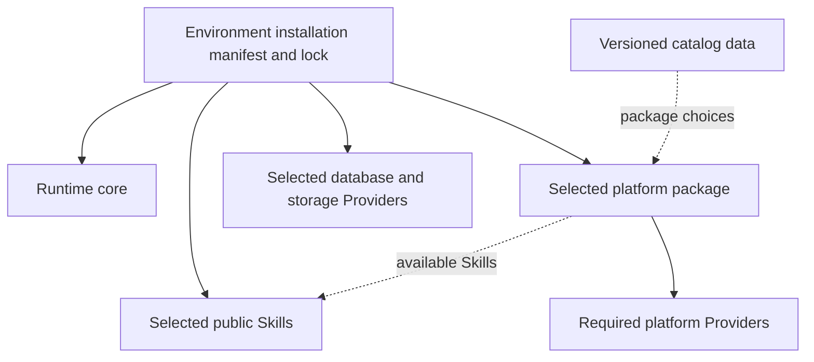

# Formal distribution direction

Owner-approved platform/environment revision, 2026-09-10: Runtime's own package
contains common implementation dependencies. Each environment installs only
its selected platforms, Skills and service Providers. A separately versioned
catalog supplies choices without introducing package dependencies on every
listed platform. See the [architecture](overview.md) and
[Japanese design review](../reviews/v2-platform-environments-ja.md).

Status: adopted. Implementation and release evidence are owned by [migration status](../migration/status.md).

| Decision | Adopted direction |
| --- | --- |
| Namespace | `@flair-agency` |
| Registry | GitHub Packages |
| Initial registry package visibility | Private; later public transitions decided per package |
| Owner / publisher | Flair organization / GitHub Actions |
| Contents | Independently managed libraries, Providers, Skills and Runtime; Skill instructions/resources are package contents |

The [earlier foundation design](../reviews/v2-foundation-design-ja.md) records
existing package names, interfaces and releases. Those remain migration inputs.
The target composition is fixed in an environment installation, not in a Runtime
release that must depend on every business package. Skills consume neutral
capabilities and retain business rules; Providers do not depend on Skills.
An npm `private: true` flag prevents publication and is distinct from GitHub
package visibility. The development root remains nonpublishable.

## Selected installation and independent catalog

Solid arrows are npm dependencies; dashed arrows are metadata relationships.
Available Skills are not all mandatory platform dependencies. Shared Skills keep
their independent identities instead of being copied for each platform. Resolve
packages relative to their declaring owner and support normal nested dependency
layouts; do not assume every dependency is directly below installation root.
Compatibility is verified for the selected set, including database/storage
capabilities and instruction resources, not inferred from package names alone.

The initial catalog is a small JSON artifact maintained in an existing private
GitHub repository, with its own immutable release version and format version.
It lists platform IDs/display names, package locations and recommended versions.
Platform packages own their Provider combinations and Skill availability;
Providers own detailed setting definitions. Credentials and actual connection
settings never belong in catalog/package contents. A new catalog version can
add a compatible platform without requiring a new Runtime release.

Persist the selected catalog revision for provenance and resolve concrete
package versions into the consuming environment's lockfile. Do not use a moving
catalog or registry tag to select versions at business-run startup. Catalog
unavailability must not prevent ordinary execution of a complete saved
environment. npm owns dependency installation; a catalog does not become a new
package registry or arbitrary-code execution mechanism.

## Update policy and recovery

Setup offers an update-policy selection. Ordinary feature updates are explicit.
Security fixes may activate automatically only under the environment's recorded
prior permission and after qualification of the actual selected composition.
A patch version number alone is not evidence of compatibility. Changes to
business semantics, authorities or configuration migration require separate
review rather than silently extending that prior permission.

Separate vulnerability detection, candidate preparation and activation. Include
transitive dependencies in the installed lock, not only Runtime's dependencies.
Retain fixed installation generations and compatible configuration revisions;
finish affected running work before switching generations. Catalog publication
or a Dependabot PR is not a production activation. Mark known-vulnerable older
versions as unsuitable normal rollback targets and prioritize serious reachable
vulnerabilities. Emergency action scope remains explicit; a catalog entry does
not grant shutdown or business-write authority.

These are approved product requirements. Concrete commands, update scheduling,
host registration and automatic-update execution remain unimplemented redesign
work. No existing installation or update setting is changed by this document.

Source associations must reflect actual owning repositories and adopted child commits. GitHub Packages does not itself require a new repository per package. Mirroring the approved independent source repositories into GitHub is a separate concrete source-management action. Existing Runtime/Provider repositories have been found; missing independent Skill/library repositories require the source association decision recorded in the foundation review. Do not push a private component into the historical public Skill monorepo by inference.

`tools/m1-distribution.mjs` verifies selected package archives and an exact isolated deployment manifest/lock. Internal packages must resolve to the selected archives; approved exact third-party dependencies are integrity-bound to the existing lock/cache. These offline checks are distinct from registry publication/retrieval. `tools/templates/m1-publish.yml` is a preparation template, not an installed or executed workflow; owning source retrieval, dependency locks and cross-repository Actions permissions must be completed before dispatch.

Real configuration, credentials, source exports and execution state remain outside Git. Initial private visibility does not change the public Skill information boundary.

## Source repository visibility and synchronization

Owner clarification, 2026-09-09: business and shared operational Skill source
repositories are public. The initial private registry-package decision above
does not make their source repositories permanently private. Providers and
organization-specific Runtime composition remain private. Review Skill content
and Git history before public creation or visibility changes; record any pending
publication explicitly. Public source does not imply that private package
dependencies can be installed anonymously.

Keep coherent development checkpoints on remote work branches under the
[development synchronization policy](../governance/development-policy.md#local-and-remote-source-synchronization).
Branch publication, default-branch integration, registry release and production
activation are separate states. Source naming and repository association can be
completed before live workflow acceptance. The adopted source identities and
remaining synchronization state are recorded in `tools/m1-source-repositories.json`
and [the reconciliation record](../reviews/repository-reconciliation-ja.md).
