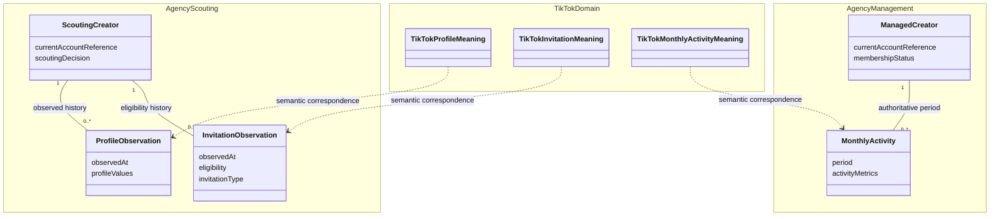

# Domain knowledge and implementation ownership

# Authority and scope

This document records the owner's directions from the architecture discussion:
centralize domain knowledge as documents in `live-agency`, associate each Skill
with a use case, separate service implementations from business schemas, and
recognize both the LIVE agency domain and each LIVE platform's domain.
Those directions are adopted and are the scope of this document's `commit`
status. The [separate Japanese design review](../reviews/domain-knowledge-ownership-ja.md#未決定の設計案)
owns the pending interface examples, mapping mechanism and artifact placement.
They are not adopted requirements. This document does not establish
implementation or production readiness.

The [business model](../domain/model.md) remains the authority for recorded
business meaning and invariants. The [architecture index](overview.md) owns
component responsibilities. This document refines their knowledge ownership;
it does not introduce new business rules. The [Japanese review record](../reviews/domain-knowledge-ownership-ja.md)
preserves the rationale, current failure assessment and next decisions.

# Adopted knowledge boundaries

| Knowledge or responsibility | Owner | Boundary |
| --- | --- | --- |
| LIVE agency business concepts, invariants and logical data requirements | Documents in `live-agency` | Scouting and Management remain separate business contexts |
| Each LIVE platform's concepts and their correspondence to the agency domain | Documents in `live-agency` | TikTok is a platform dimension, not a replacement for Scouting or Management |
| Use-case procedure, decisions, plan, applicable approval and result verification | Corresponding Skill | Depends on neutral capabilities; excludes concrete service navigation and resource identifiers |
| Supported platform capabilities, compatible Provider combinations and available Skills | Platform declaration | References the platform-domain knowledge; does not independently redefine it |
| Catalog discovery, setup and access to an environment's fixed selections | Catalog, Setup and Runtime, respectively | Runtime does not own the business workflow or depend directly on every available Skill and Provider |
| Service operations, source representation normalization and operational troubleshooting | Corresponding Provider | Implements service-specific behavior against the documented meaning |
| Actual resources, selected mappings, credential references and operational state | Selected private environment | Public source and an app project do not confer access authority |

Domain documentation is the canonical knowledge source. Skills and Providers
may include the implementation and operational explanations needed to apply it,
with traceable references, rather than maintain competing definitions. This does
not require a new executable domain package or a separate repository for each
responsibility.

For TikTok, distinguish platform meaning shared by Web, iOS and BackStage from
reusable acquisition utilities and from surface-specific navigation, fields and
limitations. A shared platform does not make the surfaces interchangeable:
BackStage membership and monthly activity authority differ from public profile
observations. Authenticated procedures and publication-uncertain source details
retain their information boundary under the [Private Source Integration Guide](../governance/private-source-integration-guide.md).
Centralization of domain meaning does not authorize copying private source
profiles, screenshots, exports or credentials into public documentation.

For invitation observations, the source eligibility status and invitation type
are distinct facts. The Skill applies the documented consumer classification,
including internal child statuses. The Provider does not invent those internal
business refinements, and the Skill does not redefine the source status.

# Business schema and Lark operation boundary

Three different descriptions must remain distinguishable:

1. The **logical business schema** describes facts, relationships and invariants,
   such as a profile observation belonging to a Scouting creator.
2. A **service mapping** describes how that schema is represented using Lark
   fields, field types and links. It is separate from generic Lark operations.
3. The **selected resource binding** supplies the actual Base, table and field
   identifiers and credential references for one environment.

The Lark Base Provider reads the selected service's actual field metadata and
performs Lark operations. Reading that metadata does not tell it the intended
business meaning. Likewise, a logical schema alone does not prove that the
selected service resources currently satisfy it.

This boundary does not select an executable mapping mechanism or its package
placement. Those questions, including the `SchemaBinding` candidate, belong to
the [pending design review](../reviews/domain-knowledge-ownership-ja.md#未決定の設計案).
A mandatory new business-specific Provider or storage-adapter package is not
adopted.

# Domain model

This conceptual class diagram shows a slice of business facts and platform
meanings. Dotted arrows express semantic correspondence, not inheritance,
shared record identity or a database migration. It is not a complete entity
catalog and does not create new tables.

Existing identity and lifecycle rules remain in the business model: no new
shared Creator UUID or master-account table; usernames are mutable references;
Scouting and Management rows retain their separate meanings. Confirmed membership
closes the scouting case while retaining history and continuing observations.
Not-found or unavailable observations are not automatically ineligible results.

# Separate implementation review

The [Japanese implementation review](../reviews/domain-knowledge-ownership-ja.md#未決定の設計案)
contains the four proposed design-class, package, component and deployment views,
with their remaining decisions. Together with the domain model above they
preserve the five requested views. Those proposals do not amend these adopted
boundaries or select implementation work.

The current Lark read failure is assessed separately in the
[review record](../reviews/domain-knowledge-ownership-ja.md#現在の読取障害との関係).
An ownership correction is not itself a verified bug fix.
