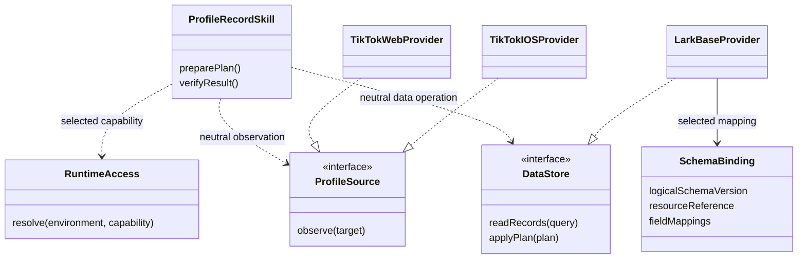
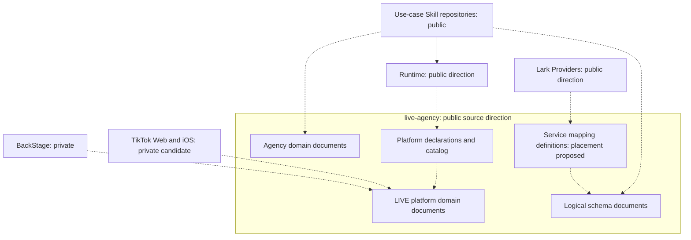
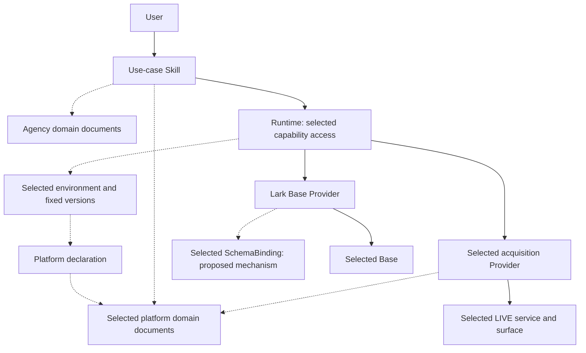
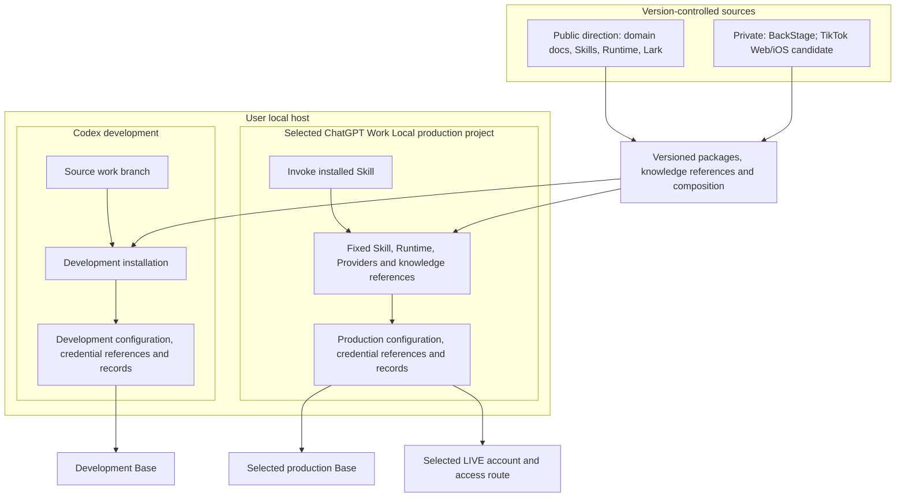

# Domain knowledge and implementation ownership

# Authority and scope

This document records the owner's directions from the architecture discussion:
centralize domain knowledge as documents in `live-agency`, associate each Skill
with a use case, separate service implementations from business schemas, and
recognize both the LIVE agency domain and each LIVE platform's domain.
Those directions are adopted. The illustrative interfaces, mapping mechanism
and artifact placement below remain proposals; the document's pending status
applies to those unresolved details. It does not establish implementation or
production readiness.

The [business model](../domain/model.md) remains the authority for recorded
business meaning and invariants. The [architecture index](overview.md) owns
component responsibilities. This document refines their knowledge ownership;
it does not introduce new business rules. The [Japanese review record](../reviews/domain-knowledge-ownership-ja.md)
preserves the rationale, current failure assessment and next decisions.

# Adopted knowledge boundaries

| Knowledge or responsibility | Owner | Boundary |
| --- | --- | --- |
| LIVE agency business concepts, invariants and logical data requirements | Documents in `live-agency` | Scouting and Management remain separate business contexts |
| Each LIVE platform's concepts and their correspondence to the agency domain | Documents in `live-agency` | TikTok is a platform dimension, not a replacement for Scouting or Management |
| Use-case procedure, decisions, plan, applicable approval and result verification | Corresponding Skill | Depends on neutral capabilities; excludes concrete service navigation and resource identifiers |
| Supported platform capabilities, compatible Provider combinations and available Skills | Platform declaration | References the platform-domain knowledge; does not independently redefine it |
| Catalog discovery, setup and access to an environment's fixed selections | Catalog, Setup and Runtime, respectively | Runtime does not own the business workflow or depend directly on every available Skill and Provider |
| Service operations, source representation normalization and operational troubleshooting | Corresponding Provider | Implements service-specific behavior against the documented meaning |
| Actual resources, selected mappings, credential references and operational state | Selected private environment | Public source and an app project do not confer access authority |

Domain documentation is the canonical knowledge source. Skills and Providers
may include the implementation and operational explanations needed to apply it,
with traceable references, rather than maintain competing definitions. This does
not require a new executable domain package or a separate repository for each
responsibility.

For TikTok, distinguish platform meaning shared by Web, iOS and BackStage from
reusable acquisition utilities and from surface-specific navigation, fields and
limitations. A shared platform does not make the surfaces interchangeable:
BackStage membership and monthly activity authority differ from public profile
observations. Authenticated procedures and publication-uncertain source details
retain their information boundary under the [Private Source Integration Guide](../governance/private-source-integration-guide.md).
Centralization of domain meaning does not authorize copying private source
profiles, screenshots, exports or credentials into public documentation.

For invitation observations, the source eligibility status and invitation type
are distinct facts. The Skill applies the documented consumer classification,
including internal child statuses. The Provider does not invent those internal
business refinements, and the Skill does not redefine the source status.

# Business schema and Lark operation boundary

Three different descriptions must remain distinguishable:

1. The **logical business schema** describes facts, relationships and invariants,
   such as a profile observation belonging to a Scouting creator.
2. A **service mapping** describes how that schema is represented using Lark
   fields, field types and links. It is separate from generic Lark operations.
3. The **selected resource binding** supplies the actual Base, table and field
   identifiers and credential references for one environment.

The Lark Base Provider reads the selected service's actual field metadata and
performs Lark operations. Reading that metadata does not tell it the intended
business meaning. Likewise, a logical schema alone does not prove that the
selected service resources currently satisfy it.

`SchemaBinding` below is a proposed declarative way to connect these descriptions.
It would contain version references, resource references and field/link mappings,
not business decisions or arbitrary executable code. Whether definitions plus
approved generic operations cover the existing normalization, query, attachment
and relation behavior still requires an implementation check. A mandatory new
business-specific Provider or storage-adapter package is not adopted.

# Domain model

This conceptual class diagram shows a slice of business facts and platform
meanings. Dotted arrows express semantic correspondence, not inheritance,
shared record identity or a database migration. It is not a complete entity
catalog and does not create new tables.

Existing identity and lifecycle rules remain in the business model: no new
shared Creator UUID or master-account table; usernames are mutable references;
Scouting and Management rows retain their separate meanings. Confirmed membership
closes the scouting case while retaining history and continuing observations.
Not-found or unavailable observations are not automatically ineligible results.

# Design class diagram

This profile-use-case slice illustrates the proposed interfaces. Class and method
names are explanatory, not adopted APIs. Interface and implementation arrows
show design responsibilities; an instruction handoff may be followed by an AI
using host tools rather than executed as a JavaScript method.

The Skill knows the required business facts; it does not know Lark field IDs or
TikTok screen structure. The interface examples do not grant general write or
delete authority. Provider coverage, interface ownership and mapping sufficiency
remain to be checked against the existing use case.

# Package and source organization

The following is a simplified UML package view expressed with Mermaid groups,
not full UML package notation. Solid arrows denote implementation dependency;
dotted arrows denote document or declaration references. The view intentionally
omits generic capability-contract dependencies. A document reference is not an
executable import. Source visibility labels are target directions, not a report
of current GitHub settings.

Actual IDs and credentials are outside these source artifacts. Runtime reads
catalog/declaration data to select a composition; the reference does not require
installing all platforms. Source visibility is governed by the
[distribution direction](distribution.md#source-repository-visibility-and-synchronization).
Registry package visibility is a separate decision.

# Component view

This simplified UML component view distinguishes invocation from knowledge and
configuration references. Solid arrows express invocation/access; dotted arrows
express reference or selection. Runtime resolution exposes the selected operation
or instruction resources to the Skill; Runtime does not initiate the workflow.

Acquisition selection may use Web, iOS or BackStage according to the required
capability; this is not a call to all three. API-first, then browser fallback is
the adopted Lark transport direction, subject to the selected authority and
known operation outcome. This diagram does not establish that the existing
Base/Chat fallback implementation is complete.

# Deployment view

This simplified UML deployment view describes local execution and artifact
placement, not the hosting of AI inference. It represents the target separation
within the user's local host; projects are not security boundaries. Concrete
production identity and current failure evidence belong to the internal review.

Development changes do not implicitly replace production registration or
configuration. Source publication, package release, installation and business
acceptance remain distinct events. This target does not require redeploying all
Skills before accepting one use case.

# Decisions still open

- Whether declarative mappings cover the existing behavior, and where their
  reusable definitions and neutral interfaces belong. Demonstrate the profile
  use case before creating mandatory packages or applying a bulk migration.
- How domain-document versions, mapping versions and selected implementation
  versions are correlated reproducibly without copying competing definitions.
- Final visibility of TikTok Web/iOS repositories and the reviewed content/history
  transition needed for each repository whose visibility will change.

The current Lark read failure is assessed separately in the
[review record](../reviews/domain-knowledge-ownership-ja.md#現在の読取障害との関係).
An ownership correction is not itself a verified bug fix.
