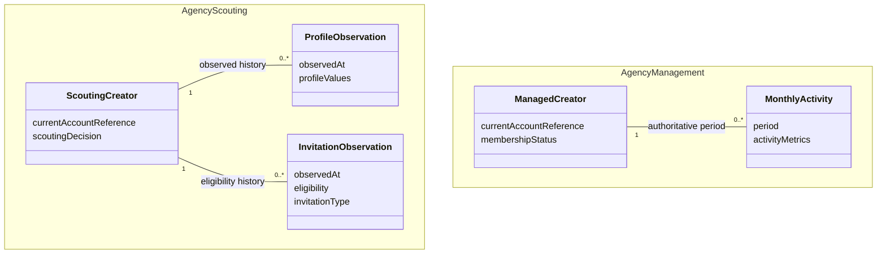

# Domain knowledge and implementation ownership

# Authority and scope

Owner direction, 2026-09-13: `live-agency` owns the abstract LIVE agency domain
common to platforms, with public source direction. Abstraction supports reuse;
public disclosure requires a separate assessment of the knowledge and its sources.
Each platform's concrete domain knowledge, including
NDA-protected knowledge, belongs in private repositories. Public Skills are
derived from the abstract agency domain model and its use cases. Provider source
may be public or private according to the knowledge and implementation it contains.

This supersedes the 2026-09-11 direction to centralize both agency and platform
meaning in this repository. It preserves the distinction between business
contexts and platforms, and between logical schemas and service operations.
The owner's direction is adopted. Work-branch changes remain subject to normal
PR integration. This decision does not claim completed content migration or public release.
The [Japanese review record](../reviews/domain-knowledge-ownership-ja.md#2026-09-13の知識配置方針)
records the correction and migration sequence. Concrete private repository names,
mapping interfaces and package placement are not selected by this decision.

The [business model](../domain/model.md) retains recorded business meaning and
invariants while its mixed content awaits separation. Its current contents are
not a publication clearance or proof that each rule is platform-independent.
The [architecture index](overview.md) owns component responsibilities. This
decision changes knowledge ownership without changing operational business rules.

# Information assets and placement decisions

Owner rationale, 2026-09-13: repository visibility is part of information-asset
and information-security design. Access restrictions can provide protection,
but placing everything in private repositories can leave ownership, scope of
reuse and reasons for protection unexplained. Considering visibility when
placing knowledge makes those decisions explicit and reviewable. A private
setting does not replace knowledge classification, and a public direction does
not establish permission to disclose the existing contents.

Assess **commonality** and **confidentiality** independently. Commonality names
the scope in which meaning is shared: across the agency industry, within one
platform, across some Providers or inside one organization. Confidentiality
concerns the permitted audience and disclosure constraints arising from the
source, applicable agreements and business sensitivity. Shared knowledge can be
confidential; service-specific implementation knowledge can be publishable.
Abstraction, renamed terms and synthetic examples do not themselves remove
restrictions on underlying meaning or decision logic.

Use the following sequence when adding or relocating knowledge. Record the
basis in the existing owning document or task record, without creating a second
registry or disclosing protected evidence in a public explanation.

| Decision | Required explanation |
| --- | --- |
| 1. Determine semantic ownership and scope of commonality | Identify the business, platform, service or organization whose concepts are described, the intended consumers and the canonical owner. State what “shared” is shared across. |
| 2. Determine permitted disclosure independently | Identify the source and applicable disclosure constraints, the intended audience, reasons for protection and any unknowns. Commonality or an existing repository setting is not evidence of permission. |
| 3. Select the repository and references | Choose a location satisfying both ownership and permitted disclosure. Keep protected meaning with an appropriate private owner and preserve authorized access, provenance and the correspondence to public abstractions. |

If source rights or disclosure scope are unresolved, preserve the knowledge in
the appropriate restricted location while resolving that question. Do not
relabel its semantic owner to fit an available repository. A change in permitted
audience alone does not change which domain owns the knowledge. Actual visibility
changes retain the existing publication and execution procedure.

These illustrative cases apply the two decisions without claiming approval for
any existing source or selecting new repository names:

| Knowledge | Commonality | Disclosure assessment | Placement consequence |
| --- | --- | --- | --- |
| An agency use case documented from publishable sources | Across platforms | Reviewed for public disclosure | Public agency model and the Skill derived from its use case |
| An abstract analysis derived from restricted source material | May apply across platforms | Restricted meaning or source permission remains unresolved | Private business-knowledge owner; do not copy into the public model or Skill merely because it is abstract |
| A service operation implemented solely from publishable specifications | Specific to that service | Reviewed for public disclosure | Its Provider may be public; service specificity alone does not require secrecy |
| A platform rule protected by an NDA and used by multiple Providers | Shared within one platform | Restricted audience | One private platform-domain owner, referenced by the authorized implementations |

The existing project choice to keep concrete platform-domain knowledge in
private repositories remains in force. That placement choice does not assert
that every platform fact is legally confidential or that every Provider must
be private. Public-direction business models and Skills contain only knowledge
whose disclosure assessment permits that audience.

# Adopted knowledge boundaries

| Knowledge or responsibility | Owner | Boundary |
| --- | --- | --- |
| Abstract LIVE agency concepts, invariants, logical data requirements and use cases common to platforms, assessed as publishable | Public-direction documents in `live-agency` | Scouting and Management remain separate business contexts; exclude platform-specific and restricted business knowledge |
| Each LIVE platform's concrete concepts, rules and correspondence to the agency domain | Private repository owning that platform's domain knowledge | Keep platform meaning, including NDA-protected or publication-uncertain knowledge, outside the public parent and Skills |
| Use-case procedure, decisions, plan, applicable approval and result verification | Corresponding public Skill | Derived from the abstract model and use case; consumes neutral capabilities and normalized facts |
| Supported platform capabilities, compatible Provider combinations and available Skills | Platform declaration | Keep confidential declarations and knowledge references private; public metadata must not reproduce private semantics |
| Catalog discovery, setup and access to an environment's fixed selections | Catalog, Setup and Runtime, respectively | Runtime does not own the business workflow or depend directly on every available Skill and Provider |
| Service operations, source representation normalization and operational troubleshooting | Corresponding Provider, with visibility selected per content | Public implementations contain only publishable knowledge; private implementations can apply the selected private platform knowledge |
| Company-specific operating choices and private service mappings | Private organizational documentation or selected private environment | Do not promote one agency's choices into universal business invariants |
| Actual resources, selected mappings, credential references and operational state | Selected private environment | Public source and an app project do not confer access authority |

Each domain has one canonical documentation owner at its visibility boundary.
The private platform model refers to the public abstraction and explains its
concrete correspondence. Shared meaning used by multiple platform Providers
must have one private owner; source navigation and parsing remain owned by the
individual Provider. This does not require an executable domain package or
automatically select a new repository for every responsibility.

Being observable through a public surface does not make all platform-domain
knowledge publishable. Renaming source terms or using synthetic values does not
remove confidential semantics. Apply the [Private Source Integration Guide](../governance/private-source-integration-guide.md)
to authenticated and publication-uncertain sources. Actual exports, screenshots,
credentials and operational records remain outside Git in restricted storage.

# Skill derivation and knowledge access

Start from an agency business outcome, the required neutral facts and invariants,
and the use case's decisions, verification and recovery. Derive the Skill from
that model, then identify the neutral capabilities needed to realize it. A
platform screen, API or Provider feature does not itself define a business Skill.
Platform-specific rules are interpreted on the private side and supplied as
reviewed normalized facts; the public Skill must not reimplement those rules.

The public model and Skill procedure must remain understandable without reading
a private platform specification. For example, a synthetic observation with an
unavailable value cannot establish a negative business fact. The private owner
documents how its source distinguishes those outcomes; the public Skill documents
the resulting business decision and stopping condition. This example does not
define new contract fields or expand an existing workflow's scope.

Authorized operators must still be able to locate the selected private knowledge,
its version, mapping rationale and recovery procedure through the private
Provider/environment documentation. That access is separate from the public
Skill's source and distribution. Do not bundle private documents, restricted
links, source labels or protected examples into public artifacts to make this
reading route self-contained. Missing private prerequisites stop the affected
capability; they do not authorize guessing or disclosure.

For invitation observations, the source eligibility status and invitation type
are distinct facts. The Skill applies the documented consumer classification,
including internal child statuses. The Provider does not invent those internal
business refinements, and the Skill does not redefine the source status.

# Business schema and Lark operation boundary

This heading retains its existing reference anchor. The separation applies to
any datastore; Lark is an implementation example, not part of the abstract
agency domain.

Three different descriptions must remain distinguishable:

1. The **logical business schema** describes facts, relationships and invariants,
   such as a profile observation belonging to a Scouting creator.
2. A **service mapping** describes how that schema is represented using a
   selected service's fields, types and links. It is separate from generic
   service operations and follows the visibility of its contents.
3. The **selected resource binding** supplies the actual Base, table and field
   identifiers and credential references for one environment.

The Lark Base Provider reads the selected service's actual field metadata and
performs Lark operations. Reading that metadata does not tell it the intended
business meaning. Likewise, a logical schema alone does not prove that the
selected service resources currently satisfy it.

For the invitation read/plan connection, the owner adopted the
[record dataset read contract](record-dataset-read-contract.md) on 2026-09-13:
the generic Lark reader interprets private selected resource/field mappings,
while the Skill owns business classification and history planning. Runtime
reuses its existing selection and configuration handoff. This is an adopted
design, not evidence of implementation, distribution or production operation.

The broader `SchemaBinding` candidate and other unresolved package/API choices
remain in the [earlier design review](../reviews/domain-knowledge-ownership-ja.md#未決定の設計案).
The invitation decision does not require a new business-specific Provider or
storage-adapter package, or a concurrent rewrite of the Profile connection.

# Domain model

This conceptual class diagram shows a slice of the abstract business model.
Concrete platform classes and their correspondence are documented by the private
platform owner. It is not a complete entity catalog and does not create tables.

Existing identity and lifecycle rules remain in the business model: no new
shared Creator UUID or master-account table; usernames are mutable references;
Scouting and Management rows retain their separate meanings. Confirmed membership
closes the scouting case while retaining history and continuing observations.
Not-found or unavailable observations are not automatically ineligible results.

# Separate implementation review

The [Japanese implementation review](../reviews/domain-knowledge-ownership-ja.md#未決定の設計案)
retains the four earlier proposed views for history. Their placement of private
platform meaning in the public-direction parent is superseded by this decision;
the proposals do not select implementation work. The current migration sequence
must preserve knowledge and references before removing the old placement.

The earlier Lark read failure is assessed separately in the historical
[review record](../reviews/domain-knowledge-ownership-ja.md#現在の読取障害との関係).
An ownership correction is not itself a verified bug fix.
