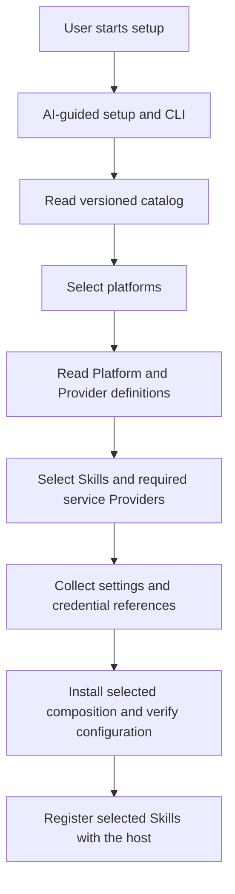
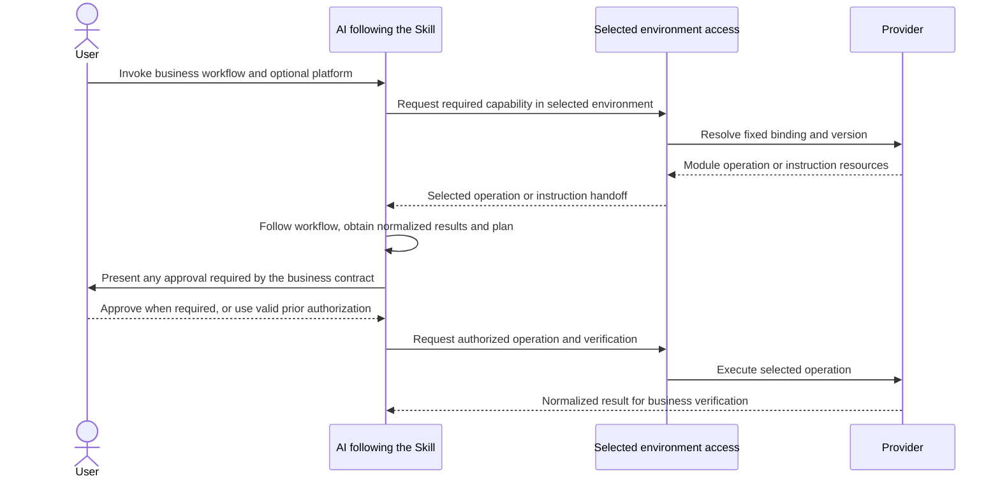
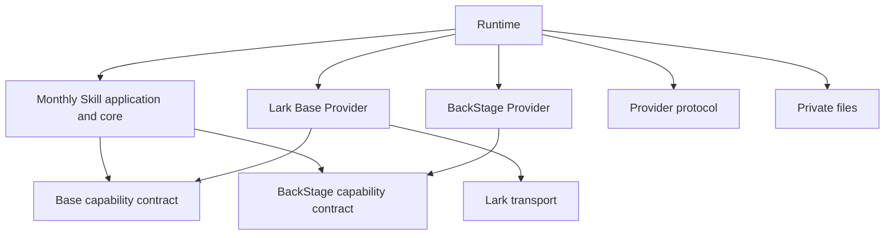

# Architecture and responsibility boundaries

Owner-approved concept revision, 2026-09-10: install a small Runtime, select
platforms and required services during setup, and invoke business Skills after
setup. Runtime provides environment management and access to the selected
capabilities. Public Skills own the business workflow. The catalog is data,
not an installed dependency on every supported platform.

This target supersedes the earlier all-components Runtime distribution and
business-specific Runtime entrypoints as the general product architecture.
It does not revoke historical acceptance or establish implementation readiness.
The [Japanese redesign review](../reviews/v2-platform-environments-ja.md)
separates approved concepts, proposed connection details, source evidence and
the smallest implementation/acceptance sequence. The earlier
[foundation review](../reviews/v2-foundation-design-ja.md) retains its historical
decisions and results.

Status: canonical index of adopted responsibilities. Scope: project-wide boundaries; implementation and deployment readiness are owned by [migration status](../migration/status.md). The [business model](../domain/model.md) owns business meaning and identity.

The owner's 2026-09-13 [knowledge-ownership clarification](domain-knowledge-ownership.md)
places the abstract agency model and use cases in public-direction `live-agency`
documents, and concrete platform meaning in private repositories. Public Skills
derive from the abstract model and use cases. Providers may be public or private
according to their contents. Logical schemas, service mappings and selected
resource identifiers remain separate. The [Japanese review](../reviews/domain-knowledge-ownership-ja.md#2026-09-13の知識配置方針)
records the superseded placement proposal and the remaining migration. This
direction does not establish a deployed redesign or completed public release.

## Adopted responsibilities

Skills own business tasks, judgments, normalized input/output and acceptance conditions. Creator Scouting and Creator Management are separate bounded contexts with distinct execution authority, destination, credential and audit identities. Those boundaries do not depend on MCP as the transport. Accounting and expenses remain outside both creator-domain MCPs. Gift history is cross-domain; membership transition crosses domains after authoritative membership confirmation. Observation continues after membership; its consumer and storage purpose change.

MCPs are external protocol adapters for application operations: they register tools, adapt requests/results and delegate to consumer-owned interfaces. Business decisions, service implementations and Provider selection belong to their owning consumers, Providers and Runtime. The entire transitional `mcp/operations` package is deferred from required v2 deployment; selected paths may use existing CLI entry points or a minimal MCP adapter. Required behavior is preserved and moved to its owners rather than discarded. The [adopted MCP treatment](../migration/v2-plan.md#adopted-treatment-of-operations-mcp) owns scope and verification. The transitional `live-agency-operations` acquisition MCP is not the final creator-domain boundary. Relationship-changing actions require a separately launched action surface; public read acquisition does not gain follow/message/invitation/gift authority.

Providers own service-specific acquisition, mutation, normalization and versioned knowledge. Independent TikTok iOS, TikTok Web and BackStage Bindings remain separate repositories. Lark Base remains Base-specific; Chat and any future Docs Binding own their own service contracts. Drivers provide generic execution mechanisms. Shared libraries own only the contract or implementation common to their consumers; repository consolidation is not required.

Providers implement the documented domain meaning rather than own competing
business definitions. The Lark Base Provider owns generic Lark operations and
actual field metadata access; business logical schemas and their service mappings
are separate concerns. Private platform meaning is distinct from reusable
acquisition utilities and surface-specific procedures. The
precise mapping mechanism and implementation placement remain design work.

Runtime manages setup and selected environment access; it does not own the
business sequence of profile, invitation or other Skills. Concrete versions
belong to each environment's installation manifest and lockfile. Runtime's
own dependencies contain its common implementation needs. Source repositories
continue to own implementation history.

## Platform and environment responsibilities

| Component | Responsibility |
| --- | --- |
| Catalog | List supported platforms, package locations and recommended versions without installing them |
| Platform | Declare supported capabilities, compatible Provider combinations and available Skills; reference corresponding platform-domain knowledge |
| Setup | Present choices, collect required settings from Provider definitions, validate, install through npm and save the selected environment |
| Runtime execution access | Expose the already-selected capability as a module operation or instruction handoff, with the selected environment and version |
| Skill | Request neutral capabilities and own business decisions, plans, applicable approvals and result verification |
| Provider | Own service operations, normalization, knowledge and service-specific configuration definitions |

Setup is initially AI-guided with a CLI performing the deterministic work.
The same operations must remain usable by a human through the documented CLI.
Responsibilities may be separate modules in one package; this concept does not
require a repository or service for every responsibility.

One LIVE platform may use several Providers. Selecting a platform does not
require every acquisition surface when the selected Skills need only a subset.
Database and storage selections are independent of the LIVE platform; require
them only for selected capabilities. A platform declaration cannot replace
Provider knowledge or introduce business rules into Runtime.

An environment stores multiple platform configurations and a default. An
explicit per-invocation platform selection uses that configuration for the run;
changing the default is a configuration change. Account identifiers and target
resources remain bound to the selected platform and environment. Platform
support must be declared and verified; illustrative alternatives such as 17LIVE
are not claims that a Provider already exists.

### Setup flow

Catalog lookup and package installation do not authorize business operations.
Authentication and host permissions retain their own controls. Setup must
report missing prerequisites or required host reloads accurately.

### Business execution flow

These arrows express workflow responsibility, not npm imports. Instruction
Providers are executed by the AI using available host tools, not by treating
instruction text as JavaScript. Module calls may be implemented through a CLI
or a library adapter. Exact connection messages remain a design-review item;
an internal call to a Skill library alone does not prove either correct or
incorrect workflow ownership.

## Host and environment separation

Production uses the selected local ChatGPT Work host; development uses Codex.
Environment identity is independent of an app project ID. Projects may be
associated with an environment for convenience, but are not required to install
or use Skills. Cloud Work is a separate deployment target, not automatically
supported by a successful local installation.

Keep installed production versions, development sources, configuration,
credential references and operational state distinct. Do not overwrite
production Skill registration with development links. Avoid simultaneously
selectable same-name development and production Skills; verify the actual host
discovery/registration mechanism instead of assuming repository precedence.
Separate projects or product modes are not a sandbox or credential boundary.
Browser origins, authentication and shell/API networking need their own effective
permission checks in the selected host.

## Authority and information

Each protected access binds one environment, organization, service, resource scope, domain, authority and Principal. Missing or ambiguous selection stops. No ambient identity, cross-organization, User/Tenant or unverified API/browser fallback is allowed. Operation support does not grant an instance authority. Scouting and Management processes do not share credentials across their boundary; exact dedicated-App decisions remain subject to effective service controls and their own contract.

Public Skills consume normalized neutral data. Providers own service-specific
formats and operating knowledge according to their individually selected
[source visibility](distribution.md#source-repository-visibility-and-synchronization);
credentials and real data remain in private storage. Authenticated and
publication-uncertain source details retain the controls in the
[Private Source Integration Guide](../governance/private-source-integration-guide.md).

## Owning specifications

| Subject | Owner |
| --- | --- |
| Capability/domain assignment | [Capability inventory](capabilities.md) |
| Registry, scope, visibility, publisher | [Distribution direction](distribution.md) |
| Approved platform concept and proposed execution connection | [Redesign review](../reviews/v2-platform-environments-ja.md) |
| Runtime deployment and actual configuration interfaces | [Deployment](../../runtime/docs/deployment.md), [configuration](../../runtime/docs/configuration.md) |
| Lark Principal/token selection | [Lark core contract](../../packages/lark-transport/docs/principal-selection.md) |
| Domain knowledge, logical schemas and service mapping boundary | [Knowledge ownership](domain-knowledge-ownership.md), [business model](../domain/model.md) |
| Existing Lark mapping implementation knowledge (not the target business-knowledge owner) | [Base Provider model](../../providers/lark-base/knowledge/data-model.md) |
| Conversation operations | [MCP contract](../../mcp/operations/docs/conversation-message-contract.md) |
| Neutral backup capability API | [source-provider-api](../../packages/provider-protocol/docs/backup-capability-contract.md) |

The prior [repository reorganization record](../archive/repository-reorganization-plan.md) retains package-placement options, evidence and release reasoning. The [migration plan](../migration/v2-plan.md) owns dependencies and release gates, not this architecture index.

## Previously accepted M1 implementation baseline

The following records the earlier monthly implementation and reusable contract
boundaries. It does not select the entrypoint or deployment model for the
revised product. In particular, its package-dependency diagram must not be read
as a requirement that users start every business workflow from Runtime.

`@flair-agency/provider-protocol` exports pure generic descriptors and correlated request/result validation. Runtime owns installed package discovery, resource confinement, explicit package/version/binding selection and module loading. `@flair-agency/private-files` owns explicit private file I/O. `@flair-agency/lark-transport` owns selected Lark transport through selection/api/cli exports; its implementation modules no longer import their re-exporting barrel.

Providers expose pure capability contracts in their own packages: BackStage
`./contracts/activity`, Lark Base `./contracts/creator-activity`, TikTok iOS
`./contracts/gift-history` and TikTok Web `./contracts/profile-observation`.
Skills consume these contracts and retain reconciliation, record matching,
reviewed-plan authorization and readback verification. Runtime continues to
inject `readActivity`, `readRecords` and `applyChanges` implementations.
TikTok observation validation does not require destination record identity;
profile recording validates that additional requirement in the Skill. Legacy
`creatorRecordId` is accepted by the observation adapter only as optional opaque
caller correlation, without Lark ID-format validation.

Provider packages have no Skill or Runtime dependency. TikTok dependency
closures exclude Lark and all Skills. Skill compatibility contract exports
must not be consumed by Providers.

The development CLI is `live-agency monthly-activity` with explicitly supplied installation root, development configuration, private request and state directory. Results distinguish done, interaction-required and failed. Resume validates request ID, capability, version, normalized context and unchanged composition; atomic claim creation prevents replay. Source module handoffs receive correlation metadata as the second `readActivity` argument and must return matching metadata.

The canonical protocol entry has no business validators, filesystem or Runtime imports. The explicit `provider-protocol/legacy` entry preserves old resolution and validation callers during the staged migration; those callers are not evidence that all Skills have adopted v2. The monthly Skill has no Runtime dependency; its Provider dependencies supply pure interfaces while Runtime supplies selected instances.
