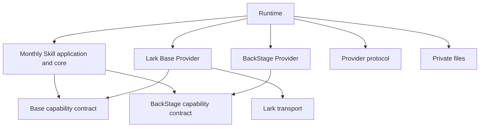

# Architecture and responsibility boundaries

Status: canonical index of adopted responsibilities. Scope: project-wide boundaries; implementation and deployment readiness are owned by [migration status](../migration/status.md). The [business model](../domain/model.md) owns business meaning and identity.

## Adopted responsibilities

Skills own business tasks, judgments, normalized input/output and acceptance conditions. Creator Scouting and Creator Management are separate bounded contexts with distinct execution authority, destination, credential and audit identities. Those boundaries do not depend on MCP as the transport. Accounting and expenses remain outside both creator-domain MCPs. Gift history is cross-domain; membership transition crosses domains after authoritative membership confirmation. Observation continues after membership; its consumer and storage purpose change.

MCPs are external protocol adapters for application operations: they register tools, adapt requests/results and delegate to consumer-owned interfaces. Business decisions, service implementations and Provider selection belong to their owning consumers, Providers and Runtime. The entire transitional `mcp/operations` package is deferred from required v2 deployment; selected paths may use existing CLI entry points or a minimal MCP adapter. Required behavior is preserved and moved to its owners rather than discarded. The [adopted MCP treatment](../migration/v2-plan.md#adopted-treatment-of-operations-mcp) owns scope and verification. The transitional `live-agency-operations` acquisition MCP is not the final creator-domain boundary. Relationship-changing actions require a separately launched action surface; public read acquisition does not gain follow/message/invitation/gift authority.

Providers own service-specific acquisition, mutation, normalization and versioned knowledge. Independent TikTok iOS, TikTok Web and BackStage Bindings remain separate repositories. Lark Base remains Base-specific; Chat and any future Docs Binding own their own service contracts. Drivers provide generic execution mechanisms. Shared libraries own only the contract or implementation common to their consumers; repository consolidation is not required.

Runtime selects and connects concrete implementations and pins compatible versions. Source repositories own implementation history; package manifests and lockfiles own distribution composition. The owner approved the [M1 concrete design](../reviews/v2-foundation-design-ja.md). Earlier package revision and MCP roadmap documents retain historical proposals; current implementation readiness remains in migration status.

## Authority and information

Each protected access binds one environment, organization, service, resource scope, domain, authority and Principal. Missing or ambiguous selection stops. No ambient identity, cross-organization, User/Tenant or unverified API/browser fallback is allowed. Operation support does not grant an instance authority. Scouting and Management processes do not share credentials across their boundary; exact dedicated-App decisions remain subject to effective service controls and their own contract.

Public Skills consume normalized neutral data; private Providers/profiles own service-specific formats and operating knowledge; credentials and real data remain in private storage. The [Private Source Integration Guide](../governance/private-source-integration-guide.md) is the single information-handling authority.

## Owning specifications

| Subject | Owner |
| --- | --- |
| Capability/domain assignment | [Capability inventory](capabilities.md) |
| Registry, scope, visibility, publisher | [Distribution direction](distribution.md) |
| Runtime deployment and actual configuration interfaces | [Deployment](../../runtime/docs/deployment.md), [configuration](../../runtime/docs/configuration.md) |
| Lark Principal/token selection | [Lark core contract](../../packages/lark-transport/docs/principal-selection.md) |
| Lark Base table/field concept mapping | [Base Provider model](../../providers/lark-base/knowledge/data-model.md) |
| Conversation operations | [MCP contract](../../mcp/operations/docs/conversation-message-contract.md) |
| Neutral backup capability API | [source-provider-api](../../packages/provider-protocol/docs/backup-capability-contract.md) |

The prior [repository reorganization record](../archive/repository-reorganization-plan.md) retains package-placement options, evidence and release reasoning. The [migration plan](../migration/v2-plan.md) owns dependencies and release gates, not this architecture index.

## Approved M1 foundation interfaces

`@flair-agency/provider-protocol` exports pure generic descriptors and correlated request/result validation. Runtime owns installed package discovery, resource confinement, explicit package/version/binding selection and module loading. `@flair-agency/private-files` owns explicit private file I/O. `@flair-agency/lark-transport` owns selected Lark transport through selection/api/cli exports; its implementation modules no longer import their re-exporting barrel.

Providers expose pure capability contracts in their own packages: BackStage
`./contracts/activity`, Lark Base `./contracts/creator-activity`, TikTok iOS
`./contracts/gift-history` and TikTok Web `./contracts/profile-observation`.
Skills consume these contracts and retain reconciliation, record matching,
reviewed-plan authorization and readback verification. Runtime continues to
inject `readActivity`, `readRecords` and `applyChanges` implementations.
TikTok observation validation does not require destination record identity;
profile recording validates that additional requirement in the Skill. Legacy
`creatorRecordId` is accepted by the observation adapter only as optional opaque
caller correlation, without Lark ID-format validation.

Provider packages have no Skill or Runtime dependency. TikTok dependency
closures exclude Lark and all Skills. Skill compatibility contract exports
must not be consumed by Providers.

The development CLI is `live-agency monthly-activity` with explicitly supplied installation root, development configuration, private request and state directory. Results distinguish done, interaction-required and failed. Resume validates request ID, capability, version, normalized context and unchanged composition; atomic claim creation prevents replay. Source module handoffs receive correlation metadata as the second `readActivity` argument and must return matching metadata.

The canonical protocol entry has no business validators, filesystem or Runtime imports. The explicit `provider-protocol/legacy` entry preserves old resolution and validation callers during the staged migration; those callers are not evidence that all Skills have adopted v2. The monthly Skill has no Runtime dependency; its Provider dependencies supply pure interfaces while Runtime supplies selected instances.
