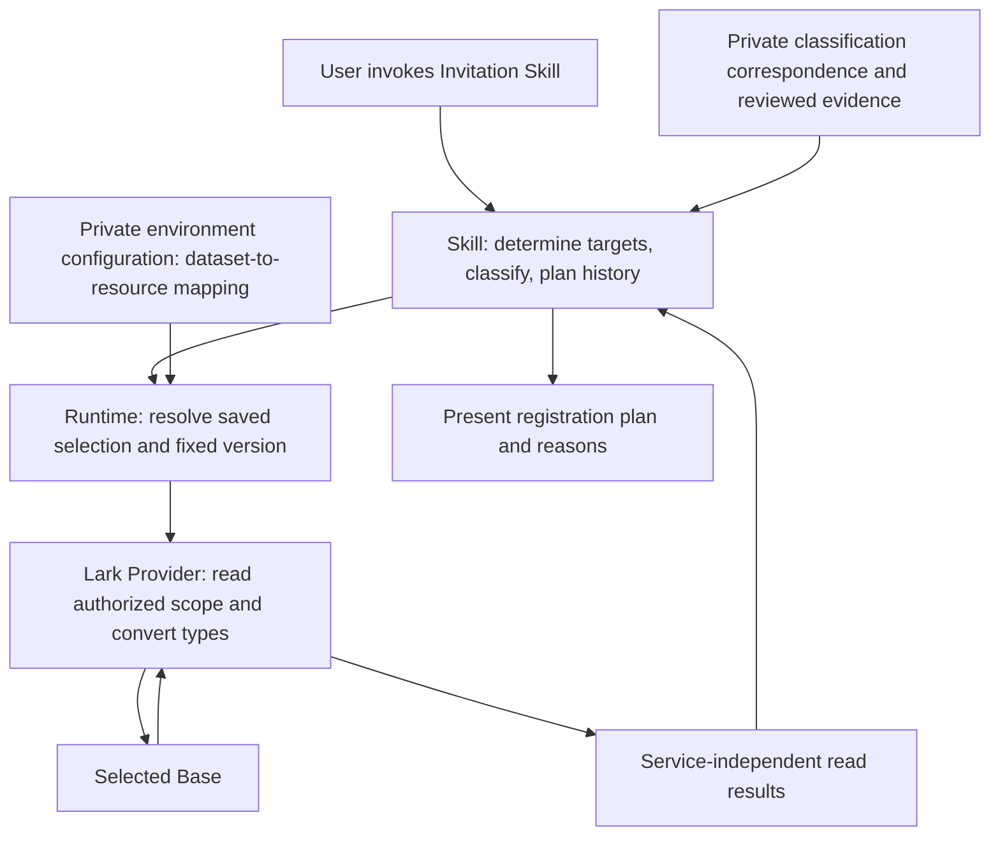

# Record dataset read contract

- Authority: the owner approved the [Japanese design review](../reviews/invitation-environment-read-contract-ja.md) at `d17d596` in [PR #73](https://github.com/flair-agency/live-agency/pull/73). That review is retained as decision history. This English document records the adopted contract.
- Canonical location: `flair-agency/live-agency`, branch `main`, path `docs/architecture/record-dataset-read-contract.md`. The document's `commit` status records owner adoption; integration into that baseline and implementation completion are separate facts.
- Scope: [migration #14](https://github.com/flair-agency/live-agency/issues/14), covering reads from a saved environment and registration planning for the Invitation Skill.
- Decision: **add configuration-driven generic dataset reading to the Lark Provider, place mappings to actual resources in private configuration, and retain business decisions in the Skill. Reuse Runtime's existing selection and configuration handoff.**
- This is an adopted design, not evidence of an implemented API. Adoption does not include distribution, production installation or registration of business data. Implementation and distribution have not been verified.

# Rationale

The [knowledge ownership policy](domain-knowledge-ownership.md#business-schema-and-lark-operation-boundary) separates the logical schema, service mapping and environment's actual resource binding. Before this decision, the executable mapping mechanism remained undecided; a new business-specific adapter package had not been adopted. This contract selects the bounded approach below without introducing such a package.

[Invitation PR #2](https://github.com/flair-agency/live-agency-creator-invitation-eligibility-record/pull/2) adopted an entrypoint that classifies and plans from normalized history. The old connection resolves Lark columns inside the Skill and reads the entire history table. Connecting that implementation directly to the new entrypoint would retain problems with responsibility separation and read scope.

| Existing mechanism | Reusable part | Required addition |
| --- | --- | --- |
| Runtime `createEnvironmentAccess()` / `invoke()` | Invocation of a fixed Provider and handoff of selection, execution context and private configuration | Do not add an Invitation-specific executor |
| Runtime `configurationRef` / `configurationSha256` | Fixed location and contents of configuration JSON, without request overrides | Provider validation of the dataset configuration below |
| Lark `createLarkBaseSelectedHistoryReader()` | Field and record reads from selected tables/views, including page bounds and related validation | Typed output, searches restricted by target IDs, and a completeness contract |
| Lark's scoped Profile history reader | Precedent for searches by target creator IDs and page consistency checks | Extract generic operations without reusing Profile-specific column definitions |
| Invitation's normalized history entrypoint | Existing classification, history transition and planning decisions | Assemble selected-environment read results into the existing inputs |

The new generic reader does not make simultaneous modification of the existing Profile connection a prerequisite for Invitation.

# Responsibilities



- Public domain documents define business facts, relationships and constraints.
- The public Skill handles logical data roles, target matching, classification and history transitions. It contains no Base IDs, Lark column representations or authentication procedures.
- Private configuration declares mappings from logical datasets to actual tables, columns and views, allowed types, relation targets and permitted reads. It uses existing credential references rather than secret values.
- The Lark Provider validates declarations and handles Lark types, pagination, searches and attachment acquisition. It does not hard-code particular classification names or scouting decisions.
- Runtime passes existing configuration and selection. It does not make business decisions from configuration or acquire responsibility for starting Skills.

Configuration is limited to compositions of approved generic operations. Do not execute JavaScript, arbitrary API paths or arbitrary transformation expressions from configuration. This contract introduces no new mandatory package or repository.

# Minimum interface

The following defines the new capability `record-dataset-read/v1`; it is not evidence that the API is currently available. Requests use the existing Protocol correlation information and Runtime selection checks.

```json
{
  "dataset": "history",
  "query": "byOwner",
  "parameters": { "recordIds": ["synthetic-creator-1"] }
}
```

`dataset` and `query` are aliases registered in fixed private configuration. Requests cannot replace configuration by supplying actual Base, table or field IDs or URLs. Reject unknown aliases, duplicate logical keys or field IDs within a dataset, and invalid or duplicate search IDs. Each dataset's configuration contains the following.

| Configuration element | Contract |
| --- | --- |
| Resource references | Fix the Base, tables and necessary views authorized in the selected environment |
| Column mapping | Map logical keys to field IDs, allowed service types and output types. Do not infer mappings from column names |
| Relations | Declare the referenced dataset and single/multiple cardinality constraints. Stop with diagnostics on a mismatch |
| Read definition | Either enumerate an authorized table or view, or search within a set of reference IDs. Fix the search column in configuration |
| Read budget | Set finite bounds for search ID count, page size, maximum pages, maximum records and elapsed time. Do not report truncated results as success when a bound is exceeded |
| Attachments | Only when needed, acquire original attachments present in configured attachment columns of rows obtained by the target search and compute content hashes. Fix acquisition authority and size limits; reject arbitrary request-supplied tokens or URLs |

A successful result returns the dataset name, read scope corresponding to the request, selection generation and configuration identity, record IDs, logical-key values and completion of all pages. Do not return partial results as success. Value types are limited to strings, finite numbers, booleans, timestamps in epoch milliseconds, record references and attachment content hashes. Define scalar/array shape and permitted absence for each column. Do not guess a conversion when a required timezone is unknown or the service representation is unsupported.

The Skill assembles read results into the adopted entrypoint's `manifest`, `statuses`, `storedHistory` and `invalidStored`. It explicitly consumes reviewed neutral classification correspondence as private input. The Skill performs generic parent/child relationship and matching validation; it does not copy protected concrete rules into code or documentation or add platform-specific decision branches. The Provider does not interpret the meaning of parent/child classifications.

# Read scope and preservation of existing behavior

1. **Targets:** preserve existing `due` / `selected` / `all` behavior, account normalization, uniqueness checks, specified order and the meaning of an explicit limit. The initial connection reads only required columns from authorized target tables/views within a finite budget. Do not omit duplicate detection before applying the limit. Do not replace this with account searches whose normalization and equivalence cannot be proven.
2. **Classification master:** read the entire explicitly authorized master within a finite budget. Validate parent, child and correspondence consistency under the existing Skill contract. Do not include protected concrete labels or rules in public source.
3. **History:** restrict reads on the server to the determined set of creator IDs. Validate the references in returned rows as well. If the search is unsupported, fail explicitly; do not fall back to reading all history. Zero targets means zero history requests. When splitting requests for API limits, verify completion and target scope for every batch. Only when multiple references cause the same row to appear across batches, verify identical content and include it once; stop on inconsistent content.
4. **Freshness:** preserve the existing requirement to recheck manifest targets, accounts and due membership before planning. Completion of the read scope does not guarantee transactional consistency across multiple API requests.
5. **Images:** distinguish an empty array because no attachments exist from attachments whose content hashes cannot be obtained. Do not treat a file token as a content hash or convert an empty string or acquisition failure to “no images.”
6. **Business decisions:** preserve existing conditions, including observation-time updates for the same state, history additions on state transitions, external ID mismatches and conflicting latest timestamps. Do not convert or rewrite past history. Keep the acquisition service's per-request input limit and Runtime checkpoints as separate responsibilities.

# Rejection conditions and diagnostics

| Condition | Required result |
| --- | --- |
| Mismatched selection generation, configuration hash, actor or authority scope | Stop before service operations and distinguish the reason reselection is required |
| Missing columns, changed types or relation targets, or unsupported conversion | Fail at the configuration/schema stage. Do not choose a similar column by display name |
| Authentication, API, communication or attachment acquisition failure | Preserve the original safe cause code and failure stage. Do not convert failure into “no history” |
| Missing pages, duplicate IDs/tokens within one search, exceeded budgets or inconsistent counts | Stop as an incomplete read. If the API returns `total`, compare it with the count for the same search scope |
| References outside the search scope, multiple values in a single relation, or invalid timestamps/hashes | Retain diagnostics for the affected record and stop planning. Do not proceed with only valid rows |
| Completely read scope containing zero records | Return a normal empty result identifying the requested scope, distinct from a fallback value on failure |

Diagnostics retained in the environment include processing stage, operation, correlation ID, safe cause classification and affected logical key. Retain necessary service details through references to private evidence; do not copy secrets or actual data to public logs or GitHub. Distinguish Provider processing failures from invalid-history-row diagnostics retained by the Skill.

The existing generic reader does not check count consistency against `total`; the scoped Profile reader provides a precedent. Include this difference in implementation scope rather than treating it as already verified. Success means completion of the read scope, not successful registration or completed production business work.

# Implementation and acceptance

| Sequence / action | Human assignee | Due date | Work and completion criteria | Evidence and recovery |
| --- | --- | --- | --- | --- |
| Adopted contract | Naoki Kimura (design adoption) | Not applicable; adopted 2026-09-13 | Owner approval of the contract, placement and rejection conditions in PR #73 at `d17d596`; reflect that approval in this English canonical document | Document changes only; recovery is a revert of the affected document changes |
| Next implementation package | TBD | TBD | Implement generic Lark reading and the necessary Invitation connection as one work package, reusing Runtime's handoff | For the same synthetic inputs, verify old/new equivalence of targets, classification, plans and stop reasons; directly verify target-ID searches, incomplete reads and image-hash failures. Retain the old route |
| Subsequent distribution and acceptance | TBD | TBD | Distribute fixed versions and accept reads and plans in the selected environment | Track actual versions, configuration, installation scope and recovery destination in [#31](https://github.com/flair-agency/live-agency/issues/31) and [#32](https://github.com/flair-agency/live-agency/issues/32) |
| Registration | TBD | TBD | Implement the separately [adopted write connection](record-dataset-write-contract.md), then execute and read back after approval of a concrete plan | Read success grants no registration authority. The new path's explicitly changed create-ID guarantee and uncertain-write reconciliation are defined in that contract; existing Profile behavior is unchanged |

The new Provider capability required a design adoption decision under [development policy class E](../governance/development-policy.md#e-change-architecture-or-shared-infrastructure) and the knowledge ownership policy because the executable mapping mechanism had not been selected. The owner's approval resolves that design decision for this contract. Already approved classification and normalized-history behavior is not subject to renewed approval.

# Evidence and AI policy review

- Inspected revisions: parent `6473cb7`, Runtime `1f45ae5`, Lark `f3a6953`, and Invitation PR #2 merge `c7ac801`. These are not claims about current distributed or installed versions.
- Principal implementation evidence: Runtime `src/environment-access.mjs` / `src/provider-configuration.mjs`; Lark `src/selected-history-reader.js` / `src/selected-profile-history-reader.js`; Invitation `scripts/invitation_lark_runtime.mjs` and the normalized-history entrypoint.
- Governing checks: [knowledge ownership](domain-knowledge-ownership.md), [document and Skill knowledge](../governance/document-knowledge-policy.md), [language](../governance/document-language-policy.md), the complete [Private Source Integration Guide](../governance/private-source-integration-guide.md), and [development policy](../governance/development-policy.md).
- The review distinguished existing implementation from proposed behavior. It included no copied private knowledge, actual resource identifiers, secrets or configuration-executed code. Existing target selection validates uniqueness across all targets; efficiency does not justify silently changing that behavior. The review specified history search scope and failures, hashing original images, and where humans inspect configuration meaning.
- Independent implementation comparison identified missing attachment-to-row/column binding, unknown/duplicate configuration and search-input rejection, and split-search completion conditions. The approved review incorporated those requirements.
- A PR P2 finding prompted document metadata before the Japanese review title, with `pending` distinguishing the then-unadopted decision from AI authorship. Main sections were also aligned to the policy's level-one heading convention. Those corrections did not change design content or approval scope. This canonical document records subsequent owner adoption with `status: commit`.
- Verification recorded for the Japanese review: seven relative links, two anchors, one JSON example, code fences and diff whitespace were checked. The diagram was compared visually with its procedure, but Mermaid rendering was not checked. Local implementation tests were not repeated for document-only changes. These are historical review checks, not verification of this translation or of implementation.
- Canonicalization review: a separate translator prepared this document from approved `d17d596`; the coordinator compared its responsibilities, input restrictions, normalization, rejection conditions, scope and acceptance criteria with that review. All requirements were retained. Nineteen relative links, five anchors and metadata in four affected documents passed validation. The JSON example and diagram topology are unchanged. Whitespace checks passed; no implementation test or Mermaid rendering was added for this documentation update. The surrounding ownership documents now identify this adopted read contract while preserving unrelated pending decisions.
- The owner has adopted the generic reader plus private correspondence configuration approach. Implementation verification and acceptance with actual data remain outstanding. Existing production Profile configuration, host registration and business data were not changed by this document work.
