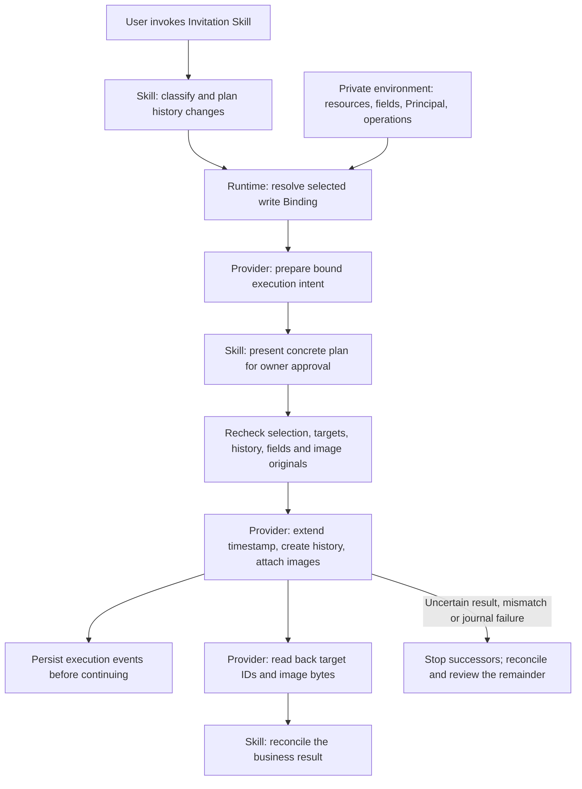

# Record dataset write contract

- Authority: the owner approved the three decisions, responsibilities and rejection conditions in [the Japanese review](../reviews/invitation-selected-write-contract-ja.md), [PR #79](https://github.com/flair-agency/live-agency/pull/79) at `eeca3d4`, and authorized implementation on 2026-09-14.
- Canonical location: `flair-agency/live-agency`, branch `main`, path `docs/architecture/record-dataset-write-contract.md`. Status `commit` records design adoption; it does not establish source integration, implementation or production success.
- Scope: [Invitation migration #14](https://github.com/flair-agency/live-agency/issues/14). Connect the existing business plan to a selected environment without moving service knowledge into the Skill or changing the existing Profile path.
- Decision: add a generic `record-dataset-write/v1` Binding, use record-ID-scoped readback with the explicitly changed create-ID guarantee below, and include images in normal execution while recovering interruptions through read-only reconciliation and a reviewed remainder.

# Purpose and responsibilities

The [read contract](record-dataset-read-contract.md) permits classification and history planning. Registration needs a separate selected write configuration, authorization and verification. Existing writers are reusable, but several depend on complete-table reads. Adding only a Binding would not meet this contract.

| Owner | Responsibility |
| --- | --- |
| Skill | Target identity, classification, same-state timestamp extension versus transition history creation, business plan and final business reconciliation. Preserve normalized input, image identity and uncertain-result handling. |
| Lark Base Provider | Convert logical fields into configured service fields and types; validate requests; execute selected operations; read complete rows by target IDs; compare values by type; upload images and prove membership and original-byte identity. Do not decide business classifications. |
| Private environment configuration | Bind logical datasets to actual resources, field mappings, Principal, credential references, permitted changes and finite operation/image budgets. Requests cannot override these bindings with arbitrary URLs, field IDs or credentials. |
| Runtime and the existing trusted caller | Resolve fixed versions and selection, check configuration, connect actual approval through existing authorization hooks, persist execution events, and exclude concurrent execution. Runtime does not invoke the business Skill. |

Read and write selections remain distinct. Check that they refer to the same intended environment, Principal and destination. Select a durable, owner-only evidence location outside Git before execution. Neither a generated JSON document nor a digest proves human approval.

# Minimum operation contract

These operations define the adopted obligations; implementation fixes concrete schemas within them.

| Operation | Input | Output and conditions |
| --- | --- | --- |
| `prepare` | Logical dataset, business-plan hash, logical creates, timestamp updates and image appends, with existing-row references | Read-only. Return an immutable intent and digest binding Principal, destination, configuration, complete baselines, image originals and operation counts. Reject unmappable fields. |
| `apply` | Approved prepared intent, with authorization and event-persistence hooks supplied separately by the trusted execution connection | Recheck selection, targets/history, schema and images before executing the unchanged intent. Await event persistence before continuing. An input flag cannot authorize a write. |
| `reconcile` | Original intent and integrity-checked persisted execution evidence | Read-only. Classify operations as confirmed, missing, conflicting or unknown. Never turn unknown into missing. The Skill and owner decide the remainder and its approval. |

Retain the relationship between the Skill's business-plan hash and the Provider's prepared-intent hash. They identify different objects. Reuse the existing `authorizeIntent` / `onEvent` connection and persistence mechanisms; do not introduce configuration-supplied executable code or a self-authorizing request.

Timestamp updates change only the existing row's configured timestamp field. Obtain a complete baseline by ID inside the Provider; a projected dataset read is not a complete baseline. Image operations also verify preservation of other values. Compare values by type and meaning, not by unrestricted equality of raw API representations.

# Scoped readback and the changed create-ID guarantee

Read approved existing rows by their IDs and newly created rows by IDs returned from the selected create API. The new path must not fall back to enumerating the complete history table for write preparation, readback or image membership.

The existing generic creator enumerates all pre-existing IDs and rejects a returned create ID found in that inventory. Reading the returned row after creation does not provide the same guarantee. The owner explicitly accepted this change for the new path:

1. Use the selected create API's response as the creation acknowledgement.
2. Validate requested and returned counts, unique IDs and correspondence to submitted rows.
3. Reject returned IDs already known from this operation's reads or plan to belong to existing rows.
4. Persist the acknowledgement before reading back those IDs and comparing approved values using field types.
5. Stop on missing IDs, ambiguous correspondence or different content. Do not resend creation.

This does **not** independently establish that every returned ID was absent from every unrelated row before creation. The new path relies on the selected create API's creation semantics, acknowledgement and request/result/readback correspondence. Preserve this distinction and the existing Profile path's separate guarantees.

# Images, interruption and human takeover

Normal execution includes every planned image and its verification. Omitting an image is not successful completion. Reuse the selected history and multi-history writers, timestamp updater, creator and attachment operations while connecting complete-row and image-membership checks to bounded ID-specific reads.

Existing image events retain identifiers, hashes and upload information; they do not provide an automatic image-checkpoint-resume API. Do not pass an image-bearing plan into the no-image-only checkpoint adapter. This package does not add automatic image checkpoint resumption.

After interruption, an authorized operator can:

1. Locate the original business plan, prepared intent, actual approval reference, image originals and durable journal.
2. Follow the selected Provider's read-only `reconcile` operation to establish confirmed, missing, conflicting and unknown effects.
3. Inspect the Skill's remaining business operations. Propose another plan only for operations established as missing.
4. Review that new plan and obtain approval for its concrete effects before execution.

If a creation acknowledgement is lost and its row ID cannot be established, do not automatically claim ownership of a similar-looking row. Preserve the unknown outcome and require further evidence. Never replay an uncertain create or image append unconditionally.

# Rejection, diagnostics and bounds

| Condition | Required behavior |
| --- | --- |
| Changed environment, generation, Principal, destination, permitted operations or configuration | Stop before mutation; identify the binding requiring preparation again. |
| Changed complete baseline, target/history identity, schema or image original | Reject stale preparation; do not substitute projected rows or omit changed images. |
| Duplicate, forged, missing or ambiguous result IDs | Reject the result; retain whether a write was attempted or acknowledged; do not resend. |
| Typed value mismatch, malformed readback, or target record absent | Distinguish these outcomes and stop successors. Read failure is not proof of absence. |
| Authentication, transport or API failure | Preserve safe lower-level cause, failure stage, acknowledgement state and write uncertainty. |
| Journal persistence failure | Await the failure, stop successors and retain available execution evidence. Do not claim workflow completion. |
| Page, record, byte or time budget exhausted | Report incomplete work, retain acknowledged effects and use read-only reconciliation. |

User-facing diagnostics exclude secrets and raw service payloads; necessary original evidence stays in the selected owner-only location. Do not collapse these failure classes into one unclassified error.

Preserve existing create/update API batch limits and ordered multi-batch processing for a complete plan. The acquisition service's input limit is a separate constraint. Functional correctness and measured operational performance are separate acceptance facts. Neither a longer diagnostic deadline nor a successful synthetic test establishes production readiness.

# Implementation and acceptance

| Action | Human assignee | Due date | Completion criteria | Evidence and recovery |
| --- | --- | --- | --- | --- |
| Adopt the connection contract | Naoki Kimura (design adoption) | Adopted 2026-09-14 | Preserve approved responsibilities, changed guarantee and rejection conditions in English | PR #79 and retained Japanese review; documentation-only revert |
| Implement Provider and Skill connection | TBD | TBD | Generic write Binding, scoped complete-row/image readback, Skill preparation/application/reconciliation and direct regressions | Same-input behavior, image-bearing creation and timestamp updates, drift and partial/uncertain outcomes; retain old routes |
| Distribute and install selected versions | TBD | TBD | Prepare fixed packages and a concrete environment change with applicable approval and rollback | [#31](https://github.com/flair-agency/live-agency/issues/31) and [#32](https://github.com/flair-agency/live-agency/issues/32); source adoption supplies no operational authority |
| Execute and accept the business workflow | TBD | TBD | Prepare current data, approve the actual plan, execute and reconcile every approved effect including images | Selected Work evidence and human takeover under [#39](https://github.com/flair-agency/live-agency/issues/39); reconcile unknown outcomes without resending |

Focused verification covers image-bearing creation, timestamp-only updates, already-applied results, selection/baseline/image drift, malformed and duplicate IDs, equivalent values with different representations, uncertain responses, journal failures, and partial-image reconciliation. Synthetic API-call evidence must prove that the new path issues no whole-history listing. Run independent caller/API-operation inventory checks where the connection changes discovery. Do not repeat unchanged passing suites without a concrete reason.

# Evidence and policy review

- The approved review compared parent `3d72544`, Lark Provider `923a5e0` and Invitation Skill `6a290bc`. These identify inspected sources, not installed versions.
- An independent read-only check confirmed the missing write Binding and full-table dependencies in writers and image membership. The review corrected the earlier implication that a Binding alone would complete the connection.
- Governing sources: [document and Skill knowledge](../governance/document-knowledge-policy.md), [language](../governance/document-language-policy.md), [development](../governance/development-policy.md), the complete [Private Source Integration Guide](../governance/private-source-integration-guide.md), and [knowledge ownership](domain-knowledge-ownership.md).
- This translation preserves the three adopted choices, their limitations, human reconciliation route, failure classes and subsequent execution authority. It includes no concrete platform classifications, actual resource IDs or credentials. Concrete schemas remain implementation work within the adopted obligations.
- Canonicalization checks covered the three changed documents, eleven distinct relative document/anchor targets, all required identity fields, balanced diagram fences and diff whitespace. The diagram was compared with the approved flow; visual rendering was not performed. No implementation test was repeated for translation.
- Adoption does not establish human comprehension, implementation correctness, distribution, production installation or successful writes. Record those outcomes separately in #14.
