# Lifecycle design planning record

Status: historical planning and verification; current specification is [Runtime deployment design](../../provider-runtime/docs/deployment.md). Proposed commands do not authorize execution.

# npm Runtime Distribution and Environment Separation: Design and Implementation Plan

Created: 2026-09-06 JST

Status: Design and plan. Implementation, package publication, and production cutover have not been performed.

Scope: LIVE Agency Skills, Providers, MCP, shared libraries, Runtime, host registration, and operational configuration.

## 1. Purpose and Design Principles

Separate production operations from the development checkout by installing verified npm packages into an independent production environment. npm owns dependency resolution and package installation. A dedicated CLI handles environment configuration, Skill registration, MCP startup, activation, and recovery.

Git is authoritative for source code. npm package manifests and the production lockfile are authoritative for the distributed dependency graph. Environment configuration is authoritative for destinations and authority. Conversations and direct edits to installed files do not define a release.

Adopt the following design principles:

- Retain the current multiple repositories, Git submodules, and npm workspaces for development. A monorepo migration, repository rename, or Skill rename is not required.
- Distinguish the distributable Runtime package from the development composition root. Version components independently and let Runtime select a combination whose compatibility has been verified.
- Install production npm packages in an independent installation project without referencing development workspaces or source files.
- Freeze the production package.json, package-lock.json, toolchain requirements, and verification results as one release.
- Initially support local execution on macOS. Use Codex for development and allow local Work to serve as the operational interface after its capabilities have been verified. Moving to Work is not a prerequisite for environment separation.
- Track package installation, production capability activation, and authorization for business operations separately. Installation must not add write authority.

Change card for this documentation work: primary class G; future implementation falls under E/D, and cutover under F. Protected boundaries are composition, Provider resolution, public/private separation, Profiles, and operational routes. Completion requires documenting the current gaps, design, dependency-ordered plan, and acceptance criteria, and verifying references. Preserve existing uncommitted changes; do not change production settings, external services, or source code. No parallel agent work.

## 2. Current State and Gaps

This baseline uses local files and existing documentation inspected on 2026-09-06. Running services, registry ownership, authentication, and permissions were not reverified for this document. The checkout contains changes from other work and is not considered a clean, releasable baseline.

| Area | Observed current state | Target and required change |
| --- | --- | --- |
| Repositories | Root pins Skills, MCP, and Providers as submodules | Retain this structure; add mappings from source commits to distributed package versions |
| Development dependencies | Root uses npm workspaces | Retain workspaces; separate development and production lockfiles |
| Root manifest | `private: true`; distribution bin/files are not yet established | Keep root as the private development composition; add a separate distributable Runtime workspace |
| Skills | `install:skills` links root-owned Skills into the user's `.codex/skills` | Use an explicit development scope; register production Skills from installed packages |
| Public Skills repository | Root manifest is `private: true`, version `0.0.0`; fixtures are mixed into dependencies | Separate runtime manifests from test composition instead of publishing the source root unchanged |
| Providers | Many have names, versions, and exports/files, but use `private: true` | Establish pack contents, dependency declarations, publication destinations, and visibility individually |
| MCP | Starts directly from source; distribution exports/bin/files need work | Define stable startup APIs and resource inventories in the distributed package |
| Actual host configuration | Several MCP entries start code from the current development checkout | Reference a stable production launcher |
| Provider discovery | source-provider-api scans root dependencies and `root/node_modules/<name>` | Use an explicit release-selected Provider list and package resolution API |
| Root-relative references | Intelligence imports paths such as `../providers/.../src`; instructions are also root-relative | Replace these with package exports and package resource APIs |
| Private paths | Intelligence restricts configuration to `<root>/private` | Move the boundary to independent environment config/state roots while preserving access restrictions |
| Installation hooks | Root postinstall installs the Skills repository's test dependencies | Restrict this to development setup; keep business operations and host changes out of production installation hooks |
| CI | No `.github` directory was found at root | Inventory component CI separately; establish artifact verification and integrated release CI |
| State files | `private/`, `runtime/`, and similar paths are Git-ignored; untracked `runtime-data/` also exists | Inventory output locations, retention, and ownership; require pack allowlists rather than relying on Git exclusions |
| Recovery | Existing rollback records are workflow-specific | Add package, configuration, and host-registration recovery separately from business-data restoration |

Primary evidence files: root `package.json`, `.gitmodules`, `.npmrc`, `scripts/install-codex-skills.mjs`, component package.json files, `scripts/agency-intelligence-mcp-server.mjs`, `scripts/agency-intelligence-mcp-runtime.mjs`, and `skills/live-agency-skills/packages/source-provider-api/src/index.js`. Do not include actual host-configuration or link paths in public artifacts.

## 12. Required Changes

| Target | Required change | Completion evidence |
| --- | --- | --- |
| Runtime root / new Runtime workspace | Distribution manifest/bin/exports; separation from development-only postinstall | Starts from a packed artifact without the development root |
| Skills repository | Runtime resource manifest, fixture dependency separation, and relative-reference fixes | Installed execution/resource checks for every supported Skill |
| Providers / core | files/exports/dependencies, bundled knowledge, and registry configuration | Individual pack and consumer tests; publication-boundary checks |
| MCP / root launchers | Remove cross-repository src imports; stable APIs and explicit Runtime/configuration injection | Authority checks for each read/write entrypoint without source paths |
| source-provider-api | Explicit Provider list, Node package resolution, and resource API | Tests for nested dependencies, missing packages, ambiguous Bindings, and global contamination |
| private-runtime-files / configuration callers | Environment roots, realpath restrictions, and schema migration | Boundary and unknown-schema rejection; migration tests from old settings |
| Existing installer | Restrict to development registration; use package provenance in production | Preserve same-name collisions, ordinary directories, and unmanaged registrations |
| Lifecycle CLI / host adapters | install/activate/status/doctor/rollback/uninstall | Interrupted-operation recovery, idempotency, conflict, and rollback tests |
| CI / release scripts | Package publication, lock generation, artifact retention, and clean installation | Matching hashes for published/tested artifacts and clean reproducibility |
| Operational documentation / schedule references | Old/new route inventory, runbooks, and handoff | No development-path references, supported-host checks, and remaining-item inventory |

## 13. Implementation Plan and Dependencies

Define work packages by outcomes rather than splitting them solely by file count. Every row below remains unimplemented. Coordinate changes to shared lockfiles or dirty submodules with existing work.

| ID | Single outcome / primary owner | Dependencies / entry conditions | Exit criteria and recovery |
| --- | --- | --- | --- |
| RLS-0 | Confirmed distribution, host, registry, and path inventory / root | This design | Explicit package names/ownership, public/private classification, all Skills/callers, toolchain, and configuration migration targets; investigation only |
| RLS-1 | Portable package-resolution and configuration-root contracts / API, root, affected consumers | RLS-0 and applicable M2U contracts | One representative route works without the development root; reject boundary violations, unknown/ambiguous inputs, and authority fallback; explicitly retain the old route |
| RLS-2 | Distribution artifacts for all selected components / component repositories | RLS-0; RLS-1 for consumers that need it | Tarballs contain complete Skills/resources/APIs/knowledge, declared dependencies, and passing unit tests; source changes remain recoverable per component |
| RLS-3 | Runtime release and production lock generation / root | RLS-2 and confirmed distribution destination | Reproduce an independent installation project from verified components; publication remains a separately identified execution step |
| RLS-4 | Lifecycle CLI and host adapter / root | RLS-1 and RLS-3 format | Complete install → activate → update → downgrade → uninstall in isolation; verify failure recovery and retained assets |
| RLS-5 | Release CI and clean-install gate for every supported Skill / root | RLS-2 through RLS-4 | Verify all supported targets without the development tree, with fresh state and a fixed toolchain; no unexplained coverage gaps |
| RLS-6 | Production cutover candidate and concrete migration runbook / root operations | RLS-5 and existing workflow gates | Record old registrations, configuration, schedules, execution state, and old/new mappings; reviewable cutover diff, authority, and recovery material |
| RLS-7 | Cutover and operational evidence for one environment / root operations | RLS-6 and production cutover authorization | Skills/MCP use the same release; expected Principal, host reload, and relevant schedules are verified; restore the old state on failure |
| RLS-8 | Retire development references and establish ongoing operations / root | RLS-7 and required stable-operation evidence | No production references to development; old-route retention period decided; update/uninstall runbooks complete |

```mermaid
flowchart LR
  R0[RLS-0 Inventory and distribution decisions] --> R1[RLS-1 Resolution and configuration contracts]
  R1 --> R2[RLS-2 Component artifacts]
  R2 --> R3[RLS-3 Runtime and lockfile]
  R3 --> R4[RLS-4 Lifecycle CLI]
  R4 --> R5[RLS-5 Clean install and CI]
  R5 --> R6[RLS-6 Production migration runbook]
  R6 --> R7[RLS-7 Production cutover]
  R7 --> R8[RLS-8 Retire old references]
```

Priority update, 2026-09-06: the [environment separation and production stability plan](environment-separation-and-production-stability-plan.md) takes precedence for immediate execution. Start with SEP-0 and verify the independent development environment through SEP-2; full npm packaging is not a prerequisite for that separation. Reuse its inventory in RLS-0. RLS-0 remains the entry point within this packaging workstream, covering package/Skill/host/configuration references, distribution and scope decisions, the supported toolchain, and the first representative route. Creating this design does not initiate publication or production migration. Documentation completion does not establish completion or authorization of existing v2 capabilities.

## 15. Relationship to Existing Plans and Open Decisions

Connect this design to the responsibility boundaries and R1–R3 phases of the [repository reorganization plan](repository-reorganization-plan.md). It specifies the future transition from development-checkout symlinks to npm artifacts. Retain existing clean-clone checks for development composition reproducibility and add evidence from clean installation of distributed artifacts.

Integrate SN-2 from the [Skill migration plan](../reviews/v2-skill-naming-and-migration-plan.md), covering provenance, collisions, and compatible registration, into RLS-2/4 without duplicate implementation. M7-2 in the [v2 migration plan](v2-migration-plan.md) owns verification of every supported Skill; RLS-5 supplies evidence for this distribution model. Preserve existing contracts and production gates, including IA-4, M2U, and W1/W2.

Decide the scope to include in existing M7 after RLS-0 reconciles capability dependencies and conflicting changes. Adding this plan does not change the next work item or completion status in the current [handoff](v2-task-handoff.md). Physical repository relocation, a separate core repository, and optional Skill renames are not release requirements. Record change cards and evidence for each stage under the [task policy](../governance/development-policy.md).

| Open decision | Current recommendation | Decision deadline |
| --- | --- | --- |
| Private registry and scope ownership | Verify GitHub Packages as the first candidate | RLS-0, before manifest changes |
| Public npm publication scope | Select general-purpose Skills/APIs individually; private distribution is acceptable initially | RLS-2, before publication |
| Concrete production/development paths and host scopes | Separate installation/state roots; avoid global registration of development versions | RLS-0, before host adapter work |
| Supported Node/npm/OS/architecture | Pin and verify on the actual host; current `node >=22` alone is insufficient | RLS-0, before lock generation |
| Initial host and Work migration | Retain current Codex operation; add local Work after verification | RLS-4 and RLS-6 |
| Secret storage | Initially owner-only files and reference IDs; Keychain migration is separate | RLS-1, before configuration migration |
| Generation count and retention period | Retain at least active and last known-good releases; prioritize references from incomplete runs | RLS-4, before prune implementation |
| Plugin, cloud, and offline distribution | Outside initial scope; share release identity with npm distribution in the future | Separate plan |

## 16. Scope of Verification for This Documentation Work

The investigation covered local manifests, the installer, resolution/startup code, existing plans, and official specifications. Deliverables are this design and its README link. Verify document links, structure, and diffs. Code tests, package creation/publication, registry authentication checks, live smoke tests, host configuration changes, Skill activation, and business-data migration are not claimed as results of this documentation work.
