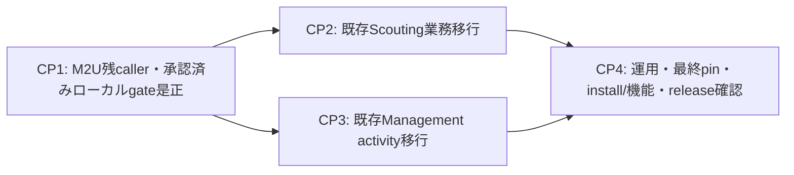
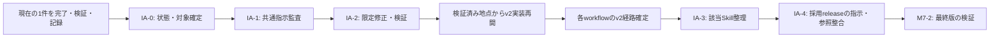
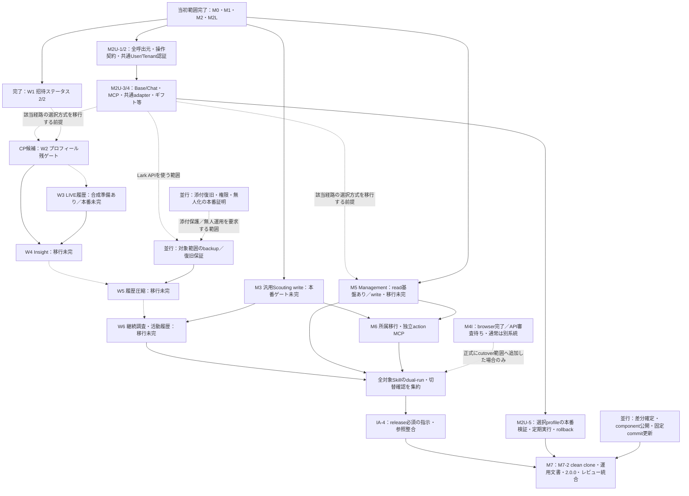
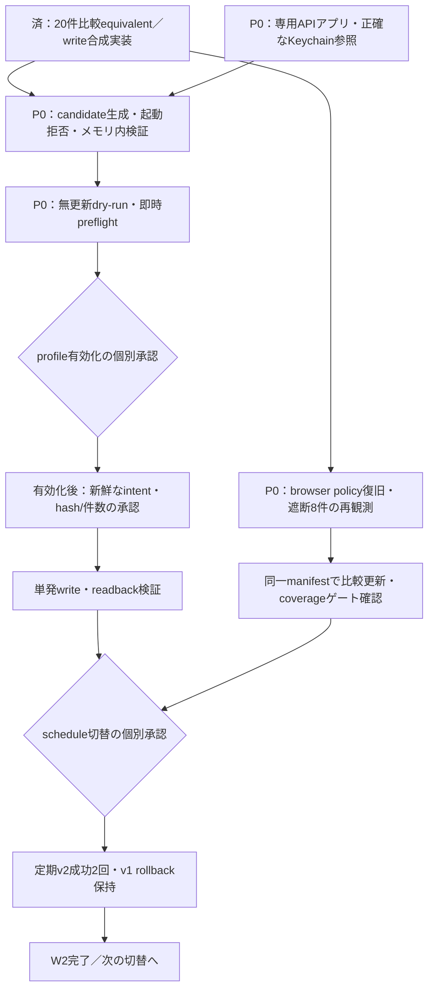

# LIVE Agency Runtime v2：進捗評価・優先順位・PERT

> Status: Historical evidence; not current instructions or present operational verification. Current work: [migration status](../migration/status.md).

評価日：2026-09-05 JST。対象：ローカル統合ブランチ `v2/domain-mcp-architecture`、HEAD `be49d23` と評価時の未コミット差分。

## 現行の依存関係（2026-09-06）

[移行計画§5](v2-migration-plan.md#5-migration-milestones)のCP1–CP4を現行とする。所要時間未評価のため最長経路の確定ではない。

各経路のM2U対応部分だけが先行依存。W4はprofile/LIVE入力、削除は対象backup、既存活動更新は必要なM3 writeに依存する。W2専用Appは未解決のコード制約でありowner必須要件とは未確定。固定2回/24h/benchmarkは一律gateにしない。追加M5/M6、添付完全復元・能力drill等は[移行後§7](v2-migration-plan.md#7-post-migration-improvements)へ移動し、CP4への矢印を持たない。現在の着手は[handoff §4](v2-task-handoff.md#4-next-work-package)を参照。

## 以下は2026-09-05評価の履歴（旧図・優先順は失効）

当時の証拠を保全するため旧評価を残す。下記M6→ALL、専用App、固定2回、旧IA着手順などは現行queue/release gateとして使用しない。現在の完了状態と未解決事項は上記リンク先を優先する。

## 承認済み計画の追記（2026-09-05）

[監査・簡素化計画](instruction-audit-and-simplification-plan.md)のIA-0〜IA-4をv2の一環として採用した。現在の1件を完了・検証・記録した後、IA-0〜2を行って実装を再開する。IA-3は各経路が固まった時点、リリースに必要なIA-4はM7-2最終検証の前に組み込む。任意の文章改善はv2完了を妨げない。監査実施・完了は未計上。

下記の実装進捗は当初評価のスナップショットであり、この追記では再評価していない。旧記載のM2U-2直近着手は現在の指示として使わず、[引き継ぎの次作業](v2-task-handoff.md#4-next-work-package)で最新の結果を照合する。Astra既定の承認は新規作業に適用し、稼働中タスクや定期実行の設定は変更しない。

## 評価の前提

移行計画、引継ぎ、切替記録、現在のコードを照合した計画上の評価。本番実績は文書記録に基づき、今回ライブサービス・定期実行・非公開receiptを再確認したものではない。2026-09-05にownerが指定した「Lark OpenAPIを利用する全ProviderのUser／Tenant選択」をM2Uとして移行計画に追加した。実装・本番切替は未完で、既存の運用権限を変更しない。

楽観・最頻・悲観の所要時間、担当者の稼働率、外部承認待ち時間は未設定。この図は依存関係を示すPERT形式の作業ネットワークであり、厳密な最長経路、余裕時間、完成日、工数ベースの進捗率は未算定。「CP候補」は現時点の優先経路を意味する。

## 進捗評価

| 項目 | 評価 | 完了根拠と残作業 |
| --- | --- | --- |
| M0 統合基盤 | 当初範囲完了 | 固定バージョンとテスト入口あり。ただし現在の追加差分・ローカルcomponent commitの公開とclean cloneはM7で再証明が必要 |
| M1 ドメイン・権限分離 | 完了 | Scouting/Managementプロセス、共通契約、分離されたwrite権限 |
| M2 / M2L データ・Larkプロファイル | 当初範囲完了 | 親レコード追加を整合、Scouting readを再検証済み。全ProviderのUser／Tenant選択は追加工程M2Uで実施 |
| M2U Lark OpenAPIのUser／Tenant選択 | M2U-1実装済み／M2U-2～5未完 | 全呼び出し元の棚卸し → 共通認証 → Base/Chat → MCP・共通adapter・ギフト等 → 本番検証。APIが対応しない組合せは拒否、User／Tenant自動切替なし |
| M3 Scouting MVP | 一部完了 | readと汎用writeの合成試験あり。汎用活動履歴writeの本番profile・資格情報・有効化は未完。招待履歴writeとは別 |
| M4 W1 招待ステータス | 切替ゲート完了 | 修復後の定期実行2/2、単発writeのreadback記録あり。定期成功はread-onlyでの正常なinteraction_requiredを含み、無人write完成を意味しない |
| M4 W2 プロフィール | 比較・write実装完了／本番切替待ち | 20件の比較がequivalent。作成案11、添付0、unavailable 9。うち8件がbrowser-blocked。専用APIアプリ不足でcandidate未生成、write未有効化 |
| M4 W3 LIVE履歴 | 合成準備着手済み | 未コミットのadapter・比較CLI・説明と11テストあり。本番dual-run、LIVE履歴/指標write、切替は未確認 |
| M4 W4 Insight | 移行完了の証拠なし | プロフィール/LIVEの移行済み証拠を使うdomain経路と比較・切替が残る |
| M4 W5 履歴圧縮 | v2移行ゲート未完 | 既存backup/retention機構あり。各domain経路、削除窓のbackup・hash/件数承認・readback・再集計・事後backupが残る |
| M4 W6 継続調査・活動履歴 | 移行ゲート未完 | 元計画の順序6番目。M3汎用write本番ゲートと各Skill移行が必要 |
| M4I Chat intelligence | browser範囲完了／APIは外部待ち | browser read-onlyは記録上稼働。API審査と同一user/scope証明が残る。追加採用しない限り既存v1移行の阻害要因ではない |
| M5 Management | read基盤あり／業務移行未完 | read/observe/validateの3ツール実装あり。Management Base write、activity移行、cost/incentive/reward/ROI等は未完 |
| M6 所属移行・特権操作 | 完了の証拠なし | 両domainのwriteと正確な行対応、部分成功照合、独立action MCPが必要 |
| M7 全体切替 | 未完 | 全Skillゲート、M2Uの全Lark OpenAPI対象検証、公開済み固定commit、clean clone、運用文書、2.0.0化、レビュー統合が残る |
| Backup強化 | 合成実装あり／本番未完 | 添付・権限・無人化・複合復旧の契約とテストに未コミット差分あり。実取得/復元、権限readback、無人実行、複合復旧、retention拡張が残る |

## PERT：残作業全体

実線は契約・ゲート上の依存、点線は計画上の移行順序、破線の注記付き経路は条件付き依存。準備作業は前段の切替完了を待たずに進められる。M5をM4全体完了の必須後続とする根拠は見つからず、並行準備を提案する。

M2U-1の呼び出し元棚卸し・選択契約は[実装済み](../../runtime/docs/archive/v2-m2u-inventory-and-contract.md)。当初評価の直近着手は **M2U-2の共通認証・制約付き通信** だったが、現在の次作業は冒頭の承認済みIA順序と引き継ぎで確認する。既存Skillの優先経路は **W2の専用APIアプリ・観測coverage解消 → W2切替 → W3 → W4 → W5 → W6 → M7** として残し、**M2U-1/2 → M2U-3/4 → M2U-5 → M7** を必須経路に追加する。該当する経路の切替にはM2Uの対応部分を満たす必要があるが、W2やM5の準備まで一律に止めない。W3以降の順序は元計画に基づく。**M3 → M6**、**M5 → M6**、backup、component公開が遅れれば、そちらが最長経路になり得る。M3はW6にも合流するため独立した末端作業として扱わない。

M2Uの汎用Chat Provider対応と、M4IのCreator Networks API本番有効化は別のゲート。M2Uでも現在のM4I instanceはTenant・更新禁止を維持し、外部のapp審査待ちを他組織の資格情報やTenant経路で代替しない。将来のDocs Providerには同じ導入条件を課すが、延期中のDocs機能自体を今回の必須実装へ追加するものではない。

## PERT：W2の直近ゲート

専用アプリと観測coverageは別の阻害要因であり、片方だけ解消しても切替はできない。観測変更でintentの入力・件数が変わる場合はdry-run/preflightと個別承認を更新する。9件のunavailableすべてを8件のbrowser-blockedと混同しない。残り1件の分類は今回の概要文書だけでは確定しないため、更新比較で確認する。

## 作業優先順位

P0＝現在のW2を直接止める作業、P1＝追加の必須基盤・並行して進める後続ゲート、P2＝基盤がそろった後の移行、P3＝現行cutover対象外。W2の外部待ちとは独立して、現在の1件の区切りでIA-0〜2を優先し、その後の実装単位を検証済み進捗から選ぶ。

| 優先 | 作業 | 着手条件・完了判定 |
| --- | --- | --- |
| P0 | W2専用APIアプリと参照確定 | ownerから別appの正確な参照。既存read appの別名化では代替できない |
| P0 | W2の遮断8件再観測と比較更新 | browser policy利用可能後。正常なunavailableと取得遮断を分離してcoverage判定 |
| P0 | candidate → 無更新検証 → 有効化 → 個別write → 切替 | 各証拠と権限を順に確認。最後に定期成功2回 |
| 直近の作業区切り | IA-0〜2 共通指示の監査・限定修正 | 現在の1件を完了・検証・記録。合格後はv2実装へ戻り、全Skill改稿を待たない |
| P1 | M2U-1/2 全Lark OpenAPIの棚卸し・選択契約・共通認証 | `api-app`/`api-user`を明示選択。操作別対応表、既定値への依存拒否、同一actorでのrefresh、読み取り・更新の制約を合成検証 |
| P1 | M2U-3/4 Base/Chatと全呼び出し元の移行 | 共通契約確定後。ドメイン外のギフト投影、backup/recovery API、共通adapterと定期runnerを含める |
| P1 | W3合成差分の確定、LIVE履歴/指標write、本番比較準備 | 当初評価では合成11テストが通過。本番切替はW2の後という計画順序を維持 |
| P1 | M3汎用活動履歴writeの本番準備 | 専用権限・最新schema・無更新検証。W6とM6を止めない |
| P1 | M5 Managementのwriteとactivity移行準備 | 既存read基盤を利用。Scoutingの全切替完了を待つ必要はないという提案 |
| P1 | Backup強化と圧縮対象ごとの保護範囲確定 | 添付復旧を保証するなら実経路・複合drill・retentionまで必要。無人化を全削除作業の無条件前提にはしない |
| P1 | 未コミット差分のレビュー、component公開・pin整合 | 現在の合成成功を公開済みclean cloneの成功と混同しない。公開自体は今回未実施 |
| P2 | M2U-5 profile別の本番・定期実行検証 | 選択actorでpreflight、必要な承認済みwrite/readback、再起動後のidentityと既存成功回数ゲート、固定commit・rollbackを検証 |
| P2 | W4 → W5 → W6の移行 | 各Skillで新旧比較、切替承認、定期成功2回。圧縮は別途exact planとbackupゲート |
| P2 | M6所属移行・特権操作 | M3/M5の必要write契約が安定してから。uncertainとsend_failedを区別、盲目的再試行なし |
| P2 | IA-3 / IA-4 | 各安定経路でSkillを整理し、release必須の指示・参照整合をM7-2前に確認。任意改善は後続へ送る |
| P2 | M7最終判定 | IA-4の必須整合、全対象Skill、M2U全対象のUser／Tenant選択と非対応時拒否、再現性、運用文書、2.0.0化、v1代替の検証を集約 |
| P3 | M4I API-user化 | app審査後。既存移行のCPから外す。browser-only完了を維持 |

週次経費申請prototypeはowner判断で凍結中であり、優先作業へ戻さない。

## 今回の検証と計画文書の補正点

当初の評価時点のworking treeで `npm test` を実行し、12グループ **432 tests / 432 pass / 0 fail**、終了コード0。内訳：Skills 151、Lark core 9、Chat 10、Base 23、BackStage 17、iOS 4、Web 19、Drive 11、Money Forward 25、MCP 101、smoke 6、v2 contracts 56。全体テストには移行対象外の経費テストも含む。これは当時のローカル合成・統合検証であり、M2U実装済み・本番・remote clone検証の証拠ではない。

M2U追加のcheckpointは文書のみを更新し、相対リンク、範囲・状態の整合と差分の空白を確認済み。Providerや本番設定は変更せず、上記テストを再実行した扱いにはしない。

既存図の「W3未着手」を合成準備済みに補正し、欠けていたW6、M3からW6/M6への合流、component公開を追加した。M5にはread実装があるため全面未着手扱いを修正した。backup強化は合成済みと本番未完を区別した。元計画のprofile一覧には招待writeが「MCP未設定」と残るが、後段と切替記録では設定・2/2完了済みのため、後者を現在の記録として採用した。handoff冒頭の古いcheckpointより実HEADを評価基準にした。

工期を確定する次の入力は、各残作業の楽観・最頻・悲観日数、担当/同時稼働制約、外部待ち、定期実行間隔。入力後に期待時間 `(O + 4M + P) / 6` と最早/最遅時刻・余裕を計算し、CPを確定する。

## 根拠

- [移行計画](v2-migration-plan.md)：M0–M7、M4の移行順序6項目、各切替ゲート。
- [Lark User／Tenant選択設計](../../packages/lark-core/docs/principal-selection.md)：M2U-1〜5、全Provider・間接利用元、操作別対応と本番検証。
- [引継ぎ](v2-task-handoff.md)：W2 blocker、local checkpoint、既存制約。
- [W1切替記録](../../runtime/docs/archive/v2-m4-wave1-scheduled-cutover.md)：2/2の定義と到達記録。
- [Backup強化](../architecture/skills/backup-hardening.md)：未コミットの合成checkpointと本番残ゲート。
- [LIVE比較テスト](../../skills/creator-live-history-sync/test/live-history-v2-dual-run.test.mjs)：11件の合成準備。
- [Management実装](../../mcp/operations/src/creator-management-mcp-server.mjs)：read-only 3ツール。
