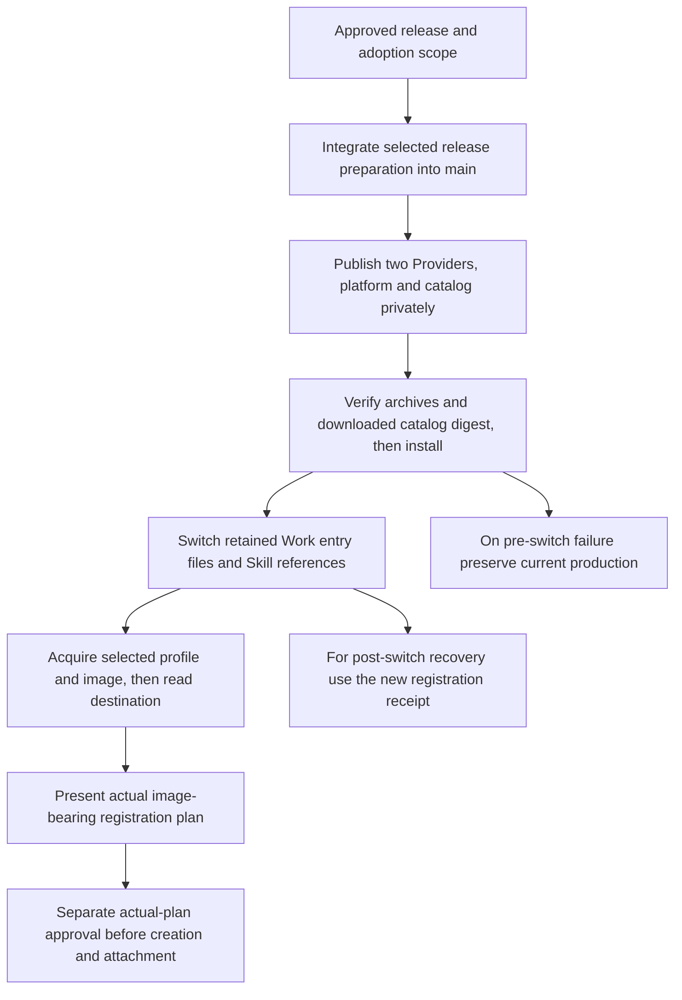

# Profile avatar and typed-readback release and production adoption

The owner approved [root PR #66](https://github.com/flair-agency/live-agency/pull/66) and [Lark Base PR #19](https://github.com/flair-agency/live-agency-provider-lark-base/pull/19) on 2026-09-12. This English decision adopts the meaning, fixed identities and acceptance criteria in the [Japanese review](../reviews/profile-avatar-readback-adoption-ja.md), including the catalog asset verification added for PR #66's P1 finding. The reviewed parent source checkpoint was `f28dc0c2eb4d71f46bcf218841e6953dc0ab5004`.

Canonical location: `flair-agency/live-agency`, branch `main`, path `docs/development/profile-avatar-readback-adoption.md`. The Japanese document is retained as approved review history. Adoption of this decision does not establish publication, installation, host switching or service-operation completion. At the preparation checkpoint these operations had not run.

The approved scope is private distribution of the fixed versions, installation into a new directory, adoption in the previously selected production ChatGPT Work Local task, and acquisition, destination reads and an actual image-bearing registration plan for the previously selected single target. Preserve that private target selection; do not place its account identity or operational bindings in Git. Actual record creation and image upload/attachment require separate approval of the resulting actual plan and counts. Do not resend records already registered and reconciled.

# Selected updates

| Component | Production at review | Approved target | Reason |
| --- | --- | --- | --- |
| TikTok Web Provider | `1.1.0` | `1.1.1` | Preserve visible-avatar acquisition routes and evidence distinguishing completed from unfinished attempts |
| Lark Base Provider | `1.4.0-m3.3` | `1.4.0-m3.4` | Compare readback by field type and distinguish failure causes |
| TikTok platform | `0.1.0-m3.2` | `0.1.0-m3.3` | Select the corrected TikTok Web version |
| Catalog | `0.1.0-m3.3` | `0.1.0-m3.4` | Select the platform and Lark versions above |

Reuse Runtime `2.0.0-m3.0`, Profile Skill `2.0.0-m3.3`, Transport `1.1.3` and CLI `1.0.93`. Preserve the existing LIVE platform, actor, destinations, authority, configuration and update policy. The implementation decisions are [TikTok Web PR #3](https://github.com/flair-agency/live-agency-provider-tiktok-web/pull/3) and [Lark Base PR #18](https://github.com/flair-agency/live-agency-provider-lark-base/pull/18). Lark's additional source changes are the release version at three locations. TikTok Web can release the accepted main source unchanged. Parent changes select the platform/catalog and record the decision.

# Authorized execution and stopping conditions

1. Check the latest scoped PR diffs, comments, CI and selected source SHAs before merging into main. Additional changes to the adopted implementations are release versions and selection metadata only.
2. Use existing manual publication workflows for the two Providers, then the platform. TikTok Web uses `latest`; Lark and the platform use `next`. Publish to the existing private GitHub Packages destinations. Store the catalog in a new private repository release without overwriting an existing version or asset. Recheck version/tag collisions immediately before publication.
3. Match the three npm archives to the approved SHA-256 values below. After publication, download `catalog.json` from release tag `catalog-v0.1.0-m3.4` into a new private file and compare its raw-byte SHA-256 to the fixed value below. Do not reformat JSON or derive the expected digest from the downloaded asset. Record tag/asset identity, retrieval time, measured digest and comparison result in the distribution receipt. If retrieval fails or a digest differs, stop before installation and preserve current production. Only after all four matches, use the existing Runtime `setup install` into a new directory. Verify the fixed CLI's official initialization procedure and checksum. Do not switch unless configuration hashes, dependency versions and all three capabilities agree.
4. Retain the three current production entry files, then redirect them and the same Profile Skill version to the new installation. Generate a new registration receipt dedicated to this switch; verify references, the actual installed generation and recovery preview. Do not invent the generation before installation.
5. Through the selected production Work route, acquire and plan for the previously selected single target. If the visible image is acquired, verify it appears as an attachment candidate. Otherwise report attempted routes, whether attempts are unfinished or acquisition is unavailable, and the concrete cause. A zero-image plan is not avatar acceptance.

Authorization ends at step 5. The final creation/attachment and readback in the diagram require separate approval of the actual plan. If configuration differs before or after installation, or a required permission is unavailable, stop the affected operation and record its cause and already completed phases.

# Fixed identities and preparation evidence

Installation-plan SHA-256: `1b4be526c8f7fadb96ce00713c69214a8d27cdcb01ba5552ec7cdc1fa92e59f0`. This identifies an installation plan, not approval for business-data registration. The existing formally installed Runtime produced it without a new installation, switch or service operation.

| Artifact | Source | Archive or raw-file SHA-256 |
| --- | --- | --- |
| TikTok Web `1.1.1` | main `6b496624534448cbd9b47de104c4f655efc08215` | `958ed55b03aea2116864d42da4264426722c296ade6d1a3cc97bdf2e770365e0` |
| Lark Base `1.4.0-m3.4` | `de5568ffa5a4c38e0f2feb863ae90b396a6dc216` | `2f938d4ad66d418cb718de037d3eab21c31970cadd3c484b50c8b4d9531fd4ad` |
| Platform `0.1.0-m3.3` | PR #66 declaration | `f8cfa4b317b6de33622d9e59ca6a8345a8410e5459fda9d8ba91f05840f02ca7` |
| Catalog `0.1.0-m3.4` | PR #66 `catalog/catalog.json`; release `catalog-v0.1.0-m3.4`, asset `catalog.json` | `521cd2cce893e97bb30a2a53d9d80afff227ce8ca683fe91956cf88e1ff1556c` |

The installation-plan digest does not prove the published catalog's identity. Existing releases did not enable GitHub's native immutability setting; use the separate post-download check. During preparation, the catalog source bytes, retained `catalog.json`, `deployment-review.json`'s `catalogSha256` and the corresponding finalized index entry agreed. Their bytes, the installation plan and the existing index remain unchanged by this document adoption. Post-publication retrieval and comparison had not been performed at that checkpoint.

| Preparation evidence | Recorded result and limit |
| --- | --- |
| Current production selection | Saved launcher/environment and registration receipt agreed; Runtime/Profile matched the versions above |
| Configuration and recovery | Both Provider configuration references and byte hashes matched production; the three current entry files and Skill reference were unchanged |
| Actual archives | TikTok 16 files, Lark 64 files, platform 2 files; compared with adopted source and required resources |
| Selection consistency | Archive manifests, platform declaration, catalog and Runtime plan agreed on the three capabilities |
| Inherited implementation checks | TikTok 20 tests plus actual image acquisition and clipboard/archive normalization; Lark 75 tests. Unchanged implementation tests were not repeated |
| Additional preparation checks | One Lark distribution-resource test, artifact/reference/declaration consistency, unchanged configuration, scoped diff and links |

Registry version lists and individual queries showed both Provider candidates and the platform candidate unused, and the new catalog tag absent. Without injection of the saved registry configuration variable, requests returned 401; passing the existing npm authentication only in child-process memory enabled the query. No credential value was changed or persisted. Use the same explicit configuration during installation; ambient authentication is not a replacement for selection.

Typed comparison addresses reproduced representation differences. Which field failed in the earlier actual registration, and whether post-registration verification will succeed in this production run, remained unverified. Keep [Issue #61](https://github.com/flair-agency/live-agency/issues/61), [avatar Issue #1](https://github.com/flair-agency/live-agency-provider-tiktok-web/issues/1) and [acceptance Issue #32](https://github.com/flair-agency/live-agency/issues/32) open until their actual evidence is complete.

# Evidence custody and immediate recovery

The designated operational user's private `~/.local/share/live-agency/deployment-plans/profile-avatar-readback-20260912/` on the same Mac holds the evidence. As that user, use Finder's Go to Folder and read `README.md`, `record.json`, then `deployment-review.json`. Directories are `0700`; files are `0600`. The bundle retains original archives, plan, configuration hashes, before/proposed entry files and preceding installation/registration receipts. Keep actual business data and credential values outside Git. Another operator needs owner-authorized access to this private bundle before acting.

Preparation verified all 37 retained file hashes. The `record.json` SHA-256 is `c0c737fa5a004a6b93abbd1c33fa6419e5db9e5a7d791363379e71fc56674b5b`. Earlier actual-image acquisition evidence is included as a private copy; images, target manifests and normalized observations remain private business data. This is same-Mac retention; off-device custody and retrieval by another operator were not tested.

The immediate recovery target is the current write-diagnostic generation `b9abf30e7e7d4efe4dd1720c316b29ace4c387642e6ad017b87c944827a7264e`. Restore the Profile reference using the new registration receipt generated during this switch. Restore the three saved pre-switch files only after checking that no third-party change has intervened. Do not use the older registration receipt under `previous/`: it would restore an earlier generation. Retain installations and diagnostic evidence. Local configuration recovery does not undo external data.

# Document adoption and AI policy review

This is class G deterministic documentation maintenance: adopt the already approved Japanese decision in English, mark review history and update the current status entry. Only those three parent documents change. No package, catalog, source snapshot, private evidence bundle, installation plan or production setting changes in this document task. The coordinating release task retains PR/Issue tracking and execution ownership.

On 2026-09-12, Codex compared the actual scoped text against the [document and Skill knowledge policy](../governance/document-knowledge-policy.md#ai-review-before-requesting-owner-approval), [language policy](../governance/document-language-policy.md), [development policy](../governance/development-policy.md), and the fully read [Private Source Integration Guide](../governance/private-source-integration-guide.md). The review checked Japanese/English meaning, fixed versions and hashes, the diagram and ordered procedure, separate actual-plan approval, zero-image non-acceptance, the new-receipt recovery route, document links and private-information boundaries. It preserves the catalog P1 correction and the distinction between approval and execution. Preparation checks above are inherited evidence, not checks newly rerun by this translation.

Changed-section local links and every approved SHA-256 value passed verification; the scoped diff passed `git diff --check`. The independent caller check, `node --test test/m2u-call-site-inventory.test.mjs`, could not run its assertions because this isolated worktree lacks `providers/lark-base/src/api-operations.js` (`ERR_MODULE_NOT_FOUND`). No component initialization or dependency installation was performed for this documentation-only task. The coordinating task must retain that limitation; this is not a passing caller-inventory result.

Self-review does not establish independent review, human takeover acceptance or production success. This document task performs no publication, installation or service operation. No new release decision is requested: the fixed scope is already approved. The next business decision is approval of the actual resulting registration/attachment plan.

| Next action | Human owner | Due | Summary | Completion criterion | Reference |
| --- | --- | --- | --- | --- | --- |
| Execute approved distribution, adoption and planning | Naoki Kimura | TBD | Verify fixed artifacts, install, switch, acquire/read/plan for the selected single target | Record phase receipts and actual Work plan/image acquisition outcome | PR #66; Lark PR #19; authorized steps above |
| Review actual image-bearing plan | Naoki Kimura | TBD | Assess actual creation/attachment counts and plan hash | Separately approve before creation/attachment and verify subsequent readback | Issue #61; avatar #1; acceptance #32 |
