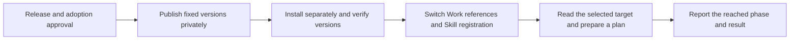

# Profile write diagnostic release and production adoption

The owner approved the grouped release, production Work adoption and read verification described in [the Japanese review](../reviews/profile-write-diagnostic-adoption-ja.md), reviewed at source commit `9cbc52a`. This English text records the approved decision; approval does not establish that publication, installation, switching or Work verification has completed. The three implementation fixes were already approved and merged into main.

At approval, the original write failure's cause remained unresolved. These changes preserve the failed authentication check and the original write and subsequent read diagnostics. They do not establish that the connection failure itself is fixed.

Canonical location: `flair-agency/live-agency`, branch `main`, path `docs/development/profile-write-diagnostic-adoption.md`. The Japanese document is retained as review history after adoption of this English text.

# Selected updates

| Component | Production at review | Approved target |
| --- | --- | --- |
| Runtime | `2.0.0-m3.0` | Unchanged |
| Transport | `1.1.2` | `1.1.3` |
| Lark Base Provider | `1.4.0-m3.2` | `1.4.0-m3.3` |
| Profile Skill | `2.0.0-m3.2` | `2.0.0-m3.3` |
| TikTok platform | `0.1.0-m3.1` | `0.1.0-m3.2` |
| Catalog | `0.1.0-m3.2` | `0.1.0-m3.3` |
| Lark CLI / TikTok Web Provider | `1.0.93` / `1.1.0` | Unchanged |

The Provider pins the new Transport exactly. The Platform advances only its available Profile Skill version, preserving the acquisition Provider and its dependencies. Preserve the saved `operations / production / tiktok` selection, authenticated principal, destinations, field configuration, allowed operations and update policy.

Adopted implementation sources: [Transport #7](https://github.com/flair-agency/live-agency-lark-transport/pull/7), [Provider #16](https://github.com/flair-agency/live-agency-provider-lark-base/pull/16), [Profile #8](https://github.com/flair-agency/live-agency-creator-profile-record/pull/8). The release-preparation PR changes are fixed versions, references, selection metadata and review documentation.

# Authorized execution

1. Merge the selected release-preparation commits into main. Use the existing GitHub Actions to publish Transport, Provider, Profile and Platform privately in that order. Transport uses its existing normal tag; the other three use `next`. Distribute the catalog as an immutable release attachment under `catalog-v0.1.0-m3.3`.
2. Verify published versions, archive integrity and private visibility, then install into a new installation. Retain the existing production installation.
3. Prepare the required executable through the pinned CLI's official initialization procedure and verify its version and checksum. Do not enable all dependency lifecycle scripts together.
4. Obtain the actual generation from the installed Runtime. Switch the three prepared host files and Profile Skill registration, retaining before/after hashes and recovery receipts.
5. Production is ChatGPT Work Local, `C|OPS|エージェンシー運営`. For the previously selected single failed target, verify destination reads through the actual Work route and create a new plan when valid input is available. Do not rewrite an old generation's approval receipt or resend the original registration. New record creation and image attachment are outside this scope.

# Preparation evidence and limits

Four actual package archives were prepared and checked for version, integrity and contents. The Provider lock's Transport integrity came from the actual archive.

One synthetic composition check connected archived Transport, Provider diagnostic processing and Skill code. It preserved the distinction among `verified:false`, the original write failure, read failure and journal persistence failure, with one write invocation in that synthetic check. It used existing development dependencies and a neutral Runtime substitute. It does not verify a formal installation, the Provider's complete write executor, service access or Work acceptance.

The installed Runtime produced plan hash `0397a9b8a5561718158c089675a15392571d4d828d83647f1cafd64e40da471f`. Two destination-configuration hashes matched production, and the three required capabilities were selectable. Prior source verification passed 30 Transport, 14 Provider and 10 Profile/Journal tests. The unchanged code's same tests were not repeated for release preparation.

The package-version listing API returned 403 because `read:packages` was unavailable. Candidate version availability was not established. Check collisions and actual published artifacts during release; stop before switching on a mismatch.

# Recovery and outstanding verification

The immediate recovery target is the authentication diagnostics installation selected at review, generation `87fe6e04dcc34b37259d53ac699eccb858193c3ba469570c9dbbf6a209b4f515`. Recovery does not target the earlier read-recovery version.

Use the Skill registration recovery receipt newly generated during the approved switch and the saved copies of the three host files. That new receipt did not yet exist at review. The saved `previous/skill-registration.receipt.json` records adoption of the current configuration; it must not undo this update because it would restore the older read-recovery version. If another change has occurred after the switch, compare before overwriting. Retain both installations and diagnostic evidence. Local configuration recovery does not reverse external data changes.

Keep [Issue #61](https://github.com/flair-agency/live-agency/issues/61) open through actual verification. A successful read establishes neither the original failure's cause nor business completion. If failure recurs, retain the added stage information to narrow the diagnosis.

# Evidence custody and decision boundary

On 2026-09-11 at 19:22 JST, before approval, the evidence was copied to durable storage and verified. It remains retrievable after deletion of the repository or temporary worktree.

- Location: `/Users/naokikimura/.local/share/live-agency/deployment-plans/profile-write-diagnostics-20260911`.
- Custodian and retrieval user: `naokikimura`, UID `501`, on this Mac. All directory modes were measured as `0700`, all file modes as `0600`.
- Retrieval: as that user, enter the location in Finder's Go > Go to Folder; read `README.md`, `record.json`, then `deployment-review.json`. Compare the index with the hash below and each artifact used with its indexed hash.
- `record.json` SHA-256: `126e1d15f22320d7d82838a5d4a05a58c031ed357efe00edb65771c33e184461`.

All 70 indexed file hashes were verified. The bundle includes the plan, selection configuration, catalog, selected source commits, package archives and integrity, before/proposed host files, and verification results. The original 32 files and original index are preserved unchanged under `original-preparation/`. Four receipts for the current installation, adoption, Skill registration and CLI initialization were copied byte-for-byte under `previous/`.

The active `selection.json` and `deployment-review.json` evidence references were relocated to this durable directory. Registry configuration retains only the existing environment-variable placeholder. The pinned Runtime recomputed the plan from the relocated selection: the entire plan and its hash matched the original. The three current host files, Skill reference and environment hash were also rechecked.

For another operator, transfer the complete bundle through an owner-authorized private channel and verify the same index hash. Access for another user, off-device backup and another operator's retrieval exercise were not performed. Same-Mac persistence is not protection against loss of the Mac. Do not copy real account or destination identifiers or credentials into GitHub documents. Original preparation scripts and synthetic results are retained as historical evidence, not reusable deployment tools for another environment.

The approved scope is distribution of these fixed versions, installation into a new directory, the host switch, reading the previously selected single target, and planning from valid inputs. Any actual data registration must be considered against the actual new plan. Approval does not reopen the already adopted implementation decisions.

# AI policy review

On 2026-09-11, Codex reviewed the release-preparation diff and supporting evidence against the [document and Skill knowledge policy](../governance/document-knowledge-policy.md#ai-review-before-requesting-owner-approval), [development policy](../governance/development-policy.md), [language policy](../governance/document-language-policy.md) and the fully read [Private Source Integration Guide](../governance/private-source-integration-guide.md).

| Area | Actual check or correction |
| --- | --- |
| Changes and ownership | Compared adopted implementation with release candidates, exact dependencies and archive contents. No concrete Provider dependency was added to the Skill; business, authentication and retry rules were unchanged. |
| Decision state and evidence | At review, implementation was adopted and release/switch approval was pending. Synthetic evidence and Work verification were distinguished. The original cause remained unresolved. The owner's subsequent LGTM adopts the execution scope above, not a completion claim. |
| Human understanding and recovery | Compared the diagram, five execution steps, stopping points and immediate recovery target. Clarified the different purposes of the old registration receipt and the new receipt generated during switching. |
| Custody, references and language | Corrected dependence on temporary evidence unavailable through the PR; saved and hash-verified the owner-only bundle before approval. Checked references, the Japanese pending review and exclusion of real data from GitHub. |
| Accessible review record | Added concrete self-review results and limits to the review. The durable bundle also contains `self-review-ja.md` and `custody-verification.json`. |

At preparation review, outstanding verification included release collisions and published artifacts, formal installation, the actual Work route and the original write failure's cause. The execution checkpoint below records subsequent checks. Self-review does not substitute for independent PR review, a human takeover exercise, authorization for production operations or proof of business completion.

# Execution checkpoint — 2026-09-11

This checkpoint records one earlier read/plan verification, including its result
and recovery target at that time. Subsequent business-write reconciliation and
acceptance outcomes remain in [issue #61](https://github.com/flair-agency/live-agency/issues/61)
and [cutover #32](https://github.com/flair-agency/live-agency/issues/32).

This factual execution report is proposed in PR #64 and is separate from the decision approved at `9cbc52a`. The [Japanese execution report](../reviews/profile-write-diagnostic-adoption-ja.md#実行結果報告2026-09-11) records the outcome already reported to the owner in the task. Adoption of this later report is not inferred from the earlier release approval.

All four release-preparation PRs are merged. Owning publication workflows succeeded and each archive matched the reviewed integrity and private visibility: [Transport](https://github.com/flair-agency/live-agency-lark-transport/actions/runs/34590399365), [Provider](https://github.com/flair-agency/live-agency-provider-lark-base/actions/runs/34590493824), [Profile](https://github.com/flair-agency/live-agency-creator-profile-record/actions/runs/34590610577) and [Platform](https://github.com/flair-agency/live-agency/actions/runs/34590782800). The [catalog](https://github.com/flair-agency/live-agency/releases/tag/catalog-v0.1.0-m3.3) was downloaded and hash-verified. Native release immutability is false; retention relies on the no-overwrite policy and pinned digest.

The new installation's lock matched the four reviewed archives. The official CLI initializer and resulting 1.0.93 binary matched the earlier checksums. Three host files and Profile registration were switched and read back. The new registration receipt identifies the immediate prior authentication-diagnostic installation; its recovery preview returned `would-restore` without executing recovery. The actor, resources, authority and configuration hashes were preserved.

Actual Work generation: `b9abf30e7e7d4efe4dd1720c316b29ace4c387642e6ad017b87c944827a7264e`. The Work task read one target and two history rows, then produced a plan with one create, zero attachments, zero already-applied rows and zero conflicts. Target read took 19.168 seconds and planning 23.882 seconds (43.051 seconds combined). It reused the retained observation, with no fresh source acquisition, registration, upload or uncertain-write replay. `businessWorkflowVerified` remains false; the original write outcome and cause remain unresolved.

The durable bundle retains actual installation, adoption, registration, native initialization, publication and recovery-preview receipts, plus the selected single-target Work read/plan result located through the owner-only execution evidence index. The original preparation index is unchanged; execution and final verification records index subsequent evidence separately.

AI policy review checked these actual receipts, archive/lock equality, selected generation, unchanged configuration, host readback, recovery preview and Work result. Changed document links and scoped diff passed. Owning publication workflows performed their required checks; unchanged implementation suites were not rerun locally. The approved English decision preserves the adopted Japanese meaning. This later execution report is separately reviewable and does not extend that approval.

| Next action | Human owner | Due | Summary | Completion criterion | Reference |
| --- | --- | --- | --- | --- | --- |
| Review remaining Profile business acceptance | Naoki Kimura | TBD | Evaluate the selected Work plan and retain uncertain-write evidence | Any registration uses its actual approved plan and readback; record the original outcome separately | Issue #61; cutover #32 |
