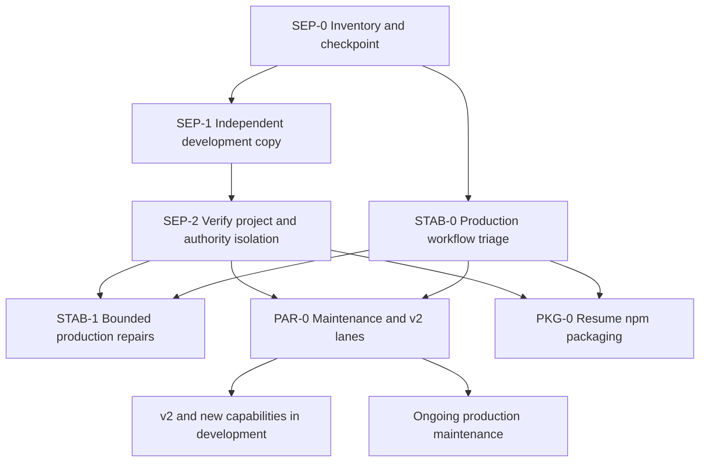

# Environment Separation and Production Stability Plan

Created: 2026-09-06 JST  
Status: Priority plan; implementation and environment cutover have not started.  
Scope: Preserve the current ChatGPT Work project, establish an independent Codex development checkout under `~/workspace/`, stabilize existing operations, and support parallel maintenance and v2 development.

## 1. Priority and Intended Outcome

Environment separation takes priority over further v2 implementation in the shared operational checkout. Production stability must not depend on finishing v2 or building the complete npm distribution system.

The owner reports that v2 migration has continued for several days, some v1 workflows no longer work, and development and operations need to proceed independently. These reports establish the priority; they do not establish the cause of each failure. Nesting projects is not itself proof of a defect. Shared source paths, Skill registration, MCP configuration, credentials, and execution state are the boundaries to inspect and separate.

The target outcomes are:

1. Changes made in the Codex development checkout no longer affect production code or loaded Skills/MCPs directly.
2. Required existing operations have a recorded baseline and a prioritized repair queue.
3. Production fixes can be developed and verified without importing incomplete v2 changes.
4. v2 and new capabilities can advance independently against development resources.
5. npm packaging later replaces the interim production delivery process without delaying separation.

This document owns cross-workstream sequencing. The v2 handoff continues to own technical progress and unfinished v2 work; the npm lifecycle design continues to own the final distribution architecture.

Change card: documentation class G; planned separation is E/D, production changes are F, and bounded repairs are B. Preserve public/private boundaries, operational authority, existing evidence, and dirty work. The present deliverable is this plan and aligned planning references, verified through document checks. No files are moved, processes stopped, settings changed, packages published, or external operations performed by this documentation task. No worker dispatch is implied.

## 2. Current Project Mapping and Baseline Limits

The owner identifies the pasted directory tree as the local directory of ChatGPT Work project **C|OPS|エージェンシー運営**. The current Codex project maps to its `live-agency-provider-runtime/` child.

```text
Existing ChatGPT Work project directory
├── live-agency-operations-mcp/
├── live-agency-provider-*/
├── live-agency-skills/
├── live-agency-provider-runtime/         # Current Codex root; operational references exist here
│   ├── mcp/live-agency-operations/
│   ├── providers/
│   ├── skills/live-agency-skills/
│   ├── packages/
│   ├── private/
│   ├── runtime/
│   └── runtime-data/
├── skills/
├── sources/
├── spikes/
├── tmp/
└── tools/
```

The sibling repositories and Runtime's nested repositories are distinct inventory entries. The tree alone does not establish whether a sibling is current, obsolete, separately checked out, or linked. Do not delete, consolidate, or repoint them based on naming similarity. Preserve `sources/` as read-only reference material.

Earlier inspection found installed Skills linked into the current Runtime checkout and MCP entries launching source there. Root and multiple submodules have uncommitted or untracked work. The latest v2 handoff also contains newer local conformance evidence. Refresh exact revisions and status when execution begins; do not use older plan hashes as a complete snapshot.

The v2 plan's reference to `origin/main` as a stable line is not evidence that the live installation currently matches it. Production may include v1 and already-activated v2 routes. Establish the actual operational combination before selecting a maintenance baseline. A blanket reset to v1 or `origin/main` is outside this plan.

## 3. Interim Environment Layout

Keep the Work project and its current operational paths in place. Create a separate development checkout; do not move the original operational directory.

```text
Existing ChatGPT Work project directory  # Retained as the operational project
└── live-agency-provider-runtime/         # Interim production code; controlled changes only

~/workspace/
├── live-agency-provider-runtime/         # Independent Codex development checkout
└── live-agency-provider-runtime-maintenance/
                                         # Independent maintenance checkout when needed

Separate development state root          # Final path selected in SEP-0
├── config/
├── runs/
└── fixtures/
```

Use an independent clone with independently initialized submodules for the main development copy. Do not use shared source symlinks, copy existing node_modules, or rely on production working files. An optional maintenance checkout starts from the recorded production baseline, independently of the v2 branch. Branch names follow the repository's conventions and are chosen at implementation time.

Retain production private data, receipts, and state at their current locations initially. Do not copy production credentials, browser sessions, exports, or real data into development. Moving production state is not required to separate source code and should be a later, separately verified change if needed.

The interim production checkout is a controlled delivery destination. Daily source edits happen in development or maintenance. This is an intermediate step toward npm-installed production, not a requirement to create a full installer now.

## 4. Boundaries That Must Be Separated

| Boundary | Production | Development and maintenance |
| --- | --- | --- |
| Code | Recorded operational baseline at existing paths | Independent source checkout and dependency installation |
| Skills | Existing operational registrations retained until explicitly changed | Explicit development registrations; never run the current global `install:skills --replace` behavior against production registrations |
| MCP | Existing verified launch paths and authority | Development launch paths and catalog; no inherited production write tools |
| Configuration | Existing environment-specific Profiles and concrete targets | Development Profiles, synthetic defaults, explicit environment selection |
| Credentials and browser sessions | Current operational identities | Dedicated test identities/sessions, or fixtures where unavailable |
| Data and state | Existing production Bases, storage, receipts, and journals | Test Bases/storage and separate run directories |
| Scheduling | Existing operational schedule ownership and cadence | Disabled by default; no duplicate production schedules |
| Project context | Existing Work project and business references | Codex project registered to the new checkout, with required development instructions |

Project scope alone is insufficient if the host also loads user-global Skills or MCP entries. Inventory global and project configuration together. Configure an isolated development host/profile where supported and verify the actual loaded catalog. If available host controls cannot isolate production authority, use a separate OS user or execution host before enabling development integrations. A different MCP name alone does not enforce a boundary.

A directory split under one OS account is operational separation, not a strong confidentiality boundary. Acceptance must state which isolation level has been proven. Development must not silently resolve credentials, Profiles, Providers, or resources from production.

The new checkout will no longer inherit all instructions from the Work project's parent directory. Inventory applicable instructions and preserve necessary development rules deliberately, with provenance. Do not blindly copy operational context or secrets. Existing Codex tasks retain their original directory context unless verified otherwise: register/open the new project and start or transfer work through supported app behavior, then verify its actual working directory. Do not assume creating a folder retargets existing tasks.

## 5. Work Packages and Order

| ID | Outcome | Dependencies | Completion evidence | Recovery |
| --- | --- | --- | --- | --- |
| SEP-0 | Current-state inventory and recoverable checkpoint | This plan | Parent/sibling/root mapping, exact dirty source inventory, active references, supported workflow list, and verified recovery artifacts | Read-only inventory; original state retained |
| SEP-1 | Independent development checkout with preserved v2 work | SEP-0 | Source parity for selected changes, initialized submodules, fresh dependencies, development instructions, separate state, focused synthetic checks | Remove only the new disposable candidate; preserve original and checkpoint |
| SEP-2 | Verified Codex development routing and isolation | SEP-1 | New project points to `~/workspace/`; actual Skills/MCP catalogs and target resolution demonstrate separation; production references unchanged | Restore captured development/host registration changes without altering business data |
| STAB-0 | Production service baseline and prioritized defect register | SEP-0; inventory can accompany SEP-1 | Every required workflow classified as working, failing, or unverified with route/version, impact, evidence, and owner | No blanket code reset; preserve baseline and existing evidence |
| STAB-1 | Restore required failing workflows through bounded maintenance changes | SEP-2 and STAB-0; urgent incident exception below | Each repair has reproduction, focused verification, controlled delivery, applicable operational evidence, and rollback | Restore the affected code/configuration set; reconcile external changes separately |
| PAR-0 | Independent maintenance and v2 development lanes | SEP-2; STAB-0 triage | Separate baselines, target environments, queues, fix-forward tracking, and integration rules | Stop only the affected lane; preserve accepted production fixes |
| PKG-0 | Resume npm lifecycle implementation from the separated baseline | SEP-2 and defined production baseline; stability work has priority | Existing RLS inventory reconciled with actual new paths and maintenance requirements | Existing production delivery remains available until npm cutover is verified |



Prioritize SEP-0 through SEP-2 before non-urgent implementation in the shared operational tree. Do not interrupt a running business write or migration halfway through: finish or reconcile the current bounded operation and record its state first. Do not initiate new non-urgent v2 mutations in that tree while separation is being executed.

An urgent production incident can receive a minimal repair before separation completes when delay would materially harm operations. Capture its baseline, exact scope, authority, validation, and rollback first; then include the repair in the separation inventory. This exception does not reopen broad v2 work in production.

## 6. SEP-0: Inventory and Recovery Checkpoint

Produce one restricted inventory covering:

- Each sibling/root/submodule path, Git top-level/common directory, realpath, remote, branch, HEAD, submodule gitlink, and dirty status.
- Tracked modifications, untracked source, ignored-but-required source, and generated outputs, classified separately. Do not archive every ignored path indiscriminately.
- Actual Skill registrations, link targets, loaded host catalogs, MCP launch commands, configuration references, and relevant automation/task working directories.
- Production workflows, concrete route selection, already-active v2 components, operational Profiles and authority, and pending operations. Store sensitive identifiers only in owner-only evidence.
- Existing state and credentials by location and ownership, without exposing their contents in public documentation.
- Necessary development instructions inherited from the parent Work project.

Preserve tracked changes and staged/unstaged distinctions per repository, selected untracked source, source hashes, exact submodule revisions, and recovery instructions in owner-only checkpoint material. Record production registration/configuration snapshots separately. Verify that the checkpoint can recover the selected source into an isolated destination and that archives exclude unintended secrets.

Do not use `git reset --hard`, `git clean`, automatic stash/pop, or recursive copying of the entire Work directory as the migration strategy. Do not commit credentials merely to preserve state. A recursive clone alone does not preserve unpublished commits or uncommitted work; transfer those explicitly and verify their hashes.

Exit: every source change is either preserved for development, identified as part of the operational baseline, or deliberately deferred with a recorded reason. No unidentified source is deleted and no development path is activated yet.

## 7. SEP-1 and SEP-2: Establish and Verify Development

1. Create the independent checkout under `~/workspace/live-agency-provider-runtime/`, preserving existing destination contents if the path already exists. Resolve collisions before writing.
2. Initialize its submodules from the recorded commits, including any unpublished commits transferred through a controlled source mechanism. Apply selected dirty changes to the matching repositories; verify parity without modifying the original checkout.
3. Install development dependencies locally. Review root lifecycle scripts so installation cannot rewrite global production registrations. Do not reuse production node_modules or source symlinks.
4. Establish development instructions, configuration, output roots, and fixture/test-service bindings. Missing test access means integration remains disabled or synthetic; it does not justify production fallback.
5. Prepare an exact before/after plan for Codex project registration and host settings, with restoration records. Use supported host configuration; verify shared global entries as well as project-local ones.
6. Register/open the new Codex development project and verify the actual working directory, loaded Skill origins, MCP executable paths, environment selection, and available authority.
7. Run focused synthetic tests through the new paths. Prove development edits remain local using a disposable fixture or checksum comparison rather than changing a live business Skill.
8. Recheck production source hashes and operational references against SEP-0. Any intentional exception must be accounted for; unexpected drift blocks completion.

Separation acceptance requires:

- Development code and nested source packages resolve inside the independent development checkout; no code links point back to the Work tree.
- Production Skills and MCPs still resolve to their recorded operational sources; development registration does not replace them.
- Development cannot implicitly use production Profiles, write tools, credentials, browser sessions, storage, or schedules within the adopted host boundary.
- Selected v2 changes and unpublished source are preserved with verified provenance.
- The new development task has the intended instructions and working directory; the old task's path is not assumed to have changed.
- The operation has a recovery record and explicitly states any host or authentication limitations.

Code separation can be reported as complete before live development integrations exist. Full environment separation cannot be claimed if production authority is still implicitly available to development.

## 8. Production Baseline and Stabilization

Create a service register before choosing repairs:

| Required field | Purpose |
| --- | --- |
| Workflow and business priority | Identify required daily operations and interruption impact |
| Actual Skill/MCP/Provider route and source revisions | Distinguish v1, already-active v2, and unfinished development |
| Current status and evidence date | Working, failing, or unverified; avoid treating old tests as current operation |
| Failure reproduction and probable boundary | Separate source defects from configuration, authentication, host, or service drift |
| Allowed operations and pending intents | Preserve existing authority and avoid duplicate writes |
| Maintenance baseline and repair candidate | Identify the exact code/configuration set to change |
| Verification and recovery method | Define completion before delivery |

The production baseline may contain both v1 and verified active v2 routes. Freeze that observed combination as a maintenance reference; do not replace it with an arbitrary historical tag. Inactive or unsupported capabilities remain labeled as such, not counted as working merely because source exists.

Repair order follows operational impact: business-blocking failures, incorrect results or unintended behavior, recurring interruptions, then minor defects. Confirm the actual affected v1 workflows during STAB-0; this plan does not invent a failing-workflow list.

For each repair, create a bounded change from the maintenance baseline, reproduce the issue, add meaningful regression coverage, verify the affected dependency combination, and prepare the exact production diff and rollback. Use existing workflow authorization and readback rules for external checks. Synthetic success alone does not prove a live workflow repaired.

Where schedules are involved, choose an appropriate observed-cycle criterion per workflow and record it before delivery. Preserve existing v2-specific cycle/activation gates where applicable; do not impose a new universal cycle count. Production stability requires evidence for required workflows, not completion of every v2 backlog item.

## 9. Parallel Maintenance and v2 Development

| Lane | Starting point | Destination | Rules |
| --- | --- | --- | --- |
| Production maintenance | Recorded operational baseline | Existing production path through controlled delivery | Small fixes; avoid unrelated v2 changes; preserve route authority |
| v2 and new capabilities | Preserved development state in the new checkout | Test environments, then reviewed per-capability cutover | No production fallback; integrate accepted maintenance fixes |
| npm distribution | Separated paths and explicit component graph | Candidate installation environment | Do not make package infrastructure a prerequisite for urgent repairs |

Track every production repair's component commits, composition pins, verification, and forward-port status into v2. If the implementation differs, record an equivalent fix and corresponding test instead of silently omitting it. Shared submodule pins and lockfiles are integrated serially; independent development does not authorize concurrent production changes.

Before packaging is ready, deliver a reviewed set of component revisions and necessary configuration changes into the existing production path during a controlled window. Finish running operations, preserve the exact old set, install dependencies only where needed, reload affected processes, and verify the actual active route. Do not overlay an entire dirty development tree or run an unrestricted update/pull as a release procedure.

If the operational checkout still contains mixed unfinished changes, establish a recoverable source manifest and clean maintenance reference before replacement. Do not discard those changes in place. A candidate checkout can be used for comparison without changing production paths.

## 10. Rollback, Authority, and Operational Boundaries

| Failure | Required response |
| --- | --- |
| Development copy lacks source or dependencies | Keep original untouched; repair the candidate from verified checkpoints |
| Host settings expose production capabilities in development | Do not enable development integrations; restore settings or use an isolated host boundary |
| Skill/MCP registration points to the wrong source | Restore exact captured entries/links; verify actual host reload |
| Production repair fails | Restore the affected source/configuration combination and verify the old route; do not undo unrelated changes |
| External operation has an uncertain outcome | Reconcile under its existing workflow contract; never retry solely because code was rolled back |
| Existing schedule starts against a changed path | Stop the affected new starts, restore the recorded route, and reconcile any started operation |

Changing project registration or code paths does not grant external read/write authority. The implementation must present concrete host/configuration/cutover effects and use applicable existing authorization; this plan is not blanket authorization to activate Profiles, expand OAuth scopes, write to Lark, or delete assets.

Record release/source identity, environment, configuration revision, verification, pending state, and rollback references without exposing secrets. Production data recovery and code rollback remain separate operations.

## 11. Relationship to Existing Plans

- [npm lifecycle design](npm-runtime-lifecycle-design.md): SEP-0 supplies path/host inventory to RLS-0; SEP-1/2 precede broad RLS implementation. Registry, packaging, full lifecycle CLI, and production state relocation do not block initial separation. The existing Work checkout remains the interim production destination until an independently verified npm cutover.
- [v2 migration plan](v2-migration-plan.md): preserve completed milestones, accepted contracts, and per-workflow gates. Move unfinished development into the new checkout. Do not wait for M7 to separate environments.
- [Current v2 handoff](v2-task-handoff.md): retain the latest completed conformance evidence and unfinished candidate, but prioritize SEP-0 before further implementation in the shared checkout. The unfinished candidate resumes in the separated development environment.
- [Repository reorganization plan](repository-reorganization-plan.md): its deferred cosmetic moves do not defer this urgent environment split. Retain internal repository ownership and layout; leave sibling repositories and business reference directories in place pending inventory.
- [Task orchestration policy](task-orchestration-policy.md): use bounded outcomes, explicit authority, and focused verification. This plan does not dispatch workers or alter model settings.

## 12. Immediate Next Package and Completion Criteria

The immediate next package is **SEP-0: inventory and recoverable checkpoint**. Produce a restricted source/reference manifest, an operational workflow register, selected-source preservation evidence, proposed development host/path mapping, and a concrete SEP-1 execution plan. It is not a package-publication or production-reset task.

This priority workstream is complete when independent development is verified, required operational workflows have accepted stability evidence, maintenance and v2 fixes follow separate integration lanes, and the interim delivery/recovery procedure is usable. npm distribution can continue afterward without keeping this workstream open until the entire package system is finished.

Open execution decisions are bounded to the inventory: actual sibling-checkout roles; exact dirty work to preserve; required/failing workflows; supported host isolation mechanism; development credentials/test destinations; and collision-free workspace locations. Resolve each before its dependent mutation rather than reopening the overall priority decision.

## 13. Documentation Verification

This document records the owner-described project mapping and priority, local planning evidence, phase dependencies, authority boundaries, and acceptance criteria. Validate local links, Mermaid/code fences, phase IDs, and consistency of priority notices in related plans. No source tests, environment migration, live service verification, or production restoration are claimed by this documentation change.
