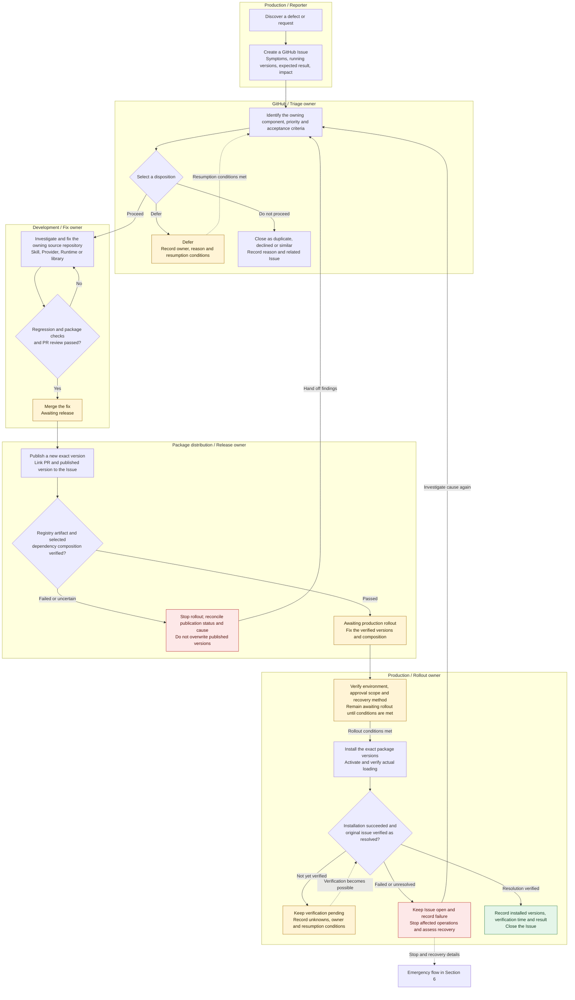
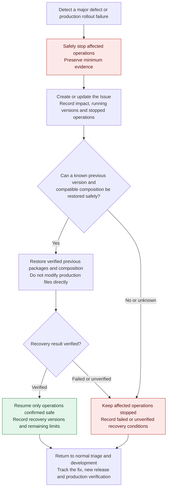

# Issue-based Skill maintenance policy

- Status: Adopted by the owner's LGTM on 2026-09-08.
- Project visibility: Public, selected explicitly by the owner on 2026-09-08.
- Project: [LIVE Agency Maintenance](https://github.com/orgs/flair-agency/projects/2).
- Scope: Production defects and requests for packaged Skills, including fixes
  owned by related Providers, Runtime and shared libraries.
- Approval evidence: [Japanese review history](../reviews/skill-maintenance-issues-ja.md).

## 1. Principles and workflow

Track production issues through source changes, package releases and production
verification using GitHub Issues. Editing installed files breaks the correspondence
between the published package and executed behavior; reinstalling can lose such fixes.

Do not directly modify a production package's Skill instructions, scripts or
reference material, or replace them with links to a development checkout.
Handle environment-specific configuration changes separately where needed;
they do not replace a permanent source fix.

This policy supplements the [distribution direction](../architecture/distribution.md)
and [development policy](development-policy.md). It does not change component
ownership, external-operation authority or migration gates.

### Normal maintenance flow

Groups identify the responsible role and working location. The GitHub Issue
tracks the whole process, linking PRs, published versions and production results.
Solid arrows show processing order; dotted arrows show resumption or the
connection to emergency handling.

Merge, publication and verified production resolution are separate milestones.
Close as resolved only at the last milestone. If investigation shows that no
requirement or code change is needed, follow the owning component's procedure
and still record production verification. Reconcile failed or uncertain
publication and installation outcomes before selecting another operation;
never replay them unconditionally.

## 2. Issue location and responsibility

Use the repository owning the change. Reporters need not diagnose the cause
before filing: accept a problem encountered while using a Skill in that Skill's
repository.

| Finding | Fix owner |
| --- | --- |
| Business decisions, common input validation, difference, approval or reconciliation procedures | Relevant Skill |
| Service-specific acquisition, mutation, screen or export format changes | Relevant Provider |
| Package composition, dependency resolution, installation or startup | Runtime |
| Shared API or contract changes | Relevant shared library or contracts repository |
| Requirements or policy spanning owners | Coordinate in the parent project and link necessary implementation Issues in each owner |

If another component owns the cause, fix it there and preserve traceability
from the original Issue. Do not mechanically split a small change owned by one
component into separate investigation, implementation and verification Issues.
Consolidate duplicate reports into an existing Issue.

The triage owner assigns priority and the next responsible person. The fix owner
records the PR and verification results; the production rollout owner records
deployment results. One person may fill multiple roles, but completion criteria
remain separate.

Use the parent project's Private GitHub repository as the common intake for
unknown repositories or reports shared across Skills. Confirm its actual URL,
Issues enablement, visibility and posting permissions when introducing this
workflow; policy adoption does not establish that this setup exists.

## 3. Report contents and information handling

Write Project text, Draft tickets, Issues and related work-tracking text in
English by default, following the [language policy](document-language-policy.md).
Use the same default for titles and bodies; owner-review discussion may remain
Japanese. Translation does not change acceptance criteria or authorize execution.

Do not require complete reproduction research for the initial report. Record
known information and explicitly leave unknowns for triage. For requests, provide
the desired business outcome and acceptance criteria instead of a reproduction error.

| Field | Contents |
| --- | --- |
| Type and summary | Defect or request, with a short title |
| Impact | Affected operations, workaround, business deadline, and whether external data is affected or the impact is unknown |
| Conditions | Occurrence time and timezone, steps, frequency and recent changes |
| Running versions | Actually loaded Skill package name/version, Runtime version and relevant Provider versions; composition or lock identifier where available |
| Expected and actual | Expected result, observation and an error summary with confidential information removed |
| Reproduction evidence | Minimal synthetic example or a safe reference identifying separately stored restricted evidence |
| Acceptance criteria | Operations and results that will demonstrate resolution |

Record any existing manual production edits or uncertainty about whether the
version matches the executed contents. A package version alone does not prove
reproducibility.

Do not put real data, credentials, session information, screenshots of actual
service screens or raw logs into Issues, comments, attachments or PRs, even in
Private repositories. Keep required evidence in separate access-restricted
storage. Issue references must not contain signed URLs or actual target
identifiers. Keep authenticated-service specifications within the private
Provider boundary; use normalized reproduction examples in public Skill Issues.
The [Private Source Integration Guide](private-source-integration-guide.md)
governs information handling.

## 4. Progress and completion

Use one organization-owned Public GitHub Project as the cross-repository
maintenance view. Keep the current workflow status in the Project and the
acceptance criteria, decisions, PR/release references and verification evidence
in the owning Issue. Begin with status, priority, assignee and repository;
use a status board and a priority-ordered table. Custom automation, estimates
and iterations are not prerequisites. Keep type labels such as `bug` and
`enhancement`, and priorities, to the minimum needed.

### Project visibility and published information

Project visibility does not change repository or Issue visibility. Items from
Private repositories remain accessible only to readers with the required
repository access; other Project viewers may see a hidden item. Do not change
repository visibility to populate the public view.

The Project title, description, README and Draft items must contain only
information suitable for publication. Project-owned text and custom fields
must not copy confidential evidence or private Issue contents on the assumption
that repository permissions protect those copies. A Draft belongs to the
Project, not to a private repository.

If an external audience needs a readable summary of private implementation work,
prepare a separate publication-safe summary item and link the private Issue.
The public summary remains public; its link does not make the target accessible
to unauthorized readers. Such summaries are optional and are not automatically
generated or published merely by adopting this policy.

See [GitHub: Project visibility](https://docs.github.com/en/issues/planning-and-tracking-with-projects/managing-your-project/managing-visibility-of-your-projects)
and [GitHub: adding items and Draft issues](https://docs.github.com/en/issues/planning-and-tracking-with-projects/managing-items-in-your-project/adding-items-to-your-project).

### Workflow states

| State | Entry condition |
| --- | --- |
| Intake / triage | Issue filed with known information; impact, ownership and priority are being assessed |
| In progress | Scope and acceptance criteria selected; investigation, fixing and verification underway in development |
| Awaiting release | Fix merged after required regression/contract checks and PR review; target package version and publication destination determined |
| Awaiting production rollout | New version published; registry artifact and selected dependency composition verified |
| Production verification | Installed and activated in the selected environment; actual loading of the new version confirmed |
| Complete | Original acceptance criteria verified in production; installed versions, verification time and results recorded in the Issue |

Keep production-origin Issues open until production verification. A merged fix
or published package does not establish production resolution. For postponed
rollout, record the owner, reason and resumption conditions. Distinguish closure
as duplicate, declined or unreproducible from verified resolution and record why.

GitHub supports keywords that close Issues when a PR is merged into the default
branch. For Issues tracking through production verification, use ordinary Issue
URL references instead of `Fixes`, `Closes` or other closing keywords in PR
descriptions and commit messages. If a separate implementation Issue is needed,
distinguish its completion from the production report's completion.
See [GitHub: linking a PR to an Issue](https://docs.github.com/en/issues/tracking-your-work-with-issues/using-issues/linking-a-pull-request-to-an-issue).

## 5. Development, release and production rollout

1. Select the Issue's scope and acceptance criteria and record a change card
   under the development policy. The existence of an Issue does not itself
   select implementation or approve a request.
2. Reproduce using the running versions and composition as evidence, and fix
   the owning source. Verify regressions against the cause of a defect and
   acceptance criteria for a new requirement. Check affected contracts and
   callers where necessary.
3. Record the Issue, rationale, checks, compatibility and known limits in the
   PR. Verify the published archive's instructions, resources, dependencies
   and installation from that archive. Passing source tests alone does not
   establish successful distribution.
4. Publish a new unique version under the existing distribution contract.
   Never overwrite a published version. Link the fix PR/source commit, package
   name/version and release evidence from the Issue.
5. Fix and verify the Runtime, Skill, Provider and shared dependency combination
   selected for production. Determine from dependencies whether the Skill change
   needs new Provider or Runtime versions. Do not use tracking `latest` as the
   production rollout procedure.
6. The rollout owner identifies the environment, selected versions/composition,
   affected stop boundary, verification method and recoverable previous
   composition. Publication and production rollout are separate operations
   under existing approval scopes and explicit execution selection. Do not
   request redundant approval for an unchanged scope with valid authorization.
7. After installation, verify activation and actual loading, then perform the
   minimum checks corresponding to the original issue. Verification that
   changes external data follows its own authority, dry-run and readback
   conditions. Keep production verification pending or deferred if confirmation
   is unavailable.

Restoring package composition and restoring external data are different
operations. Successful code/configuration recovery does not establish that an
earlier erroneous data update has been corrected.

The [Runtime deployment design](../../runtime/docs/deployment.md) includes
unimplemented CLI proposals. This policy is not documentation of an implemented
update or rollback command. At execution time, consult the
[current status](../migration/status.md) and the owner's actual implementation
and configuration procedures.

## 6. Emergencies and initial rollout of the workflow

### Emergency flow

This flow applies at initial discovery and after a failed production rollout.
The production rollout owner follows existing execution selection and authority
for stopping and recovery. Track containment and permanent correction in the
same Issue. Restored operation does not close a still-unresolved issue.

Handle readback and necessary data recovery for erroneous or uncertain external
writes separately from package recovery. Switching to an older version does
not restore data.

Allow safe stopping or recovery to a known version with verified compatibility
and availability to precede full intake during major incidents. Start with
minimal records and add details to the Issue; intake must not delay containment.
Do not unconditionally repeat writes with uncertain outcomes.

Build emergency fixes in development source and install verified new package
versions. Direct production patches are not an exception procedure. If no older
version is safe to use, keep the affected operations stopped and perform any
necessary data recovery under separate conditions.

Limit initial workflow setup to intake confirmation, defect/request templates,
responsibility and priority assignment, and the completion criteria above.
Triage time-critical business outages and suspected erroneous updates first;
schedule limited-impact defects and enhancements. This policy introduces no fixed SLA.

Markdown templates are sufficient initially; Issue Forms can standardize fields
as the workflow settles. See
[GitHub: Issue and PR templates](https://docs.github.com/en/communities/using-templates-to-encourage-useful-issues-and-pull-requests/about-issue-and-pull-request-templates).

Adopting this policy does not execute Issue posting, publication, installation
or automatic updates. Before adding automated reporting, separately decide the
destination, permissible transmitted information and posting conditions.

## 7. Adoption and remaining setup

The adopted direction is owner-repository intake with a Private parent intake
for shared/unknown ownership, completion after production verification,
package-based emergency fixes, minimal initial templates, and one Public
organization Project for cross-repository tracking. The initial recommendation
to make the Project Private is superseded by the owner's explicit Public choice.

Confirm the common intake URL and visibility, Issues enablement and posting
permissions, and the triage and production rollout owners. Then implement
templates in the selected owning repositories. These are remaining setup items,
not verified operational readiness. Embedding Issue-posting procedures into
every Skill or creating a dedicated Issue-management Skill is not a prerequisite.

Resolve the actual maintenance Project before setup; do not publish an unrelated
existing Project. Verify the selected Project's identity, visibility and safe
contents, then configure the views and fields above. Project setup does not
itself post the pending reports or authorize automatic publication of Issue summaries.

The linked Project was created and verified on 2026-09-08 with Public visibility,
the six workflow states, four priority levels, a status board and a priority-ordered
table. Assignee and repository fields are visible in both views. Default workflows
were removed so that adding or merging items does not automatically complete work,
close Issues or add unselected items. Configuration evidence and the scoped initial
Issue association are recorded in the Japanese review history. Intake ownership and
template rollout remain separate setup work.
