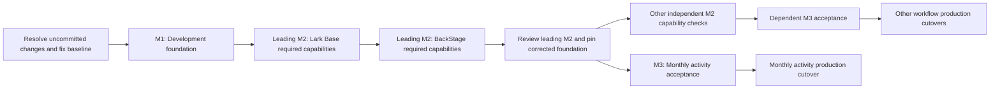
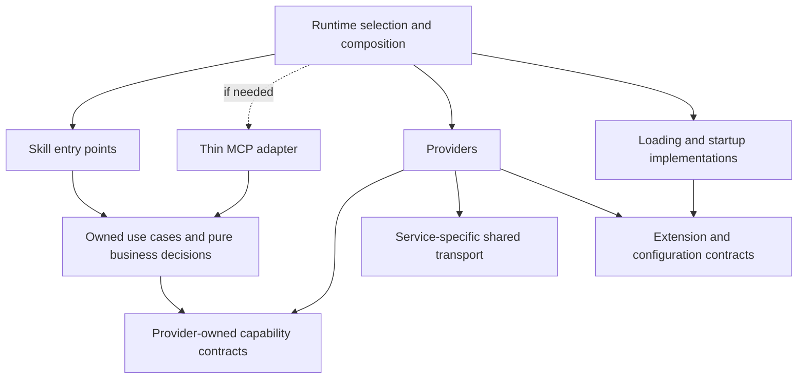

# v2 migration plan

Status: Adopted on 2026-09-07 following the owner's approval of the revised plan and the recommendations in its decision section. This is the English canonical plan. The [Japanese review](../reviews/v2-migration-plan-review-ja.md) and [Skill naming review](../reviews/v2-skill-naming-and-migration-plan.md) retain review history. [Current status](status.md) owns completion and the current work queue. Subsequent owner feedback on source cleanup, milestone reviews and controlled parallelism is incorporated below. Plan approval does not itself dispatch implementation.

## Outcome and sequence

Implement the v2 architecture and independently managed common libraries, Providers, Skills and Runtime packages, with MCP adapters only where the selected client path requires them. Deploy a tested combination of fixed versions so development changes do not directly change production. Environment separation and package management belong to v2, rather than separate programmes.



The user has reported broken Skills. Uninterrupted migration and a working older rollback version cannot be presumed. Complete the foundation first; do not replace this order with an individual Skill repair queue. Existing source separation, contracts, implementation and applicable test evidence are inputs, not work to repeat.

The [business model](../domain/model.md), [architecture](../architecture/overview.md), [capabilities](../architecture/capabilities.md), [distribution direction](../architecture/distribution.md), [naming policy](../governance/skill-naming-policy.md) and [development policy](../governance/development-policy.md) own their respective rules.

## Milestones and review points

M1, M2 and M3 below name the three stages of this revised plan; they do not reactivate identically numbered archived milestones. M1 is shared. M2 completes per Provider capability and M3 per Skill, rather than repeating the entire foundation for each Skill.

| Point | Reviewable result | Review and exit |
| --- | --- | --- |
| Before M1 | Purpose-based disposition of uncommitted changes and proposed baseline | Owner reviews concrete rollback/roll-forward recommendations. Resolve adopted changes and record component commits plus parent pins before implementation |
| M1 design | Package responsibilities, names, consumer-defined interfaces, dependency graph, source changes and representative test operation | Owner reviews concrete choices under adopted D1–D3; do not reopen agreed principles |
| M1 completion | Registry installation, client request/result exchange, update and rollback | Demonstrate the five foundation conditions and assess remaining shared risks |
| Leading M2 completion | Required Lark Base then BackStage capabilities for monthly activity, with actual integration evidence | Incorporate common fixes, record interface/package versions and verification procedure, and review readiness before releasing parallel M2 work |
| Each M3 | Business expectations agreed before testing; installed-workflow results and relevant failure behavior | Owner acceptance review per Skill; use existing specifications and authorization without redundant approval loops |
| Each production cutover | Exact target, effect, tested versions and usable recovery procedure | Review concrete operational scope and residual risk; reuse valid existing authorization |

Routine code review, direct tests and integration checks belong to the work task and coordinator. Escalate new interface/business decisions or a changed operational scope; do not turn every implementation detail into an owner review.

## Before M1: Resolve uncommitted changes

The default for unadopted work is rollback, after its purpose and dependencies are understood and a recoverable copy is retained. Do not perform a blanket reset: existing HEADs may predate approved restructuring, and an indiscriminate reset would undo adopted work.

Create one purpose-based disposition table, covering staged, unstaged and untracked source changes in the parent and affected components. Each row records purpose, repositories/files, adoption basis, dependencies, effect of rollback, recommended rollback or roll-forward, and preservation location. Preserve existing index distinctions while investigating. Mixed-purpose changes must be separated before deciding their disposition. Unknown-purpose changes are explicit decisions, not guessed deletions or automatic adoption.

Roll forward the necessary approved restructuring and other explicitly adopted changes into owning-repository commits; preserve and roll back unadopted experiments or superseded implementations. Present the concrete table before executing dispositions. Then record child commits and parent pins and verify the selected baseline in a separate work location. Clean working copies are not proof of completeness: required manifests/resources and intended behavior must be present. Do not treat the old version as operationally healthy merely because it is committed.

This cleanup is preparation for M1, not a new architecture milestone. The current documentation update does not execute rollback, commits or source cleanup.

## Adopted source and distribution boundaries

The local restructuring is complete. The parent manages 30 component repositories through submodules:

```text
live-agency/
├── runtime/                    # Composition, startup and deployment: 1 repository
├── skills/<skill>/             # Independent Skill repositories: 16
├── providers/<provider>/       # Independent Provider repositories: 7
├── mcp/operations/             # Existing operations MCP repository: 1
├── packages/<library>/         # Independent shared library repositories: 5
├── docs/                       # Project-wide specifications and governance
├── tools/                      # Shared development and distribution tools
├── test/                       # Cross-component tests and synthetic fixtures
├── package.json                # Private development npm workspace
├── package-lock.json           # Development dependencies
└── tmp/                        # Ignored output and retained original sources
```

The parent workspace connects independent repositories for development; it does not require a joint Skill release. Runtime no longer contains the other source repositories. Deployment requires its own installation manifest/lockfile, without sibling-source paths or workspace links. Parent submodule pins do not include child uncommitted changes. Adopt the intended changes in their owning repositories, then update parent pins. Configure actual GitHub sources for newly split repositories and replace local-only submodule URLs before expecting remote recursive checkout. Retain existing Runtime/Provider/MCP remotes. Do not repeat the completed repository restructuring or publish the old complete history as a prerequisite.

Use `@flair-agency`, GitHub Packages, initial Private visibility and Flair organization GitHub Actions publication. Service-neutral code is not automatically public. Later public visibility is decided per package. The approved M1 distribution scope is 16 packages: five common libraries, all seven Providers, Runtime and the three adopted Skills (creator-monthly-activity-reconcile, gift-history-merge and creator-profile-record). Remaining supported Skills retain their v2 migration scope; finalize their names, business specifications and individual package distribution during each Skill's M3 preparation. Include a minimal MCP adapter only if the selected client path needs it; the entire existing operations MCP package is not a foundation requirement; a library-and-coin-only release does not complete the foundation.

The adopted common packages are `provider-protocol`, `private-files`, `lark-transport`, `cli-utils` and `row-archive`. The first three supersede `source-provider-api`, `private-runtime-files` and `lark-core`. Runtime owns discovery/composition. The published baseline has Provider-owned capability contracts; the neutral contract revision gate below replaces that target. Skills retain business rules. The corrected published foundation graph has no Provider-to-Skill dependency or package cycle. Unmigrated Skill sources retain their documented migration work.

The 16 Skill sources include the frozen `coin-expense-weekly-application` prototype. Source preservation is distinct from supported distribution and acceptance. Its presence does not reopen development or activate it. See the [README](../../README.md) for directory policy and development setup.

## Neutral contract revision gate

Following the owner-selected direction transferred from the design discussion,
use one neutral contracts repository and initially one package with
capability-specific exports. Skills and Providers depend on those contracts;
Runtime selects and injects concrete implementations. This replaces the earlier
Provider-owned capability-contract target. Existing release evidence remains
valid for its tested versions, but does not establish Skill package independence.
The owner approved [foundation review section 14](../reviews/v2-foundation-design-ja.md#14-中立contractへの設計変更レビュー),
including `packages/contracts/`, repository `live-agency-contracts`, package
`@flair-agency/contracts`, monthly capability semantics, compatibility and
legacy ownership. Adopt tsyringe only inside Runtime composition, using explicit
registration after asynchronous initialization and a child container per run.
Keep runner in the Runtime package. Implement and verify this monthly slice
before extending M3 or parallel M2; preserve the M1–M2–M3 sequence.

## Adopted decisions

| Decision | Adopted recommendation | Implementation consequence |
| --- | --- | --- |
| D1: Contract and business-code distribution | One neutral contracts repository, initially one package with capability-specific exports. Skills and Providers depend on neutral contracts; neither depends on the other's implementation. Runtime composes both | Implement the approved monthly slice; neutral contracts 1.0.0, Runtime-only tsyringe, and independent package verification before expansion |
| D2: First development client | Use the current local Codex with explicit development startup, configuration and registration | Reuse existing separation work and verify actual configuration/credential resolution. Add another host only for a demonstrated isolation gap; multiple-host support is not an initial prerequisite |
| D3: First Skill acceptance target | Prioritize `creator-activity-sync` using its monthly inputs/results and existing runner | Prioritize its required Lark Base and BackStage capabilities. Higher business urgency can change the order without blocking foundation work |

D1 adopts a design rule, not an already-completed package mapping. The concrete mapping includes the Skill candidate names and unresolved semantic questions below. Review it with the related implementation design; do not create a separate naming-only task or repeatedly ask the owner to choose the adopted principles. Current Skill identifiers in this plan identify sources, not final names.

## Responsibility and dependency design

Here, an interface contract means a consumer-defined interface plus its observable behavior (inputs, results and failures), as in OOP dependency inversion. It does not introduce a Design by Contract framework or require a precondition/postcondition enforcement mechanism.

Business procedures and decisions belong to Skills. Service acquisition/mutation and operating knowledge belong to Providers. Domain MCPs expose domain operations without embedding Lark operations in protocol handling. Preserve Scouting/Management business and authority boundaries independently of the choice of transport; postponing MCP does not merge credentials or grant additional operations. Accounting and expenses remain outside creator-domain MCPs.



Arrows represent code/package dependencies, not invocation sequence. The selected invocation is client/Skill → a CLI or optional MCP entry point → consumer-owned application logic → its Provider interface → the injected Provider. An MCP hop is not mandatory. The entry point adapts the call; it does not own business rules or service operations. Runtime selects concrete implementations. Skills may depend on Provider packages through pure capability exports; business decisions must not import transport or loading implementations. Providers must not depend on Skills. Runtime still injects selected implementations. Share the same business implementation where Skill and MCP use the same decision. Each diagram box need not become one package. Use cases belong to Skills; capability contracts belong to Providers. Independent contract packages are reserved for a demonstrated separate release need.

## Adopted treatment of operations MCP

The owner approved deferring completion and deployment of the entire `mcp/operations` package. Retain its repository and source for preservation and selective reuse. Do not delete it, disable an installed process or remove a live route merely because it is no longer a migration prerequisite.

MCP is an external protocol adapter exposing application functions to clients such as Codex. It owns tool registration, protocol schemas and request/result/error adaptation, and delegates to consumer-defined application interfaces. Business logic must remain callable without MCP. Service behavior and implementation selection remain outside the adapter.

The current repository contains mixed responsibilities; retaining required behavior does not require deploying the whole package:

| Existing responsibility | Intended owner and migration treatment |
| --- | --- |
| MCP registration and protocol adaptation | A thin MCP adapter, only if needed by the selected client path |
| Observation selection, history-update decisions and pure domain interfaces | The owning consumer/business module; reuse with its direct behavior tests |
| Lark field resolution, record reads and mutations | Lark Base Provider, implementing the consumer-defined interface |
| Provider discovery/selection and profile resolution | Runtime or the appropriately scoped shared implementation/interface |

Include these files and their actual callers in the pre-M1 purpose/disposition review. Extract only behavior required by selected migration workflows; defer unrelated features. Preserve relevant selection, approval, audit and result-reconciliation semantics with the adopted behavior. Required non-MCP modules must not retain an import or deployment dependency on the deferred package. Do not relocate all code into Runtime or a generic shared library merely to avoid the package dependency.

M1 first establishes whether an existing CLI/runner path supports the required development-client request/result exchange, including instruction-based interactions. The monthly activity runner demonstrates a reusable non-MCP composition path, but does not yet prove complete acquisition-to-update coverage. If the selected path needs MCP, include only a minimal adapter for the representative operation and its necessary migration calls. There is no requirement to implement the old package's full tool catalog or all domain MCP processes.

Full domain-MCP expansion is post-migration work, selected when concrete conversational operations justify it. Scouting/Management business, execution-authority and credential boundaries remain enforced through the chosen runtime/entry points; their preservation is independent of whether MCP is used. Accounting remains outside creator-domain operations.

M1 review evidence must identify the selected client path, demonstrate installed request/result transfer, account for required behavior extracted from this repository, and show that the deferred package is not an undeclared runtime prerequisite. This changes transport/package scope, not the five foundation outcomes or the leading-M2 gate.

## Stage 1 (M1): Development foundation

Completion means fixed packages published by Actions to GitHub Packages can be installed into a development destination and start v2 without its source tree. The selected development client must invoke the installed composition with a synthetic Provider and exercise initial installation, update and rollback.

| Work | Required result |
| --- | --- |
| Adopt source and Git distribution | Record intended component commits and parent pins, preserve unrelated changes, configure new GitHub source URLs and access |
| Finalize contracts and package mapping | Resolve cycles and inverted concrete dependencies; cover the approved 16-package foundation and only necessary entry-point adapters; include formal names, exports and old identifiers |
| Build packages | Include required code, instructions and resources, declare dependencies and remove source-relative startup requirements; reuse existing pack/install checks |
| Connect Runtime and development client | Resolve explicit configuration, Providers, Skill resources and the selected CLI or minimal MCP entry point from installed packages; reject omitted selection and accidental production configuration |
| CI and publication | Reuse parent source CI; prepare owning-repository publication workflows, package associations and access; create fixed installation manifests/lockfiles |
| Deploy and recover | Install, start, update and restore a previously verified version using the same mechanism without altering production registration, settings or running versions |

The dependency is package/contract definition → build → startup and CI → end-to-end development deployment. Git/CI access waits block publication or retrieval only; continue independent local implementation and package checks. Startup and publication preparation can proceed independently after shared contracts are fixed, without concurrent edits to shared manifests/lockfiles.

Use a test consumer as the driver and a synthetic Provider as a stub/fake. Automated tests invoke the interface directly; a test Skill exercises the installed path from the development Codex through the selected CLI or minimal MCP adapter and Runtime composition. Reuse existing fixtures and add only missing success, failure and required interruption/result-transfer cases. These test doubles verify foundation integration, not real service behavior.

All five foundation conditions must pass:

1. Dependency direction and public entry points are defined; cycles and business-to-service-concrete dependencies are removed.
2. Required code, instructions and resources install and resolve without development-source links.
3. Actions publishes fixed versions, GitHub Packages supplies them, and a separate installation manifest/lockfile reproduces the composition.
4. The local development client uses installed Skill resources and the selected entry point (existing CLI/runner or a minimal MCP adapter where needed) to exchange a request/result with a synthetic Provider, including required instruction-based paths. The entire `mcp/operations` package is not required.
5. Initial startup, update and rollback work in development without changing production registration, configuration or running versions.

Start the end-to-end check with one representative operation. Complete installation/resource resolution for the approved 16-package foundation before declaring this stage complete; full business acceptance belongs to Stage 3. Synthetic success does not verify a real Provider. Local tarballs are intermediate evidence, not a substitute for registry deployment and client connectivity.

Do not add all planned deployment CLI commands, all Skill workflows, multiple hosts, complete uninstall or generation garbage collection to this stage. Implement the necessary installation/start/update/rollback path first; scope final operational management before production cutover. Existing CLI names are not proof of implemented features.

## Stage 2 (M2): Real Provider verification

Use Stage 1 packages and Runtime, reusing the established integration methods.

| Environment | Providers and verification |
| --- | --- |
| Lark API/CLI and required browser | Base/Chat selection, reads, mutations, attachments, normalization and relevant errors |
| Web browser | BackStage, TikTok Web and applicable Lark workflows: selected screens, acquisition, normalization and result transfer |
| iPhone | TikTok iOS LIVE capabilities: selected device/account, required operations and result transfer. Gift export acquisition is a human task, as specified below |
| Existing service-specific paths | Google Drive and Money Forward: required storage, retrieval, registration and related capabilities |

Specify configuration, identity, allowed development targets and capabilities. First verify the monthly-activity requirements sequentially: Lark Base, then BackStage. Do not start other M2 execution in parallel before this leading M2 passes. Record and incorporate shared interface/Runtime fixes and verify the corrected pinned combination. At the leading-M2 review, confirm that the connection method and verification procedure are established before releasing independent M2 tasks. Preparatory environment checks do not count as completed M2 execution. Verify success, normalized results, target selection, authentication expiry and relevant failures. Read back authorized mutations. Include manual browser/device steps when required by the contract; added automation is not a prerequisite.

Existing attachment append and browser/iPhone methods are not new spikes. Complete missing implementations or operational evidence per capability. No mandatory spike is currently justified by a specific technical uncertainty. Propose a bounded experiment only for a concrete uncertain question with an exit condition.

### Gift-history acquisition: human task (owner-confirmed)

For gift history, a human requests the JSON export in TikTok, checks readiness,
completes any SMS authentication and downloads the attached JSON/ZIP on the iPhone.
The owner reports unresolved SMS and TikTok-to-Safari redirection issues with iPhone
Mirroring; acquisition automation is excluded from this migration, not a deferred
M2/M3 completion requirement. Do not add polling, authentication, app navigation or
download automation to the gift Skill or its Provider binding.

The automated boundary starts with an existing local ZIP/JSON plus the human-confirmed
source account and request date. The Provider binds and normalizes that artifact;
the Skill validates, plans reconciliation and performs approved destination work.
Installed gift Skill 1.1.0 and TikTok iOS Provider 1.2.0 already implement this boundary.
No package change is required for this decision. This exclusion is gift-specific;
it does not remove device verification for independent LIVE capabilities.

Record success by Provider version, capability, operation, path and scope. Read success does not imply write success. Block only dependent work when an environment or capability is unavailable.

## Stage 3 (M3): Skill acceptance and production cutover

After the leading M2 has passed and its common fixes are incorporated, run monthly-activity M3 alongside other independent M2 tasks. Do not wait for the first Skill to reach production before starting those M2 tasks. Subsequent Skills enter M3 when their required capabilities pass; they do not wait for every Provider. Reuse already-verified capabilities when versions, configuration assumptions and required scope still apply; rerun only for a relevant change or coverage gap.

1. Finalize the Skill's formal name and business specification, publish its package and verify isolated installation where not already completed in M1. Align instructions, code, resources and business logic.
2. On a permitted test target, verify input acquisition, planning, required approval, execution and result reconciliation.
3. Exercise relevant ambiguous targets, stale inputs, partial success and uncertain outcomes.
4. Pin the accepted combination and cut over the specified workflow with concrete configuration, recovery artifacts and data protection. Reuse valid existing authorization; seek a new decision only for changed scope.

Include user-reported broken Skills. Compare matching inputs through a valid old route when available; otherwise use the business contract and expected results. Do not assume an unverified old version is a recovery target. Code rollback does not reverse external data changes.

Representative dependencies are Lark Base + BackStage → monthly activity, and Lark Base + TikTok Web/iOS → profile/LIVE workflows. Backups require both Base and the storage Provider. Use the [capability inventory](../architecture/capabilities.md) for the actual required operations; missing capability blocks its dependent acceptance only.

## Skill naming and foreign-revenue migration

This work is included in the three stages, not an independent SN/FR programme or a future v3. The sources are the 16 split Skills plus the separately maintained `foreign-revenue-accounting`; final target count depends on accepted splits and frozen/deferred status. External OpenAI/Lark/Canva Skills are not renamed.

Skill identifiers use the business namespace `live-agency`; npm uses the organization scope `@flair-agency`. Keep the source repository basename, Skill directory and `SKILL.md` name identical, including `live-agency-`. Under Flair, the source URL is `https://github.com/flair-agency/<skill-identifier>`. Map npm identifiers explicitly; the npm name is not the source of the Skill repository name. Candidate Skill names imply candidate repository names until the owning responsibility and identifier are adopted. Installation resolves name, provenance and pinned version, rejects ambiguous same-name sources and preserves unrelated installations.

The following inherited candidates remain inputs to D1, not a command to rename every source mechanically:

| Current identifier | Actual task | Candidate identifier | Alignment considerations |
| --- | --- | --- | --- |
| `creator-activity-sync` | Reconcile monthly activity results with existing records and apply authorized metric changes | `live-agency-creator-monthly-activity-reconcile` | Distinguish this from scout activity logs and observed LIVE duration; state that only existing records may be updated |
| `creator-invitation-status-sync` | Record invitation-eligibility observations as transition history | `live-agency-creator-invitation-eligibility-record` | Distinguish eligibility from the progress of a sent invitation; reconcile the existing state contract with v2 vocabulary and migrate the contract if its meaning narrows |
| `creator-profile-sync` | Record profile observations and avatar evidence as history | `live-agency-creator-profile-record` | Explain that this is neither general current-value editing nor overwriting past history; move Lark-specific routes behind the boundary |
| `creator-live-history-sync` | Record LIVE sessions and point-in-time metrics from an observation | `live-agency-creator-live-observation-record` | Include the metric snapshots omitted from the current name; two storage destinations alone do not justify two skills |
| `creator-insight-sync` | Update the current assessment and approved characteristic tags from evidence | `live-agency-creator-assessment-update` | Includes inference rather than simple transfer; do not expand it into all forms of creator assessment |
| `creator-profile-compaction` | Prune profile-observation history according to retention policy | `live-agency-creator-profile-history-prune` | This is a business decision not to retain some information; distinguish it from resource reclamation or lossless compression and preserve account-continuity review evidence |
| `creator-live-metrics-compaction` | Retain representative point-in-time LIVE metrics and prune other history | `live-agency-creator-live-metric-history-prune` | Distinguish metric snapshots from session history and specify evidence retained to cover missing values |
| `creator-live-history-compaction` | Retain required session history and archive selected records before deletion | `live-agency-creator-live-session-history-prune` | Distinguish sessions from metric snapshots; describe archive restoration as a supporting history-management procedure, separate from whole-system production recovery |
| `creator-invitation-status-compaction` | Remove only adjacent duplicate states while preserving transitions | `live-agency-creator-invitation-eligibility-history-deduplicate` | This is not global deduplication; preserve A → B → A; the eligibility vocabulary requires the same contract review as the recording skill |
| `gift-history-sync` | Merge partial observations of agency-funded gifts into a master | `live-agency-gift-history-merge` | Distinguish the durable master from derived summaries; this is neither all gifts received by a creator nor accounting expenditure |
| `coin-expense-reconcile` | Match coin-purchase evidence to existing expense candidates and verify approved registrations | `live-agency-coin-purchase-expense-reconcile` | Distinguish purchases from coin consumption, estimated gift value, and new manual expense entry |
| `coin-expense-weekly-application` | Frozen prototype that groups weekly coin expenses into a draft or submitted claim | `live-agency-weekly-coin-expense-claim-submit` | Preserve frozen status; the week is the claim unit, not the execution cadence; evaluate separate draft-preparation and submission responsibilities only if development is reopened |
| `lark-base-backup` | Check coverage, create backups for a requested recovery scope, and verify stored content | `live-agency-data-backup-create` | Reuse equivalent artifacts; separate Base-specific formats and routes from the abstract contract and explicitly define attachment coverage |
| `lark-base-backup-retention` | Protect retained generations and dependent artifacts while planning and verifying deletion of unneeded backups | `live-agency-data-backup-prune` | Make deletion visible in the name; if the delivered capability only plans, use `live-agency-data-backup-retention-plan` or complete the execution route before advertising pruning |
| `lark-base-disaster-recovery-drill` | Restore stored artifacts into an isolated environment and verify recovery scope | `live-agency-data-recovery-test` | Does not promise all disaster-response work or production recovery; move technology-specific restore routes and checks into Providers |
| `lark-base-maintenance` | Coordinate capacity, history pruning, backup coverage, generation retention, and recovery testing | `live-agency-datastore-maintain` for the shared maintenance responsibility | Defer a one-to-one migration; separate protection-policy review, capacity maintenance, and business-history retention; place technology-specific operations in Providers and organization-specific sequencing and cadence in Runtime |

Review names, descriptions, instructions, implementation, inputs/outputs and delivered capabilities together. Resolve invitation eligibility semantics, session identity (creator/start/end versus account/startAt), evidence retained by profile/metric pruning, backup attachment coverage and artifact dependencies, and shared maintenance boundaries. Additional retention/restore modes alone do not justify more Skills; independent selection, inputs, outcomes or authority can justify a split.

The foreign-revenue source was recorded at `~/.codex/skills/foreign-revenue-accounting`; verify the actual source/callers when implementing. Its new home is independent `skills/<confirmed-name>/` repositories, not the retired Skills monorepo. Candidate responsibilities are `live-agency-foreign-currency-revenue-recognize` and `live-agency-foreign-currency-receivable-settle`. Decide one versus two Skills alongside required Provider capabilities in D1; the candidate split is not an established implementation.

Neutral recognition/settlement workflows, contracts, deterministic calculations and plan/result validation belong to Skills with synthetic tests. Invoice parsing/acquisition, exchange-rate adapters, accounting lookups/mutations and readback normalization belong to appropriate Providers. Organization accounting choices, profile selection and monitoring composition belong to Runtime/private profiles. Actual invoices, bank information, journals, credentials and execution/monitor state remain outside Git. Do not infer that an existing Provider already supplies all required capabilities.

Inspect the foreign-revenue instructions, scripts, references, profiles, callers and temporary receipt-monitor lifecycle. The shared Stage 1 foundation supplies package installation and Runtime connectivity. Resolve the foreign-revenue Skill split, separation and individual distribution during its Stage 3 preparation; Stage 2 verifies its required real capabilities before Stage 3 acceptance and cutover of invocation/monitor references. Preserve monitor identity/ownership and reconcile pending state to avoid duplicate monitors or journal execution. Keep the original source until packaged invocation and rollback are verified. This migration does not certify accounting policy or create production journals merely to demonstrate relocation.

For each adopted target, update the directory, metadata, imports, distribution resources, installer, callers, tests and documentation together. Preserve frozen/prototype/implemented/active distinctions. Historical plans and receipts can bind old names to hashes: retain them, distinguish legacy reads from new contract generation, and prevent compatibility paths from causing duplicate selection/execution. Naming-only changes use focused discovery/install/reference/behavior checks; changed effects require their applicable Provider and business gates.

## Release installation coverage

Stage 1 covers installation/resources for the approved 16-package foundation and representative client connectivity. Each remaining Skill's Stage 3 preparation includes formal naming, business specification, publication and isolated installation verification. Stage 3 completes each supported Skill's installed business path and operational acceptance; these are not additional legacy M7/SN queues.

Use a fresh isolated installation with fixed registry versions, declared toolchain/access prerequisites and no dependency on developer sources, old links, untracked files, global libraries or private runtime state. Separately verify pinned source retrieval for development reproducibility; deployment itself must work without cloning sources. Preserve the user's live installation.

GitHub Packages authentication is selected per execution environment. Publishing from an owning repository's GitHub Actions workflow uses `GITHUB_TOKEN` with `packages: write`. A consuming repository uses `GITHUB_TOKEN` with `packages: read` after that repository has been granted package read access under Manage Actions access. Local development installation uses a personal access token (classic) with `read:packages` and package access; fine-grained PATs are not supported for this registry. Keep token values outside Git and task messages, and supply them through the selected local credential configuration. A local read token is not a CI publishing credential. See the [GitHub npm registry authentication documentation](https://docs.github.com/en/packages/working-with-a-github-packages-registry/working-with-the-npm-registry#authenticating-to-github-packages).

Maintain explicit supported/frozen/prototype/deferred coverage. Check installed identity, provenance, instructions, resources, executable entry points and dependencies. Exercise principal executable paths with synthetic inputs, expected results and relevant entry-point/Provider resolution; imports/help alone are insufficient. Verify intended missing-configuration/capability failures. Instruction-only and interactive Skills need resource/tool contracts and bounded host discovery/invocation for the supported mode. Real-service/device evidence remains distinct.

For renamed installations also verify collisions, old-to-new references, preservation of unrelated installed files, updates and rollback. Account for all supported release Skills, including those not renamed. Record actual pins, environment, checks, per-Skill outcomes, limitations and applicable live evidence. Do not silently remove failing Skills or waive their workflow-specific checks. Required instructions must be reachable and authority conflicts resolved; optional editorial work is separate. Reuse evidence only when artifacts, scope and environment match.

## Applicable gates and release conditions

| Gate | Scope and reason | Release condition |
| --- | --- | --- |
| Selected media holds | Required profile/invitation media paths; original metadata cannot prove stored content and append support is independently unverified | Accepted owning media contract, implementation and direct conformance for the exact operation; external evidence only within scoped authority |
| Coordinated compaction | Profile/metric and LIVE/invitation execution differ; the owning maintenance handoff is missing | Verified owning execution handoff, same-Base/schema full backup no earlier than child plan, exact parent/child approvals, serial execution, readback/counts and post-backup; LIVE/invitation also require verified row archives |
| W2 candidate rejection | Existing shared-Principal count restriction; distinct App is not automatically a domain requirement | Decide bounded support for the required sharing or retain restriction with a separately selected credential; verify changed builder/route before cutover |
| Protected environment operations | Actor/target/operation selection and actual authority must be known | Scoped selection and applicable contract checks; historical SEP catalog failures alone do not add a universal new host or approval requirement |
| Release and rollback | Artifact success is distinct from live operation | Reproducible final pins, supported-Skill coverage and workflow-specific authorized acceptance; verify a usable rollback, including data protection |

Do not reinstate custom host/session guarantees, complete optional attachment recovery, prior certification for an explicitly authorized unknown-capability validation drill, or successful cleanup as universal backup/v2 gates. Normal authentication, exact destinations, content/receipt verification and uncertain-result reconciliation remain. Restoration and cleanup outcomes are separate. Optional attachment factory restrictions still present in code are not removed by documentation.

Do not impose blanket two-cycle, 24-hour wait or all-workload benchmarks. Preserve historical W1 2/2 evidence; other routes need evidence appropriate to actual scheduling, token lifetime and defects. Normal review and coordinator acceptance apply; an independent reviewer is required only when its specific contract requires one.

## Work risks and assessment

Separate shared-foundation risks from component-local risks. Once the interface and Runtime are verified, an implementation that violates the interface is repaired in its owning consumer/Provider. An inadequate shared interface or Runtime defect is a shared issue: assess dependent work, serialize the common fix, run affected checks and publish a new verified baseline. Pause affected integrations only. A different browser/device implementation remains a local capability risk unless evidence demonstrates a common flaw.

The assessments below are qualitative planning judgments, not measured failure rates. High impact means shared rework, loss of intended source or material external effects; medium impact is primarily bounded rework/delay. Residual ratings are targets conditional on the stated evidence, not current claims that the risk has been reduced.

| Risk / scope | Initial likelihood / impact | Mitigation and evidence | Owner / review | Residual target after evidence |
| --- | --- | --- | --- | --- |
| Lost or wrongly adopted changes / source baseline | High / High | Purpose table, recoverable originals, selective rollback/roll-forward, recorded child commits and parent pins, independent baseline reproduction | Coordinator; before M1 | Low likelihood; loss remains high impact |
| Workspace-only success / foundation | High / High | Install registry artifacts without the source tree; verify resources, declared dependencies, startup and update/rollback | Foundation owner; M1 completion | Low likelihood; shared impact remains high |
| Synthetic/real integration mismatch / foundation | Medium / High | Leading M2 against required Lark Base and BackStage capabilities; incorporate common fixes before any other M2 execution | Foundation and leading Provider owners; leading-M2 review | Lower shared likelihood; other media remain unverified locally |
| Interface/Runtime defect or incompatible package combination / shared foundation | Medium / High | Consumer-defined behavior, compatibility checks, pinned combinations, affected regression and serialized shared changes | Integration owner; M1 and leading M2, then any shared change | Low likelihood while assumptions hold; high shared impact |
| Lost required behavior or hidden dependency when deferring operations MCP / selected workflows | Medium / High | Trace actual imports/callers, preserve required behavior and tests in owning modules, and verify the installed selected path without the deferred package | Foundation/integration owner; source disposition and M1 completion | Low likelihood for checked paths; unexamined features remain deferred |
| Consumer or Provider implementation defect / individual component | Medium / Medium | Owning interface/behavior tests and capability or Skill acceptance; repair locally under established interfaces | Component owner; its M2/M3 | Low likelihood for covered paths; failures block dependent workflows only |
| Conflicting edits or shared browser/device/account use / parallel work | Medium / High | Leading-M2 gate, distinct owning Worktrees, one shared integration owner and exclusive scheduling for shared external resources | Coordinator; parallel dispatch | Low likelihood when independence is established |
| Accidental production selection / external operation | Medium / High | Verify actual actor/configuration/target resolution before real operations; explicit development targets and reject missing selection | Provider/Runtime owner; first real operation and relevant changes | Low likelihood; impact remains high |
| Broken references or duplicate execution on rename/cutover / affected workflow | Medium / High | Old/new mapping, installed provenance, caller/monitor reconciliation, existing-installation update and rollback checks | Skill/Runtime owner; M3 and cutover | Low likelihood; external effects remain high impact |
| CI access or browser/device availability / schedule | Medium / Medium | Early concrete prerequisite checks, distinguish implementation from external waiting, progress unaffected work within the leading-M2 gate | Owning worker; planning and blocked result | Bounded dependency delay; not assumed eliminated |
| Expanding redesign prevents foundation completion / scope | High / High | Fixed M1 exit conditions, adopt only necessary interface/package work, defer unrelated improvements and reuse valid evidence | Coordinator; design review and proposed scope changes | Lower likelihood while scope discipline holds |

Track actual owner, evidence, response status and remaining risk in the existing task/status record as work proceeds. Current mitigation verification is pending; inherited restructuring tests alone do not close these risks. Reassess at baseline adoption, M1 completion, the leading-M2 gate, each affected M3 and production cutover. Use evidence addressing the particular risk, not aggregate test counts. Do not add separate risk documents or a review task for every row.

## Execution and records

This conversation is the coordinating task: it owns the plan, decisions, task dependencies, integration and acceptance of worker results. A work task receives its outcome, owning repositories, selected starting versions, constraints and completion checks, and returns implementation, direct tests, changed versions and unresolved issues. It does not receive unrelated history. Creating or dispatching tasks follows the user's execution instruction; this plan update does not create them.

When work is instructed, first prepare and resolve the purpose-based change disposition, then build the v2 development foundation and deploy/start it through the registry. Include accepted contract changes, necessary caller refactoring, packages, Runtime wiring and direct tests. Do not create separate naming-only, routine-review-only or per-table-row tasks. Coordinate existing tasks and source ownership once; isolate changes in the owning component Worktrees. A parent Worktree alone does not inherit or isolate child dirty state. Assign one integration owner for common interfaces and composition. Integrate changes serially. After the leading M2 gate, parallelize only tasks without conflicting shared changes or external resources; other M2 tasks and monthly-activity M3 may run together. Within M1, startup and CI preparation can still proceed independently after interface decisions, with distinct ownership.

Use the completed source restructuring and preserved original tree. No additional repository reorganization, eight-business-package split, general queue or persistent workflow engine is a prerequisite. Reuse request/result handling; choose durable continuation only for a business need. Protect production Base and bind actual external operations explicitly without blocking independent local development. Provider/Skill readiness, not document count, test count or fixed JSON equality, measures progress. Estimate implementation and external waiting separately once source differences and environment prerequisites are known.

Fixed caller snapshots, source-hash equality and migration-status equality tests remain retired. On-demand caller investigation and independent contract tests remain. Historical CP/M/SEP/RLS numbers are evidence references only. Existing operation-specific safeguards carry forward to the owning capability/workflow; old avatar-first and repair-first queues do not select current work.

New Management cost/reward capabilities, account-transition features, additional intelligence routes, optional complete-attachment recovery, and performance/endurance projects are not added automatically. The [archived migration plan](../archive/v2-migration-plan.md) and associated historical records preserve their evidence without creating another active plan.


### Adopted gift and profile package identities

On 2026-09-07 the owner adopted the one-to-one mappings reviewed in foundation design section 9: `gift-history-sync` becomes `live-agency-gift-history-merge` (`@flair-agency/gift-history-merge@1.0.0`), and `creator-profile-sync` becomes `live-agency-creator-profile-record` (`@flair-agency/creator-profile-record@1.0.0`). Directory, Skill identifier and owning private repository basename match. The later approved contract-ownership correction supersedes the initial consumer-owned layout: TikTok iOS/Web own capability contracts; Skill `./contracts` compatibility entries consume those exports and retain business validation. Existing unaccepted live routes remain M2/M3 work. These two names are adopted rather than candidates; other candidate mappings retain their documented decision status.

Runtime Skill installation now selects an already installed exact npm package, installation root and client Skill directory explicitly. It validates matching Skill/source provenance and refuses ordinary-directory or unrelated-package replacement. Synthetic local-client installation is intermediate evidence; actual development Codex invocation and registry-only Runtime update/rollback were subsequently verified for the approved 16-package scope; evidence and the M1 completion decision are recorded in [current status](status.md). This does not imply host-wide Skill catalog registration.
