# npm Runtime Distribution and Environment Separation: Design and Implementation Plan

Created: 2026-09-06 JST  
Status: Design and plan. Implementation, package publication, and production cutover have not been performed.  
Scope: LIVE Agency Skills, Providers, MCP, shared libraries, Runtime, host registration, and operational configuration.

## 1. Purpose and Design Principles

Separate production operations from the development checkout by installing verified npm packages into an independent production environment. npm owns dependency resolution and package installation. A dedicated CLI handles environment configuration, Skill registration, MCP startup, activation, and recovery.

Git is authoritative for source code. npm package manifests and the production lockfile are authoritative for the distributed dependency graph. Environment configuration is authoritative for destinations and authority. Conversations and direct edits to installed files do not define a release.

Adopt the following design principles:

- Retain the current multiple repositories, Git submodules, and npm workspaces for development. A monorepo migration, repository rename, or Skill rename is not required.
- Distinguish the distributable Runtime package from the development composition root. Version components independently and let Runtime select a combination whose compatibility has been verified.
- Install production npm packages in an independent installation project without referencing development workspaces or source files.
- Freeze the production package.json, package-lock.json, toolchain requirements, and verification results as one release.
- Initially support local execution on macOS. Use Codex for development and allow local Work to serve as the operational interface after its capabilities have been verified. Moving to Work is not a prerequisite for environment separation.
- Track package installation, production capability activation, and authorization for business operations separately. Installation must not add write authority.

Change card for this documentation work: primary class G; future implementation falls under E/D, and cutover under F. Protected boundaries are composition, Provider resolution, public/private separation, Profiles, and operational routes. Completion requires documenting the current gaps, design, dependency-ordered plan, and acceptance criteria, and verifying references. Preserve existing uncommitted changes; do not change production settings, external services, or source code. No parallel agent work.

## 2. Current State and Gaps

This baseline uses local files and existing documentation inspected on 2026-09-06. Running services, registry ownership, authentication, and permissions were not reverified for this document. The checkout contains changes from other work and is not considered a clean, releasable baseline.

| Area | Observed current state | Target and required change |
| --- | --- | --- |
| Repositories | Root pins Skills, MCP, and Providers as submodules | Retain this structure; add mappings from source commits to distributed package versions |
| Development dependencies | Root uses npm workspaces | Retain workspaces; separate development and production lockfiles |
| Root manifest | `private: true`; distribution bin/files are not yet established | Keep root as the private development composition; add a separate distributable Runtime workspace |
| Skills | `install:skills` links root-owned Skills into the user's `.codex/skills` | Use an explicit development scope; register production Skills from installed packages |
| Public Skills repository | Root manifest is `private: true`, version `0.0.0`; fixtures are mixed into dependencies | Separate runtime manifests from test composition instead of publishing the source root unchanged |
| Providers | Many have names, versions, and exports/files, but use `private: true` | Establish pack contents, dependency declarations, publication destinations, and visibility individually |
| MCP | Starts directly from source; distribution exports/bin/files need work | Define stable startup APIs and resource inventories in the distributed package |
| Actual host configuration | Several MCP entries start code from the current development checkout | Reference a stable production launcher |
| Provider discovery | source-provider-api scans root dependencies and `root/node_modules/<name>` | Use an explicit release-selected Provider list and package resolution API |
| Root-relative references | Intelligence imports paths such as `../providers/.../src`; instructions are also root-relative | Replace these with package exports and package resource APIs |
| Private paths | Intelligence restricts configuration to `<root>/private` | Move the boundary to independent environment config/state roots while preserving access restrictions |
| Installation hooks | Root postinstall installs the Skills repository's test dependencies | Restrict this to development setup; keep business operations and host changes out of production installation hooks |
| CI | No `.github` directory was found at root | Inventory component CI separately; establish artifact verification and integrated release CI |
| State files | `private/`, `runtime/`, and similar paths are Git-ignored; untracked `runtime-data/` also exists | Inventory output locations, retention, and ownership; require pack allowlists rather than relying on Git exclusions |
| Recovery | Existing rollback records are workflow-specific | Add package, configuration, and host-registration recovery separately from business-data restoration |

Primary evidence files: root `package.json`, `.gitmodules`, `.npmrc`, `scripts/install-codex-skills.mjs`, component package.json files, `scripts/agency-intelligence-mcp-server.mjs`, `scripts/agency-intelligence-mcp-runtime.mjs`, and `skills/live-agency-skills/packages/source-provider-api/src/index.js`. Do not include actual host-configuration or link paths in public artifacts.

## 3. Responsibilities and Package Structure

| Layer | Distributed contents | Excluded contents |
| --- | --- | --- |
| General-purpose Skills | SKILL.md, required scripts/references/assets, and a Skill inventory manifest | Private service procedures, production identifiers, secrets, and real data |
| Provider API / shared libraries | Stable exports, schemas, and compatibility definitions | Environment-specific connection settings |
| Private Providers | Implementation, service-specific knowledge/instructions, required technical Skills, and Binding manifests | Production credentials, browser sessions, and real data |
| MCP | Contracts, tool implementations, authority-separated entrypoints, and Provider injection APIs | Absolute development paths and concrete production Profiles |
| Private Runtime | Verified dependency versions, composition injection, launcher, setup CLI, and configuration schemas | Test fixtures, production secrets, and operational logs |
| Release descriptor | Production installation manifest/lockfile, artifact hashes, compatibility, supported Skills, and verification records | User credentials and concrete business data |

The provisional distribution name is `@flair-agency/live-agency-runtime`, with the `live-agency` bin. Check ownership and collisions in RLS-0 before publication. Rename existing packages only when the distribution destination requires it, and include the effects on imports, Bindings, audit records, and compatibility routes in the same change.

Use exact versions for direct production Runtime dependencies. Use peerDependencies only where compatibility constraints on host-provided APIs are needed; they do not replace a lockfile. Verify compatibility through Skills-to-MCP-to-Provider integration tests rather than inferring it from SemVer alone.

Provider discovery receives package names from Runtime's selection manifest and uses Node package resolution relative to the package that owns that manifest. Use each Provider's exported descriptor/resource API instead of depending on an unexported subpath merely to read `package.json`. Do not assume a particular hoisting or nested node_modules layout. Skill CLIs also receive an explicit Runtime context. Give the development provider-root compatibility route an expiry and caller inventory. Do not fill missing packages or unknown Bindings with ambient or global packages.

## 4. Development Environment

The following is an example target layout. This documentation work does not relocate existing directories.

```text
dev/live-agency-provider-runtime/         # Git composition root
├── skills/live-agency-skills/            # Existing submodule
├── providers/*/                         # Existing submodules
├── mcp/live-agency-operations/           # Existing submodule
├── packages/lark-core/                  # Existing workspace
├── packages/runtime/                    # New: distributable Runtime / CLI
├── config/                             # Schemas and non-secret composition definitions
├── scripts/                            # Development, verification, and release creation
├── tests/packaging/                     # Integration checks after installation
├── .agents/skills/                      # Explicit development registration destination
├── package.json                        # Private development composition
└── package-lock.json                    # Workspace lockfile
```

Register development Skills using an explicit destination equivalent to the existing installer's `--dest`; do not overwrite user-wide production registration. If the same host also loads production Skills from user scope, eliminate duplicate names through development-specific host configuration, disabling entries, or equivalent controls. Separate projects do not automatically isolate Skills, MCP, or authentication.

Use workspaces for daily development and an isolated directory without access to the development tree for release verification. Separate development Lark Bases, storage, accounts, and browser profiles from production. Use fixtures for services that are not ready; never fall back to production. Directory separation under one OS user prevents accidental cross-environment use but is not a strong credential-access boundary. Use separate OS users or execution hosts when stronger isolation is required.

## 5. Production Environment: Package Installation

Production is a small npm installation project restored from a release descriptor. It does not require a source repository clone, Git, development workspaces, untracked files, or globally installed business packages.

```text
production/
├── launcher/                            # Stable host entrypoint / control CLI
├── installations/
│   ├── <release-id>/
│   │   ├── package.json                 # Private; exact Runtime version
│   │   ├── package-lock.json            # Lockfile for this installation project
│   │   ├── .npmrc                       # Non-secret registry mappings and settings
│   │   ├── node_modules/                # Installed by npm
│   │   └── release.json                 # Hashes, compatibility, and provenance
│   └── <previous-release-id>/
├── control/                             # Active record, operation journal, registration ownership
└── workspace/                           # Work's business workspace

state/production/                       # Outside distributed artifacts; owner-only
├── config-revisions/<revision>/         # Immutable non-secret configuration snapshots
├── secrets/                             # Initially owner-only files; later Keychain or equivalent
├── runs/                                # Intents, receipts, audit and execution records
└── backups/                             # Configuration and operational recovery material
```

Keep development state under a separate root. Confirm concrete locations in RLS-0. Retaining two or more installation generations enables activation and recovery without modifying running node_modules. npm continues to own dependency resolution, retrieval, and installation.

An active record identifies a release ID, configuration revision, and registration revision as one set. The launcher resolves this set once at startup and pins it for that execution. Skill instructions/resources and MCP must use the same release. Initially require a separately installed, verified Node/npm toolchain. Specify executable paths rather than assuming that the host inherits PATH.

Host adapters own Skill discovery, MCP registration, and reload behavior in Codex/Work. Do not claim Work support until it has been verified in the actual local Work host. Cloud Work, remote MCP, and Plugin distribution are later extensions, not completion criteria for this local release. See [OpenAI: execution environments](https://learn.chatgpt.com/docs/enterprise/chatgpt-work-overview) and [Skill locations](https://learn.chatgpt.com/docs/build-skills).

## 6. Packaging and Reproducibility

### 6.1 Building Distribution Artifacts

1. Fix the release commit and version for each repository, distinguishing publicly distributable changes from private changes.
2. Establish `files` allowlists, exports, bin entries, required knowledge/resources, license, repository metadata, and dependency declarations.
3. Inspect contents with `npm pack --dry-run --json`, then unpack and inspect the actual tarball. Reject private/runtime/runs state, credential files, real data, test-only fixtures, and symlinks to external source trees.
4. In addition to development workspace tests, run integration tests through the tarball-installed execution route. Publish that verified tarball rather than repacking source after verification.
5. Keep host configuration changes, authentication, Lark operations, and activation out of install/postinstall/prepare hooks. Complete required builds before distribution.

Do not assume that `npm pack` automatically bundles all ordinary dependencies. Make dependencies available from a registry. If offline bundles become necessary, handle the complete dependency closure, OS/architecture-specific resources, and checksums as a separate capability; do not present a single Runtime tgz as self-contained. See [npm: package.json](https://docs.npmjs.com/cli/v11/configuring-npm/package-json/).

### 6.2 Production Lockfile

Do not copy the development workspace lockfile into production. Generate and verify a production lockfile in an independent installation project that references exact distributed versions, then preserve it in the release descriptor. Reject releases containing development paths, workspace links, or `file:` references to development directories.

A distributed package's `package-lock.json` does not lock dependencies for its consumers. Place the lock at the consuming installation project. The initial design does not depend on the behavior of published shrinkwrap files. See [npm: lockfiles](https://docs.npmjs.com/cli/v11/configuring-npm/package-lock-json/).

Install production candidates with `npm ci --omit=dev --ignore-scripts` using the fixed toolchain and npm configuration. This restores the entire installation project from its lockfile; it is not an individual package update. Isolate and verify any dependency that requires lifecycle scripts, and record the need and execution method as release conditions. Never run npm ci in the active environment. See [npm: ci](https://docs.npmjs.com/cli/v11/commands/npm-ci/).

Every production lockfile change requires a new release descriptor. Changes to transitive dependencies or the toolchain require a new release ID and verification results even if direct dependencies remain unchanged. Record supported OS/architecture combinations in a compatibility matrix; do not claim equivalent results on unverified environments.

## 7. Release Management and Distribution

### 7.1 Release Identity

Use SemVer for each component and the Runtime package. Give the release descriptor that fixes their combination a unique release ID. Keep package versions distinct from v2 work milestones such as M2U/M4/M7. Record knowledgeVersion, Profile/schema versions, and CLI configuration schema versions separately.

Required release descriptor information:

- Component names, versions, source repositories/commits, tarball integrity, and Runtime version.
- Hashes of the installation package.json, lockfile, and non-secret npm settings; toolchain and supported OS/architecture combinations.
- Supported configuration/schema ranges, migration procedures, rollback limits, and per-capability activation conditions.
- Identifiers, provenance, resources, dependencies, and test results for every supported Skill; explicit prototype/deferred classifications.
- Release notes, changed contracts, verification records, known limitations, and references for recovery to the previous release.

Use the states `candidate → verified → released → installed → active → retired`. Dist-tags such as `latest` are for discovery, not production startup selection. Do not overwrite a published version's contents. After a publication failure, inspect already-published packages before resuming; partial publication is not a successful production release. See [npm: publish](https://docs.npmjs.com/cli/v11/commands/npm-publish/).

### 7.2 Distribution Destinations

Initially prefer GitHub Packages for private artifacts and release assets in the private root repository for release descriptors. Decide public npm distribution of general-purpose Skills and APIs independently. A public source repository alone is not a reason to publish automatically.

Because GitHub Packages relates package scopes to ownership, verify ownership and usable registries for the existing `@flair-agency` and `@live-agency-skills` scopes in RLS-0. Do not assume current names can be published unchanged. If names cannot be retained, first define a bounded scope migration and mapping manifest. Select another private npm registry if the initial candidate does not fit. See [GitHub: npm registry](https://docs.github.com/en/packages/working-with-a-github-packages-registry/working-with-the-npm-registry).

Separate credentials for development retrieval, CI publication, read-only retrieval on the operational machine, and business-service access. Fix registry mappings as non-secret configuration and inject tokens from the environment or owner-only authentication settings. Explicitly configure and verify each package's publication destination and visibility; reject publication to an unintended default registry.

### 7.3 Pipeline

```text
Component PR: focused tests → public/private boundary → pack inspection → installed-artifact tests
Component release: publish the same verified tarballs to the registry in dependency order
Runtime candidate: select exact versions → generate independent lockfile → clean-install integration checks
Runtime release: freeze and distribute the descriptor and evidence
Production Mac: verify descriptor → install candidate → doctor → activate → verify host
```

Do not supply production business credentials to CI or include external writes in release smoke tests. Do not let PR workflows directly operate the production Mac. Separate release publication authority from production activation authority. Initially use CI for release creation and a local CLI for activation; unattended automatic updates are a later extension.

## 8. Installation and CLI Contracts

The commands below are proposed interfaces, not currently available commands. Manage the CLI itself at a selected exact version, without relying on a globally installed latest version or automatic retrieval at execution time. For bootstrap, retrieve the fixed CLI package and bootstrap manifest/lockfile from the private distribution channel, install through npm, and then use the explicit executable. Do not update the running MCP and the CLI itself simultaneously.

| Proposed command | Contract |
| --- | --- |
| `live-agency status --env production` | Show active/previous/candidate releases, configuration revisions, and host/process status |
| `live-agency install --release <id> --env production` | Verify the descriptor and hashes, then install a new candidate through npm without changing the active release |
| `live-agency doctor --env production` | Verify dependencies, resources, configuration, permissions, and host compatibility; offline by default |
| `live-agency doctor --live-read ...` | Optional check with an explicit target and existing read authority; excluded from normal installation |
| `live-agency config validate --env production` | Validate schemas, Profile/Principal/Binding consistency, and referenced destinations |
| `live-agency activate --release <id> --env production` | Review changes, establish the stop boundary, switch registration/configuration, and verify host reload |
| `live-agency rollback --to <id> --env production` | Verify compatibility of saved code, configuration, and registration, then activate the older release |
| `live-agency uninstall --env production` | Remove managed host registrations and executable packages while preserving operational data/configuration |
| `live-agency prune --env production` | List generations that are neither active nor retained for recovery, and remove only selected ones |

Provide `--dry-run` and machine-readable results for mutations, reporting the target environment, release ID, affected destinations, retained assets, and stop reasons. Never default to production when arguments are omitted. Stop before mutation for unknown environments, inconsistent locks, hash mismatches, unknown schemas, or a lock held by another operation.

Register Skills from the package manifest's explicit list, not every Skill discovered on disk. Check existing names, provenance, and link targets. Do not overwrite entries absent from the ownership ledger, ordinary directories, or same-name Skills from another environment. Track ownership when migrating from `.codex/skills` to the new location, and avoid duplicate registration.

Patch only the targeted MCP entries in host configuration, preserving other Plugins, MCPs, and personal settings. Compare existing configuration hashes and stop on concurrent changes. If the supported host cannot reload dynamically, report `restart-required`; do not report successful activation until the user restarts the host and actual tools/Skills are verified. Do not force-quit unmanaged applications.

## 9. Updates, Downgrades, and Activation Consistency

An update combines installation and activation of a new release. Do not use `npm update` or manual edits inside the active environment as normal operations. A downgrade restores the older release descriptor together with compatible configuration revisions and host registration, rather than merely retrieving an older package.

Activation procedure:

1. Acquire the management lock and record the current active record, host configuration, affected links, and schedule references.
2. Verify candidate packages, configuration, and all supported Skills. Inventory incomplete intents and running business operations.
3. Stop managed new starts and wait for running operations to finish. Hold activation if untracked manual tasks remain.
4. Stop managed MCP processes in the supported host and record the activation journal.
5. Switch Skill registration, MCP registration, configuration revision, and active record, recording each step in the journal.
6. Reload the host and verify the new release ID and expected tool/Skill set.
7. Resume new starts after success and retain the previous generation for recovery.

An atomic rename of one symlink does not make changes across multiple files and hosts atomic. On failure or crash, use the journal to restore the prior state through compensating actions. Report `activation-incomplete` and block new runs until verification succeeds. If an existing conversation retains old Skill instructions during the change, refresh or restart the conversation and reject mismatches through the Runtime handshake.

Configuration migration creates and verifies a new revision while retaining the original. Select an older revision or reject downgrade when backward compatibility is absent. npm rollback does not reverse external Lark schema changes or business writes. Stop if the older release is incompatible with the current external schema and use a separate business migration/recovery procedure. Do not unconditionally replay previously approved intents on a new release.

## 10. Uninstallation and Retention

Uninstallation first blocks new starts, lets running operations finish, and stops managed MCP processes. Remove only registrations recorded in the ownership ledger whose current contents or link targets still match expectations. Preserve user-modified entries as conflicts. Only adopt links created by the old installer through an explicit ownership transfer.

Inventory managed schedule integrations and stop or detach those belonging to the environment. Leave unrelated automations intact. Report unverifiable references as remaining items rather than claiming complete removal.

Normal uninstallation removes installation generations and the dedicated launcher while retaining configuration, secrets, runs, receipts, backups, workspace artifacts, and the last operation record. Report retained locations and allow them to be verified and reused after reinstallation. Credential revocation is a separate operation in the source service; do not remove shared npm credentials or accounts.

Treat complete removal as a separate proposed `purge` operation requiring an explicit selection after reviewing targets, retention requirements, and recoverability. External Lark/Drive data deletion is outside its scope. Prune must also preserve active/previous generations, running releases, and generations referenced by incomplete operations.

## 11. Configuration Management

| Type | Storage and versioning | Update rule |
| --- | --- | --- |
| Package defaults/schemas | Distributed package, versioned with code | Non-secret, non-production defaults only |
| Release composition | Descriptor, lockfile, and supported capability inventory | Freeze as a new release |
| Environment configuration | Per-environment configuration revisions | Verify before and after changes; add a revision |
| Instance Profiles / Principals | Owner-only configuration with explicit schemas/versions | Preserve organization, resource, and authority consistency |
| Credentials | Owner-only secret store; configuration contains reference IDs | Separate rotation and revocation from package updates |
| Host registration | CLI ownership ledger plus actual host configuration | Bounded patches, conflict detection, and recovery snapshots |
| Execution state / audit evidence | Per-environment runs | Record release/configuration revisions without exposing secrets |

Resolution order is explicit CLI environment/configuration path → that environment's registration → supported schema's non-secret defaults. Do not implicitly fall back to arbitrary environment variables or another environment's credentials. Inventory existing `LIVE_AGENCY_*` variables and support them explicitly only during migration.

Validate canonical paths and realpaths for configuration references; reject symlinks outside allowed roots and path traversal. Replace the existing root-local `private/` boundary with the new environment-root boundary rather than simply removing the restriction. Redact credentials from configuration exports and doctor results, and exclude concrete business identifiers from public release artifacts.

Preserve production read/write process separation, Profile active/inactive status, dedicated Principals, operation allowlists, approval hashes and readback, and the prohibition on automatically retrying uncertain writes. The presence of write implementation in a package does not activate capabilities without the required configuration and authority.

## 12. Required Changes

| Target | Required change | Completion evidence |
| --- | --- | --- |
| Runtime root / new Runtime workspace | Distribution manifest/bin/exports; separation from development-only postinstall | Starts from a packed artifact without the development root |
| Skills repository | Runtime resource manifest, fixture dependency separation, and relative-reference fixes | Installed execution/resource checks for every supported Skill |
| Providers / core | files/exports/dependencies, bundled knowledge, and registry configuration | Individual pack and consumer tests; publication-boundary checks |
| MCP / root launchers | Remove cross-repository src imports; stable APIs and explicit Runtime/configuration injection | Authority checks for each read/write entrypoint without source paths |
| source-provider-api | Explicit Provider list, Node package resolution, and resource API | Tests for nested dependencies, missing packages, ambiguous Bindings, and global contamination |
| private-runtime-files / configuration callers | Environment roots, realpath restrictions, and schema migration | Boundary and unknown-schema rejection; migration tests from old settings |
| Existing installer | Restrict to development registration; use package provenance in production | Preserve same-name collisions, ordinary directories, and unmanaged registrations |
| Lifecycle CLI / host adapters | install/activate/status/doctor/rollback/uninstall | Interrupted-operation recovery, idempotency, conflict, and rollback tests |
| CI / release scripts | Package publication, lock generation, artifact retention, and clean installation | Matching hashes for published/tested artifacts and clean reproducibility |
| Operational documentation / schedule references | Old/new route inventory, runbooks, and handoff | No development-path references, supported-host checks, and remaining-item inventory |

## 13. Implementation Plan and Dependencies

Define work packages by outcomes rather than splitting them solely by file count. Every row below remains unimplemented. Coordinate changes to shared lockfiles or dirty submodules with existing work.

| ID | Single outcome / primary owner | Dependencies / entry conditions | Exit criteria and recovery |
| --- | --- | --- | --- |
| RLS-0 | Confirmed distribution, host, registry, and path inventory / root | This design | Explicit package names/ownership, public/private classification, all Skills/callers, toolchain, and configuration migration targets; investigation only |
| RLS-1 | Portable package-resolution and configuration-root contracts / API, root, affected consumers | RLS-0 and applicable M2U contracts | One representative route works without the development root; reject boundary violations, unknown/ambiguous inputs, and authority fallback; explicitly retain the old route |
| RLS-2 | Distribution artifacts for all selected components / component repositories | RLS-0; RLS-1 for consumers that need it | Tarballs contain complete Skills/resources/APIs/knowledge, declared dependencies, and passing unit tests; source changes remain recoverable per component |
| RLS-3 | Runtime release and production lock generation / root | RLS-2 and confirmed distribution destination | Reproduce an independent installation project from verified components; publication remains a separately identified execution step |
| RLS-4 | Lifecycle CLI and host adapter / root | RLS-1 and RLS-3 format | Complete install → activate → update → downgrade → uninstall in isolation; verify failure recovery and retained assets |
| RLS-5 | Release CI and clean-install gate for every supported Skill / root | RLS-2 through RLS-4 | Verify all supported targets without the development tree, with fresh state and a fixed toolchain; no unexplained coverage gaps |
| RLS-6 | Production cutover candidate and concrete migration runbook / root operations | RLS-5 and existing workflow gates | Record old registrations, configuration, schedules, execution state, and old/new mappings; reviewable cutover diff, authority, and recovery material |
| RLS-7 | Cutover and operational evidence for one environment / root operations | RLS-6 and production cutover authorization | Skills/MCP use the same release; expected Principal, host reload, and relevant schedules are verified; restore the old state on failure |
| RLS-8 | Retire development references and establish ongoing operations / root | RLS-7 and required stable-operation evidence | No production references to development; old-route retention period decided; update/uninstall runbooks complete |

```mermaid
flowchart LR
  R0[RLS-0 Inventory and distribution decisions] --> R1[RLS-1 Resolution and configuration contracts]
  R1 --> R2[RLS-2 Component artifacts]
  R2 --> R3[RLS-3 Runtime and lockfile]
  R3 --> R4[RLS-4 Lifecycle CLI]
  R4 --> R5[RLS-5 Clean install and CI]
  R5 --> R6[RLS-6 Production migration runbook]
  R6 --> R7[RLS-7 Production cutover]
  R7 --> R8[RLS-8 Retire old references]
```



Priority update, 2026-09-06: the [environment separation and production stability plan](environment-separation-and-production-stability-plan.md) takes precedence for immediate execution. Start with SEP-0 and verify the independent development environment through SEP-2; full npm packaging is not a prerequisite for that separation. Reuse its inventory in RLS-0. RLS-0 remains the entry point within this packaging workstream, covering package/Skill/host/configuration references, distribution and scope decisions, the supported toolchain, and the first representative route. Creating this design does not initiate publication or production migration. Documentation completion does not establish completion or authorization of existing v2 capabilities.

## 14. Verification and Acceptance Criteria

| Verification group | Required cases |
| --- | --- |
| Package boundaries | Allowlists, private-information leakage, missing resources, undeclared dependencies, and remaining workspace/absolute-path references |
| Dependency reproduction | Lock inconsistency, tampering, registry failure, or unsupported toolchain stops the operation while preserving the active release |
| Functionality | Execute every supported Skill's principal route using synthetic inputs; check resources and host contracts for instruction-only Skills |
| Authority | Read/write separation; reject missing environments, different Principals/Bases, unknown schemas, inactive Profiles, and paths outside allowed boundaries |
| Registration | First install, repeat execution, old-installer migration, same-name/different-provenance entries, user modifications, and preservation of other MCPs |
| Activation | Running tasks, pending host restart, failure/crash at each journal stage, and concurrent-operation locks |
| Recovery | Rollback to identical artifacts/configuration, incompatible downgrade rejection, and preservation of incomplete intents |
| Removal | Uninstall managed assets only, retain configuration/data, reject pruning active generations, and reinstall |
| Hosts | Actual Skill/MCP loading in Codex and the adopted local Work host; release mismatch rejection |

Successful installation, working `--help`, or tests passing against existing node_modules are insufficient acceptance evidence. Distinguish checks requiring external services, browsers, or devices from synthetic evidence, and retain existing workflow operational gates. Log release/configuration/tool versions, operation IDs, outcomes, and recovery status without secrets.

Final completion requires installation and principal-route verification for every supported Skill with the development checkout inaccessible, restoration of fixed dependencies through npm, update/rollback/uninstall without damaging unmanaged assets, and the relevant host/workflow evidence for production cutover.

## 15. Relationship to Existing Plans and Open Decisions

Connect this design to the responsibility boundaries and R1–R3 phases of the [repository reorganization plan](repository-reorganization-plan.md). It specifies the future transition from development-checkout symlinks to npm artifacts. Retain existing clean-clone checks for development composition reproducibility and add evidence from clean installation of distributed artifacts.

Integrate SN-2 from the [Skill migration plan](v2-skill-naming-and-migration-plan.md), covering provenance, collisions, and compatible registration, into RLS-2/4 without duplicate implementation. M7-2 in the [v2 migration plan](v2-migration-plan.md) owns verification of every supported Skill; RLS-5 supplies evidence for this distribution model. Preserve existing contracts and production gates, including IA-4, M2U, and W1/W2.

Decide the scope to include in existing M7 after RLS-0 reconciles capability dependencies and conflicting changes. Adding this plan does not change the next work item or completion status in the current [handoff](v2-task-handoff.md). Physical repository relocation, a separate core repository, and optional Skill renames are not release requirements. Record change cards and evidence for each stage under the [task policy](task-orchestration-policy.md).

| Open decision | Current recommendation | Decision deadline |
| --- | --- | --- |
| Private registry and scope ownership | Verify GitHub Packages as the first candidate | RLS-0, before manifest changes |
| Public npm publication scope | Select general-purpose Skills/APIs individually; private distribution is acceptable initially | RLS-2, before publication |
| Concrete production/development paths and host scopes | Separate installation/state roots; avoid global registration of development versions | RLS-0, before host adapter work |
| Supported Node/npm/OS/architecture | Pin and verify on the actual host; current `node >=22` alone is insufficient | RLS-0, before lock generation |
| Initial host and Work migration | Retain current Codex operation; add local Work after verification | RLS-4 and RLS-6 |
| Secret storage | Initially owner-only files and reference IDs; Keychain migration is separate | RLS-1, before configuration migration |
| Generation count and retention period | Retain at least active and last known-good releases; prioritize references from incomplete runs | RLS-4, before prune implementation |
| Plugin, cloud, and offline distribution | Outside initial scope; share release identity with npm distribution in the future | Separate plan |

## 16. Scope of Verification for This Documentation Work

The investigation covered local manifests, the installer, resolution/startup code, existing plans, and official specifications. Deliverables are this design and its README link. Verify document links, structure, and diffs. Code tests, package creation/publication, registry authentication checks, live smoke tests, host configuration changes, Skill activation, and business-data migration are not claimed as results of this documentation work.
