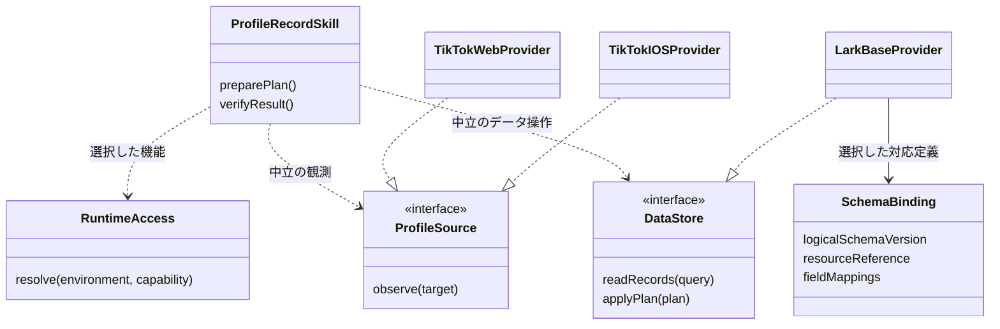
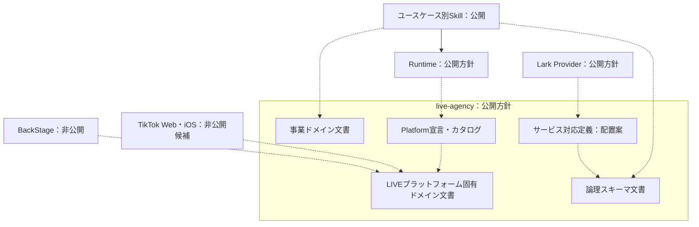
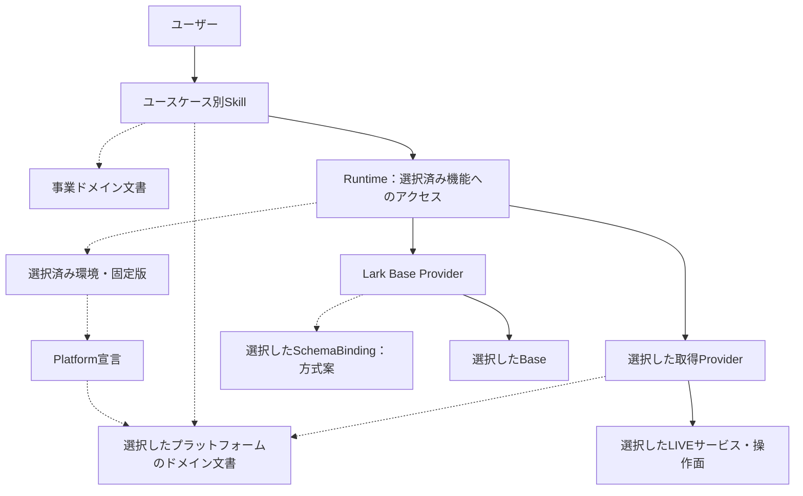
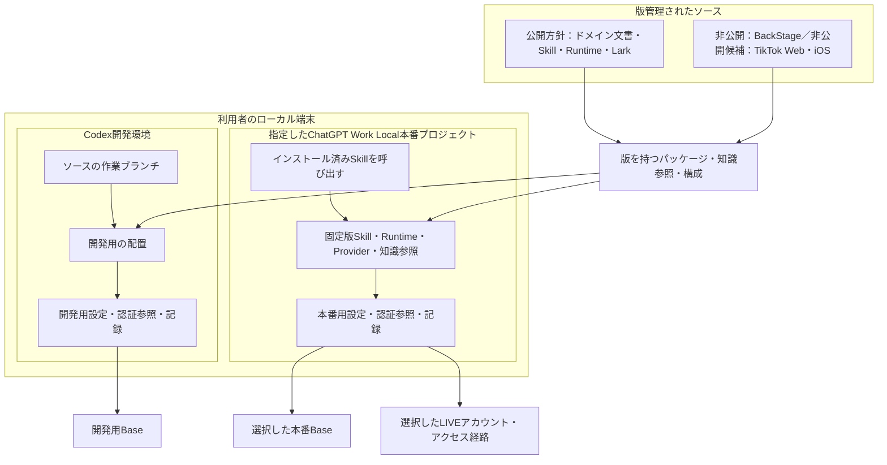

# ドメイン知識の実装案レビューと経緯

# この記録の位置付け

オーナーから「この整理をちゃんと文書化しておいて。これを踏まえて、今直面したバグは解決しそうですか？」との指示を受けて記録する。採用済み方針の正本は英語の[知識所有文書](../architecture/domain-knowledge-ownership.md)（`status: commit`）である。本書はその参照説明と経緯を含む、未決定の実装案のレビュー文書（`status: pending`）とする。クラス名・宣言的なマッピング方式・コードの配置は本書で検討し、採用済み方針を再定義しない。未実装・未検証の部分を承認済み仕様や本番の状態として扱わない。

5図のうち、ドメインモデルは採用済み正本に、設計クラス図・パッケージ図・コンポーネント図・配置図は本書の未決定案に保存する。後半3図はMermaidによるUMLの簡略表現である。業務上の概念、実装インターフェース、ソース配置、実行関係、環境配置をそれぞれ別の図にし、文書への参照をコード依存や実行と区別した。

# 正本の採用済み方針と理由（参照）

| 整理 | 理由・保つ境界 |
| --- | --- |
| LIVEエージェンシー事業ドメインと、TikTokなど各LIVEプラットフォーム固有ドメインを区別する | Scouting／Managementは業務の区分、TikTokはプラットフォームの区分であり、片方で他方を置き換えない |
| ドメインモデルを含む知識の正本は`live-agency`の文書に集約する | 複数の実装が意味を別々に定義せず、人が根拠を読んで業務を引き継げるようにする |
| ユースケースごとにSkillが対応する | Skillが業務の進行・判断・計画・適用される承認・結果検証を持つ。Runtimeは選択済み環境へのアクセスを支える |
| 業務の論理スキーマ、Larkへの対応定義、実環境のIDを分ける | Lark Base ProviderにCreator Scouting／Creator Managementの業務定義を押し込めない |
| TikTokの共通知識、共通の取得処理、Web／iOS／BackStage固有の操作を区別する | 共通する意味を重複定義せず、画面や権限が異なる取得経路を同一視しない |
| ソース公開方針は`live-agency`・Skill・Runtime・Lark関連が公開、BackStageが非公開 | TikTok Web／iOSは非公開候補のまま。実際の公開変更、レジストリー配布、本番導入は別の作業・判断である |

知識を文書に集約しても、SkillやProviderが実装時にその知識を使わなくなるわけではない。正本を参照し、その意味を実装に反映する。認証画面の手順・未公開仕様・私有の証跡は、公開予定のドメイン文書へ転記せず、権限のある人が参照できるProvider側の知識として保持する。

招待可否は、Providerが返すステータスと招待区分を、Skillが内部の子ステータスへ対応させる整理を維持する。今回の文書化で新たなステータスや全件停止条件は追加しない。共通Creator UUIDや新しいマスターテーブルの導入、ScoutingとManagementの同一レコード化も行わない。

# 未決定の設計案

`SchemaBinding`は、論理スキーマの版、保存先の参照、フィールド・リンクの対応を宣言として表す候補である。業務判断や任意の実行コードを設定へ埋め込むものではない。既存の型検証・正規化・検索・添付・関連付けを、この定義と汎用操作だけで表せるかは確認が必要である。

独立したドメイン実装パッケージや、業務別の保存Provider／アダプターパッケージを必須にする案は採用していない。まずプロフィール1ユースケースで、必要な責務と既存処理との対応を確かめる。具体的なAPI名、再利用するマッピング定義の配置、文書の版と実装の版の結び方、TikTok Web／iOSの最終的な公開範囲は残る判断である。

## 設計クラス図（案）

プロフィール1ユースケースのインターフェース案であり、クラス名・メソッド名をAPIとして採用するものではない。実装関係は責務を示す。手順を返すProviderは、AIがホストのツールで実行する場合もあり、必ずしもJavaScriptメソッドの実行を意味しない。

Skillは必要な業務上の事実を知り、Larkのfield IDやTikTokの画面構造は持たない。図は一般的な更新・削除権限を付与しない。同じインターフェースに見えても、Providerごとの対応範囲・条件が同一とは限らない。具体的なインターフェースの所有者と、対応定義だけで処理を表せるかは未確認である。

## パッケージ図（案）

Mermaidのグループを使ったUMLの簡略表現。実線は実装依存、点線は文書または宣言の参照であり、文書参照を実行コードのimportとは扱わない。汎用capability contractへの依存は省略している。公開・非公開の表示は方針または候補であり、現在のGitHub設定を示さない。

実ID・認証情報はソースの外へ置く。RuntimeのPlatform参照は宣言の読み取りであり、全プラットフォームのインストールを要求しない。具体的なマッピング定義の配置は案である。[配布方針](../architecture/distribution.md#source-repository-visibility-and-synchronization)がソースの公開方針を規定し、レジストリー上のパッケージ公開範囲は別に判断する。

## コンポーネント図（案）

実線は呼出し・アクセス、点線は知識・構成の参照を示す。Runtimeは選択済みの操作や手順をSkillへ提供し、業務を開始する責務はSkillが持つ。

取得は必要なcapabilityに応じてWeb・iOS・BackStageを選ぶ。3経路すべてを呼ぶ図ではない。LarkのAPI優先・ブラウザへの順次フォールバックという採用方針は維持し、選択された権限と既知の操作結果を扱う。既存のBase／Chatでフォールバックが実装・検証済みであることは、この図だけでは示さない。

## 配置図（案）

利用者のローカル端末での実行・配布物の配置を示し、AI推論基盤の配置図ではない。プロジェクトの分離自体をセキュリティ境界とは扱わない。

開発変更は本番のSkill登録や設定を暗黙に上書きしない。ソース同期・パッケージ配布・インストール・業務受入は別の段階であり、1ユースケースの受入を全Skillの再配布完了まで待たせない。具体的な配置方式はこの設計案の確認対象である。

# 現在の読取障害との関係

**責務の混在を解消する方向は定まったが、この整理だけで現在のエラーが直るとはまだ言えない。** 業務スキーマの定義・環境の対応設定・Larkの実操作を区別すると修正対象を特定しやすくなる。一方、実際のAPI呼び出しや設定検証の失敗原因は、別途絞り込む必要がある。全コンポーネントの再設計・再配布を先に完了させる必要はない。

| 分かっていること | 判断できる範囲 |
| --- | --- |
| 最新の限定履歴読取診断は`read-fields`で停止した | この段階にはクリエイターテーブルの列定義読取、プロフィール履歴テーブルの列定義読取、両者の対応検証が含まれる |
| 上位には`PROFILE_ENVIRONMENT_FAILED`、内側には`PROFILE_DATASTORE_READ_FAILED`が出る | 異なる二つの根本原因ではなく、失敗を異なる層で包んだ結果。外側の名前だけでは環境設定の誤りと断定できない |
| Providerは`stage`を残すが元の例外理由を失い、Skill側でもその詳細が上位へ残らない | どちらのAPI呼び出し、またはフィールド・型・リンク対応検証で失敗したかを現状の出力から特定できない |
| この限定診断では履歴レコード読取・画像処理へ進んでいない | 今回の停止を履歴全件走査や添付処理の遅さと断定できない。以前の長時間読取とは分けて扱う |
| 先行するクリエイター読取は成功している | 後続の別テーブル・別処理の成功を保証しない |

ソース照合対象はLark Providerの`src/creator-profile-read.js`、`src/creator-profile-normalization.js`とProfile Skillの`src/profile-environment.mjs`。`read-fields`が2回の列定義読取と`resolveProfileFields`を包んでいること、Providerでの理由欠落と上位伝達の不足を確認した。認証・通信の問題、選択設定と実テーブルの不一致、実装側の検証不備は、現段階では原因候補である。

本番はChatGPT Work Localの指定プロジェクト「C|OPS|エージェンシー運営」。停止時の固定構成はRuntime `2.0.0-m3.0`、Profile `2.0.0-m3.1`、Lark `1.4.0-m3.0`。インストールとSkill登録は完了したが計画は未完成、`businessWorkflowVerified: false`、業務データ書込み・画像アップロードは0件である。Workの最終試行はクレジット不足で終了している。これは停止時の記録であり、今回再実行した結果ではない。

停止時の根拠は[本番検証の証跡checkpoint](https://github.com/flair-agency/live-agency/commit/ad3c1ba)と、その記録が参照する私有の`work-final-summary.json`・`work-diagnostic-summary.json`。実ID・クリエイター情報・生レスポンスはこの文書に転記しない。[Issue #32](https://github.com/flair-agency/live-agency/issues/32)が業務受入未完了を引き続き追跡する。

# 最小の次の作業

| タイトル | 人の担当 | 期限 | 内容 | 完了条件 | 参照 |
| --- | --- | --- | --- | --- | --- |
| 読取失敗の原因を特定する | TBD | TBD | 列定義読取2回と対応検証を区別し、秘密情報を除いた理由コード・段階を上位へ残す。選択済み環境・対象の限定読取で原因を1回切り分ける | 設定・サービス呼出し・実装のどこを修正するか証拠で説明できる | Issue #32、上記ソース |
| 必要箇所を修正してプロフィールの計画を作る | TBD | TBD | 特定した原因の修正に限定し、指定済みの1ユースケースを再開する | 計画・件数を実データから提示できる。登録完了とは区別する | Issue #32 |
| マッピング方式を具体化する | TBD | TBD | 既存のプロフィール処理と宣言的な対応定義の適合性を照合する | 再利用範囲・不足・版管理を具体的に説明できる。必須パッケージを推測で増やさない | 設計文書の未決定事項 |

この文書化の作業ではサービス再試行や実装変更を行わない。上の診断と実装は次の作業として残す。既に与えられた権限を尊重し、同一の承認を改めて要求する根拠にはしない。

# 作業範囲と検証記録

主分類G（文書）。作業単位は、採用済みの知識所有方針と5図を保存し、関連する正本の責務・公開方針の記述を整合させ、現在の障害との関係を記録すること。実装・契約・子リポジトリーのpin・配布・本番設定を保護境界とする。完了条件は内容と参照の照合、文書ポリシーレビュー、所有する文書差分のリモート作業ブランチへの同期。次のゲートは必要な設計案の具体化とPR統合であり、本番操作ではない。

rootの既存`runtime`変更を保持し、`origin/main`の`6b45205`から文書専用ブランチ`codex/domain-knowledge-ownership`を分離した。子ソースと本番記録は読取参照とし、既存の証跡ブランチを丸ごと採用しない。独立worker（gpt-6-astra / low）は、文書作成と並行して読取障害のソースに限定した確認を行った。

復旧はこの文書変更のrevertで可能。インストール済み構成・業務データには変更がない。

初版（`6a2395a`）のAIポリシーレビューでは、既読の文書知識・言語・開発方針とPrivate Source Integration Guide、今回のオーナー指示を根拠として文書7ファイルの差分を照合した。既存の「業務スキーマをBase Providerが所有」「Providerは一律非公開」という記述を今回の方針に合わせて修正した。合意した方向と未採用の実装案、公開方針と公開済み状態、業務完了と導入済み状態を区別した。独立workerの読取レビューでも、この境界および障害の説明に重大な指摘はなかった。

初版の変更箇所と新規文書の相対リンク24件は参照先・見出しを確認し、欠落0件。未展開のBase Provider文書への参照1種類は既存checkoutで確認した。新規Mermaid図は5件で、classDiagramの関係線をnamespace外に置くなど構文と責務の表現を目視照合した。GitHub上での描画は未検証。空白差分を検査し、アプリケーションのコードを変更していないためユニットテストは追加・実行していない。

残る判断は本書の未決定案に列挙したマッピング方式・配置・版の結び方・TikTok Web／iOSの公開範囲である。現在の読取障害の根本原因と、業務の正常完了は未確認のまま保持する。

# PR #55のレビュー対応

初版のセルフレビューでは、文書全体のステータスと採用範囲の不整合、移行計画に残る旧配置指示の2点を見落としていた。GitHubのレビュー指摘を根拠に、今回の文書修正で対応した。

| 指摘 | 修正 |
| --- | --- |
| [採用済み境界と未決定案のステータスを分離](https://github.com/flair-agency/live-agency/pull/55#discussion_r3981447987) | 英語正本は採用済みの境界・ドメイン図に限定し、`status: commit`とした。具体的な方式・配置・4図は本書の`pending`な実装案へ移し、相互の参照を更新した |
| [現行移行計画のマッピング所有者も更新](https://github.com/flair-agency/live-agency/pull/55#discussion_r3981447993) | `v2-plan.md`のProfile M2からProviderへの一括移動指示を外し、論理スキーマ・対応定義・実環境bindingの分離へ改訂した。過去の配置指示より今回の方針を優先し、方式と配置は未決定であることを明記した |

修正対象は文書5ファイル。元の5図を保持し、レビュー側の図の説明を日本語にそろえた。移行計画が参照する過去の採用記録は書き換えず、現行計画から後続方針による更新を明示した。独立workerは指摘2件への対応と、移した図の意味・未決定事項の保持を読取確認し、追加の重大な指摘はなかった。

修正文書の相対参照103件は参照先・見出しを確認し、欠落0件。未展開コンポーネントの参照先6種類は既存checkoutで確認した。5図の構造と空白差分も確認した。GitHub上の描画は未検証で、業務コードのテストやサービス操作は実行していない。本番の読取障害はこの文書修正によって解決済みにはしない。
