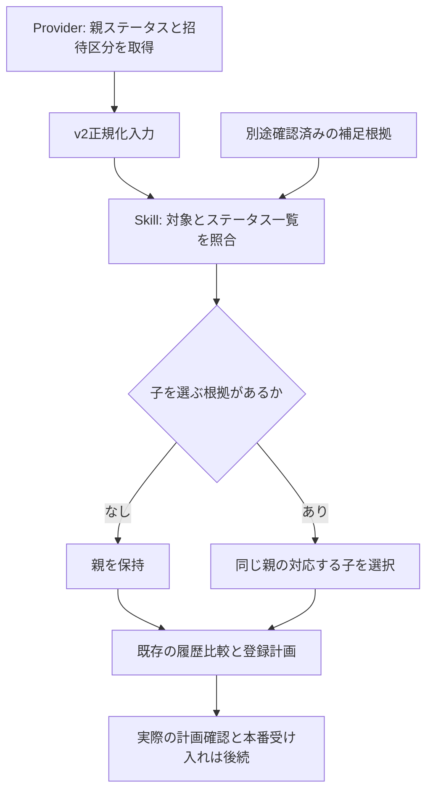
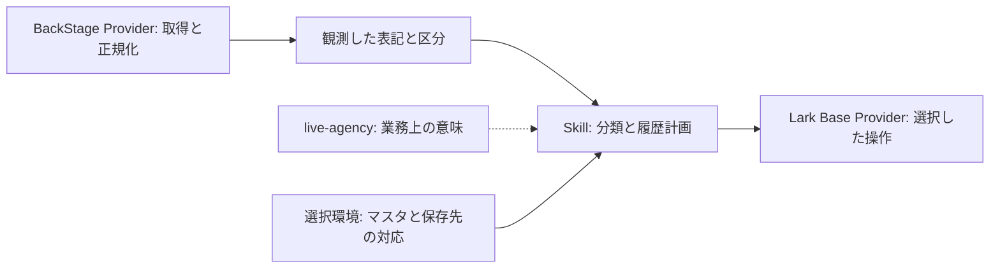

# 招待ステータスと内部分類の受け渡し

この文書は実装レビュー案です。業務境界は所有者が「はい、その解釈であっています」と承認済みです。今回レビューするのは、その意味を保持するv2入力とSkillの分類処理です。現在の本番プロフィール同期は変更しません。

# 修正する欠落

Providerは招待ステータスと、招待できる場合の招待区分を別の事実として渡します。Skillはその事実を、明示されたステータス一覧の親・子へ対応付けます。現行のv1入力は招待区分を持たず、一般とプレミアムを同じ親へ縮退させていました。

Provider側の過去の未統合修正も今回の開発ブランチへ取り込みます。七つの表示ステータスの認識、表示された「見つかりません」と取得不能の区別、回収済みの知識です。過去の「承認待ち」という記述を、その後の所有者承認と区別して訂正します。

| 入力事実 | Skillの分類 | 推測しないこと |
| --- | --- | --- |
| 対象、一般 | 対応する「対象（一般）」の子 | Providerに保存先の子を選ばせない |
| 対象、プレミアム | 対応する「対象（プレミアム）」の子 | 一般と同じ親に情報を落とさない |
| 親ステータスのみ、区分・補足根拠なし | 親のまま | 以前の子を現在も正しいと決めない |
| 親ステータスと、独立した確認済み補足根拠 | 同じ親に属する明示された子 | A〜Eやリスク解除後の区分を自動推定しない |
| 表示された「見つかりません」 | 取得済みの親ステータス | 取得エラーへ変換しない |
| 取得不能・結果不明 | 未解決として停止 | 「対象外」や表示ステータスへ捏造しない |



# 実装範囲と互換性

| 実装 | レビュー | 開発commit |
| --- | --- | --- |
| Providerのv2受け渡し・対象照合・日時検証・知識分離 | [BackStage PR #2](https://github.com/flair-agency/live-agency-provider-backstage/pull/2) | `6f0fc7fd769394a18ad33730ee33a5de448be398` |
| 中立なv2入力・Skill分類・既存履歴計画への接続 | [Skill PR #1](https://github.com/flair-agency/live-agency-creator-invitation-eligibility-record/pull/1) | `afba283dde8f3b1929d2c67fb9d156347c8f9558` |

Skillは未リリースの採用済み基点 `821b6e4` から分離しました。別ブランチの複数バッチ修正を暗黙には取り込んでいません。Providerは現在のmainに、招待知識の既存未統合ブランチを合わせています。親のsubmodule pin・配布構成は今回変更しません。

- Providerの新しい名前付きnormalizerとsource/v2を明示選択します。出力は `invitation-eligibility-observations/v2`。`eligibility` と `invitationCategory` を分け、区分がない場合はnullとします。
- v2には取得前に保持した依頼一覧 `requestedAccountKeys` を必須とし、結果の不足・余分・正規化後の重複を拒否します。結果から依頼一覧を作り直してはいけません。v1は旧引数を維持し、一覧が渡された場合は同じ照合を行います。v1単独で取得範囲の完全性を証明することはできません。両版で実在する暦日・時刻・時差を持つ完全ISO日時を検証します。
- v1の形式・既存入口を維持します。v1をv2へ名前だけ変えたり、欠けた区分を履歴から補ったりしません。v1のみでは今回の情報保持を受け入れできません。
- Skillのステータス一覧は中立なID・ラベル・親ID・区分対応です。サービス固有の列名、Base ID、画面、認証情報は持ちません。その他の子は明示された補足根拠参照を必要とします。
- 分類結果を既存の履歴比較へ渡します。分類前の観測、選択した親・子、根拠を区別して追跡できるようにします。既存履歴を自動変換しません。
- このパッケージはソースとローカル計画の接続までです。保存済み環境への招待read/write接続、カタログ・配布・本番登録は未完了です。

# 作業カードと後続

主分類D（移行）、副分類B（情報欠落修正）。境界はProviderの正規化入力とSkillの業務分類です。不変条件は既存状態遷移の意味、v1互換、画像・本人情報の保持、明示された対象範囲、公開/非公開の分離です。

最初のパッケージの完了条件は、同じ入力から区分を失わず、既存履歴比較が正しい新規作成・時刻更新を計画することです。開発ブランチの差分・直接テストを確認し、既存の本番構成には触れません。回復は未採用ブランチを採用しないことです。

| 作業 | 担当 | 期日 | 完了条件 | 追跡 |
| --- | --- | --- | --- | --- |
| 区分保持と分類 | Codex、採用判断は所有者 | TBD | 同一入力の分類・履歴計画比較、レビュー可能なPR | #14、#6 |
| 保存済み環境からの招待読み取り・計画接続 | TBD | TBD | SkillからRuntimeで選択済みの機能を解決できる | #14、#31 |
| 配布と本番受け入れ | TBD | TBD | 承認済み構成をWorkへ導入し、実際の計画・登録・読戻しを確認 | #32 |

独立したSkill実装を `gpt-6-astra / low` のworkerが担当し、coordinatorは固定した同一v2入力に対応するProvider修正と統合確認を担当します。Runtimeの再設計やLarkの広範なリファクタリングは含みません。

# 検証とAI方針レビュー

初回の `5aa9cfd` / `afba283` ではProviderの直接確認13件、Skillの分類・従来契約・履歴回帰24件、独立した呼出元/API操作検査2件が成功しました。これは初回ソースの検証記録です。

検証ロジックのレビュー指摘修正時（Provider `e7b3b9d`）に、Providerの直接確認15件、検証ツールのソース照合3件が成功しました。その後の知識分離では、変更したmanifestと配布リソースの確認2件、修正版の完全SHAによる統合4シナリオを確認しました。業務ロジックとSkillは変更しておらず、既存の15件・24件を一括で繰り返していません。統合確認は架空9件について一般・プレミアム・区分なし、七つの親、補足根拠の有無、表示not-found混在、同一分類の時刻更新と区分変更の新規履歴を対象とします。

Skillの既存テスト依存は、分離した開発checkoutから既存開発依存を読む一時resolverで解決しました。新規installや本番へのリンクはありません。これは固定版パッケージの新規インストール検証ではありません。Skill用の汎用validatorは既存環境にPyYAMLがなく起動できませんでした。変更した参照・export・配布対象、frontmatter未変更、差分を別途確認しています。

統合確認は [検証ツール](../../tools/verify-invitation-classification-handoff.mjs) に二つのcheckoutの絶対パスと完全SHAを明示して再現できます。パスは手元のcheckoutに置き換えてください。

```sh
node tools/verify-invitation-classification-handoff.mjs \
  --provider-source /absolute/provider-checkout \
  --provider-commit 6f0fc7fd769394a18ad33730ee33a5de448be398 \
  --skill-source /absolute/skill-checkout \
  --skill-commit afba283dde8f3b1929d2c67fb9d156347c8f9558
```

import前と結果出力前に、指定コミットとの一致およびステージ済み・未ステージ・未追跡の変更がないことを確認します。違う版や未コミットの修正があれば成功結果を返しません。成功JSONの `sources` に実際のcommitとtreeを記録します。知識分離後のtreeはProvider `74e07b9187e5fd26257cb6d88099822e0c203de4`、Skill `8062b64858f10498ee73ee5a1fc8524be614de8b` でした。[回帰確認](../../test/verified-source-checkout.test.mjs) は版違い・作業中の変更・途中のコミット変更の拒否を検証します。

実サービス操作は0件です。画像についてはメタデータの保持を直接テストで確認した範囲であり、今回のBackStage画像実取得は未検証です。

適用方針は [開発方針](../governance/development-policy.md)、[文書・Skill知識方針](../governance/document-knowledge-policy.md)、[言語方針](../governance/document-language-policy.md)、全文確認した [Private Source Integration Guide](../governance/private-source-integration-guide.md) です。自己レビューで、Providerの「意味の所有」を中央のドメイン文書に従う取得・正規化へ訂正し、矛盾した現行not-found説明を過去版から分離しました。ソース事実と業務分類、根拠・停止条件・人の照合手順、図、公開範囲を確認しました。AIテストは人間による業務理解や本番受け入れの代わりではありません。

レビュー指摘対応のAI方針レビューでは、取得前の依頼一覧を保持する責務、v1互換の限界、日時の既存契約への一致、証跡と実ソースの対応を確認しました。今回の変更はB（不具合修正）で、既存の作業カードの境界内です。対象範囲・業務分類・本番構成を変更せず、未採用の修正コミットを戻せます。レビュー待ちはソースの採用判断であり、配布・本番受け入れ完了とは区別します。

# 知識の責務分離

所有者の指摘により、Providerが取得時に読み込む `invitation-status-semantics.md` に、ソースの表記とBase側の状態管理知識が混在していたことを確認しました。以前の自己レビューは「Skillが分類する」という説明を確認した一方で、同梱リソースに分類・履歴・保存の詳細を残していました。過去の知識を回収した際の配置が不適切でした。

| 知識 | 所有者と今回の扱い |
| --- | --- |
| 画面の入口、30件ずつの入力、七つのソース表記、表示理由・招待区分の読み取り、画像取得 | BackStage Provider。現行の同梱文書には、この取得と正規化の手順を残す |
| 観測と内部分類の違い、補足根拠、分類の業務目的、子を親へ平坦化しない原則 | `live-agency` の [ドメインモデル §1.3](../domain/model.md#13-invitation-observations-and-consumer-classification)。既に合意した意味を集約 |
| 明示された親・子への対応付け、競合停止、履歴比較・登録計画・検証 | [Skillの分類手順](https://github.com/flair-agency/live-agency-creator-invitation-eligibility-record/blob/afba283dde8f3b1929d2c67fb9d156347c8f9558/references/invitation-classification.md)。既存の手順を使用し、今回は変更しない |
| 実在するマスタのレコード構成・ID、Base/table/field、業務スキーマとLark型の対応 | 選択済みの非公開環境と対応定義。Providerの取得知識から外し、新たなテーブルや対応定義は作らない |
| 回収した過去の議論・仮説・当時の保存判断 | 下記の不変な過去版から追跡可能にする。現行の取得手順として読み込ませない |



「Providerは子を選ばない」という注意書きを残すだけでなく、子の一覧、A〜Eの内部ラベル、履歴比較や保存フィールドの決定を、取得時の必読リソースから取り除きます。過去版と現行版が同じ文書内で異なるnot-found表現や結合済みの状態を指示していた点も整理します。現行文書は実装済みv1/v2の正規化だけを記述し、過去版はGitの固定参照で分けます。

## 回収した知識の追跡

原記録は [Providerの修正前文書 e7b3b9d](https://github.com/flair-agency/live-agency-provider-backstage/blob/e7b3b9de29a8e76c4e643ab6edc175c0117fdb2a/knowledge/invitation-status-semantics.md) に保持されています。認証を要するソースの調査情報は、その非公開参照のまま保持し、公開Skillへコピーしません。この参照は過去の根拠であり、現在の設定値や実行手順を選択しません。

| 過去版の節 | 保存する意味と参照時の注意 |
| --- | --- |
| Source labels and internal records | ソースの七つの表記と、当時のマスタの親・子構成は別の事実。現在の実マスタは選択環境で照合し、過去の件数を固定スキーマにしない |
| Enrichment and rationale | A〜Eの原因候補、回復期間、画面順序の経験則は所有者の説明・仮説として保持。自動分類や自動スケジュールの規則に昇格させない。業務目的は中央モデルに保持 |
| Recovered final storage decision — 2026-09-10.3 | 途中の追加フィールド案と最終の保存判断を区別する。子に含まれる意味を失わず、生レスポンス保存を追加要件にしない。制限中の区分は招待許可を意味しない |
| Historical proposal / Adopted boundary | 保留だった解釈と、その後の所有者承認を区別する。採用済みの責務境界は中央モデルと所有権文書で参照する |

今回のAI方針レビューでは、文章中の責務宣言に加え、manifestから実際に配布・読込される全ての招待リソースを確認しました。取得手順・公開範囲・人の照合経路を維持し、業務分類・保存手順の混入を除去しました。変更は知識と参照の整理で、normalizerやSkillの業務ロジックは変更しません。知識版を `2026-09-12.3` として追跡し、配布・本番採用は別の未完了作業として残します。
