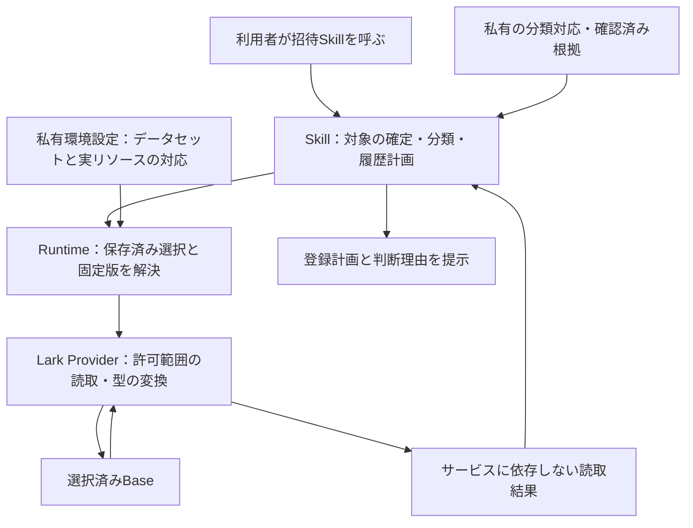

# 招待Skillの保存済み環境への接続：読取境界の設計レビュー

- 状態：未承認の日本語設計案。実装済み仕様ではない。
- 対象：[移行 #14](https://github.com/flair-agency/live-agency/issues/14)。招待Skillの保存済み環境からの読取と登録計画まで。
- 決定したいこと：**Lark Providerに設定駆動の汎用データセット読取を追加し、実リソースとの対応を私有設定、業務判断をSkillに置く。Runtimeは既存の選択・設定受渡しを再利用する。**
- 採用後は承認内容を英語の正本文書に反映する。配布、本番導入、業務データの登録はこの設計採用に含めない。

## なぜこの決定が必要か

[知識配置方針](../architecture/domain-knowledge-ownership.md#business-schema-and-lark-operation-boundary)は、論理スキーマ・サービスとの対応・環境の実リソース束縛を分離している。ただし、対応を実行する仕組みは未決定であり、業務別アダプターパッケージの新設は採用していない。

[Invitation PR #2](https://github.com/flair-agency/live-agency-creator-invitation-eligibility-record/pull/2)により、正規化済み履歴から分類・計画を作る入口は採用済み。一方、旧接続はSkill内でLarkの列を解決し、履歴テーブルを全件取得している。この接続をそのまま新しい入口につなぐと、責任分離と取得範囲の問題が残る。

| 既存の仕組み | 再利用できる部分 | 今回必要な追加 |
| --- | --- | --- |
| Runtimeの`createEnvironmentAccess()` / `invoke()` | 固定したProviderへの呼出し、選択情報・実行条件・私有設定の受渡し | 招待専用の実行器は追加しない |
| Runtimeの`configurationRef` / `configurationSha256` | 設定JSONの所在と内容の固定。要求による上書きを許さない | 下記のデータセット設定をProviderが検証する |
| Larkの`createLarkBaseSelectedHistoryReader()` | 選択した表・ビューの列とレコードの読取、ページ上限等の検証 | 型付きの出力、対象IDで絞る検索、完全性の契約 |
| LarkのProfile限定履歴読取 | 対象クリエイターIDによる検索・ページ整合性確認の先例 | Profile固有の列定義を流用せず、汎用操作として取り出す |
| Invitationの正規化済み履歴入口 | 分類・履歴遷移・計画の既存判断 | 選択済み環境の読取結果を既存入力へ組み立てる |

この案は汎用読取を新設するが、既存Profileの接続を同時に改修することを招待の前提にはしない。

## 責任分担



- 公開ドメイン文書：業務上の事実・関係・制約を定義する。
- 公開Skill：論理的なデータの役割、対象の一致、分類・履歴遷移を扱う。BaseのID、Larkの列形式、認証手順を持たない。
- 私有設定：論理データセットと実際の表・列・ビューの対応、許容型、関係先、許可する読取を宣言する。秘密値ではなく既存の認証参照を使う。
- Lark Provider：宣言を検証し、Larkの型・ページング・検索・添付取得を扱う。特定の分類名やスカウト業務の判断をハードコードしない。
- Runtime：既存の設定と選択を渡す。設定内容から業務判断を行わず、Skillを起動する責任も増やさない。

設定は承認済みの汎用操作の組合せに限定する。JavaScript、任意APIパス、任意の変換式を設定から実行しない。新しい必須パッケージやリポジトリーはこの案では設けない。

## 提案する最小インターフェース

以下は新規能力`record-dataset-read/v1`の設計案であり、現在利用できるAPIではない。要求は既存Protocolの相関情報とRuntimeの選択確認を使う。

```json
{
  "dataset": "history",
  "query": "byOwner",
  "parameters": { "recordIds": ["synthetic-creator-1"] }
}
```

`dataset`と`query`は固定済み私有設定に登録した別名である。実際のBase・表・列IDやURLを要求から渡して設定を差し替えることはできない。未知の別名、同一データセット内の論理キー／field IDの重複、不正・重複した検索IDを拒否する。設定は、データセットごとに次を持つ。

| 設定要素 | 契約 |
| --- | --- |
| リソース参照 | 選択環境で許可されたBase・表・必要なビューを固定 |
| 列の対応 | 論理キーから列ID、許容されるサービス型、出力型へ対応。列名から推測しない |
| 関係 | 参照先データセットと単数・複数の制約。相違は診断付きで停止 |
| 読取定義 | 許可表またはビューの列挙、参照ID集合による限定検索のいずれか。検索対象列は設定側で固定 |
| 取得予算 | 検索ID件数・ページ件数・最大ページ数・最大レコード数・時間上限を有限値で設定。超過を切捨て成功にしない |
| 添付の扱い | 必要な場合に限り、対象検索で得た行の設定済み添付列に実在する添付原本を取得して内容ハッシュを算出。取得権限・サイズ上限を固定し、要求側の任意token／URLを受け付けない |

成功時は、データセット名、要求に対応した取得範囲、選択世代・設定の識別情報、レコードID、論理キーの値、全ページ読取完了を返す。部分結果を成功として渡さない。値の型は文字列・有限数値・真偽値・時刻のepochミリ秒・レコード参照・添付内容ハッシュに限定し、単数／配列・欠落許容を列ごとに定義する。時刻にタイムゾーンが必要なのに不明な場合や、未対応のサービス表現は推測で変換しない。

読取結果を受けたSkillが、採用済み入口の`manifest`、`statuses`、`storedHistory`、`invalidStored`へ組み立てる。分類対応は確認済みの中立的な対応データを私有入力として明示的に使う。Skillは汎用的な親子関係・一致検証を行い、保護対象の具体的な規則をコードや文書へ転載したり、特定プラットフォーム用の判断分岐を追加したりしない。Providerは親子分類の意味を解釈しない。

## 取得範囲と既存仕様の維持

1. **対象者**：既存の`due`／`selected`／`all`、アカウント正規化、一意性検証、指定順、明示したlimitの意味を維持する。初期接続は許可された対象表／ビューを必要列だけ、有限予算内で読む。limitを掛ける前の重複検出を省略しない。正規化と同等性を証明できないアカウント検索への置換は行わない。
2. **分類マスター**：明示的に許可したマスター全体を有限予算内で取得する。親・子・対応の整合性は既存Skill契約で検証する。保護対象の具体的ラベルや規則は公開ソースに含めない。
3. **履歴**：確定したクリエイターID集合でサーバー側を絞る。返された行の参照先も検証する。検索に対応できない場合は明示的な失敗とし、全履歴取得へ切り替えない。対象0件なら履歴要求も0件。API上限で分割する場合は全分割の完了と対象範囲を検証する。複数参照により分割をまたいで同じ行が返る場合だけ、内容一致を確認して一度だけ採用し、不一致は停止する。
4. **鮮度**：計画作成前にmanifestの対象・アカウント・due該当を再確認する既存条件を維持する。取得範囲の完了は、複数API要求間のトランザクション整合性を保証するものではない。
5. **画像**：添付がない場合の空配列と、添付があるが内容ハッシュを取得できない状態を分ける。file tokenを内容ハッシュとして扱わず、空文字・取得失敗を「画像なし」にしない。
6. **業務判断**：同状態の観測日時更新、状態遷移時の履歴追加、外部ID不一致・最新時刻の競合等の既存条件を維持する。過去履歴の変換・書換えはしない。取得サービスの一回の入力上限とRuntimeのチェックポイントも別の責任のまま維持する。

## 拒否条件と診断

| 条件 | 必要な結果 |
| --- | --- |
| 選択世代・設定ハッシュ・実行主体・認可範囲の不一致 | サービス操作前に停止し、再選択が必要な理由を区別 |
| 列の欠落、型・関係先の変化、未対応変換 | 設定／スキーマ段階の失敗。表示名から近い列を選ばない |
| 認証、API、通信、添付取得の失敗 | 元の安全な原因コードと失敗段階を保持。「履歴なし」にしない |
| ページ欠落、同一検索内の重複ID／トークン、予算超過、件数不整合 | 不完全な読取として停止。APIがtotalを返す場合は同じ検索範囲の件数と照合 |
| 検索対象外の参照、単数関係の複数値、不正時刻・ハッシュ | 該当レコードの診断を保持し計画を止める。正常行だけで進めない |
| 完全に取得できた0件 | 要求した範囲を明示した正常な空結果。失敗時の代替値とは区別 |

環境側に残す診断は処理段階・操作・相関ID・安全な原因分類・該当論理キーを持つ。必要なサービス詳細は私有証跡への参照で保持し、秘密値や実データを公開ログ・GitHubへ転載しない。Providerの処理失敗と、Skillが保持する不正履歴行の診断を混同しない。

既存汎用readerにはtotalとの件数整合検証がなく、Profile限定readerには先例がある。この差を「検証済み」と扱わず、今回の実装対象に含める。成功は取得範囲の完了を意味し、登録成功や本番での業務完了を意味しない。

## 実装から受け入れまで

| 順序 | 作業・完了条件 | 根拠と復旧 |
| --- | --- | --- |
| 今回 | この契約・配置・拒否条件のレビュー。採用内容を英語正本へ反映 | 文書差分のみ。取り消しは当該文書のrevert |
| 次 | Larkの汎用読取とInvitationの必要な接続を一つの実装単位で作る。Runtime受渡しを再利用 | 同一の合成入力に対する旧／新の対象・分類・計画・停止理由の一致、対象ID検索・不完全読取・画像ハッシュ失敗の直接検証。旧経路を残す |
| その後 | 固定版配布と選択環境での読取・計画の受け入れ | [#31](https://github.com/flair-agency/live-agency/issues/31)・[#32](https://github.com/flair-agency/live-agency/issues/32)で実際の版・設定・導入範囲・復旧先を明示して扱う |
| 登録 | 残る書込側の接続を同じ責任分担で確認し、具体的計画の承認後に実行・再読込 | 読取成功を登録権限にしない。既存の二重登録防止・曖昧結果の再照合を維持 |

新しいProvider能力の採用判断が必要なのは、[開発方針のクラスE](../governance/development-policy.md#e-change-architecture-or-shared-infrastructure)と現行知識配置方針で、実行するマッピング方式がまだ採用されていないため。既に承認された分類・正規化済み履歴の仕様は再承認の対象にしない。

## 根拠・AI方針レビュー

- 調査した版：親`6473cb7`、Runtime `1f45ae5`、Lark `f3a6953`、Invitation PR #2 merge `c7ac801`。現在の配布版・導入版を意味しない。
- 主な実装根拠：Runtime `src/environment-access.mjs` / `src/provider-configuration.mjs`、Lark `src/selected-history-reader.js` / `src/selected-profile-history-reader.js`、Invitation `scripts/invitation_lark_runtime.mjs` / 正規化済み履歴入口。
- 照合方針：[知識配置](../architecture/domain-knowledge-ownership.md)、[文書・Skill知識](../governance/document-knowledge-policy.md)、[言語](../governance/document-language-policy.md)、[Private Source Integration Guide](../governance/private-source-integration-guide.md)全文、[開発方針](../governance/development-policy.md)。
- AIレビュー：実装済みと提案を分離。私有知識の転載・実リソース・秘密値・設定内コード実行を含めない。既存target選択には全対象の一意性検証があるため、効率化を理由に暗黙に変更しない。履歴の検索範囲と失敗時の扱い、画像原本によるハッシュ取得、設定の意味を人が確認する場所を明示した。
- 独立した実装照合で、添付の対象行・列への束縛、未知／重複した設定と検索入力、分割検索の完了条件に不足を指摘され、本文へ補足した。
- 文書検証：相対リンク7件、アンカー2件、JSON例1件、コードフェンスと差分の空白検査を確認。図は手順との対応を目視確認し、Mermaidの実表示は未確認。文書だけの変更のためローカルの実装テストは繰り返していない。
- 人の判断：冒頭の汎用読取＋私有対応設定という方式の採否。実装検証・実データでの受け入れは未実施。既存Profile本番構成、ホスト登録、業務データは変更していない。
