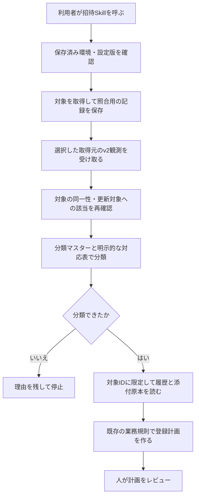

# 招待Skillの選択環境読取・計画接続

2026-09-13の実行チェックポイント：Lark側は`codex/record-dataset-read`の`1f67cc7`、Skill側は`codex/invitation-environment-read`の`ec188e9`にコミット済みです。親側は`codex/invitation-read-integration`です。先行するSkillのコミット試行は自動承認レビューのクレジット不足で停止しましたが、今回の再開では同じ正規の実行経路で成功しました。拒否の迂回は行っていません。

今回の再開では既存差分と検証結果を引き継ぎ、3ブランチの同期・PR作成、Project 3とIssue #14の更新までを進めます。作業ツリーは`/private/tmp/lark-record-dataset-read-20260913`、`/private/tmp/invitation-environment-read-20260913`、`/private/tmp/live-agency-invitation-read-integration-20260913`です。開発用`node_modules`リンクはコミット対象外です。最終接続検証は5項目成功、外部呼出し0件、検証ツールSHA-256は`6d0e3fec74a17fe3284e2968acd777c0e41964263eecdb203827129d960e1688`です。実装変更がないため、成功済みテストは繰り返していません。

作業構成はオーナーが承認した司令塔・担当方式に変更しました。class Gの開発方針文書更新のみを`gpt-5.6-terra` / `low`のサブエージェント1体へ委任し、司令塔は既存成果のGitHub同期・統合を担当します。担当の編集範囲は開発方針のモデル選択・引継ぎ節に限定し、実装・本番構成・承認権限を変えません。完了条件は承認済み方針の英語反映と差分確認、復旧は当該文書差分のrevertです。このタスク自身のモデル設定は変更していません。節約率の実測はまだありません。

方針更新のAIレビューでは、担当の差分を承認された日本語の指示と照合しました。人の承認権限を委譲しないこと、担当のモデル指定が親の設定変更を意味しないこと、従来の検証・権限境界を維持することを確認し、曖昧だった2か所の表現を修正しました。文書のみのため追加テストは行っていません。

[Issue #14](https://github.com/flair-agency/live-agency/issues/14)の次の実装単位です。
[採用済み契約](../architecture/record-dataset-read-contract.md)に従い、Providerの汎用読取とSkill側の接続を実装しました。
今回のレビュー対象はソースの採用です。配布・本番導入・業務登録の判断とは区別します。

# 変更と責任の所在

| 所有者 | 今回の変更 | 人が確認する内容 |
| --- | --- | --- |
| Lark Base Provider | `record-dataset-read/v1`。私有設定の表・列・型・検索範囲を検証し、全ページの取得と値の正規化を実行。画像は取得した行の添付原本からハッシュを計算 | 指定した論理項目が意図した資源に対応するか。取得上限・認証・添付取得権限は私有設定で明示する |
| Invitation Skill | 保存済み環境から対象・分類マスター・対象IDの履歴を読み、既存の分類・履歴計画処理へ渡す。`targets` / `plan`の入口を追加 | 親子分類の意味、招待区分との対応、追加根拠が採用済みの業務知識と一致するか |
| 親プロジェクト | 実Runtime・Provider・Skillを隔離コピーして接続する開発用検証ツールと本レビュー記録 | 合成サービス応答で確認した事項と本番未確認事項の区別 |

Runtimeの実装、既存Profileの実装・本番構成、親のcomponent pinは変更していません。
開発構成は候補ソースを明示して検証し、既存の配布済み版や本番の固定構成へ混ぜません。

# 維持した動作と停止条件

- `due` / `selected` / `all`、アカウント正規化、選択順序、明示した件数制限を維持します。重複の確認は件数制限より前です。
- 同一状態なら観測日時だけ更新、状態が変われば履歴追加、ID矛盾・最新時刻の競合は停止という既存の判断を使います。
- 計画前に対象IDとアカウントを再確認します。更新対象から外れた場合の停止も、従来と同じ計画操作に適用します。
- 分類不能な観測は分類の理由を残して停止し、不要な履歴取得を始めません。対象0件も履歴取得0件です。
- API障害、ページ欠落、取得上限超過、対象外の参照、画像原本の取得失敗は空データへ置き換えません。安全な原因コード・段階を保持します。
- 公開Skillへ具体的なプラットフォーム表記、私有分類規則、実Baseの列名・IDや認証方式を追加していません。

# 検証と証拠の範囲

Skillの比較検証では実際の旧対象選択関数と新入口の結果を比較し、既存の分類・正規化済み履歴計画とも比較しました。入力不正・範囲逸脱・分類停止・画像不整合・設定変更を含む関連27件が成功しています。

Providerは汎用読取の直接検証に加え、既存Profileとの関連回帰を確認しています。実装時の全体280件と、最終の補強に対する関連36件が成功しました。ソースIDは各PRとIssue #14へ記録します。

接続検証は、実Runtime `2.0.0-m3.0`と候補Provider・Skillを一時ディレクトリへ実体コピーし、合成サービス応答だけを注入します。Providerのmanifest/export、対象正規化、子分類、日時更新1件、対象ID限定の履歴検索1回、設定変更時の取得前停止を確認しました。外部通信は0件です。これは配布用パッケージのインストール検証や本番受け入れではありません。

実行入口は[`verify-invitation-environment-connection.mjs`](../../tools/verify-invitation-environment-connection.mjs)です。`--runtime-source`、`--protocol-source`、`--provider-source`、`--skill-source`、`--dependency-root`に検証するソースと既存開発依存の絶対パスを指定します。結果にはコピー内容のハッシュ、検証項目、外部呼出し件数と限界を含め、一時構成は終了時に削除します。

親の独立caller/API-operation検証2件も成功しています。今回のProvider変更に新規API operation定義はありません。文書リンク、配布参照、構文、差分の空白を確認しています。図は手順との対応を確認していますが、Mermaidの実レンダリングは未確認です。

# AI方針レビューと修正

[知識・文書方針](../governance/document-knowledge-policy.md)、[言語方針](../governance/document-language-policy.md)、[開発方針](../governance/development-policy.md)、完全な[Private Source Integration Guide](../governance/private-source-integration-guide.md)と採用済み読取契約を確認しました。合成例のみを公開ソースへ記載し、人が辿る設定・取得元・分類根拠・失敗時の手順をSkillとProviderの文書に残しています。

独立レビューで、分類停止より先に履歴を取得して原因を隠す差を発見し、分類を先行するよう修正しました。Providerでは通信引数の改変による検索範囲拡大を拒否するよう修正しました。調整担当の確認では、根拠のない固定上限や同じ表を複数の論理データセットへ対応させることへの制約を取り除き、明示した有限の取得予算と確認済みのサービス制限を使うよう修正しました。

解析前JSONの重複メンバー名は、Runtimeの`JSON.parse`後には検出できません。正規化済み設定の重複した列対応・検索IDの拒否と区別して記録しています。私有設定作成時に重複メンバー名を排除する必要があり、今回の実装が生JSONの重複検出まで行うとは説明しません。

# 残る作業と復旧

| 作業 | 担当 | 期限・着手条件 | 記録先 |
| --- | --- | --- | --- |
| 今回のソース採用 | オーナー | PRレビュー後 | 各実装PR、Issue #14 |
| 固定版配布・保存済み環境への導入と実読取受け入れ | 未定 | ソース採用と具体的な配布・導入範囲の確定後 | [#31](https://github.com/flair-agency/live-agency/issues/31)、[#32](https://github.com/flair-agency/live-agency/issues/32) |
| 取得元の選択とv2観測引継ぎの接続 | 未定 | 今回の読取・計画接続の採用後 | [#6](https://github.com/flair-agency/live-agency/issues/6) |
| 選択環境での書込接続と登録後照合 | 未定 | 所有境界に沿った具体的な書込計画・承認手順の確認後 | Issue #14、#32 |
| 人による業務引継ぎの受け入れ | オーナー | 具体的な環境・手順の整備後 | [#39](https://github.com/flair-agency/live-agency/issues/39) |

この変更には書込コマンドがなく、取得成功も`businessWorkflowVerified: false`です。新しい計画を旧経路のapplyへ渡してはいけません。旧入口・既存履歴・既存の本番固定構成を保持しており、ソース採用の復旧は今回の変更のrevertです。Issue #14は本番受け入れまで継続し、このPR群の採用だけでは完了にしません。
