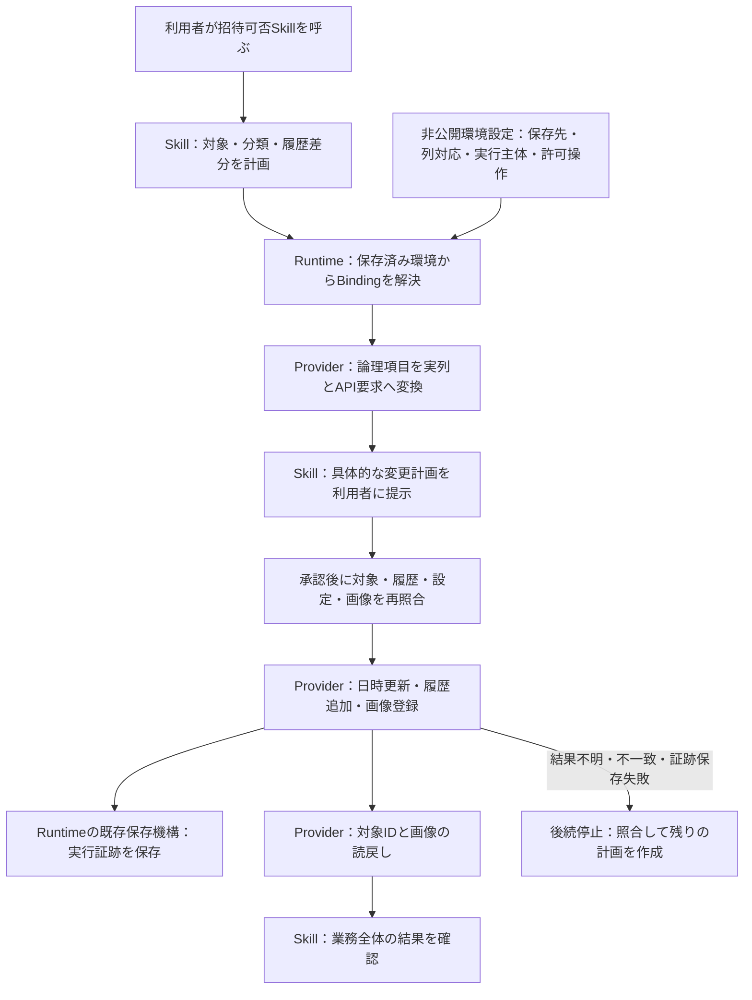

# 招待可否スキルの登録接続：レビュー案

これは未承認の日本語レビュー案です。採用後、承認した範囲を親リポジトリーの英語契約へ反映します。分類・履歴の業務ルールを変更する提案ではありません。

# 現在地

既存の登録処理はありますが、選択済み Runtime から呼べる汎用の書込 Binding がありません。[採用済み読取契約](https://github.com/flair-agency/live-agency/blob/main/docs/architecture/record-dataset-read-contract.md)でも Registration は未決定です。

開発検証では9名について、履歴8件追加（各1画像）・既存1件の日時更新という計画まで完成しています。これは過去の読取検証結果であり、現在の状態の再確認や書込承認ではありません。業務データの登録は0件、`businessWorkflowVerified` は false のままです。

[Lark Provider PR #26](https://github.com/flair-agency/live-agency-provider-lark-base/pull/26) は main に採用済みです。配布・本番導入・改善後の実測は未実施です。この性能改善と、ここで扱う機能接続は区別します。

# 採用を提案する3点

| 判断 | 提案と理由 |
| --- | --- |
| 書込の入口 | 汎用 `record-dataset-write/v1` Binding を Lark Base Provider に追加する。Skill は論理データと計画を渡し、Provider が実テーブル・型・API要求に変換する。読取と同じ境界を守り、Skill に Lark SDK・列ID・認証解決を追加しない。 |
| 読戻しの範囲 | 既存行は承認対象ID、新規行は create 応答のIDで限定取得する。履歴テーブル全件の取得を新経路へ持ち込まない。ただし、下記の「全既存IDとの比較」は同じ保証を維持できないため、明示的に扱いを変更する。 |
| 画像付き処理の中断 | 初回実行では画像も最後まで登録・検証する。中断後は証跡と実データを照合して残りの計画を提示する。同じ実行の自動再開は今回追加しない。画像を省いて成功とすることはない。 |

## 全既存IDとの比較についての変更

既存の汎用 create 処理は、作成前にテーブル全件のIDを取得し、create 応答のIDがそこに含まれないことを検査しています。作成後にそのIDだけを取得しても、この事前比較の代わりにはなりません。

新経路では、この全件ID比較を必須にしないことを提案します。選択された新規作成APIの応答を作成結果の根拠とし、次を確認します。

- 要求と応答の件数・IDの一意性、提出行との対応が成立する。
- 既に今回の読取・計画で確認した既存IDを新規IDとして返していない。
- acknowledgement を記録してから、そのIDの行を取得し、承認した値を型ごとに比較する。
- IDが不明、対応が曖昧、内容が異なる場合は成功にせず、後続を止める。作成要求は再送しない。

これにより、**対象外の既存行すべてについて「返されたIDは作成前に存在しなかった」と独立に検証する保証はなくなります**。代わりに、選択された create API の意味と、要求・応答・実データの照合に依拠します。この違いを暗黙に削除しません。既存 Profile 経路の契約変更も今回には含めません。

# 責務と接続

Runtime が Skill を呼ぶ構成にはしません。Skill が保存済み環境の機能を利用します。図中の承認と実行証跡は、単なるJSONの自己申告を承認として扱う意味ではありません。

| 所有者 | 今回の責務 |
| --- | --- |
| Skill | 親・子分類、同一状態の日時延長／変化時の履歴追加、対象一致、最終業務照合。既存の正規化・画像同一性・不明結果時の停止を維持する。 |
| Provider | 論理項目からサービスの列・型への変換、実行要求の検証、対象IDに限定した完全行の取得、型に沿った値比較、画像のアップロード・所属確認・原本ハッシュ照合。業務分類を判断しない。 |
| 非公開環境設定 | dataset と実Base・テーブル・列の対応、許可する列・変更操作、実行主体、認証参照、件数・画像バイト数等の上限。呼出側の任意URL・列ID・認証指定で上書きさせない。 |
| Runtime と呼出側の既存実行接続 | 固定版・選択世代・設定の検証、明示的な承認フック、証跡保存と排他。既存の `authorizeIntent` / `onEvent` と保存機構を使う。保存場所はGit外・利用者限定で、再起動後も残る場所を選定してから実行する。 |

# 最小の要求・結果契約

新Bindingに次の3操作を用意する案です。ここでは役割と拒否条件を決め、実装時に具体的なスキーマを固定します。

| 操作 | 入力 | 結果・制約 |
| --- | --- | --- |
| `prepare` | datasetの論理名、Skill計画のハッシュ、論理項目による追加・日時更新・画像追記の予定、既存行の参照 | 読取のみ。実行主体・保存先・設定版・完全baseline・画像原本・各操作件数を束縛した不変の実行計画とハッシュを返す。写像できない項目は拒否する。 |
| `apply` | 承認済みの実行計画。信頼された実行接続から別に渡す承認・証跡保存フック | 現在の選択・対象・履歴・列定義・画像を再確認し、同一計画だけを実行。イベント保存完了を待って次へ進む。単なる入力フラグでは承認できない。 |
| `reconcile` | 元の計画、整合性を確認した保存済み証跡 | 読取のみ。各操作の「確認済み／未反映／矛盾／不明」を返す。不明を未反映に置き換えない。残差計画とその承認判断はSkill・利用者に残す。 |

読取用と書込用の選択を区別し、同一環境・主体・保存先であることを確かめます。実行計画のハッシュは、今回の `source-plan` のハッシュとは別です。両方の関連を保存します。

日時更新は既存行の日時1項目のみです。dataset読取の射影行を完全baselineとして流用せず、対象IDの完全行をProvider側で取得します。画像処理でも対象行の他の値を変えていないことを確認します。生のAPI表現の完全一致を新たな要件にせず、型付きの意味比較を使用します。

失敗時は、下位のエラーコード・失敗段階・acknowledgementの有無・書込結果が不明かを保持します。値の不一致、読戻し形式の不正、行の未検出、通信・認証失敗を一つの不明エラーに潰しません。秘密値や生レスポンスは利用者向け診断へ出さず、必要な原証跡は利用者限定の保存先で管理します。

作成・更新の既存APIバッチ上限と、全件を複数バッチで処理する既存方針を維持します。BackStageの一回の入力上限とは混同しません。ページ・件数・バイト数・時間の上限は明示し、尽きた場合に途中結果を完全な結果として返しません。

# 再利用する実装と必要な変更

Provider の `selected-history-writer` / `selected-multi-history-writer` に、日時更新→追加→画像と各段階の検証があります。これらの処理を再利用します。ただし、新Bindingを足すだけでは完了しません。

- `selected-timestamp-updater`、history writer、新規画像追加・既存画像追記、画像の所属確認まで、全件 `records:list` に依存する箇所を新経路では対象IDの `records:batch-get` に接続する。
- `selected-batch-creator` の事前全ID比較は、上記の採用判断に沿って新経路の契約を分ける。既存経路の保証を黙って弱めない。
- 既存の画像イベントはID・ハッシュ・upload token等を残すが、それを読み込んで自動再開するAPIはない。画像なし専用の checkpoint adapter に画像付き計画を渡さない。
- 最終 `reconcile` で未反映と確定できた操作だけを残差候補とする。acknowledgementが失われて作成IDを特定できない場合、値が似た行を自動的に自分の作成結果と認定しない。

# 進め方と完了条件

| 作業単位 | 完了条件 | 人の担当・期限 |
| --- | --- | --- |
| 今回：接続契約の採用 | この3点と責務・拒否条件をレビュー。決まった内容を英語契約へ反映する | 担当・期限とも未指定 |
| 次：Provider接続とSkillの登録・照合 | 新Binding、対象限定readback、Skill接続、直接の回帰検証を一つの機能変更として完成。承認された設計で独立に進められる実装は安価なworkerへ委譲 | 担当・期限とも未指定 |
| その次：配布・環境導入・受入れ | 固定版と具体的な環境変更を用意し、必要な承認後に導入。最新データで作成した実変更計画の承認後に登録し、画像を含めて業務全体を読戻し確認 | 担当・期限とも未指定 |

検証は、画像付き追加と日時更新、既に同じ結果が存在する場合、設定・baseline・画像の変更、応答不明と証跡保存失敗、部分画像完了時の残差照合に絞ります。偽造ID・欠落ID・重複ID・表現だけ違う同じ値も対象です。新経路が全件履歴読取を発行しないことをAPI呼出記録で検証します。実装に応じて独立したcaller/API inventory確認を実施します。同じ合格済みテストを根拠なく繰り返しません。

性能の計測結果は別に記録します。正常な処理を最後まで確認した事実と、運用上許容できる速さかの判断を混同しません。

# 今回の調査・自己レビュー記録

- Change card：主分類 E（未決定の共通書込契約）、副分類 A/D。現在の一作業単位はこの意思決定資料の準備で、実装は採用後。維持する境界は「業務判断はSkill、具象はProvider／非公開設定、Runtimeは環境解決」。対象限定読取と不明書込の非再送を維持する。
- 実装根拠：Provider `923a5e0`、Skill `6a290bc`、親main `3d72544`。独立した読み取り担当が既存writer、画像イベント、checkpointの対応範囲を確認した。実装・テスト・サービス呼出は実行していない。
- 元作業場所の既存 `runtime` 変更と、別作業場所の `node_modules` は変更していない。既存9件計画・環境ファイル・準備記録の存在を確認した。存在確認は証跡の再承認や現在の実行可否の確認ではない。
- 方針レビュー：[知識](https://github.com/flair-agency/live-agency/blob/main/docs/governance/document-knowledge-policy.md)、[言語](https://github.com/flair-agency/live-agency/blob/main/docs/governance/document-language-policy.md)、[開発](https://github.com/flair-agency/live-agency/blob/main/docs/governance/development-policy.md)、Private Source Integration Guide全文を確認した。未承認の提案と採用済みの業務規則、過去の成功と今回の完了範囲を分けた。具象のBase ID・アカウント名・認証情報・画像を含めていない。
- 調査による補正：「既存writerを接続するだけ」という説明を修正した。全件読取への依存、全既存ID比較の保証変更、画像自動再開の未実装を明示した。
- 文書確認：移動先で参照する文書4件とアンカー1件、未承認の表示、フロー図のコードブロック構造を確認した。図の実レンダリングや新しい契約の実装テストは未実施。独立した既存実装の参照調査は Astra / low で実施した。
- 再開時の確認：現行の親 `main` とProvider／Skillの採用済みソースを限定照合し、書込BindingとRegistration契約が引き続き未採用であることを確認した。既存writerの全件読取依存も説明と一致した。過去の合格済みテストは繰り返していない。
- 制限：今回の文書はAIの自己レビューであり、人の理解や業務受入れを証明しない。新契約の実装・配布・環境変更・外部書込は0件。文書を撤回しても実行環境は変わらない。
- 次に必要な判断：上記3点の採用。既存の分類・履歴ルールやPR #26の採用について再承認は求めない。追跡先は [移行 #14](https://github.com/flair-agency/live-agency/issues/14)。先行準備ではPR化前に自動承認審査が停止したが、今回 `main` の `3d72544` から分離したレビュー用ブランチにこの案を配置した。

実装前に設計採用を求める根拠は、[開発方針 class E](https://github.com/flair-agency/live-agency/blob/main/docs/governance/development-policy.md#e-change-architecture-or-shared-infrastructure)の “Start with a decision package, not code” と、読取契約が未決定として残した Registration です。これは新規の共通Bindingと保証変更に適用する判断であり、日常的な実装修正に承認を増やすものではありません。
