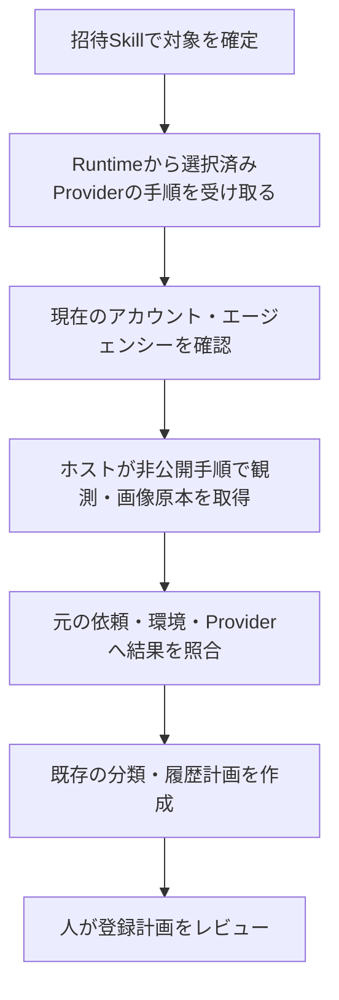

# 招待Skill：選択した取得元から計画へ渡す接続

状態：ソース採用のレビュー案。対象は [#6](https://github.com/flair-agency/live-agency/issues/6) と [#14](https://github.com/flair-agency/live-agency/issues/14) の接続部分です。本番受け入れは未完了です。

# 今回できるようになること

招待Skillが保存済み環境のRuntimeから取得手順を受け取り、実施後の結果を同じ依頼・環境・Providerへ照合して、既存の分類・履歴計画へ渡します。従来は対象の読取と計画作成ができても、この間の手順受け渡しが未接続でした。

BackStage Providerの採用済みv2手順とRuntimeの既存の手順受け渡し機能を使います。ProviderやRuntimeの新しい実行方式は追加しません。取得手順に従ってブラウザーを操作するのはホストのAIまたは人です。

# 変更の所有者と維持する意味

| 所有者 | 今回の変更・責務 |
| --- | --- |
| Invitation Skill | `source` と `source-plan` の入口、対象・依頼・選択版の照合、取得元の記録を追加。分類・履歴計画は既存処理を再利用 |
| BackStage Provider | 変更なし。観測したステータスと招待区分を分けて返し、画像取得と正規化の手順を所有 |
| Runtime | 変更なし。保存済みの選択から手順を返し、依頼と結果の対応を確認 |
| 親プロジェクト | 既存の接続検証ツールを拡張し、実ソースを組み合わせた検証結果と残る作業を記録 |

取得区分から社内の子分類を決めるのはSkillです。公開Skillへ具体的な画面、サービスの表記、Baseの列名、認証情報を移しません。旧来の正規化ファイルを受け取る `plan` は残し、取得元の相関を確認済みとは扱いません。

# 実際の確認と限界

実Runtime、採用済みBackStage Provider、汎用Lark読取と候補Skillを隔離したローカル構成で接続しました。サービス応答は合成データです。

- 選択したProviderの6つの手順・知識ファイルがそのまま届くこと。
- Providerの実正規化関数から招待区分と合成画像の原本を渡し、同じ入力の既存計画と一致すること。
- 画像のバイト列を変えると、履歴を取得する前に拒否すること。
- 対象IDに限定した履歴検索と、設定変更時の取得前停止が維持されること。

取得元の依頼・結果の照合は、実画面でその観測が行われたことやアバターの本人性を証明しません。今回の画像は合成ファイルで、ブラウザーからの取得を検証したものではありません。外部サービスへの操作は0件、`businessWorkflowVerified: false`です。

再実行入口は [既存の接続検証ツール](../../tools/verify-invitation-environment-connection.mjs) です。従来の5つの絶対パス引数に加え、`--observation-provider-source` と `--source-fixture` を対で指定すると、今回の接続も検証します。後者は非公開Providerの既存契約に沿った合成入力と分類対応だけを置く私有JSONで、`synthetic: true`、`normalization`、`statuses` を持ちます。実データを使いません。結果にはソース内容・検証ツール・私有fixtureのハッシュを残し、手順本文や観測値は出力しません。

Skillの直接検証19件、接続検証8項目が成功しました。親の独立caller/API-operation検証2件も既存ルートのソースで成功しています（候補Skillの証明は前述の別検証です）。リンク・配布対象・構文・差分を確認しました。Skillのfrontmatterは未変更です。汎用Skill検証ツールは既存環境のyamlモジュール不足で実行できず、依存追加はしていません。図の手順整合は確認し、Mermaidの実レンダリングは未確認です。

検証したSkillは `85bace8`、BackStageは採用済み `2e69d94`、Lark読取は採用済みPR #20の `b5e2729`、Runtimeは `2.0.0-m3.0` です。最終接続の合成通信は34回、履歴検索は3回（最初の既存経路1回、同一入力比較の2経路各1回）、外部通信は0回です。検証ツールSHA-256：`a08c90dbfb9549940e8cf71b219b32b47c8546bb7ad64e0d3bd934edc9df1d6f`。私有合成fixture SHA-256：`8155051772a7779bcc578d717c2d577f2219fc0816d222a9cb1ce7fb9acdd49e`。元のパッケージ版が同じでも採用ソース差分があるため、固定版配布の検証とは扱いません。

# AI方針レビュー

[文書・知識方針](../governance/document-knowledge-policy.md)、[言語方針](../governance/document-language-policy.md)、[開発方針](../governance/development-policy.md)、完全な [Private Source Integration Guide](../governance/private-source-integration-guide.md) と既存のRuntime契約を照合しました。

初回手順応答の検証でProviderの失敗理由を汎用エラーへ落とす箇所を発見し、元の安全な原因コードを保持するよう修正し、直接検証も成功しました。図にはホストによる実取得を独立した工程として記載しています。Skillの詳細手順は既存の `references/environment-workflow.md` を更新し、重複したマニュアルは追加しません。

# 残る作業と復旧

今回の採用判断は接続ソースです。現在のアカウント・エージェンシーを選んだ取得とアバターの照合は #6、書込と登録後照合は #14、固定版配布と指定Work環境での受け入れは #31/#32、人による引継ぎ確認は #39 に残ります。

既存のプロフィール本番構成、component pin、旧入口を維持しています。復旧は今回のSkillと親の差分をrevertします。この変更は外部データや本番の登録を変更しません。
