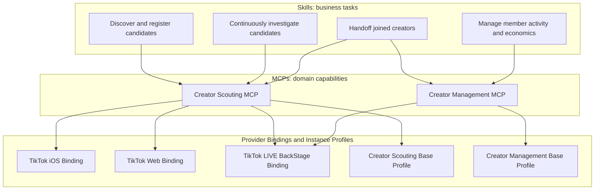

# LIVE Agency MCP Architecture Roadmap

> Status: Review proposal; unapproved portions remain unadopted. Relocation does not approve the design. Current work: [migration status](../migration/status.md).

- Status: Working draft for cross-thread design continuity
- Created: 2026-09-01
- Updated: 2026-09-02
- Scope: Skills, MCP servers, and provider runtime components that support LIVE agency operations

## 1. Purpose

This document records the architecture and migration roadmap for AI-assisted LIVE creator scouting and post-membership management. It is intended to let another chat or contributor continue the design discussion without reconstructing the earlier conversation.

The business concepts and invariants that this roadmap implements are recorded separately in [`live-agency-domain-knowledge.md`](../domain/model.md). That document should be reviewed before changing a domain boundary or assigning a Skill to an MCP.

This is an architectural working draft, not an authoritative interpretation of contracts, external-service publication rights, or Lark Base data. It intentionally excludes production records, screenshots, credentials, Base IDs, table IDs, and field IDs.

## 2. Executive summary

The architecture uses the following layers:

1. A **Skill** corresponds to a concrete LIVE agency business task.
2. An **MCP server** exposes capabilities from a bounded LIVE agency domain context.
3. A **Provider Family** owns knowledge and implementation shared by one external service family, such as TikTok or Lark Base.
4. A **Provider Binding** corresponds to an independent execution surface, such as TikTok iOS, TikTok Web, or TikTok LIVE BackStage.
5. An **Instance Profile** corresponds to a concrete external instance, such as a specific Lark Base.
6. A **Driver** provides a generic execution mechanism, such as iPhone Mirroring, browser control, or an API client.

The leading MCP domain boundaries are:

- **Creator Scouting MCP**: from creator discovery until agency membership or termination of the scouting case
- **Creator Management MCP**: from confirmed membership until departure or the end of management

The two Lark Bases have already been renamed manually to:

- `Creator Scouting`
- `Creator Management`

## 3. Goals and current non-goals

### 3.1 Goals

- Acquire the information needed for the initial scouting scope from TikTok. A
  broader LIVE-platform information-source architecture remains a future
  direction, not an initial data-model requirement.
- Isolate TikTok-specific acquisition behavior inside private providers while keeping Skill and MCP contracts independent from source-specific UI structure.
- Separate pre-membership scouting from post-membership management responsibility.
- Preserve the safety rules already implemented by existing Skills, including dry runs, explicit approval, constrained writes, and readback verification.
- Maintain versioned provider knowledge that fails closed when an external UI or schema changes.

### 3.2 Current non-goals

- Unattended or unapproved message sending, following, gifting, inviting, or other relationship-changing scouting approaches
- General-purpose or follow-up messaging beyond the reviewed initial scout-DM workflow
- Removing the human approval step before a candidate is registered
- Mixing TikTok LIVE BackStage DM or invitation actions into a read-only acquisition surface
- Storing production data, creator screenshots, credentials, or internal Lark identifiers in Git
- Managing off-TikTok discovery, candidate registration, observations, or cross-
  platform person matching in the initial v2 scope

## 4. Terminology and responsibilities

| Layer | Corresponds to | Primary responsibilities | Must not own |
| --- | --- | --- | --- |
| Skill | Business task | Target selection, sequence, deadlines, approval, cross-MCP orchestration, result reporting | Provider names, URLs, screen structure, credentials |
| MCP | Bounded domain capability | Stable tools, domain validation, invariants, provider resolution, audit context | Public exposure of source-specific UI procedures |
| Provider Family | External service family | Shared model, shared safety rules, shared authentication and transport policy | Knowledge from unrelated services |
| Provider Binding | Execution surface | Surface recognition, acquisition, transformation, drift detection, stopping conditions | Guessing from another binding's UI structure |
| Instance Profile | Concrete external instance | Instance schema mapping, allowed operations, fingerprints, versioning | Secrets or production data in Git |
| Driver | Generic execution mechanism | Screenshots, taps, browser actions, HTTP and API transport | LIVE agency business decisions |

The component that should be one-to-one with a concrete external reality is normally a Provider Binding or Instance Profile, not necessarily the entire provider package or repository.

## 5. Domain MCP boundaries

### 5.1 Creator Scouting MCP

#### Managed subject

Prospective creators whose agency membership has not yet been confirmed, together with the scouting cases associated with them.

#### Lifecycle

Starts with discovery or prospecting and ends with confirmed membership or termination of the scouting case.

#### Expected domain capabilities

- Discover creators who are currently LIVE.
- Prospect for creators who are likely to become LIVE creators.
- Observe public creator profiles.
- Observe LIVE history, frequency, reactions, fan-club data, and related signals.
- Observe invitation eligibility through TikTok LIVE BackStage.
- Resolve TTBA initial-DM candidates from the exact Creator-table grid view
  `DM候補（TTBA）`. Its prior-outreach dependency must treat both a pre-scout
  `メッセージ` and a `スカウト` as prior DM activity; do not treat the
  assigned-scout `DM可` field as scoutability.
- Check for an existing candidate before registration.
- Register a candidate after human approval.
- Manage the relationship between a candidate and an assigned scout.
- Record scouting approaches performed by humans as activity history.
- Prepare and execute one personalized initial scout DM for an invitation-eligible candidate through a separately authorized action MCP.
- Attempt one best-effort follow from the exact sender before that DM without making follow success a delivery prerequisite.
- Identify candidates due for renewed observation or a next action.

#### Source boundary

- Public profile and LIVE activity information comes from the TikTok app or TikTok Web.
- Whether a candidate is unaffiliated and invitation-eligible does not come from the public LIVE platform. It comes from TikTok LIVE BackStage.
- Read-only acquisition and relationship-changing scouting actions use separately launched MCP authority surfaces. The default acquisition MCP never exposes follow or message-send controls.

#### Data system

Uses the Lark Base named `Creator Scouting`. A reviewed export snapshot showed
that its account-centered creator records also carry profile observations, LIVE
metrics, LIVE history, invitation-state history, scout assignments, scouting
activity history, and next-action management. The rows are account-centered
operational aggregates, not immutable person, candidacy, or platform-account
master entities. Within the current Base, the Lark record ID preserves
relations when the displayed username changes. The verified optional
`クリエイター.親レコード` self-relation represents only a reviewed current
sub-account-to-main-account link.

#### Initial scout-DM invariant

The automated business task is one personalized first outreach to a candidate
whose current invitation status is eligible and whose completed scouting
history shows no prior initial outreach. The sequence is sender verification,
exact creator identification, eligibility and prior-contact checks, one
best-effort follow attempt, one confirmed free-form message send, delivery
verification, and Lark activity recording.

An explicit `未送信` / `Not sent` marker is `send_failed`. It is not `sent`,
`outcome_unknown`, or `dm_unavailable`, and its retry control is never activated
automatically. Only a validated delivered outgoing message permits a completed
`スカウト` activity record. Only an explicit recipient-level messaging
restriction permits the creator's `DM不可` field to be set.

### 5.2 Creator Management MCP

#### Managed subject

Creators whose agency membership has been confirmed, together with their activity, management work, costs, rewards, and management lifecycle.

#### Lifecycle

Starts with confirmed membership and ends with departure or the end of management.

#### Expected domain capabilities

- Confirm and read membership state.
- Acquire member activity metrics from BackStage.
- Manage internal creator-management activity.
- Manage management costs.
- Combine `コスト（ギフト）` with the manually entered USD
  `コスト（その他）` through `コスト計` for monthly management analysis.
- Manage incentives and rewards.
- Provide the data needed to evaluate the relationship between activity, cost, and reward.
- Record departure or management termination.

#### Data system

Uses the Lark Base named `Creator Management`. A reviewed export snapshot showed tables for creators, management history, monthly activity, incentives, fee policies, gifts, tasks, and incentive rules. BackStage remains authoritative for platform membership and source activity facts; the Base owns the agency's internal management model and derived analysis.

The current gift-derived cost is an estimated coin-consumption value rather than an accounting expense. Management ROI accepts a monthly manual USD `コスト（その他）` amount for Promote, equipment gifts, partial reimbursements, and other agency-funded support.

## 6. Membership handoff across bounded contexts

When a candidate becomes an agency member, management responsibility moves from Creator Scouting to Creator Management.

This transition should not be hidden inside either MCP. A dedicated Skill should orchestrate both contexts as one reviewed business task.

Expected sequence:

1. Read the candidate and scouting case from Creator Scouting MCP.
2. Confirm membership through TikTok LIVE BackStage.
3. Obtain human approval for the handoff.
4. Register the member through Creator Management MCP.
5. Close the scouting case as joined through Creator Scouting MCP.
6. Read back both sides and verify the exact source and destination account
   records and the BackStage-confirmed transition without treating username,
   BackStage ID, parent relation, or either Lark record ID as a shared identity.

The scouting history remains in Creator Scouting after membership. Ongoing membership and management state belong to Creator Management. The same operational state must not be maintained independently in both contexts.

## 7. Provider Family, Binding, and Instance Profile design

### 7.1 TikTok Provider Family

#### Shared knowledge and implementation

- TikTok username normalization
- Shared concepts such as platform user ID, current username, nickname, and account
  observation references
- Shared types for profile observations, LIVE sessions, and LIVE metrics
- Shared observation timestamp, unavailable-value, evidence, and error envelopes
- Shared safety rules that separate observation from relationship-changing actions

#### Independent Bindings

- TikTok iOS
- TikTok Web
- TikTok LIVE BackStage

Each Binding independently owns its authentication state, interaction tools, screen or schema structure, capabilities, drift cadence, interface fingerprints, stopping conditions, and knowledge version.

A shared logical Provider Family does not require one monolithic repository. Independent surface repositories may remain in place while consuming a shared private core library.

### 7.2 Lark shared core and Base Provider

#### Shared service-neutral implementation

- Lark authentication and API transport
- Organization-bound API-app Principal verification
- Organization-local browser-user Principal preflight
- Explicit route-equivalence checks

The shared core is a private library, not a Provider Binding. It owns no Base,
Chat, or Docs surface knowledge.

#### Base Provider implementation

- Pagination, batching, and attachment handling
- Field-type and relation-target validation
- Base-only row, sync, native-export, table, field, view, and relation knowledge
- Tenant/API and Base-capability execution-policy derivation
- Dry-run generation and content-bound write intents
- Prevention of blind retries after uncertain writes
- Post-write readback verification

#### Independent Instance Profiles

- Creator Scouting Base Profile
- Creator Management Base Profile

Each `service=lark-base` profile identifies its Base, tables, fields, views, and
relations by immutable IDs rather than display names. It independently owns an
instance-specific schema fingerprint, allowed operations, knowledge version,
one tenant-capability reference, one Base-capability reference, and explicit
Principal routes. Tenant profiles record API and integration-flow budgets;
Base profiles separately record rows-per-table capacity, Base-to-Base sync, and
native full-export routes. Product names and inferred evidence never select
execution behavior. The current Flair capability evidence selects browser
`.base` export because its reviewed API surface does not produce that native
artifact; this backup-specific selection is independent of API-first record
operations.

Chat and Docs use different Instance Profile resource schemas and independent
Provider Bindings. Their allowlists, visibility scopes, and surface knowledge
do not move into the Base Provider or shared core.

Renaming a Base must not affect provider resolution or write targeting. No runtime dependency on the previous Base display names has been identified in the current codebase.

### 7.3 Google Drive backup-storage Provider

The Google Drive Provider owns the concrete shared-storage boundary for Base
backup artifacts and content-bound receipts. A private Instance Profile resolves
the reviewed shared drive and separate artifact and receipt folders for each
Base by stable identifiers. The checked-in Binding contains no production IDs,
credentials, or artifacts.

Interactive runs have demonstrated upload, complete stored-byte readback,
receipt publication, shared coverage recheck, retention planning, and isolated
Base recovery for the reviewed structure and record-data scope. The Binding
remains interactive until the same backup path succeeds in a scheduled run
without user interaction. Native `.base` import does not restore attachment
blobs, so a separate attachment-capable backup and restore route remains open.
The storage Binding never owns retention deletion or Base restoration.

### 7.4 Drivers

- An iPhone Mirroring MCP is a generic execution driver used by the TikTok iOS Binding.
- Browser control is an execution driver used by the TikTok Web and BackStage Bindings.
- A Lark API client is shared infrastructure used by the Lark Base Provider Family.
- Drivers do not own domain concepts such as candidate registration, invitation eligibility, or scouting decisions.

## 8. Skill layer

A Skill corresponds to one business task and may orchestrate more than one MCP.

### 8.1 Existing Creator Scouting candidates

- `creator-profile-sync`
- `creator-live-history-sync`
- `creator-invitation-status-sync`
- `creator-insight-sync`
- `creator-profile-compaction`
- `creator-live-history-compaction`
- `creator-live-metrics-compaction`
- `creator-invitation-status-compaction`

These are candidates for migration to stable Creator Scouting MCP tools.

### 8.2 Cross-domain Lark data protection

- `lark-base-backup`
- `lark-base-backup-retention`
- `lark-base-disaster-recovery-drill`
- `lark-base-maintenance`

These are cross-domain infrastructure workflows. Creator Scouting and Creator
Management supply separate Instance Profiles, but the Skills do not belong to
either creator business domain.

### 8.3 Existing Creator Management candidates

- `creator-activity-sync`

Other Skills involving member activity, support cost, and reward should use the Creator Management domain model documented in `live-agency-domain-knowledge.md`.

### 8.4 Cross-domain and accounting Skills

- `gift-history-sync` is cross-domain. It maintains agency-funded gift events and derived purpose projections: `Scouting` for Creator Scouting, `Development` for Creator Management, and `Relationship` for agency-operations analysis.
- Gift-purpose attribution describes coin consumption and estimated value. It does not allocate a specific coin-purchase expense.
- `coin-expense-reconcile` and related coin-expense Skills belong to a separate Expense and Accounting domain. They handle actual coin-purchase expenditure and must not be forced into the creator-domain MCPs.
- Low-volume Promote payments remain manual for now, while their support value must still be included in Creator Management ROI.

### 8.5 Likely new Skills

- Discover and register scouting candidates
- Continuously investigate scouting candidates
- Record scouting activity history
- Handoff joined creators to management
- Refresh monthly member-management data
- Refresh activity, cost, and reward evaluation

## 9. Differences from the current implementation

### 9.1 Existing MCP

The current `live-agency-operations` MCP provides read-only capabilities for:

- Creator Activity acquisition, observation, and validation
- Creator Invitation Status observation and validation

It currently groups capabilities obtained from BackStage into one MCP. Under the
v2 domain boundaries, invitation eligibility belongs to Creator Scouting while
member activity belongs to Creator Management.

During migration, retain it as an internal technical acquisition compatibility
surface. It is mounted as an independently pinned submodule and remains
read-only. The initial Creator Scouting and Creator Management read processes
now run independently while sharing its source-neutral acquisition runtime;
their current tools cover invitation eligibility and member activity, with the
remaining domain tools assigned to later migration milestones.

### 9.2 Existing providers

Lark Base, BackStage, TikTok iOS, TikTok Web, Google Drive backup storage, and
Money Forward Cloud Expense currently exist as separate provider repositories.

The target design preserves independent Bindings and independent knowledge versions while deciding how to share TikTok-wide knowledge and Lark-wide implementation.

### 9.3 Existing Provider API

Provider API schema version 2 already supports multiple Bindings in one provider package. The proposed Provider Family, Binding, and Instance Profile model should clarify or extend that existing mechanism rather than replace it without cause.

## 10. Mandatory design principles

The migration must preserve the following principles:

1. Public Skills and MCP contracts do not include source-specific URLs, screen names, DOM structure, export-column names, or parsing rules.
2. Provider-specific knowledge remains private and versioned.
3. Production data, real account identifiers, screenshots, and credentials never enter Git.
4. Provider or Instance Profile resolution stops when there are zero or multiple matches.
5. Ambiguous UI structure, schema, account, month, or coverage causes a fail-closed result.
6. Read access, Lark writes, and relationship-changing BackStage actions use separate authority boundaries and independently launched MCP servers where required.
7. Writes require a dry run, content hash, reviewed counts, explicit approval, and readback verification.
8. An uncertain create or update is not blindly retried.
9. External records and fields are identified by immutable IDs rather than display names.
10. Tests use synthetic data only.

## 11. Roadmap

No calendar dates are assigned yet. Each phase is defined by its exit criteria.

### Phase 0: Inventory domain capabilities and authority

#### Work

- Inventory existing Skills, MCP tools, and Provider capabilities.
- Record each task's inputs, outputs, source, destination, side effects, approval requirements, and unattended eligibility.
- Define the shared vocabulary for concepts such as Creator, Candidate, Assigned Creator, and Member.
- Record the accepted account-centered model: no separate Actor/person,
  Platform Account, Scout Candidacy, Agency Membership, or Username History
  master, no stable cross-context ID, and an optional Scouting-local parent
  relation for reviewed main/sub links.
- Build an authority matrix for reads, Lark writes, and BackStage actions.

#### Exit criteria

- Every existing Skill and MCP tool is assigned to a domain or explicitly marked out of scope.
- Terms that have different meanings in the two contexts are documented.

### Phase 1: Design Provider commonality

#### Work

- Define the manifest representation for Provider Family, Binding, and Instance Profile.
- Decide where TikTok-wide models and safety rules live.
- Preserve independent knowledge versions for TikTok iOS, Web, and BackStage.
- Define the boundary between the shared Lark client and Base-specific Instance Profiles.
- Prevent Creator Scouting and Creator Management from writing to each other's Base.

#### Exit criteria

- Shared knowledge is not duplicated unnecessarily.
- Each execution surface can still stop and evolve independently.
- Base display-name changes cannot affect provider resolution or write targeting.

### Phase 2: Prove the TikTok iOS acquisition path

#### Work

- Evaluate iPhone Mirroring MCP candidates as Drivers for the TikTok iOS Binding.
- Verify screenshot, OCR, tap, swipe, text entry, and screen-identity checks.
- Test small scenarios for profile observation, LIVE-history observation, and candidate discovery.
- Verify fail-closed behavior, local OCR, owner-only evidence storage, and restricted permissions.
- Prevent automatic screen learning or coordinate recompilation from continuing through an unreviewed interface change.

#### Exit criteria

- The path can be tested with synthetic fixtures without placing production evidence in Git.
- Unknown screens, authentication requests, CAPTCHA, account mismatch, and structural drift stop the run.

### Phase 3: Build the Creator Scouting MCP MVP

Status: In progress. The separate read-only Creator Scouting process now
exposes paired observe/validate tools for public profiles, LIVE history, and
invitation eligibility through exact Binding Profile routes. It also exposes
Lark-backed continued-observation selection and account-evidence review tools.
The synthetic read runtime resolves immutable field IDs, verifies Creator,
profile-history, and invitation-state relations and counts, and never exposes a
mutation. Reviewed write-intent contracts cover append-only activity history
and exact next-action deadline updates for existing records, including
approval, replay, and readback gates. Those contracts are now connected to a
separately launched three-tool write process that passes synthetic preflight,
mutation, replay, uncertain-result, and readback tests. Production read-profile
activation and verification pass through the owner-only `lark-profiles/v2`
bundle. The write process remains inactive pending a distinct credential
reference and explicit profile activation approval; persistence and continuous
investigation remain.

#### Work

- Define normalized contracts for discovery, profile observation, LIVE observation, and invitation eligibility.
- Design domain tools for reading and writing the Creator Scouting Base.
- Preserve the activated continued-observation selection and account duplicate
  and username-change evidence-read runtime. Its authority-specific read
  credential, exact immutable bindings, Principal fingerprint check, and bounded
  live routing/count gates must pass before any later profile revision. Keep new
  candidate registration, username or alias persistence, person matching, and
  automatic parent mutation outside the MVP unless separately designed and
  approved.
- Preserve the implemented comparison of timestamped platform User ID,
  nickname, avatar, and username evidence. Ambiguous or conflicting evidence
  must not update a record or create an alias; nickname equality alone is not a
  candidate.
- Place the existing Invitation Status capability in the Creator Scouting context.
- Separate read-only tools from write-authorized tools.
- Keep the connected activity-history and next-action write process inactive
  until its distinct credential and current-format Instance Profile receive
  explicit activation approval. It must use one API route with no fallback and
  first pass a bounded zero-mutation dry-run from fresh authoritative evidence.
- Keep the existing acquisition MCP read-only and expose BackStage relationship changes through a separately launched Creator Scouting action MCP.

#### Exit criteria

- Existing account-centered candidates can move from observation to reviewed
  history updates without exposing provider names or UI procedures to the Skill.
- Append-only history, dry-run, readback, and safe replay rules remain intact.

### Phase 4: Migrate Creator Scouting Skills

#### Work

- Gradually migrate the profile, LIVE history, invitation status, insight, and compaction Skills.
- Add candidate-discovery, continuous-investigation, and activity-history Skills
  that do not require person-master creation or account merging.
- Move Skills from direct provider resolution to Creator Scouting MCP domain tools.

#### Exit criteria

- Each major Creator Scouting task maps cleanly to one Skill.
- Adding or changing a provider does not normally require a Skill procedure change.

### Phase 5: Analyze Creator Management and build its MCP MVP

#### Work

- Analyze the tables, relations, formulas, views, and automations in the `Creator Management` Base.
- Distinguish authoritative and derived values for membership, activity, management cost, incentive, and reward.
- Separate BackStage Activity responsibility from Creator Management Base responsibility.
- Migrate `creator-activity-sync` to Creator Management MCP.
- Define additional management and evaluation Skills.

#### Exit criteria

- The source and authority for member activity, cost, and reward are explicit.
- Creator Management MCP can operate without depending on the Creator Scouting Base.

### Phase 6: Build the membership-handoff Skill

#### Work

- Define a reviewed account-level transition manifest shared by both MCPs. It
  binds the exact source Scouting record, destination Management record, and
  BackStage confirmation without introducing a shared person or membership
  master.
- Combine BackStage membership confirmation, human approval, Management registration, and Scouting-case closure into one business task.
- Define reconciliation rules for partial success, uncertain communication results, and replay.

#### Exit criteria

- The transition preserves exact approved account-level source and destination
  references and prevents conflicting active ownership.
- A failed attempt can be reconciled without losing history or blindly repeating writes.

### Phase 7: Strengthen operations, automation, and audit

#### Work

- Separate unattended-safe reads from interactive operations.
- Define refresh deadlines, target limits, failure notifications, and resume conditions.
- Record Provider Family, Binding, Instance Profile, and knowledge version in audit output.
- Formalize drift evidence, review, update, deployment, and resume procedures.
- Add a content-verified attachment backup and isolated restore path for Base
  attachments that require a recovery guarantee.
- Keep BackStage DM and relationship-change authority isolated from read-only MCP tools, including separate launch configuration and audit identity.
- Preserve explicit `send_failed` separately from recipient restrictions and uncertain outcomes; never activate visible retry controls automatically.

#### Exit criteria

- Scheduled work never performs an interaction-required operation silently.
- Source and destination versions remain auditable.
- Failures do not cause guessing, unbounded retries, or duplicate writes.

## 12. Decisions and remaining open questions

### 12.1 Decided for migration

1. Keep independent TikTok surface repositories; a shared private core may be
   added without making repository consolidation a v2 requirement.
2. Run Creator Scouting MCP and Creator Management MCP as separate processes.
3. Retain `live-agency-operations` as the transitional internal acquisition MCP.
4. Do not add or backfill a Flair-owned creator identity during the migration.
   The accepted model introduces no separate person, candidacy, platform-
   account, username-history, or membership master. Existing cross-Base matches
   remain evidence only, while Creator Scouting may use its reviewed local
   `親レコード` relation.
5. Resolve Creator Networks, Creator Scouting Base, and Creator Management Base
   through explicit, non-fallback Lark Instance Profiles.
6. Keep ongoing profile, LIVE, account, membership, and activity observations
   after membership; move their operational ownership and destination purpose to
   Creator Management.
7. Resolve a domain acquisition request through a private Binding Profile that
   maps one capability and input kind to one exact provider package and Binding
   ID. Missing, duplicate, mismatched, or uninstalled routes fail closed; Skills
   do not select provider names.

The executable decision record, migration gates, and rollback rules are in
`../docs/v2-migration-plan.md`. The current inventory is in
`docs/v2-capability-inventory.md`.

### 12.2 Remaining open questions

1. The authoritative TikTok multi-account invitation rule and whether any
   automatic parent-relation set/change/remove operation should later be added.
2. The meaning and lifecycle of the confidential TikTok LIVE BackStage `ID`,
   including issue timing and behavior after departure and rejoining.
3. The remaining detailed source-of-truth rules, derived values, and update
   authority of the Creator Management Base.
4. The valuation policy and effective rate used for estimated coin consumption.
5. The threshold at which monthly manual non-gift support amounts require
   itemized support-event records.
6. The final iPhone Mirroring MCP choice and its security and stability
   assessment.

## 13. Short handoff summary for another chat

> Migrate the LIVE agency AI foundation incrementally from version 1 to version 2 without stopping current operations. Skills remain business tasks. Creator Scouting MCP and Creator Management MCP are separate Skill-facing processes. Provider Families own shared external-service knowledge, Bindings own surfaces such as iOS, Web, or BackStage, Instance Profiles own concrete Lark tenants and Bases, and Drivers provide generic execution. The current `live-agency-operations` MCP remains a read-only internal acquisition MCP during migration. Public profile and LIVE information comes from TikTok iOS or Web, while invitation eligibility and initial scout-DM actions come from BackStage under separate read and action authorities. TikTok username remains the operational and external integration key, Lark record ID remains the technical identity inside one Base, and no new cross-context creator ID or person master is introduced. Creator Scouting uses only its reviewed local `親レコード` relation for current main/sub links. Version 1 schedules remain active until each Skill passes a reviewed v1/v2 dual run and two successful scheduled v2 cycles.

## 14. References

- `../docs/live-agency-domain-knowledge.md`
- `../docs/v2-migration-plan.md`
- `docs/v2-capability-inventory.md`
- `skills/live-agency-skills/docs/provider-architecture.md`
- `mcp/live-agency-operations/README.md`
- Provider Runtime root `README.md`
- The ChatGPT project source titled `Private-source integration Skill design guide`
