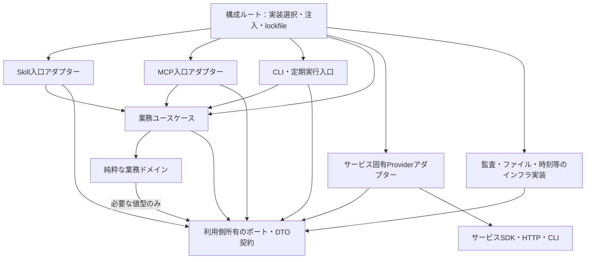
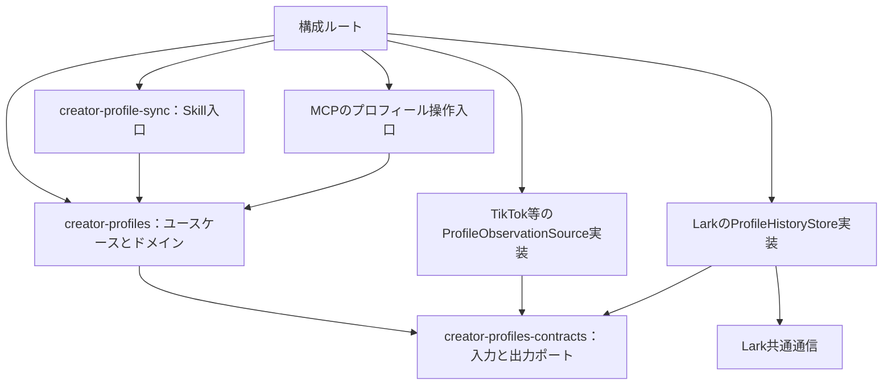
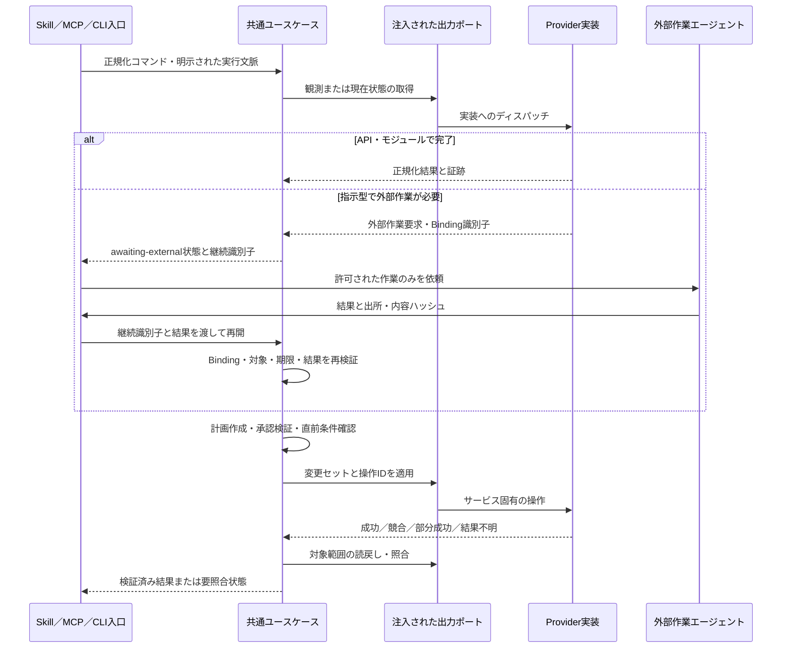
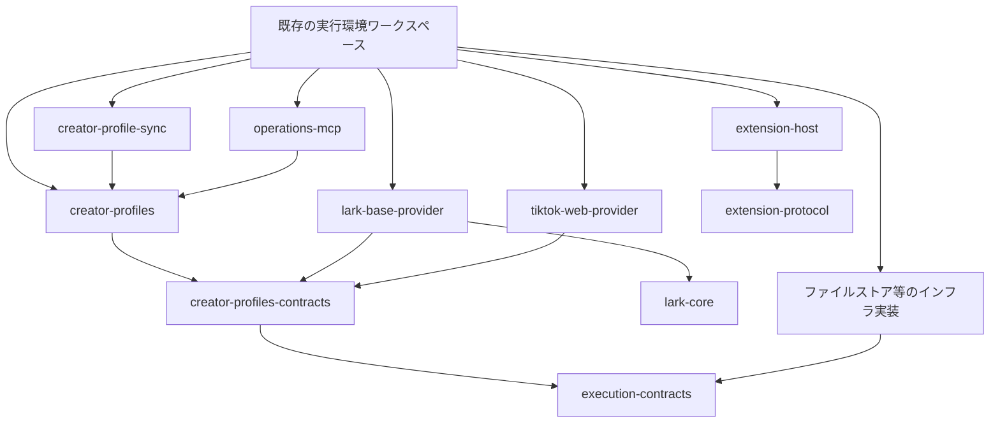
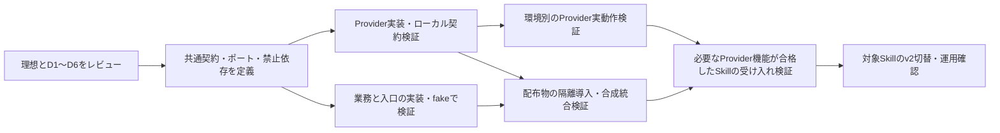

# 理想アーキテクチャ・現状ギャップ・意思決定案

> Status: Review proposal; unapproved portions remain unadopted. Relocation does not approve the design. Current work: [migration status](../migration/status.md).

2026年9月7日／レビュー版。従来のSDK一括統合案、4分野契約への機械的分割案、Lark直接依存を理想に残す案を置き換えます。**目標構造と移行途中の状態を分け、既存実装を残す都合で目標を弱めません。** 本文は設計提案であり、採用・実装・移行は未実施です。

構成は、①理想と根拠、②実装とのギャップ、③意思決定、④移行順と完了基準です。パッケージ名は責務を識別する候補です。リポジトリの新設・履歴移行は前提にしません。

## 1. 設計の根拠と評価基準

主な根拠は、Robert C. MartinのDependency Ruleとコンポーネント設計原則、Alistair CockburnのPorts and Adaptersです。特定の書籍第2版を通読・照合したという主張ではなく、著者の一次資料とローカル実装を基にします。

- [The Clean Architecture — Robert C. Martin](https://blog.cleancoder.com/uncle-bob/2012/08/13/the-clean-architecture.html)：内側の方針を外側の技術詳細から独立させる。データ形式の依存も対象。
- [Principles of OOD — Robert C. Martin](https://butunclebob.com/ArticleS.UncleBob.PrinciplesOfOod)：SOLID、REP・CCP・CRP、ADP・SDP・SAP。今回は検索取得本文で確認し、直接ページ取得は502でした。
- [Hexagonal Architecture — Alistair Cockburn](https://alistair.cockburn.us/hexagonal-architecture)：外部技術との接続をポートとアダプターで分け、実サービスなしでアプリケーションを検証可能にする。

原則をそのままパッケージ名にするのではなく、このシステムでは次の条件に落とします。

| 原則・観点 | この設計で要求すること | 判定方法 |
| --- | --- | --- |
| SRP・CCP | 業務ルール、操作の進行、サービス形式変換、通信、入口プロトコルを別の変更理由として扱う | 変更シナリオごとの影響先を下表で確認 |
| DIP・ISP | 必要な操作のポートは利用側が所有する。巨大なProvider共通CRUDを要求しない | コアが外部SDK・技術形式をimportせず、狭いfakeでテストできる |
| LSP | API型と指示型は、共通の成功結果だけでなく失敗・非対応・非同期状態も契約で表す | 同じ能力を宣言する実装に同じ契約テストを適用 |
| REP・CRP | 利用者が選ぶ単位を配布し、不要なサービス実装を依存に引き込まない | MCPだけの利用にSkill資源やLark実装が推移依存しない |
| ADP・SDP・SAP | 依存は安定した利用側の抽象へ向ける。契約から実装へ戻らない | 型・再export・静的import・動的ロードを区別して循環を検出 |
| 単一の業務判断 | CLI・Skill・MCPが同じ判断を別実装しない | 共通ユースケースを入口だけ変えて同じ入力で検証 |
| 明示的権限 | インストール、選択、承認、実行を区別する | 不明・変更・期限切れのBindingでは副作用に到達しない |

「安定」は変更頻度だけでなく依存される関係も含みます。すべてをinterfaceにする、すべてを別npmにする、依存数だけを最小化する、という適用はしません。

### 変更シナリオによる境界の評価

| 変更 | 主な変更先 | 変更しないもの |
| --- | --- | --- |
| Lark APIやフィールド形式の変更 | Lark Provider内のアダプター・通信、必要な構成 | 業務ユースケース、Skill、MCPプロトコル処理 |
| プロフィールの採用・履歴作成ルールの変更 | プロフィール業務コンポーネント | Larkの汎用通信、MCPのトランスポート |
| MCPの入出力仕様変更 | MCP入口アダプター | 業務ルール、Provider実装 |
| CLIから定期実行へ入口を追加 | 新しい入口と構成 | 既存ユースケース |
| ProviderをAPIから指示型へ変更 | 能力の適合検査、実行アダプター、構成 | 業務ルール。ただし実行方式に必要な条件を満たさない場合は拒否 |
| ファイルの保存方式・保存先変更 | ArtifactStore等の実装と構成 | 業務判断と監査の意味 |
| 受渡し契約の破壊的変更 | 契約所有者と該当する利用・提供実装 | 無関係な業務コンポーネント |

## 2. 理想の論理構造

### 2.1 責務の配置

| 要素 | 所有する責務 | 所有しない責務 |
| --- | --- | --- |
| 業務ドメイン | 一意照合、状態遷移、重複判定、保持規則などの純粋な判断 | ファイル・ネットワーク・MCP・具体的Provider |
| アプリケーション／ユースケース | 読取→計画→承認検証→適用→読戻しの進行、部分成功・再開、ポート呼出し | LarkのテーブルID・API形式、秘密の取得、Provider探索 |
| 利用側契約 | 入力ポート、出力ポート、正規化DTO、エラー・結果・能力の意味 | 実装ロード、接続情報、ドメイン判断の本体 |
| Skill入口 | エージェント向けの手順・説明・例、ユースケースへの入力変換 | 独自の照合・承認ロジック、非公開取得手順、具体的サービス実装 |
| MCP入口 | ツール登録、プロトコルの検証・変換、ユースケース呼出し、結果の提示 | 業務計画、テーブル操作、具体的Provider生成 |
| Provider／出力アダプター | 利用側ポートの実装、サービス固有形式の変換、技術的な失敗の変換 | 業務上何を変更すべきかの判断 |
| 共通インフラ | ファイルストア、時刻、監査保存、通信などのポート実装 | 業務上の承認そのもの |
| 構成ルート | 必要な実装を選択し生成・注入する。実行主体と対象を固定する | 業務ルールの再実装 |

既存の「Skillが業務処理を担う」という意味は保ちます。ただし、その実行コードをSkill配布物だけに閉じ込めず、入口から独立した業務パッケージに置きます。SkillとMCPはその同じ実装を利用します。これは業務責務の削除ではなく、再利用できる所有場所の明確化です。

### 2.2 静的依存グラフ

**矢印はimport／npm依存です。** ポートを呼ぶ実行時の方向ではありません。構成ルート以外では具象実装への依存を内側に持ち込みません。

重要な禁止辺は、`業務→Provider具象`、`業務→Loader/FS/MCP SDK`、`契約→業務実装`、`Provider→業務実装`、`Skill/MCP入口→Lark具象`です。Providerは契約を実装しますが、利用側のユースケースをimportしません。構成ルートが具体的Providerをimportすることは必要な結線であり、違反ではありません。

業務ドメインとユースケースはモジュールを分けますが、同じ業務の変更理由で共同リリースする場合は一つのnpmパッケージに置きます。図の箱ごとにパッケージを増やしません。

### 2.3 プロフィール同期の具体例

ポートは例として以下を提案します。実装済みAPIという意味ではありません。

| ポート | 操作例 | 契約が隠すもの |
| --- | --- | --- |
| `ProfileObservationSource` | 対象に対する観測の取得、または外部作業要求の返却 | TikTokの画面・認証・取得形式 |
| `ProfileHistoryReader` | 対象スコープの正規化スナップショットと版情報の取得 | Larkのページング、テーブル・フィールドID |
| `ProfileHistoryWriter` | 検証済み変更セットの条件付き適用、結果照会 | バッチサイズ、APIペイロード、添付API |
| `ArtifactStore` | 内容ハッシュに結び付いた計画・証跡の保存と読取 | パス、権限ビット、圧縮、ストレージ製品 |
| `ApprovalVerifier` | 主体・対象・操作・計画ハッシュ・期限の検証結果 | 承認記録の取得・署名方式 |

読取ポートと書込ポートを分け、読取用途に書込機能を渡しません。上記ポートはプロフィールユースケースの要求から定義し、全サービス共通の汎用CRUDを中核に置きません。

例えばLarkの`batchCreate(appToken, tableId, rows)`はアダプターの内部処理です。業務側が扱うのは、対象の意味、観測、変更意図、期待版、操作ID、個別結果です。アダプターは、どの観測を採用するかやどの履歴を削除するかを決めません。

### 2.4 実行時の呼出しと状態

ポートは実行時の抽象で、常に別の中継オブジェクトを生成する必要はありません。関数注入で満たせます。

指示型は「同期APIと同じ関数に見せて待つ」という設計にしません。`awaiting-external`からの再開は永続化された要求、Binding、対象、入力ハッシュ、期限に結び付けます。命令文やエージェントの成功申告だけで書込完了としません。履行できない能力は明示的に`unsupported`とし、同じポートを名乗るだけで代替可能とは扱いません。

### 2.5 権限・永続化・整合性

- ユースケースは計画と承認の意味を検証し、境界の実装は実際の主体・対象・操作を検証します。二段階は重複した業務実装ではなく、判断と実行制約の分担です。
- 計画の状態は、作成・承認待ち・承認済み・実行中・検証済み・競合・部分成功・結果不明・期限切れを区別します。外部作業待ちも独立した状態です。
- 操作IDと変更前条件を保持します。結果不明の書込みは照会・読戻しを先に行い、無条件に再送しません。履行記録は再開可能な永続ストアに残します。
- DBトランザクションやCASを提供しないサービスで、アプリケーションだけによるexactly-onceや完全な同時更新防止を約束しません。Providerは原子性・条件付き書込・冪等性の能力を宣言し、ユースケースが要求を満たさない実装を拒否できるようにします。
- 外部書込前の計画・承認・操作IDの保存に失敗した場合は実行しません。外部成功後に記録保存が失敗した場合は「失敗だから再送」ではなく、未確定操作として照合します。秘密や実データをコード・一般ログへ出しません。
- npmの依存分離とDIは権限隔離ではありません。同一Nodeプロセスに読み込んだ任意コードを、安全なプラグインとして隔離できるとは主張しません。信頼境界が異なるProviderは、限定資格情報・許可された接続先を持つ別プロセス等で実行します。
- 実行時の`process.cwd()`、周囲の環境変数、Keychain、ブラウザー状態からの暗黙選択をコアに入れません。必要な外部状態は構成側で選択・検証し、ポートへ渡します。

## 3. 配布単位の設計

### 3.1 業務コンポーネントの候補

次は理想の依存規則を実現する具体的な配布案です。業務の境界自体はレビュー対象であり、既存ディレクトリ名から確定した事実とはしません。

| 業務コンポーネント候補 | 対応する既存Skill | 一緒に扱う理由 |
| --- | --- | --- |
| `creator-profiles` | profile-sync、profile-compaction | プロフィール観測とその履歴の整合性 |
| `creator-invitations` | invitation-status-sync、invitation-status-compaction | 招待状態遷移とその履歴 |
| `creator-activity` | activity-sync | 月次活動の単位・対象・照合 |
| `creator-live-history` | live-history-sync、live-history-compaction、live-metrics-compaction | LIVE観測・セッション・集約指標と保持 |
| `creator-insights` | insight-sync | 観測からの評価・タグ付与の判断 |
| `gift-history` | gift-history-sync | ギフトイベントの同一性と履歴統合 |
| `coin-expenses` | coin-expense-reconcile、coin-expense-weekly-application | 購入・経費照合・週次申請という業務の連続性 |
| `data-maintenance` | base-backup、backup-retention、disaster-recovery-drill、base-maintenance | 復元可能性・世代保持・保守の進行 |

既存MCPのscouting／management／intelligenceは入口の業務分類として保持できますが、その分類をそのまま全ドメイン境界とみなしません。例えばプロフィールの規則は、Skillから使う場合もscoutingのMCPから使う場合も一つの所有者に置きます。

コンテキスト間は正規化された明示的な契約で連携し、他コンテキストの内部モデルを参照しません。例えばinsightsはプロフィール内部のクラスをimportせず、評価用の観測スナップショットを受け取ります。保守の横断実行は、保守側が定義する参加者ポートへ、各ユースケースのファサードを構成側で接続します。相互の業務パッケージを循環importしません。

### 3.2 npmへの配置規則

| 単位 | 配布案 | 依存の規則 |
| --- | --- | --- |
| 業務本体 | 上表の各業務パッケージ内にdomain／applicationを配置 | 自分の契約と必要最小限の純粋ライブラリのみ |
| 利用側契約 | 各業務の`…-contracts`を別配布。入力／出力ポートは内部モジュールで区別 | 実装・I/Oへ依存しない。Providerへ業務実装を導入させない |
| 横断的実行契約 | `execution-contracts`候補。操作結果、継続、承認証跡・ArtifactStore等の共通部分だけ | 業務ごとの採否規則やサービス設定は含めない |
| Provider拡張方式 | `extension-protocol`候補と、そのロード実装`extension-host`候補 | protocolは副作用なし。hostは構成・外側でだけ使用 |
| Provider | 既存7個をサービス・実行方式ごとに維持 | 該当する利用側契約、サービスSDK、必要なインフラのみ |
| Skill | 既存16個のSkill IDで独立配布 | 対応する業務ユースケースと契約。非公開Providerへの依存なし |
| MCP | 既存のパッケージを入口実装として維持 | ユースケース・契約・MCP SDK。具象Providerを含めない |
| 構成ルート | 既存実行環境の非公開ワークスペース | 使用する具体的なSkill・MCP・業務実装・Provider・インフラを固定 |

契約と業務本体を別npmにする案は、Providerや別入口に業務実装を推移依存させないためです。domainとapplicationを必ず別npmにする必要はありません。同じ変更理由・同じ利用者なら内部モジュールとして共同リリースします。

各業務契約から`execution-contracts`への依存は、同じ意味と所有者を持つ共通の値・結果に限ります。重複した文字列型を見つけただけでshared kernelへ集約しません。`extension-protocol`は業務契約と区別し、能力IDからロードされる実装が要求契約を満たすかは構成時に検証します。

前案の`restricted-fs`は、もはやコアから参照する共通APIではありません。ファイル実装の内部またはインフラ専用の共有ライブラリへ置きます。公開パッケージにするかは、独立したインフラ利用者の必要性で決めます。ArtifactStoreが業務のポートであり、chmodやrenameが業務のポートになることはありません。

Lark共通通信は`lark-core`としてProvider側だけから利用します。既存`lark-base-client`の単なる改名で完了とはせず、Larkの汎用通信と利用側ポートを満たすアダプターを区別します。Provider内に両モジュールを置くことは可能です。

### 3.3 パッケージ依存の具体例

Providerがコードでmanifestを検証する場合はprotocolへの依存を追加し、メタデータだけなら不要です。この図はプロフィールの一経路だけを示し、例えば同じProviderがギフトの契約も実装する場合、その契約への依存を別に宣言します。図にないサービス依存を暗黙に隠す設計ではありません。

## 4. 現状とのギャップ

優先度は**修正の前提関係**です。実運用上の脆弱性や障害を測定した優先度ではありません。確認した事実、そこからの評価、まだ未確認の範囲を分けます。

| ID／順序 | 確認した現状 | 理想との差分と必要な変更 | 根拠 |
| --- | --- | --- | --- |
| G1／最初 | source-provider-apiの入口とruntime-contextが相互import | 契約・エラー・版定義を下位へ置き、ロード実装との循環を除去。モジュール循環とパッケージ循環は区別 | [E1]、[E2] |
| G2／最初 | index.jsがfs/path/importと業務検証を同時にexport。coinのcoreがこの入口から検証関数をimport | 純粋な契約を利用側の所有へ移す。コアから技術詳細を含むパッケージへの依存を切る | [E1]、[E3] |
| G3／最初 | MCPプロフィールハンドラーがLark write実装から出力スキーマをimport | 入出力契約をアプリケーション側へ所有移転し、入口を具象から分離。単なるクライアント注入だけでは不足 | [E4] |
| G4／次 | MCPのLark write runtimeが計画・承認関数を呼び、同じ処理内でbatchCreateや添付APIを実行 | 業務ユースケースの進行とLarkアダプターの操作変換を分離 | [E5] |
| G5／次 | Skillのprofile_lark_runtimeが業務plan/coreを呼びつつclient/config/field IDで適用 | 公開Skillの入口と共通ユースケースへ分離。Lark固有操作はProviderのポート実装へ。理想に直接依存を残さない | [E6] |
| G6／次 | MCP側とSkill側に別のプロフィール計画・適用経路がある | 同じユースケースなら一つへ統合。現在の意味的同値は未確認であり、重複実装と断定して一方を削除しない | [E5]、[E6]、[E7] |
| G7／次 | 共通fileライブラリをSkill入口や複数Providerが直接使用。アーカイブヘルパーも圧縮と証跡検証が同居 | コアに必要なArtifactStore／Receiptの意味を定義し、I/O・codecと分離。全ファイル関数の機械的統合はしない | [E8]、[E9] |
| G8／次 | 互換性検査が旧APIパッケージのpeer名に結び付く。既定cwdからの探索もある | プロトコル互換性とnpm実体共有を分離。構成ルートが探索範囲を明示 | [E1] |
| G9／次 | 5系統のProviderはinstruction経路を持ち、Backstageにはmodule経路もある。指示を例外で返す入口がある | 外部作業要求・継続・結果検証を明示的な状態として扱う。Promiseの完了と業務完了を同一視しない | [E10] |
| G10／配備境界 | 旧Lark入口には環境・Keychain経由の生成があり、v2専用入口も存在 | 旧入口の存在と現行の実到達を区別。理想では構成からの明示注入のみ。実到達は別途検証し、未確認の本番fallbackを断定しない | [E11] |
| G11／配布 | ルートpostinstallが別ディレクトリでnpm ci。全Provider等にprivate:true、Skill発行定義は一部 | workspace境界と公開payloadを整理。インストールと登録・起動を分離。private:trueとregistry visibilityを区別 | [E12] |
| G12／全体 | 既存テストは多数あるが、今回の理想境界に対する禁止依存・共通ユースケース性は実証していない | アーキテクチャ適合テスト、共有contract tests、入口間の同一ケース検証を加える。テスト数を設計適合の証明にしない | 今回の調査限界 |

### 維持する良い構造

- MCPハンドラーは既に注入されたruntimeを呼ぶ形を持っています。この入口を全面的に作り直す必要はなく、依存する契約とruntimeの所有先を正します。[E4]
- Lark操作runtimeにもclient・clock・sleepの注入があり、テスト可能性の足場があります。問題は注入対象が技術CRUDのままなことと責務の混在です。[E5]
- 既存の計画ハッシュ、承認検証、読戻し、結果照合関数は保持候補です。ユースケースの所有先を変える際、意味を維持します。[E7]
- Lark BaseとChatがlark-coreを共有する境界は、サービス固有インフラとして再利用できます。[E13]

### 未確認であり、設計違反と断定しない事項

全経路の意味的重複、全動的importの到達、実サービスのCAS・冪等性能力、実際のホスト隔離、すべての履歴の共同変更頻度は未検証です。代表経路の調査を「全実装の監査完了」とは扱いません。これらは該当する移行単位の受入条件で確認します。

## 5. 意思決定を求める事項

原則違反を残すかどうかではなく、原則を満たす複数の構成・導入方法の選択です。循環解消、業務から具象への依存除去、権限を暗黙に拡大しないことは推奨案の固定条件です。

| 判断 | 選択肢 | 推奨と根拠 | 代償／確認点 |
| --- | --- | --- | --- |
| D1 業務境界と配布粒度 | 表の8業務＋各契約／より大きな業務単位／Skillごとに業務を分割 | **8業務を出発点としてレビュー**。データのライフサイクルと業務判断の所有をまとめ、入口の都合で分けない | 正確な境界は業務知識による確認が必要。contractsを別配布する管理コストが増える。無関係なconsumerをまとめないことが条件 |
| D2 Skillと実行コードの関係 | Skill配布物だけにコードを置く／入口非依存の業務パッケージを設ける | **独立した業務パッケージ**。Skill・MCP・CLIが同じ実装を使う | パッケージ数と版管理は増えるが、業務ルールの二重実装を防ぐ |
| D3 指示型Providerの扱い | moduleだけを標準とする／外部作業待ちを第一級の経路として支持 | **両方を支持し、非同期状態を明示**。既存の取得手段を偽の同期APIにしない | 永続化・継続識別・期限・結果検証の実装が必要。完全自動実行できない能力は明示される |
| D4 Providerの信頼境界 | 全実装を同一信頼プロセス／権限境界ごとの別プロセス | **書込資格情報・外部指示実行は分離した権限境界**。純粋なローカル変換は同一プロセス可 | IPC・資格情報供給・運用のコスト。既存ホスト隔離の実証は別途必要 |
| D5 移行方法 | 全面置換／同じ理想を目指す業務単位の段階移行 | **段階移行**。旧経路は隔離したlegacy領域へ置き、新側から参照させない | 一時的に二経路を保持。担当・廃止条件・適用先の固定が必要。「直接依存を新設計に残す」妥協はしない |
| D6 外部サービスの整合性保証 | 強い冪等性・CASを必須にする／不足する能力を明示し保留・照合を許容 | **操作の重要度ごとに要求を明示**。不足を成功と扱わず、満たさない自動書込は拒否 | 一部処理が人手照合・保留になる可能性。アプリケーションだけで存在しない原子性を作れない |

現時点の推奨は上表の太字です。最終的なnpm名はこれらの責務・所有の判断に従わせます。命名だけを先行して変更する作業は行いません。

## 6. 移行順と完了条件

これは共通→Provider→Skillという配布・受け入れの順序を維持しつつ、その前提となる利用側の要求・ポートを先に定義するものです。Provider実環境の準備待ちでも、契約に基づくSkillの実装・単体検証・合成統合は進めます。ただし、それを実Provider経由のSkill受け入れ完了とは扱いません。

### Provider検証とSkill受け入れを分離する

ユーザーの検証順序の指摘を反映した方針です。v2の既定ドメインMCP経路に沿って検証し、この検証計画だけで前節の追加アーキテクチャ提案を採用したことにはしません。

| 段階 | 確認対象 | 合格によって主張できること |
| --- | --- | --- |
| 1 ローカル契約検証 | Providerの変換、エラー、拒否条件、module／指示の受渡し。fake・合成データを使用 | 契約を満たす実装がある。実サービスで動くという主張はしない |
| 2 環境準備 | 検証用の主体・対象・権限と、API／ブラウザー／端末へのアクセス | その検証を実行できる。Provider合格とは別 |
| 3 Provider実動作検証 | 実サービスで必要な能力・操作が成功し、正規化結果と必要な読戻しが契約を満たす | 指定版・実行経路・主体・対象範囲で、その能力が検証済み |
| 4 Skill受け入れ検証 | 検証済みProviderとv2経路を組み合わせ、業務シナリオを入口から実行 | 入力、計画、承認、操作、結果がSkillの受入基準を満たす |
| 5 v2切替・運用確認 | 対象Skillだけを切替し、実際の運用経路で結果を確認 | 当該Skillの移行完了。別Skillの完了や全体完了には拡大しない |

Providerの実動作検証は以下の環境別に管理します。Larkという同じサービス名でもAPI／CLI経路とブラウザー経路は別の検証対象です。

| 環境 | 主な対象 | 準備と検証の焦点 |
| --- | --- | --- |
| Lark API／CLI | Lark Base・Lark Chat | 選択した主体と権限、検証用Base・Chat、対象スコープ、取得・更新・ページング・添付など該当操作。Baseの合格をChatへ流用しない |
| Webブラウザー | BackStage・TikTok・Lark | 対応する操作手段、ログイン主体、利用可能な画面、必要な対話。取得範囲・正規化・中断／再開を実経路で確認。API経路の合格で代替しない |
| iPhone | TikTok iOS | 対応する実機と操作手段、アカウント、アプリ状態、対象画面。手動工程を含めて再現できることと証跡の受渡しを確認 |
| その他の採用経路 | Money Forward・Google Drive等 | 実際に採用したAPI・ブラウザー・指示経路で確認。上の3環境だけで全Providerを検証済みとしない |

「Provider全体が完了」という一つのフラグではなく、**Provider版 × 能力・操作 × 実行経路 × 選択した主体・対象範囲**で結果を残します。例えば読取の合格は書込や添付の合格ではありません。Skillは必要な能力が揃えば進め、無関係なiPhone経路や別Provider全体の完了を待ちません。

環境待ち、契約検証済み、実動作検証済み、Skill受け入れ済みを分けて報告します。環境がない状態は実装失敗ではなく環境待ちです。失敗時も、Providerの取得・通信・正規化の問題と、Skillの業務判断・組合せの問題を切り分けます。

同じProvider版・契約・経路で合格した低レベルの検証は複数Skillで再利用します。Skill受け入れでは業務固有のシナリオと結合点を検証し、毎回Provider全試験を繰り返しません。Provider実装、契約、認証経路、重要な環境条件が変われば影響する検証だけを更新し、変更がないことを無制限に推定しません。

書込・削除等の試験は、許可された非本番の対象と合成レコードを使います。環境の確保と実行権限は別途具体化し、計画への追加だけで実サービスを操作しません。Skill受け入れに必要なProvider検証は、一般的な接続成功ではなく、その業務が要求する対象範囲と操作を満たすことが条件です。

- **契約完了**：利用側の入力・出力・失敗・非対応・再開の意味が定まり、純粋なfakeでユースケースを書ける。契約→実装の依存がない。
- **Providerローカル検証完了**：契約テストと拒否条件が合格する。実環境の確認とは区別する。
- **Provider実動作検証完了**：対象Skillが必要とする能力を、採用する実環境・主体・対象で確認し、範囲と制約を記録する。
- **業務完了**：主要規則・計画・承認・読戻し判断の実装が一つに集約され、サービスSDK・MCP・fsなしで検証できる。
- **入口完了**：同じ入力とfake出力で、Skill／CLIとMCPが同じ業務結果・拒否理由に至る。入口は表示・プロトコル差だけを担う。
- **配布完了**：各artifactの許可ファイル・entrypoint・依存が明示され、ソースリポジトリに読めない状態でも導入後の経路が成立する。インストールが登録・起動を行わない。
- **Skill受け入れ完了**：必要なProvider能力の実動作検証が揃い、その組合せで対象の業務シナリオが成功する。旧経路比較が必要な移行では、差分・欠落・拒否理由まで説明できる。
- **切替完了**：対象経路だけを明示的に切り替え、旧経路への暗黙fallbackがなく、必要なreadbackと廃止条件を満たす。合成テストを外部権限の代用にしない。

### 自動化する設計適合チェック

1. contracts/domain/applicationからMCP SDK、Provider具象、fs、child_process、構成モジュール、秘密取得APIへのimportを禁止する。型importと再exportも検査対象。
2. モジュール・パッケージの強連結成分を検査し、循環を拒否する。単純な静的解析では解決できない動的ロードは構成境界の明示allowlistとして検証する。
3. 内部モジュールを公開barrelから逆importしない。package exportsで内部境界を制限する。
4. 公開Skill・業務契約にサービス固有の非公開ソース知識や実データを含めない。対象APIの記述を機械的に秘密扱いするのではなく責務と内容で判定する。
5. 部分成功・timeout・結果不明・stale plan・期限切れ承認・対象変更・Provider変更をテストする。再送をしないだけでなく、再照合・再開できることを確認する。
6. 同じ契約実装に適合テストを共用する。実サービスでしか確かめられない能力は別の限定検証とし、fakeの成功で主張しない。

既存1,010件のテストは影響範囲の証跡として再利用します。循環や責務分離が正しい根拠にテスト件数を使いません。対象コードが変わったテストと設計適合検査を実行し、理由なく全体を繰り返しません。

実装開始時は他タスクの担当・ブランチ・未コミット変更を一度に照合し、選択した開始状態のCodex Worktreeで進めます。独立クローンの世代追加は行いません。作業カードはE、対象は契約・Provider・入口・構成境界です。今回は文書更新だけで、コード・Git index・認証・外部環境・スケジュールは変更していません。新規タスク／サブエージェントも作成していません。

## 7. 実装根拠

下記リンクは今回読んだローカル実装です。ハッシュは調査時の内容を識別するもので、コミット済み・不変・リリース可能であることを意味しません。以後の変更で行番号が変わる可能性があります。

- **E1** [skills/live-agency-skills/packages/source-provider-api/src/index.js:126](../../packages/provider-protocol/src/index.js#L126) — 契約・互換性・探索・動的ロードと、966行の再export。SHA-256: `857ce79325b4b792788e0a46a8b573cecd806cc1e50d22b198f5fa5d8c418669`
- **E2** skills/live-agency-skills/packages/source-provider-api/src/runtime-context.js:6 (historical source: `packages/source-provider-api/src/runtime-context.js`; retained with the pre-M1 source-disposition snapshot) — 公開入口への逆向きimport。SHA-256: `13b4051bc05918245e97e04b640117ed6d2f9fb43c7b8d6b03c166d7878d1387`
- **E3** [skills/live-agency-skills/skills/live-agency-coin-purchase-expense-reconcile/scripts/coin_expense_core.mjs:3](../../skills/live-agency-coin-purchase-expense-reconcile/scripts/coin_expense_core.mjs#L3) — 業務coreから共通API入口への依存。SHA-256: `b97846f6b197c7fa9acd91eaaf89487737c686b63b7e08a4910e07aa5d437034`
- **E4** [mcp/live-agency-operations/src/creator-scouting-profile-write-mcp-server.mjs:12](../../mcp/operations/src/creator-scouting-profile-write-mcp-server.mjs#L12) — Lark実装からの出力スキーマimportと37行以降のruntime注入。SHA-256: `f53fbd65c2b080e59d9cdcfbbcd17645cee778236380d20c4661bfed72343edc`
- **E5** [mcp/live-agency-operations/src/profile-history-lark-write.mjs:427](../../mcp/operations/src/profile-history-lark-write.mjs#L427) — client注入、計画・承認の進行と791行以降のLark書込。SHA-256: `e56f5e84d191594db9a022e586fd8831e0fe04bf0b08968157d5166fa6eaa879`
- **E6** [skills/live-agency-skills/skills/creator-profile-sync/scripts/profile_lark_runtime.mjs:353](../../skills/live-agency-creator-profile-record/scripts/profile_lark_runtime.mjs#L353) — Skill側の計画再検証とLark適用。5行に具象依存。SHA-256: `e10651787df6036e831f6f16c5df785d56e6f9038d10141e15018a76ab361463`
- **E7** [mcp/live-agency-operations/src/profile-history-write-contracts.mjs:514](../../mcp/operations/src/profile-history-write-contracts.mjs#L514) — 計画作成。711行に承認検証、928行に照合。SHA-256: `ed9e43be547ed7a0538f8629df382845c140154ce50847bfe3823bf69b35045f`
- **E8** [skills/live-agency-skills/packages/private-runtime-files/src/index.js:8](../../packages/private-files/src/index.js#L8) — ファイル書込と47行以降の制限付き読取。SHA-256: `0e23b6d86bb2e675d8069df0a41b89a5010935c53982ac62d043ed785b746679`
- **E9** [skills/live-agency-skills/skills/_shared/row-archive-receipt.mjs:10](../../packages/row-archive/src/receipt.mjs#L10) — 圧縮デコードと48行以降の業務証跡構造検証。SHA-256: `805a801c44dc94fa8550fa350531b032afc5de88b065d025511e45d074938eb4`
- **E10** [skills/live-agency-skills/packages/source-provider-api/src/index.js:202](../../packages/provider-protocol/src/index.js#L202) — 指示・moduleのロードと279行以降の指示型エラー。SHA-256: `857ce79325b4b792788e0a46a8b573cecd806cc1e50d22b198f5fa5d8c418669`
- **E11** [skills/live-agency-skills/skills/_shared/lark-base-client.mjs:3](../../providers/lark-base/src/skill-client.mjs#L3) — 旧環境依存生成と28行以降の明示選択入口。SHA-256: `54875abb07854c46e8de65a2da90dce42a00f95d3067016d4d42905b0c12ff56`
- **E12** [package.json:21](../../runtime/package.json#L21) — postinstallと明示的Skill登録コマンド。SHA-256: `2135409fb7a66ce50664533e535360826aaeeaad3d3f5dfa93828c86c67f5e91`
- **E13** [packages/lark-core/src/index.js:1](../../packages/lark-transport/src/index.js#L1) — Lark共通通信・CLI・選択機構。SHA-256: `eecd9593ccdea02fb0a3852341de16d1df83f4c0a30eadd9b4049b67de4613e3`

Providerの実行方式は`providers/*/package.json`の7定義、Skill一覧は16個の`SKILL.md`の配置を照合しました。契約テスト、コード実行、live API検証は今回行っていません。
