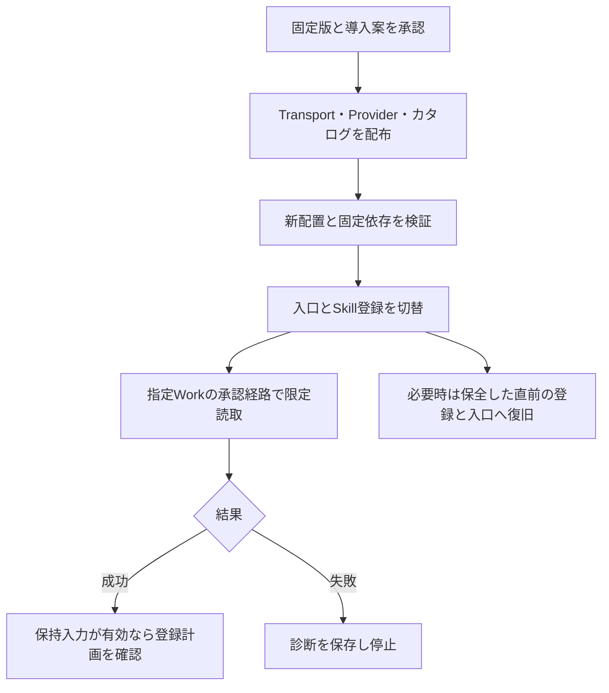

# 認証診断の固定版配布とWorkでの読取確認

認証情報の取得で止まった場合に、Baseの列定義エラーと区別できる修正を配布する。
[Transport PR #5](https://github.com/flair-agency/live-agency-lark-transport/pull/5)と
[Provider PR #13](https://github.com/flair-agency/live-agency-provider-lark-base/pull/13)のソース採用は承認済み。
今回の変更はその配布版・依存・カタログと本番導入案であり、業務実装を追加しない。

| 対象 | 現行 → 候補 | 変更 |
| --- | --- | --- |
| Lark Transport | `1.1.1` → `1.1.2` | 承認済みの認証エラー分類と前処理の段階を配布 |
| Lark Base Provider | `1.4.0-m3.1` → `1.4.0-m3.2` | Transportを固定し、承認済み診断と操作知識を配布 |
| カタログ | `0.1.0-m3.1` → `0.1.0-m3.2` | Larkの選択版を更新 |
| 再利用 | Runtime `2.0.0-m3.0`、Profile `2.0.0-m3.2`、TikTok platform `0.1.0-m3.1` | 再配布不要。CLIも `1.0.93` を維持 |

# 対処と確認する範囲

この修正はKeychainアクセス権を変更しない。確認済みの実行環境差への対処は、ホストが提供する承認機構から、同じ固定環境・主体・対象の限定読取コマンド全体を実行すること。子CLIだけを昇格する仕組みは追加しない。ホストの承認が利用できない場合は停止し、権限や資格情報を変更して迂回しない。

失敗時は `LARK_CLI_CREDENTIAL_STORE_UNAVAILABLE` と `transportStage=auth-status` を保持する。この段階で失敗した試行はBase操作へ未到達である。`business-api` は要求処理の段階を示すだけで、サービスへの到達を証明しない。従来のAPI20008の有限回復は維持し、Keychain失敗は自動再試行しない。

指定Workの実際のタスクで、指定済み1アカウントの対象確定と履歴の限定読取を確認する。保持した入力が有効なら登録計画まで進める。業務登録・画像送信・新たな観測・スケジュール変更は含めない。Codex起点の成功だけをWorkの受入成功にしない。

# 配布・導入・復旧

1. 配布候補のマージ後、既存workflowでTransport `1.1.2`を非公開`latest`、Provider `1.4.0-m3.2`を非公開`next`へ順に配布する。実archiveとregistryのintegrityを比較する。既存platformの配布workflowは起動しない。
2. カタログを `catalog-v0.1.0-m3.2` の非公開リリースに保存する。既存リリースを差し替えない。
3. 配布済み固定版から新しい配置を作り、ProviderがTransport `1.1.2`・CLI `1.0.93`を解決することを確認する。設定参照・ダイジェスト・主体・保存先・既存操作許可を維持する。
4. 保存した変更案で入口3ファイルと既存Profile登録を切り替える。直前のハッシュ・登録先が変わっていれば上書きせず停止する。新generationと登録receiptは実インストール後に取得する。
5. Workで上記の限定読取を確認し、実結果と失敗段階を保存する。

実際に配布済みのRuntimeで作成した導入計画SHA-256は
`87d40a84f498029c9bb42add17650e0b82d638f1f579f1e30971b1309c2ed4d2`。
具体的な配置先、設定・入口の前後ハッシュ、アーカイブのintegrityは端末内の私有レビューに保存した。
復旧先は直前のProfile `2.0.0-m3.2` / Lark `1.4.0-m3.1` / Transport `1.1.1`構成。
実際の新登録receiptから以前の登録へ戻し、保全した入口3ファイルとmodeを復元する。旧構成と証跡は保持する。

# 検証と残る判断

ソース採用時のTransport29件、Provider読取8件・知識1件の証跡を再利用した。今回の実archive計74ファイルはソースbyte一致・配布allowlist内。展開したProviderから候補Transport `1.1.2` / CLI `1.0.93`の解決と、npm Arboristによるlockの版・integrity整合を確認した。archive同士の診断伝達1件が合格し、CLI・API呼出しは0件。初回の検証用fixture依存不足は一時参照を補って解消し、使用したsymlinkを除去した。現行設定を維持する計画は実際の配布済みRuntimeで生成し、入口の前後ハッシュと直前の登録を照合した。これはregistryからの新規インストール検証を代替しない。

現接続のpackage versions APIは`read:packages`不足の403で、新候補版の未使用確認は配布前ゲートに残る。既存workflowの権限で照合し、衝突・integrity不一致は停止する。新パッケージのregistry再インストール、Workでの実読取成功はまだ確認していない。

[文書知識方針](../governance/document-knowledge-policy.md)、[言語方針](../governance/document-language-policy.md)、[開発方針](../governance/development-policy.md)、全文の[Private Source Integration Guide](../governance/private-source-integration-guide.md)に照らしてAIレビューを行った。具象知識はProviderに保持し、秘密・業務レコード・実配置情報をGitの差分へ含めない。診断の改善と権限変更、Codexの証拠とWork受入を区別した。既存OPERATORの古い復旧世代と未登録との記述は今回の私有変更案で訂正し、実際の直前登録・保全ファイルから復旧する手順に統一した。図・実施順・停止条件・再利用する版を照合した。

今回の判断は、固定版のマージ・非公開配布、新配置への導入・入口と登録の切替、指定Workの限定読取まで。先のLGTMはソース採用までとして提示していたため、具体化した配布・本番変更をここでまとめて確認する。[不具合Issue #9](https://github.com/flair-agency/live-agency-provider-lark-base/issues/9)と[受入Issue #32](https://github.com/flair-agency/live-agency/issues/32)は実結果の確認まで完了にしない。
