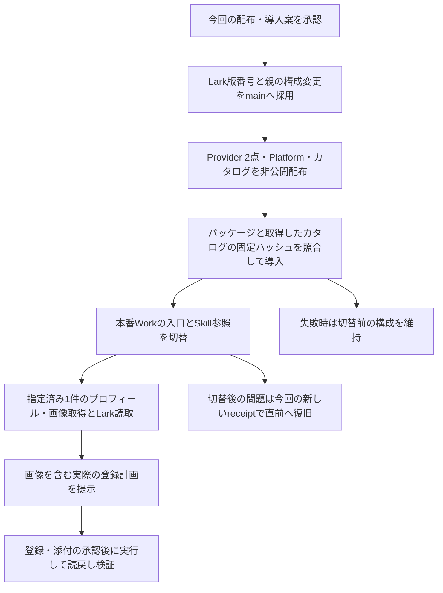

# アバター取得・登録後検証修正の配布と本番導入案

この文書は、2026-09-12にNaoki KimuraがPR #66とLark Base PR #19へのLGTMで承認した日本語レビュー履歴です。正本は[英語の採用文書](../development/profile-avatar-readback-adoption.md)です。以下は承認時点の提案・証拠を保持しており、配布や本番導入の完了報告ではありません。実装修正は採用済みです。承認された範囲は、以下の固定版を配布し、本番 **ChatGPT Work Local「C|OPS|エージェンシー運営」** へ導入して、指定済み1件の画像取得・読取・登録計画まで確認することです。

実データの登録・画像添付は、そのとき作成する実際の計画と件数を別途確認します。既に登録・照合が完了したレコードは再送しません。

# 変更対象

| 対象 | 現在の本番 | 今回の候補 | 理由 |
| --- | --- | --- | --- |
| TikTok Web Provider | 1.1.0 | **1.1.1** | 可視アバターの取得経路と、試行完了／未完了の根拠を残す |
| Lark Base Provider | 1.4.0-m3.3 | **1.4.0-m3.4** | 登録後の値をフィールド型に沿って比較し、失敗理由を区別する |
| TikTok Platform | 0.1.0-m3.2 | **0.1.0-m3.3** | 修正したTikTok Web版を選択する |
| カタログ | 0.1.0-m3.3 | **0.1.0-m3.4** | 上記PlatformとLark版を選択する |

Runtime **2.0.0-m3.0**、プロフィールSkill **2.0.0-m3.3**、Transport **1.1.3**、CLI **1.0.93** は再利用します。LIVEプラットフォーム、利用者、保存先、権限、更新方針は既存の選択を維持します。ソース修正の採用根拠は [TikTok Web PR #3](https://github.com/flair-agency/live-agency-provider-tiktok-web/pull/3) と [Lark Base PR #18](https://github.com/flair-agency/live-agency-provider-lark-base/pull/18) です。

Larkの追加ソース変更は配布版番号3か所だけです。TikTok Webは採用済みmainからそのまま配布できます。ルートリポジトリーではPlatform／カタログと今回の記録を更新します。

# 承認後の実行順序

1. 各PRの最新差分・コメント・CIと採用対象SHAを確認してmainへマージします。採用済み実装への追加変更は版番号と選択情報だけです。
2. 既存の手動配布workflowを使い、Provider 2点、Platformの順で配布・取得確認します。TikTok Webは`latest`、LarkとPlatformは`next`です。いずれも既存の非公開GitHub Packagesへ配布します。カタログは非公開リポジトリーの新規リリースに保存し、既存の版や添付を上書きしません。
3. npmパッケージ3点を下記の実アーカイブと照合します。カタログはリリースタグ `catalog-v0.1.0-m3.4` の添付 `catalog.json` を配布後に新規の私有ファイルへ取得し、取得したファイルの生バイトのSHA-256を下表の固定値と照合します。JSONを再整形して比較せず、取得した資産から期待値を作り直すこともしません。タグ・添付の識別情報、取得時刻、実測ハッシュと一致結果を配布receiptに残します。取得不能・不一致ならインストール前に停止し、既存本番を維持します。4点の一致後にのみ既存のRuntime `setup install` で新規ディレクトリーへ導入します。固定CLIの公式初期化手順とチェックサムも確認します。設定ハッシュ、依存版、3つの機能が一致しなければ切り替えません。
4. 控えを残した3つの本番入口ファイルと、同じ版のProfile Skillを新しい導入先へ参照し直します。登録時に今回専用の新しいreceiptを作り、参照先・実際のgeneration・復旧プレビューを検証します。
5. 本番Workから指定済み1件を取得・計画します。可視画像を取得できた場合は、その画像が添付候補に含まれることを確認します。取得できなければ試した経路、未完了か取得不能か、具体的理由を示します。0画像の計画をアバター受入完了とは扱いません。

手順5までが今回提案する実行範囲です。図の最後の登録・添付と読戻しは、その実計画の承認後です。導入前後の設定不一致や未取得の権限が見つかった場合は、対象の操作を止めて原因と既に完了した範囲を記録します。

# 検証できたことと限界

| 証拠 | 確認結果 |
| --- | --- |
| 現在の本番選択 | 保存済みlauncher／環境と登録receiptが一致。RuntimeとProfileは上記の版 |
| 設定と復旧 | 2つのProvider設定の参照・バイトハッシュが本番と同一。3つの現行入口ファイルとSkill参照の変更なし |
| 実配布物 | TikTok 16ファイル、Lark 64ファイル、Platform 2ファイル。採用ソースとの一致と必要リソースを確認 |
| 選択の整合 | 配布物のmanifestとPlatform宣言・カタログ・Runtime作成計画の3機能が一致 |
| 継承する実装検証 | TikTokの20件と実画像取得・クリップボード／配布物による正規化、Larkの75件。実装不変なので繰り返していない |
| 今回の追加確認 | Lark配布リソース1件、配布物・参照・宣言の照合、設定不変、変更差分・リンク確認 |

計画SHA-256：`1b4be526c8f7fadb96ce00713c69214a8d27cdcb01ba5552ec7cdc1fa92e59f0`。
これは**導入計画**のハッシュです。業務データ登録の承認ハッシュではありません。Runtimeは既存の正式導入版で計画を作成しましたが、新規インストール・本番切替・サービス操作はまだ実行していません。

導入計画のハッシュは、実際に配布されたカタログの同一性を保証しません。既存リリースではGitHubネイティブの変更不能設定が有効ではないため、上記の取得後照合を別に行います。

| 配布物 | ソース／SHA-256 |
| --- | --- |
| TikTok Web 1.1.1 | main `6b496624534448cbd9b47de104c4f655efc08215` / `958ed55b03aea2116864d42da4264426722c296ade6d1a3cc97bdf2e770365e0` |
| Lark Base 1.4.0-m3.4 | `de5568ffa5a4c38e0f2feb863ae90b396a6dc216` / `2f938d4ad66d418cb718de037d3eab21c31970cadd3c484b50c8b4d9531fd4ad` |
| Platform 0.1.0-m3.3 | 本PRの宣言 / `f8cfa4b317b6de33622d9e59ca6a8345a8410e5459fda9d8ba91f05840f02ca7` |
| カタログ 0.1.0-m3.4 | 本PRの `catalog/catalog.json` → `catalog-v0.1.0-m3.4` の添付 `catalog.json` / **`521cd2cce893e97bb30a2a53d9d80afff227ce8ca683fe91956cf88e1ff1556c`** |

カタログの固定値は、今回のソース、保管済み `catalog.json`、`deployment-review.json` の `catalogSha256`、確定済み索引の該当項目が一致することを確認済みです。これらのバイト列・既存の導入計画・索引は今回の文書修正で変更していません。配布後の資産取得・照合は未実施です。

レジストリーの既存版一覧／個別照会で両ProviderとPlatformの候補版が未使用、カタログの新規タグが存在しないことを確認しました。保存済みレジストリー設定の変数が未投入だと401になることも確認し、既存npm認証を子プロセスのメモリー内だけで渡して正常に照会しました。認証値の変更・保存はありません。導入時にも同じ明示設定を使います。配布直前には重複を再確認します。新しい環境のgenerationは実インストール後の値を採用し、ここでは捏造しません。

型比較の修正は再現した表現差への修正です。過去の実登録でどのフィールドが失敗したか、今回の本番で登録後検証が正常に完了するかは未確認です。Lark [#61](https://github.com/flair-agency/live-agency/issues/61)、アバター [#1](https://github.com/flair-agency/live-agency-provider-tiktok-web/issues/1)、受入 [#32](https://github.com/flair-agency/live-agency/issues/32) は実際の証拠が揃うまで閉じません。

# 証拠の保管と復旧

保管先は `/Users/naokikimura/.local/share/live-agency/deployment-plans/profile-avatar-readback-20260912` です。同じMacの `naokikimura` がFinderの「フォルダへ移動」から開き、`README.md`、`record.json`、`deployment-review.json` の順で確認します。ディレクトリー0700、ファイル0600。原本アーカイブ、計画、設定ハッシュ、変更前後の入口、直前の導入・登録receiptを保管しています。実データや資格情報の値はGitへ入れません。

保管済み37ファイルのハッシュを検証しました。索引 `record.json` のSHA-256は **`c0c737fa5a004a6b93abbd1c33fa6419e5db9e5a7d791363379e71fc56674b5b`** です。以前の実画像取得証拠も私有コピーとして含みます。画像・対象manifest・正規化観測は業務データとして非公開で扱います。

直前の復旧先は現在の書き込み診断版、generation **`b9abf30e7e7d4efe4dd1720c316b29ace4c387642e6ad017b87c944827a7264e`** です。今回の切替で新しく作る登録receiptを用いて、Profile参照をこの版へ戻します。今回の変更前3ファイルも、切替後に第三者の変更がないことを照合してから復元します。`previous/`の古い登録receiptを復旧操作に使うと、さらに古い版へ戻るため使いません。インストール先と診断証拠は保持します。ローカル設定の復旧は外部データを取り消しません。

これは同じMacでの継続保管です。別の端末への保管や、別の担当者による取得検証までは行っていません。

# AI方針レビュー

2026-09-12に、[知識・文書方針](../governance/document-knowledge-policy.md#ai-review-before-requesting-owner-approval)、[開発方針](../governance/development-policy.md)、[言語方針](../governance/document-language-policy.md)、全文を読んだ [Private Source Integration Guide](../governance/private-source-integration-guide.md) に実差分を照合しました。

- 実装採用、配布、導入、業務受入を区別し、未承認の実行案として記述しました。
- 具象知識・認証はProviderに保持し、Skill・Runtimeの契約や利用者／保存先を変更していないことを確認しました。
- 図と手順の順序、取得不能と試行未完了の違い、画像0件で完了扱いにしない基準を照合しました。
- 旧receiptで古い世代に戻す誤りを避け、今回の切替で作るreceiptを復旧に使うことを明記しました。
- CLIの版確認は、Provider直下ではなく実際の所有者であるTransportの依存として照合しました。
- 日本語の未承認レビュー、英語の構成説明、リンク、配布物、非公開保管を確認しました。
- PR #66のP1指摘に対応し、レビュー資料に欠けていたカタログ資産の固定SHA-256を保管済み証拠と照合して追記しました。図・配布手順・一覧を揃え、取得不能／不一致時はインストール前に停止すること、取得結果をreceiptへ残すことを確認しました。既存の計画・カタログ・索引は不変です。

これはセルフレビューです。正式インストール、実Workでの画像付き登録、独立レビューや人による引継ぎ受入の代替ではありません。承認前の残る判断は、この固定版の配布・導入・指定済み1件の取得と計画までを承認するかでした。この範囲は上記LGTMで承認済みです。実登録・画像添付は、今後の実計画の別承認が必要です。

# 承認採用記録 — 2026-09-12

[PR #66](https://github.com/flair-agency/live-agency/pull/66) と [Lark Base PR #19](https://github.com/flair-agency/live-agency-provider-lark-base/pull/19) のLGTMに基づき、承認済みの意味・版・ハッシュ・停止条件・復旧先を英語正本へ採用しました。PR #66のP1修正で追加したカタログの取得後固定ハッシュ照合も承認範囲に含まれます。元の提案の手順と証拠は承認時点の履歴です。

文書採用の自己レビューでは、上記の知識・言語・開発方針と全文を読んだPrivate Source Integration Guideに照合し、日英の範囲、図と手順、全固定ハッシュ、0画像時の未受入、実計画の別承認、新receiptでの直前復旧、非公開情報の境界、文書リンクと3ファイルの差分を確認しました。実装・配布物・私有37ファイルの索引・導入計画は変更していません。過去の準備検証を今回の再実施や本番完了とは扱いません。人による引継ぎ受入・独立レビューの代替ではありません。この文書作業では公開・導入・サービス操作を実行していません。

変更範囲のローカルリンク・全承認SHA-256・`git diff --check`は合格しました。独立caller確認 `node --test test/m2u-call-site-inventory.test.mjs` は、この隔離worktreeに `providers/lark-base/src/api-operations.js` がなく、`ERR_MODULE_NOT_FOUND`で検証本体を実行できませんでした。文書作業のためcomponent初期化や依存導入は行っておらず、この検査を合格とは報告しません。

| 次の対応 | 人の責任者 | 期限 | 概要 | 完了条件 | 追跡 |
| --- | --- | --- | --- | --- | --- |
| 承認済み配布・本番導入・計画を実行 | Naoki Kimura | TBD | 固定版を照合して導入し、指定済み1件を取得・読取・計画 | 各段階のreceiptと実Workの計画・画像取得結果を記録 | PR #66、Lark PR #19、英語正本 |
| 画像付き実計画を確認 | Naoki Kimura | TBD | 実際の作成・添付件数とハッシュを判断 | 実計画への別承認後のみ登録・添付し読戻し検証 | #61、アバター#1、#32 |
