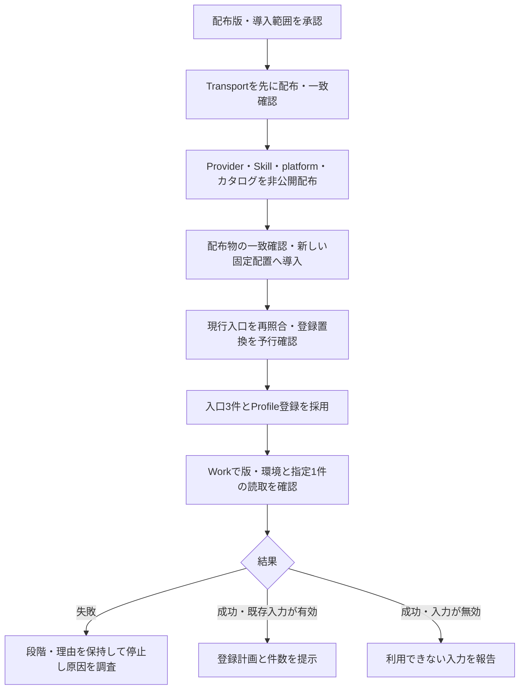

# プロフィール読取回復・診断修正版の配布・導入レビュー

# 開発調査を踏まえた現在の提案

開発環境で間欠的な読取失敗を再現し、公式へ[Lark CLI #2709](https://github.com/larksuite/cli/issues/2709)として報告した。
オーナーはCLI修正を待たないワークアラウンドを採用し、[Transport PR #2](https://github.com/flair-agency/live-agency-lark-transport/pull/2)を承認した。ソースはmainへ統合済みで、本番の固定導入版には未反映である。
今回は回復処理と診断修正を含む固定版の配布・導入を準備した。根本原因は未確定で、成功した再試行を根因解消の証拠にしない。
旧診断のみの計画は未適用で今回の計画に置き換える。旧提案と開発再現先行の判断はGit履歴と私有記録に保持する。

# 今回の判断対象

採用済みの回復処理と診断修正を新しい固定版として配布し、指定済みのChatGPT Work Local
本番プロジェクトで、選択済みの1アカウントについて限定読取を行う。
目的は有限回復を本番へ反映し、失敗時にも箇所・理由を失わずに指定1件の読取と計画を確認することである。
実際の接続障害の原因・解消はまだ確認できていない。

[Provider PR #10](https://github.com/flair-agency/live-agency-provider-lark-base/pull/10)と
[Skill PR #5](https://github.com/flair-agency/live-agency-creator-profile-record/pull/5)の
ソース採用は承認済みで、双方mainへ統合した。今回は新しい配布版と具体化した
導入範囲をまとめて提示する。これまでのLGTMはソース採用までとして提示していた。

| 対象 | 現行 → 候補 | 内容 |
| --- | --- | --- |
| Runtime | `2.0.0-m3.0` → 同じ版 | 既存のsetup・固定環境解決を使う。再配布しない |
| Lark Transport | `1.1.0` → `1.1.1` | 読取20008の有限回復と共有時間予算。CLIは`1.0.93`を維持 |
| Lark Base Provider | `1.4.0-m3.0` → `1.4.0-m3.1` | Transport `1.1.1`へ固定し、列定義の失敗箇所と期限超過理由を保持 |
| Profile Skill | `2.0.0-m3.1` → `2.0.0-m3.2` | 計画と登録後確認の失敗でも診断を利用者へ届ける |
| TikTok platform・カタログ | `0.1.0-m3.0` → `0.1.0-m3.1` | 上記のSkill・Provider版を選択。TikTok取得Providerは`1.1.0`のまま |

Transportは採用済みmainに対する版番号のみ。Providerは依存固定、期限超過診断1件とその知識・検証も変更し、Skillは版番号のみである。
[Transport PR #3](https://github.com/flair-agency/live-agency-lark-transport/pull/3)、
[Provider PR #12](https://github.com/flair-agency/live-agency-provider-lark-base/pull/12)、
[Skill PR #7](https://github.com/flair-agency/live-agency-creator-profile-record/pull/7)を
この親変更とともに採用する。既存GitHub ActionsでTransport stable版を先に非公開`latest`へ配布し、依存するProvider、Skill、platformを非公開`next`へ配布する。
各環境は固定版を使うため、タグ更新だけで既存環境が切り替わることはない。
カタログは`catalog-v0.1.0-m3.1`の不変な非公開リリースとして保存する。
ソースの公開範囲やパッケージの可視性を変更する作業ではない。

# 読取回復と停止条件

共有Transportは、選択済みidentityと一致する構造化`api/unknown/20008`の読取を、同じ対象・同じ要求で最大3回試行する。待機は250／500ミリ秒。
既存の60秒を、読取1要求の事前確認・ファイル準備・CLI・待機で共有する。時間切れ後の送信と遅延成功を拒否し、書込は再送しない。
Providerは`API_READ_DEADLINE_EXCEEDED`を原因不明に変換せずSkillへ渡す。読取知識版は`lark-base-profile-read/2026-09-11.2`。
処理全体を外側から自動で繰り返さない。失敗の段階・理由・監査を保存し、同じ選択と現在の認証を確認して人が再開を判断する。

# 本番へ適用する具体的な範囲

選択済み本番環境の利用者・認証参照・保存先・操作許可、
手動更新設定、ストレージ未選択を保持する。読取・書込の設定ファイルは現行の
固定ダイジェストと一致し、今回の計画でも同じ参照・同じbytesを使う。

導入計画SHA-256は
`e1b7ce147a75e8344febe6c8edeab86ac73f6aeb22e1ea49562210fec2436e81`。
具体的な環境名・配置先・設定参照は、端末内の私有の`plan.json`と
`deployment-review.json`に保存した。同じ私有領域にカタログ・宣言、
現行入口の保全と変更案がある。実リソースのIDと設定内容はGitへ記録しない。

- 私有の計画に指定した新しい配置へ、配布済みの固定版からインストールする。
  現行配置は保持する。Providerの位置から依存を解決し、Transport `1.1.1`とCLI `1.0.93`、承認済みintegrityをホスト切替前に確認する。
- 起動入口、RuntimeホストSkill、運用ガイドの3ファイルを、保存済みの変更案へ更新する。
  現行bytesのハッシュが変わっていたら自動上書きしない。
- 既存のProfile Skill登録を新配置へ置き換える。今回は新規登録ではない。
  既存Runtimeの`setup register --replace`で予行確認し、適用receiptを保存・再読取する。
- Workで固定版と環境を確認し、指定1件の限定読取を1回行う。
  既存の対象・観測がSkillの条件を満たす場合は、同じ入力で計画まで進める。
  観測が利用できない場合は、その制約を報告し、今回の診断のために再取得を繰り返さない。
- 業務レコード登録・画像送信・招待送信・スケジュール変更は0件。
  登録は、実際の計画・ハッシュ・件数を提示した後の判断となる。

# 検証したことと限界

- Transport候補の全src・README・LICENSEは採用済みmainとbyte一致。4アーカイブの計90ファイルをソースと照合し、宣言moduleの読込を確認した。
- 展開したProviderが候補Transport `1.1.1`を解決しCLI `1.0.93`を使うこと、Provider lockの固定version・integrity・依存の整合をnpmの依存解決ライブラリーで確認した。
- Transport対象25件と従来API・selection51件、注入した20008後の開発実読取の既存証拠を再利用。変更したProviderは実Transportによる列読取2箇所の期限超過診断を含む読取7件と知識1件が合格した。
- 実際に配布済みのRuntime `2.0.0-m3.0`の`planEnvironment`で新しい計画を作成した。
  必須capability、固定版、現行読取・書込設定のダイジェスト、既存登録の参照先を照合した。
  サービス呼出し、インストール、ホスト変更は行っていない。
- 承認済みのProvider 237件、Skill初期13件と修正後の対象経路6件の検証を再利用した。
  変更のない業務テストは再実行せず、今回の依存・診断変更に必要な確認へ絞った。
- 当初の本番失敗証跡とWorkの記録には、原因を識別する下位エラーが残っていなかった。
  `read-fields`にはCLI・認証等の事前確認も含まれるため、APIそのものの失敗とはまだ言えない。
- 現在のGitHub接続ではpackage versions APIが403となり、新候補版が未使用であることは未確認。
  資格情報は変更していない。配布時は既存workflowのパッケージ権限で検査し、版衝突や
  同一性の不一致があれば停止する。新候補のregistryからの再インストール検証は配布後に行う。

Provider lockは候補の正確なversionと実archiveのintegrityを保持し、未確認の取得URLは記載しない。
URLをregistryから解決するのは[npmが対応する形式](https://docs.npmjs.com/cli/v11/using-npm/config/#omit-lockfile-registry-resolved)であり、取得URLを推測しない。
Transport配布後、Providerの既存workflowの`npm ci`でregistryからの再取得を確認する。

候補のintegrityは私有の`deployment-review.json`に記録した。配布後に実アーカイブと
registryのintegrityを比較する。新しいgeneration、登録の予行結果、適用receiptは
実インストール後に取得し、未実行の値を事前に生成しない。
後続の読取が成功しても、それだけで以前の失敗原因が特定されたとは扱わない。

# 復旧と完了条件

復旧先は今回の直前のProfile `2.0.0-m3.1`配置・generation・登録先である。
入口3件の現行bytesとmode、既存Profile登録の参照先を保全した。
登録置換で作成する新しいreceiptから以前の登録へ戻し、入口も保全したbytesへ戻す。
旧M2への復旧記録を今回の復旧先として流用しない。
この導入は外部データを書き換えないため、レコードの復元は発生しない。

配布・固定版一致・ホスト切替はそれぞれ証拠を残し、実際に確認できた段階をProjectへ反映する。
[調査Issue #9](https://github.com/flair-agency/live-agency-provider-lark-base/issues/9)は
根拠のある原因説明と選択済み本番計画が確認できるまで完了にしない。

# AIポリシーレビュー

今回の更新では、採用済みワークアラウンドと未実施の配布・本番適用、有限回復と根本原因、私有証跡とGitHub上の進捗を区別した。依存と診断の伝達、時間制限、停止条件、版・archive・設定・復旧と図を照合した。

[文書知識方針](../governance/document-knowledge-policy.md)、
[言語方針](../governance/document-language-policy.md)、
[開発方針](../governance/development-policy.md)、全文の
[Private Source Integration Guide](../governance/private-source-integration-guide.md)、
[配布方針](../architecture/distribution.md)に照らして確認した。
採用済み診断修正と今回の版・導入提案、設定の不変性と実接続の未確認を区別した。
古いカタログ説明の「設定ダイジェスト変更が必要」という記述を、今回維持する設定と区別して訂正した。
実データ・認証情報をpublic Skillへ移さず、私有の導入案にも秘密値を追加していない。
図と手順、復旧先、既存登録の置換、未実行の範囲を照合した。
業務スキーマ移設や新しいビジネスルールは含まれない。

送信前の自動承認レビューが内部運用情報の送信範囲を指摘したため、具体的な
プロジェクト名・環境名・端末の配置先は私有レビューへ分離した。
送信先はオーナー指定の`flair-agency/live-agency`で、非公開かつ管理権限があることを確認した。
GitHub側にはパッケージ版、一般的な導入手順と判断範囲を残す。
