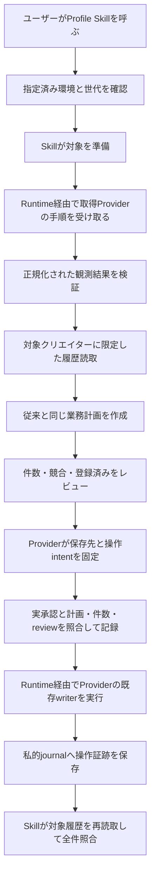

# Profile Skillの保存済み環境への接続

# 変更と判断対象

計画接続の先行checkpointは[Profile Skill PR #2](https://github.com/flair-agency/live-agency-creator-profile-record/pull/2)、コミット `1d2ea9b1c11239dfe062ce5a4342b59b7975ee56` です。以下はその後の書込接続を含むソース変更のレビューであり、この先行コミットを現在の書込実装の証拠として扱いません。現在の書込接続は次の専用ブランチへコミット・同期済みです。

| 所有者 | レビュー対象 | コミット |
| --- | --- | --- |
| Runtime | [PR #7](https://github.com/flair-agency/live-agency-provider-runtime/pull/7) | `df6324f8a6128b995f9b03c65951440198bfb8bc` |
| Lark Provider | [PR #7](https://github.com/flair-agency/live-agency-provider-lark-base/pull/7) | `a99d26a98e2076538444d215e04c1179f142e5c7` |
| Profile Skill | [PR #2](https://github.com/flair-agency/live-agency-creator-profile-record/pull/2) | `1106947406029d1a29036c3237c91e08b8d8c1bd` |

承認する内容は、この3件のソースを採用することです。固定版の配布・本番環境の変更・実データの登録はこの承認対象に含めません。

提案段階のソース変更です。Skillから保存済み環境のRuntimeを呼び出し、対象の取得、観測手順の受け渡し、対象者に限定した履歴読取、登録計画、承認された登録と最終再読取を接続します。Runtimeは汎用のローカル実行hooksを提供し、具体的な保存先・権限・サービス操作への変換はprivate Providerが担当します。

採用済みの役割分担を既存Profile処理に接続する変更であり、業務上の照合条件の変更は提案していません。今回はこのソース変更がレビュー対象です。main統合、リリース、固定版導入、本番へのSkill登録と実データ書込は未実施です。

# 維持した意味と限界

- 既存の対象選択、未取得値、登録済み照合、画像だけが欠けた既存行への追加、競合・不正行の判断を維持しました。Providerが既に返す正規化履歴を使用します。
- 読取失敗を空の履歴に変換しません。履歴には対象IDを必ず指定し、対象0件で全件読取に広げません。環境世代・要求と応答・対象範囲が違えば、その受け渡しを拒否します。
- 業務計画のハッシュは従来と同じです。環境との対応は別のreceiptハッシュで記録し、承認として扱いません。
- 観測データの検証は、旧Providerが公開契約として持っていた中立スキーマを制約を変えずにSkillへ配置しました。サービスの取得方法は移していません。基準SHAはコードに残しています。
- 画像のローカルファイルとメタデータの一致を確認し、書込Providerが既存の画像writerへ接続します。後述の統合proofは画像なし1件であり、画像経路の統合受入や本番登録の証明ではありません。
- 新入口は具体Providerを直接importしません。ただし既存の互換経路と依存は保持しています。**パッケージ全体の具象依存の撤去は未完了です。** 配布版の確定前に呼出元と置換・復旧を整理します。

# 承認・証跡・人による再開

Skillは業務計画からprepared reviewを作り、計画・review・intentのハッシュ、作成と画像の件数、選択環境を結び付けます。実行前に対象と履歴を読み直し、計画が変わればその承認で続行しません。trusted callerは実際のオーナー承認referenceと対象・件数を検証して記録します。ハッシュ、referenceの文字列やcallbackが存在するだけでは承認になりません。

Runtimeの`authorizeIntent`と`onEvent`は同一プロセスの呼出元から渡す関数です。JSON要求や保存設定からcallbackを生成しません。Runtimeは承認関数の前後で環境世代・設定digestを確認し、Providerは固定intentと具体的なactor・resource・operationを照合します。RuntimeへProfileの業務判断は移しません。既に書込が起きた後の証跡を失わないよう、選択変更後も`onEvent`は保存に使用できます。

CLIには私的な永続journalと読取専用`verify`を接続しました。journalはreview単位で排他的に作成し、操作の前に記録を永続化します。同じ記録を上書きして再実行できません。ただし他の端末と共有されたロックや承認認証サービスではありません。承認記録、操作イベント、失敗と再読取結果を保持し、通信応答が失われても作成を自動再送しません。担当者はjournalとreviewを確認し、同じ対象の履歴を読取専用で照合してから未解決の差分を判断します。環境・計画・件数が変わった場合は新しいreviewへ戻ります。これらの手順は実承認や人による引継ぎ演習を代替しません。

# 実施した検証

## 計画接続の先行checkpoint

以下は先行実装時の実績です。`apply不可`などは当時の範囲であり、現在の書込接続の仕様・最終テスト数ではありません。

| 検証 | 結果と範囲 |
| --- | --- |
| 既存Profile・移行比較テスト | 20件成功。既存の登録・曖昧応答後照合を含む合成データ検証 |
| 環境接続のbehavioral test | 3件成功。対象順序、1件に限定した履歴要求、相関、世代差異、失敗応答、範囲外応答、具体Providerのimport不在、apply不可 |
| 変更前のソースとの直接比較 | Skill main `168418af0afdbf78546cf7c68a52e63c024b0316`を別の一時ディレクトリーへ展開し、新規・画像追加・登録済み・競合・不正行の5入力で計画全体・ハッシュが一致 |
| 独立した呼出元/API操作の検出 | 親の `node --test test/m2u-call-site-inventory.test.mjs` 2件成功 |
| 配布ファイル・参照 | exports 12件、変更した導線の相対リンク6件、packの必要リソースを確認。公開内容・空白チェック成功 |

先行環境接続テストは要求を記録するaccess代替を使用しました。

## 書込接続の現在の検証

親の[統合proof](../../tools/verify-profile-environment-connection.mjs)はローカルsourceを明示して、実Runtime API、実Provider write executor、既存selected writer、Skillのprepare/apply/verifyを接続しました。通常成功は作成1回と全件readback一致、承認拒否はmutation 0回、作成後の応答喪失は作成1回のままreadbackで回復し、加えて書込後の記録障害を「結果不明」として保持し、読取だけで確認できることも含め、4ケースとも成功しました。通常ケースはCLIによる対象準備・計画・prepare-write・apply・verify、私的journalの記録と権限、同じreviewの再apply拒否まで通しています。Runtime focused testは8件成功し、hook拒否、JSONによる代替不可、承認待機中の環境・設定変更と証跡継続を確認しました。

観測入力、transport、承認、read surfaceは合成です。実Providerのread executor、画像、実サービス、registry経由の独立インストール、人による引継ぎ演習はこのproofで検証していません。最終実行レポートは私的保存先 `/private/tmp/profile-environment-final-checkpoint-20260910/report.json` にあり、3所有者のsource file hashes、検証器のhashと限界を含みます。レポートSHA-256は `4174830848153e95d1270f386acef10af37fc7f56447e7a54ce38062e8db679b` です。既存の開発依存を使用し、追加インストールは行っていません。

追加のfocused検証は、Skillの環境・journalが4件、Providerの新bindingが3件と既存writerが4件成功です。packのexportsはSkill 13件・Provider 7件・Runtime 1件、必要な配布資源と変更リンクを確認しました。親の独立caller/API検査は開発checkoutで2件成功しました。親の分離worktreeでは未初期化submoduleによるimport失敗があったため、そこで成功したとは扱いません。

Providerの既存writerには全件取得によるサービス事前確認・照合が残ります。今回、Skillの履歴照合を対象者に限定したことと区別します。実サービスでの書込時間はまだ計測していません。

# AIによる事前ポリシーレビュー

[文書・Skill知識方針](../governance/document-knowledge-policy.md)、[言語方針](../governance/document-language-policy.md)、[開発方針](../governance/development-policy.md)、[Private Source Integration Guide](../governance/private-source-integration-guide.md)に照らして実際の差分を確認しました。

計画の二重実装を残さないよう旧入口も中立処理へ委譲しました。その比較だけでは変更前との一致を証明できないため、変更前mainとの直接比較も行いました。登録可能・業務受入済みと誤認しない説明、図と手順の対応、失敗時の証跡と再開方法、具体情報の境界を確認しました。新しいソースとテストは架空データのみです。これはAIの事前レビューであり、人による理解・受入や本番登録の承認を代替しません。

書込接続の追記では、上記方針とguide全文を参照し、実装済みソースと合成proofの範囲、承認責任、RuntimeとProviderの境界、応答喪失後の再読取、図と手順、英語statusとの整合を確認しました。先行の「書込は次の作業」と現在のsource wiringを区別し、CLI最終検証・配布・実環境受入を成功扱いしないよう修正しました。最終CLIの差分と再実行結果も確認しました。独立レビューで見つかった「Providerの失敗段階を保存しない」「書込後の記録障害を結果不明として保持しない」の2点を修正し、記録障害後の読取復旧を統合proofで確認しました。人による理解と実承認は残っています。

# 続きと復旧

既存の公開済みSkill 1.2.0、稼働中のM2インストール、前回のホスト復旧記録を維持します。今回のソースを採用しなくても本番構成は変わりません。親のSkill pinは今回更新しません。

| 次の作業 | 人の担当 | 期限 | 完了条件 |
| --- | --- | --- | --- |
| ソースレビュー | オーナー | TBD | 今回の接続範囲と検証の限界を確認 |
| 固定配布と本番Skill選択 | オーナー承認後 | TBD | 依存と配布資源を確定し、独立インストールを確認して指定Work環境へ導入 |
| 1件の業務受入 | オーナー | TBD | 実計画の承認後、登録と再読取を確認 |

進捗は[Issue #32](https://github.com/flair-agency/live-agency/issues/32)に記録します。
