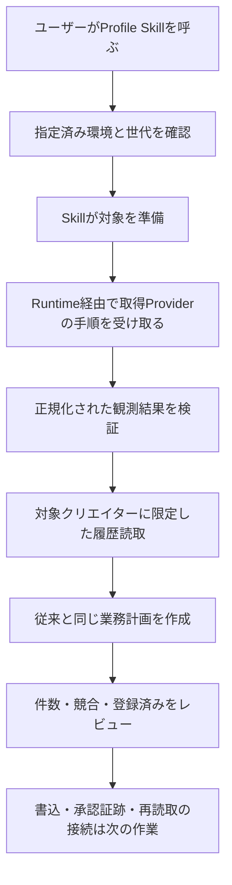

# Profile Skillの保存済み環境への接続

# 変更と判断対象

実装は[Profile Skill PR #2](https://github.com/flair-agency/live-agency-creator-profile-record/pull/2)、コミット `1d2ea9b1c11239dfe062ce5a4342b59b7975ee56` です。書込接続が残るためDraftとして同期しています。

提案段階のソース変更です。Skillから保存済み環境のRuntimeを呼び出し、対象の取得、観測手順の受け渡し、対象者に限定した履歴読取、登録計画の作成を行う入口を追加しました。RuntimeやProviderの実装は今回変更しません。

採用済みの役割分担を既存Profile処理に接続する変更であり、業務上の照合条件の変更は提案していません。今回はこのソース変更がレビュー対象です。新入口からの登録操作、配布、本番へのSkill登録は次の作業です。

# 維持した意味と限界

- 既存の対象選択、未取得値、登録済み照合、画像だけが欠けた既存行への追加、競合・不正行の判断を維持しました。Providerが既に返す正規化履歴を使用します。
- 読取失敗を空の履歴に変換しません。履歴には対象IDを必ず指定し、対象0件で全件読取に広げません。環境世代・要求と応答・対象範囲が違えば、その受け渡しを拒否します。
- 業務計画のハッシュは従来と同じです。環境との対応は別のreceiptハッシュで記録し、承認として扱いません。
- 観測データの検証は、旧Providerが公開契約として持っていた中立スキーマを制約を変えずにSkillへ配置しました。サービスの取得方法は移していません。基準SHAはコードに残しています。
- 画像のローカルファイルとメタデータの一致は確認します。アップロード上限などのサービス条件は次の書込Provider接続で確認します。この計画は画像を登録できることの証明ではありません。
- 新入口は具体Providerを直接importしません。ただし既存の互換経路と依存は保持しています。**パッケージ全体の具象依存の撤去と、選択環境での書込は未完了です。** 配布版の確定前に呼出元と置換・復旧を整理します。

# 実施した検証

| 検証 | 結果と範囲 |
| --- | --- |
| 既存Profile・移行比較テスト | 20件成功。既存の登録・曖昧応答後照合を含む合成データ検証 |
| 環境接続のbehavioral test | 3件成功。対象順序、1件に限定した履歴要求、相関、世代差異、失敗応答、範囲外応答、具体Providerのimport不在、apply不可 |
| 変更前のソースとの直接比較 | Skill main `168418af0afdbf78546cf7c68a52e63c024b0316`を別の一時ディレクトリーへ展開し、新規・画像追加・登録済み・競合・不正行の5入力で計画全体・ハッシュが一致 |
| 独立した呼出元/API操作の検出 | 親の `node --test test/m2u-call-site-inventory.test.mjs` 2件成功 |
| 配布ファイル・参照 | exports 12件、変更した導線の相対リンク6件、packの必要リソースを確認。公開内容・空白チェック成功 |

環境接続テストは要求を記録するaccess代替を使っています。実Runtimeを含む独立インストール、本番の外部操作、人による引継ぎ演習は今回実施していません。既存の開発依存を使用し、追加インストールは行っていません。

# AIによる事前ポリシーレビュー

[文書・Skill知識方針](../governance/document-knowledge-policy.md)、[言語方針](../governance/document-language-policy.md)、[開発方針](../governance/development-policy.md)、[Private Source Integration Guide](../governance/private-source-integration-guide.md)に照らして実際の差分を確認しました。

計画の二重実装を残さないよう旧入口も中立処理へ委譲しました。その比較だけでは変更前との一致を証明できないため、変更前mainとの直接比較も行いました。登録可能・業務受入済みと誤認しない説明、図と手順の対応、失敗時の証跡と再開方法、具体情報の境界を確認しました。新しいソースとテストは架空データのみです。これはAIの事前レビューであり、人による理解・受入や本番登録の承認を代替しません。

# 続きと復旧

既存の公開済みSkill 1.2.0、稼働中のM2インストール、前回のホスト復旧記録を維持します。今回のソースを採用しなくても本番構成は変わりません。親のSkill pinは今回更新しません。

| 次の作業 | 人の担当 | 期限 | 完了条件 |
| --- | --- | --- | --- |
| ソースレビュー | オーナー | TBD | 今回の接続範囲と検証の限界を確認 |
| 書込・承認・証跡の接続 | TBD | TBD | 既存writerで計画・保存先・承認・操作記録を対応付け、業務再読取まで接続 |
| 固定配布と本番Skill選択 | オーナー承認後 | TBD | 依存と配布資源を確定し、独立インストールを確認して指定Work環境へ導入 |
| 1件の業務受入 | オーナー | TBD | 実計画の承認後、登録と再読取を確認 |

進捗は[Issue #32](https://github.com/flair-agency/live-agency/issues/32)に記録します。
