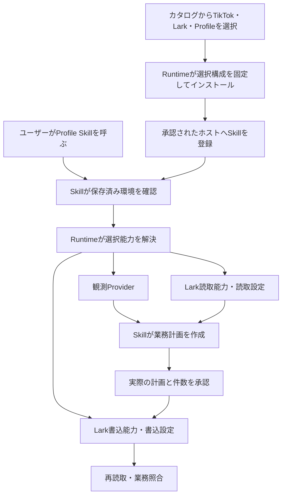

# Profile Skillを配布できる構成にする

このソース採用・固定配布案はオーナーLGTMで承認され、4PRをmainへマージしました。以下の候補レビューは当時の記録です。配布後に判明した差と、修正版および本番導入の判断対象は[本番導入レビュー](profile-production-adoption-ja.md)を参照してください。採用済みの構成・配布状態の正本は英語の[移行状況](../migration/status.md)です。

承認済みの接続ソース4件はmainへマージ済みです。今回は、そのソースを実際に配布・インストールできる候補へ整理しました。現在の本番はChatGPT Work Localの「C|OPS|エージェンシー運営」、`operations / production / tiktok`です。まだ旧M2構成で動いており、今回の候補は本番へ導入していません。

# 今回の変更

| 所有者 | 候補版 | 変更 |
| --- | --- | --- |
| Runtime | `2.0.0-m3.0` | 同じデータベースの読取・書込能力に、それぞれ異なる設定ファイルを固定できる |
| Lark Base Provider | `1.4.0-m3.0` | 承認済みの書込接続を含む版を確定。今回は版情報のみ変更 |
| Profile Skill | `2.0.0-m3.0` | 配布物を中立の業務処理・環境入口に限定。旧スクリプトのexportを除くためmajor更新 |
| TikTok platform | `0.1.0-m3.0` | Profileを選択肢にし、観測・履歴読取・書込の3能力を要求 |
| 独立カタログ | `0.1.0-m3.0` | 上記platform・Lark版と能力を固定 |

| ソースレビュー | 固定コミット |
| --- | --- |
| [Runtime PR #8](https://github.com/flair-agency/live-agency-provider-runtime/pull/8) | `0151ac5eee03c1f487d1f750b349d41017851105` |
| [Lark PR #8](https://github.com/flair-agency/live-agency-provider-lark-base/pull/8) | `8cd4ad4e5ee6ba6759188ad95e805e46a28ef6d3` |
| [Profile Skill PR #3](https://github.com/flair-agency/live-agency-creator-profile-record/pull/3) | `c1718b1f8b09e5aa1315309c6993924b8069475a` |

Profileの新しい実行時依存にはLarkやTikTokの具象を置きません。単体インストールではRuntimeも自動で入れず、選択済み環境が対応版を供給します。旧スクリプトとその開発依存は比較用ソースとして残し、従来の呼出元は公開済み1.2.0を引き続き使います。親の既存lock・submodule pinを新majorへ一括置換していません。

Runtimeの従来設定は、ひとつのサービスが持つ全能力へ同じ設定ファイルを渡していました。しかし採用済みのLark読取・書込は異なる設定schemaです。今回は`configurationRefs`へ能力ごとのファイルを指定できるようにし、各ファイルのSHA-256を固定しました。データベースの選択は1つのままです。従来の単一`configurationRef`方式も保持し、Providerの設定内容・業務判断はRuntimeへ移していません。

図のホスト登録以降は次の導入・受入段階です。今回完了したのは独立インストールと登録の予行確認までです。

# 実施結果と限界

- Runtime全17件、Skill全24件が成功。既存の業務計画コードは変更していません。
- [検証器](../../tools/verify-profile-candidate-installation.mjs)で4つの実アーカイブを新しい私的ディレクトリーへインストールしました。作業ソースへのsymlinkがなく、lockのintegrityとアーカイブが一致し、全export・必要資料を確認しました。
- インストールされたSkill CLIがRuntimeを解決し、無効なreviewをサービス呼出前に拒否しました。ホスト登録は`dryRun`で`would-register`でした。
- Skillアーカイブを単体でもインストールし、Runtime・Lark・TikTok Providerが自動で入らず、exportのimportが成功することを確認しました。
- 公開内容検査・差分の空白検査・親の独立した呼出元/API操作検査2件が成功。親の検査は既存開発checkoutで実行しました。

最初の検証はfixture用のローカル依存不足でインストール前に停止しました。次の試行はGitHub CLI認証のpackage scope不足で依存解決に失敗しました。既存のnpm認証設定を明示した3回目で成功しました。権限設定の追加や本番設定の変更は行っていません。

成功レポートは私的保存先 `/private/tmp/profile-m3-candidate-install-20260910-3/report.json`、SHA-256は `32da3acd5bccd3e79c7bd13138d38c9ab1a44c47368a9a0fe4962125583718a6`。アーカイブ4件・カタログ・検証器のハッシュと限界を含みます。Skill単体は `/private/tmp/profile-m3-standalone-skill-20260910/report.json` に記録しました。

これはローカル候補アーカイブとregistryの既存依存を使った証拠です。候補版そのもののregistry配布、実Provider操作、ホストのSkill発見、実画像、業務登録の成功はまだ証明していません。前回の合成書込proofとは検証範囲を分けます。Provider既存writerに残る全件事前確認の実サービス所要時間も未計測です。

# 次の承認対象と進め方

今回のソースPRをmainへ採用し、上表のnpmパッケージ4点をGitHub Packagesの非公開`next`として配布し、カタログを非公開リポジトリーの固定releaseへ配置することが次の承認対象です。Skillのソースリポジトリーは公開のままです。配布先の可視性とパッケージの利用条件は別に扱います。

承認後は配布された版だけから新規インストールし、今回の候補アーカイブとの一致を検証します。続いて既存本番のactor・保存先を維持した読取/書込設定とホスト登録差分を準備します。書込設定の操作範囲、本番の新世代・登録先・復旧記録を確定してから本番導入の対象として提示します。実データ登録はさらに実際の観測・計画・ハッシュ・件数を確認して進めます。

この順序でProfileだけを先行させます。他のSkillの移行完了を待ちません。今回のLGTMを未確定の本番設定や業務登録への承認として使いません。

# 復旧とAI事前レビュー

配布だけでは本番は変わりません。現在のM2.1インストールと3つのホスト入口、旧Profile 1.2.0を保持します。次の本番導入では、この時点の入口とProfile登録の以前状態を新しい復旧記録へ保存します。前回M2.0へ戻すための古いreceiptを今回の復旧先として流用しません。

[知識方針](../governance/document-knowledge-policy.md)、[言語方針](../governance/document-language-policy.md)、[開発方針](../governance/development-policy.md)、[Private Source Integration Guide](../governance/private-source-integration-guide.md)全文に照らして実差分をレビューしました。Runtime/Provider/Skillの境界、旧呼出元とmajor更新、人が使える判断条件・図・失敗後の再開、公開物の範囲、証拠と本番未検証の区別を確認しました。独立レビューで発見した文書の時刻条件を既存コードの「観測時刻の5分前以降」に訂正しました。業務条件を新設していません。設定mapと検証器の独立レビューでは追加の修正必須指摘はありませんでした。

残る人の判断は、上記のソース採用・固定配布です。人による業務受入や本番書込の承認を、このAIレビューで代替しません。
