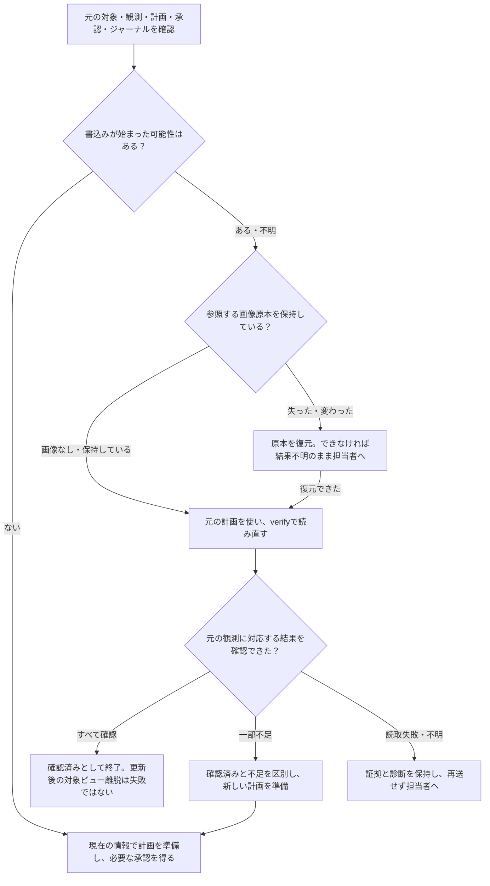

# プロフィール記録の文書・引き継ぎ確認

# 今回確認すること

対象は[Issue #39](https://github.com/flair-agency/live-agency/issues/39)のプロフィール部分である。
本番へ配備したProfile `2.0.0-m3.4`の業務受入れは完了している。
ここでは、担当者が資料を使って結果と次の行動を判断できるかを確認する。
本番登録を再実行したり、業務ルールを追加したりする作業ではない。

基準は[文書・Skill知識方針](../governance/document-knowledge-policy.md#human-understanding-and-substitution)。
その「文書を使って判断・代替・停止条件を説明する」という要件を、下の3ケースで確認する。
文書のLGTM、AIによる照合、本番処理の成功は、この確認の代わりにはならない。
[以前のパイロット案](skill-documentation-pilot-ja.md)は招待と旧構成の検討記録として残す。
プロフィールの今回の確認対象は本書に限定する。

# 読む資料と確認できた範囲

Skill文書の正本は、所有リポジトリーの指定基準ブランチに置く英語文書である。
今回は選択中の配布版と対応するソース版を照合する。本書は日本語のレビュー用資料であり、別の業務仕様ではない。

| 資料 | 読む目的 | 照合結果 |
| --- | --- | --- |
| [SKILL.md](https://github.com/flair-agency/live-agency-creator-profile-record/blob/1ac82a1088443177d7911e2744ec08616e941590/SKILL.md) | 目的、対象の選び方、何を記録するか、判断規則 | 配布済み版と一致。既存プロフィール値の上書き・削除をしないこと、未確認値をゼロにしないことを記載 |
| [入力仕様](https://github.com/flair-agency/live-agency-creator-profile-record/blob/1ac82a1088443177d7911e2744ec08616e941590/references/normalized-profile-observations.md) | 本人、観測時刻、各値の確認状態、画像原本 | 架空の入力例と、値・確認状態・画像ハッシュの規則を記載 |
| [配布済みフローと復旧手順](https://github.com/flair-agency/live-agency-creator-profile-record/blob/1ac82a1088443177d7911e2744ec08616e941590/references/environment-workflow.md) | 対象準備から読み直しまでの操作順序、承認、途中停止からの再開 | フロー図、操作例、結果不明時の診断、更新後に対象ビューから外れる場合を記載。画像原本の保持条件には下記の補足が必要 |
| 選択環境の運用記録と、選択されたProviderの資料 | 実際の取得先・保存先・権限・サービス固有の操作を確認 | 配布済みの取得手順と保存先Providerの読取・書込・復旧資料が存在し、ローカルで読めることを確認。サービスへの現在の接続可否や、人が入口を見つけられることは別途確認する |

取得側の操作は、Skillの`source`が返す選択済みの非公開手順を読む。
保存側は、運用記録で指定されたインストールのProvider資料を読む。
モジュール型の保存先capabilityの応答に、手順本文が必ず含まれるとは扱わない。
具体的なインストール先と補助資料の索引は、権限のある担当者向けの私有レビュー資料で示す。
公開Skillへ実環境や非公開の操作知識を複製しない。

# 見つかった文書上の不足と修正案

画像を含む観測の読み直し検証は、保存先だけでなく、元の観測が参照するローカル画像も開いて所有者・権限・サイズ・ハッシュを確認する。
従来の保存物一覧は計画・承認・ジャーナル・結果を挙げていたが、**検証を再開するには画像原本も同じパスと内容で必要**であることが明確でなかった。

英語ガイドに、画像原本を保持すること、失った場合は元の内容と権限で復元すること、復元できなければ結果不明を維持して担当者へ引き継ぐことを補足する。
古いレビューの画像情報を書き換えたり、書込みを再送したりする代替は追加しない。
あわせて、実環境のフィールド対応と業務スキーマの意味の所有を区別し、既存の純粋な計画関数のimport先を示す。
実装・契約・承認方式は変更しない。[Profile文書PR #13](https://github.com/flair-agency/live-agency-creator-profile-record/pull/13)の補足案は、まだ配布済み版には含まれていない。

# 引き継ぐときの流れ

本人の同一性、対象範囲、値と画像の一致は読み直しでも確認する。
対象ビューから外れたことだけを、登録失敗や再登録の根拠にはしない。
この図は既存の復旧手順の要約であり、新しい実行経路を定めない。

# 担当者に確認してほしい3ケース

すべて架空の例であり、サービス操作は不要。資料を参照しながら、**判断・次の行動・根拠にした資料**を短く説明する。
分からない場合は、推測せず「どこで迷ったか」を記録する。

| ケース | 渡す状況 | 説明してほしいこと |
| --- | --- | --- |
| A：保存前 | dueモードの対象manifestはalphaとbetaの2名のみ。2名とも現在のdue対象に含まれ、本人IDとアカウントが一意に一致し、観測時刻・入力形式・選択環境の検証も成功している。対象2名分の履歴を正常に読み取り、0件と確認した。alphaは表示名だけを観測でき、betaはどのプロフィール値も確認できなかった。画像はいずれもない | この前提で作成する履歴は何件か。betaをどう扱うか。前提を確認できない場合にも同じ結論にできるか。何を確認・承認してから保存するか |
| B：保存後に中断 | 2名とも元の観測・画像原本は保持。alphaは履歴・画像が一致し、更新後に対象ビューから外れた。betaはそれ以外の値と時刻が一致し、添付画像が空の履歴が1件ある。本人・範囲・時刻・一意性の条件は満たす | 誰を確認済みとするか。何が不足するか。古い保存要求を再送するか。次にどの計画・承認が必要か |
| C：結果不明 | 書込みを送った可能性があるが応答が途切れた。先に行った読み直しも認証段階で失敗した。その後の復旧準備で、元の観測が参照する画像ファイルを失ったと分かった | 成功・未処理・結果不明のどれか。残す証拠と復元するものは何か。誰の手順から切り分けるか。再送できるか |

資料の到達確認として、選択環境・取得手順・保存先の診断資料をどこから開くかも確認する。
サービスの認証情報や実データをレビュー回答に記載する必要はない。

## 照合に使う観点

これは暗記試験ではなく、資料を使った判断の確認である。
採用済み規則との対応を示すため、期待する判断を以下に置く。

- A：明示した前提では作成はalphaの1件。betaは未確認として保持し、値を作らない。対象・本人・時刻や履歴読取の前提を確認できなければ、この件数を確定せず不足を解消する。計画ハッシュ、作成・画像件数、対象と保存先を確認して承認する。
- B：alphaは確認済みで再登録しない。betaは画像追加の候補となる。読み直し結果とジャーナルを確認し、現在の条件に合う新計画と承認を得る。due対象から外れて新計画の条件を満たせない場合も、古いレビューを再利用しない。
- C：結果不明のまま扱う。認証段階の失敗は空の履歴や登録失敗を証明しない。計画・承認・ジャーナル・診断を保持し、選択されたProviderの手順と運用担当者に引き継ぐ。画像原本を復元するまで現行verifyも完了できない。書込みは再送しない。

# 確認記録と残る作業

| 項目 | 現在の状態 |
| --- | --- |
| 配布済み文書と実装の照合 | 実施済み。画像原本依存の説明不足を確認 |
| 修正案の文書・公開境界レビュー | 実施済み。業務意味・実行権限・本番構成を変更しない |
| 修正の採用・配布 | 未実施 |
| 担当者によるケースA/B/Cの説明 | 未実施 |
| 担当者が選択中の非公開手順へ到達できること | 未確認。ローカルの資料存在・読取確認とは区別する |

実施時はこの表を更新し、担当者、日付、参照した版、判断と迷った箇所を残す。
オーナーが文書を承認しただけで「人による確認済み」に変更しない。
プロフィールの技術的・本番業務受入れは維持する。招待部分が残るため、本書だけで#39全体を閉じない。

| 次の作業 | 人の担当 | 期限 | 要約・完了条件 | 参照 |
| --- | --- | --- | --- | --- |
| 文書補足の採用 | TBD | TBD | 画像保持・復旧条件の説明を確認し、修正を採用 | 本書、Profile文書PR #13 |
| プロフィールの引き継ぎ確認 | TBD | TBD | 3ケースと資料への到達結果を記録し、実際の不足を解消 | Issue #39 |
| 配布文書への反映確認 | TBD | TBD | 採用した補足が選択版に含まれることを確認 | Issue #39 |

# 作業範囲・AIレビュー

主分類G、プロフィールの文書とレビュー資料が対象。業務コード、Provider契約、親pin、配布版、本番設定とデータは変更しない。
rootの既存`runtime`変更を保持し、文書用worktreeを分離した。
独立worker（GPT-6 Astra / low）は配布文書を6つの知識項目と実装に照合し、画像原本の依存を指摘した。
コーディネーターも実装の参照先と復旧説明を確認した。追加の読取レビューで、正本と配布版を混同する記述を修正した。これは人の理解を代替する確認ではない。

根拠は既存の[知識方針](../governance/document-knowledge-policy.md)、[言語方針](../governance/document-language-policy.md)、[所有方針](../architecture/domain-knowledge-ownership.md)、[Private Source Integration Guide](../governance/private-source-integration-guide.md)。
本番稼働、文書の採用、画像原本を必要とする実装上の制約、人による確認の未実施を区別した。
日本語の本書と英語の配布文書案の意味、フローと本文を照合した。相対リンク8件（見出し2件を含む）、固定ソースへの参照3件、配布済み文書3件と対応ソースの一致、変更ガイドが配布対象に含まれることを確認した。
選択インストールの補助資料9件は、私有索引に記録し存在とローカル読取りを確認した。図は構造を確認し、GitHub上の描画は未確認。コードを変更しないためユニットテストは追加・反復していない。
復旧はこの文書差分の取り下げで可能。本番のサービス操作は0件。

## PR #72のレビュー対応

[ケースAの前提不足の指摘](https://github.com/flair-agency/live-agency/pull/72#discussion_r3998397857)に対応し、現在のdue対象、manifestの範囲、本人・時刻・入力の検証と、正常な履歴読取で0件と確認したことを明記した。
隣接例の確認で、ケースBも「添付画像が空の一致履歴が1件」という既存の追補条件へ具体化した。`targetIssues`と`buildProfileSyncPlanFromHistory`の既存条件に照合し、新しい競合条件や画像の置換規則は追加していない。
