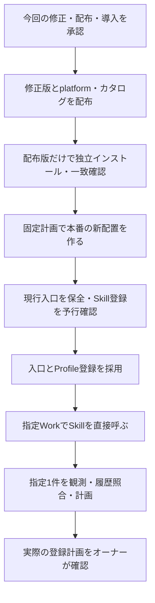

# Profileを本番のWorkで試せる状態にする

今回の判断対象は、配布時に見つかった依存の修正と、具体化した本番導入です。導入後はChatGPT Work Localの「C|OPS|エージェンシー運営」でProfile Skillを直接呼び、指定済みの `._.nanika7` 1件を取得・計画まで試せる状態を確認します。

# 配布で確認したこと

RuntimeとLarkの固定版は非公開配布と再インストール検査が成功し、候補アーカイブとの一致も確認できました。

| 配布物 | 版・状態 | 証跡 |
| --- | --- | --- |
| Runtime | `2.0.0-m3.0` 配布済み | [成功run](https://github.com/flair-agency/live-agency-provider-runtime/actions/runs/34487935233)、main `1f45ae5936980013097202bd570378a8ed5fa747` |
| Lark Base Provider | `1.4.0-m3.0` 配布済み | [成功run](https://github.com/flair-agency/live-agency-provider-lark-base/actions/runs/34488080826)、main `5e66a82ffa8d722248ac7141a56417dad1a6e109` |
| Profile Skill | `.0` 配布済み・事後検査失敗、`2.0.0-m3.1` が修正候補 | [失敗run](https://github.com/flair-agency/live-agency-creator-profile-record/actions/runs/34488190609)、修正commit `eee6755f9f8e57196c146361bd4000d99f92d676` |
| TikTok platform / カタログ | ともに `0.1.0-m3.0` 未配布 | Profileの選択版を `.1` へ変更 |

Profile `.0` の配布先メタデータでは、Runtimeのpeer依存は残る一方、任意扱いの指定が欠落していました。そのため単体インストールがRuntimeも取得しようとし、配布ワークフローの認証では `read_package` 403となりました。実アーカイブの破損ではありません。新たな読取権限の追加でこの自動依存を認めるのではなく、`.1` でpeer宣言を除き、Runtimeは採用済みの環境が供給する構成を維持します。

業務コード・Skill手順は変更していません。修正アーカイブを単体で実インストールし、Runtime・具体Providerが追加されず、全exportをimportできることを確認済みです。配布の前後双方に同じ検査を追加しました。公開内容と差分検査も成功しています。検証レポートは `/private/tmp/profile-m3-standalone-fix-20260910/report.json`、SHA-256 `e893e0d764d255de0ab82d0535ba117898dcd4e9df2a1ef939b847f0ec837a4e` です。修正版そのもののregistry検証は配布後に行います。

# 本番で採用する範囲

- 環境は既存の `operations / production / tiktok`。既存の利用者・認証参照・テナント・Base・プロフィール保存先・読取権限を維持します。
- Runtime `.m3.0`、Lark `1.4.0-m3.0`、Profile `2.0.0-m3.1`、platform / catalog `0.1.0-m3.0` を固定版から新規配置します。既存配置へ上書きしません。
- 読取設定を変更せず、書込用に `records:batch-create`（履歴追加）、`media:upload`（画像送信）、`attachments:append`（既存履歴の不足画像追加）を選択します。これは後続の承認済み業務計画を扱う設定です。設定採用だけでデータを登録するわけではありません。
- 既存の起動入口・RuntimeホストSkill・運用ガイドの3ファイルを更新し、`live-agency-creator-profile-record` を新規登録します。Runtimeが業務Skillを起動する構造にはしません。
- 指定Workで起動・版・環境を確認し、`._.nanika7` の対象準備・プロフィール観測・既存履歴の限定読取・登録計画まで検証します。実際の登録は、その計画・ハッシュ・件数への承認後です。スケジュールは変更しません。

具体的な保存先と変更前後のハッシュは、端末内の私的な `deployment-plans/profile-2.0.0-m3.1/deployment-review.json` に保存済みです。

| 固定対象 | 値 |
| --- | --- |
| インストール計画SHA-256 | `87947d3bcb527518c0b8a13bdaea341f2e425256277912d4a61ea484d5ab814f` |
| 書込設定案SHA-256 | `631733badd0066c1c5486237560714e8043470e63189f042eabee69c316da40c` |
| 変更しない読取設定SHA-256 | `b16d7a4f395cfa34f71304c5f6ff9a703c8db626168c2a1950b3e42a4d8129be` |
| 新配置 | `~/.local/share/live-agency/production/installations/runtime-2.0.0-m3.0-profile-2.0.0-m3.1` |
| 新Skill登録先 | `~/.agents/skills/live-agency-creator-profile-record`（確認時は未登録） |
| 復旧先 | 現行のRuntime / Lark `.m2.1` 構成と3入口。新規Skill登録はreceiptで取り消す |

本番の新しいgenerationは、承認された固定計画のインストール結果から取得します。現在のgenerationを流用したり、未実行の値を生成したりしません。登録直前にも対象が未登録であることを確認します。

# 完了条件・限界・復旧

完了条件は、指定Workが登録したProfile Skillと固定環境を認識し、指定1件の対象準備と計画へ進めることです。ローカルの起動成功だけを本番受入にしません。データ取得が認証・権限・画面操作で止まる場合は、その段階と実際の結果を報告し、受入完了としません。

配布後は各アーカイブのintegrityと固定版を照合します。現在のM2.1入口・mode・ハッシュは検査済みで、切替直前にも一致確認して保存します。復旧はこの時点の3入口と新規Skill登録だけを戻します。前回のM2.0への復旧記録は流用せず、旧配置と設定を保持します。コードの復旧で外部データの変更が取り消されるわけではありません。

既存のwriterには全件事前確認が残り、実際の書込所要時間・画像を含む業務成功は未検証です。今回の計画までの試用と、その後の実書込受入を分けて結果を記録します。

# AI事前レビューと残る判断

[文書・Skill知識方針](../governance/document-knowledge-policy.md)、[言語方針](../governance/document-language-policy.md)、[開発方針](../governance/development-policy.md)、[Private Source Integration Guide](../governance/private-source-integration-guide.md)に基づき、実差分と私的な設定案・入口案を確認しました。修正は依存メタデータと配布検査に限定し、業務判断を変更していません。Providerの既存契約で主体・保存先・操作の整合をオフライン確認しましたが、APIへの権限・接続確認とは扱っていません。入口案の旧候補番号・設定参照を訂正し、図と実施順、証拠・未検証・復旧を照合しました。

オーナーに確認するのは、修正版のソース採用・非公開配布、上記固定計画による本番導入・3入口更新・Skill登録、指定1件の取得と計画までの検証です。前回の配布承認は `.0` までで本番導入を含まなかったため、変更された版と具体化した本番操作をここでまとめて提示しています。
