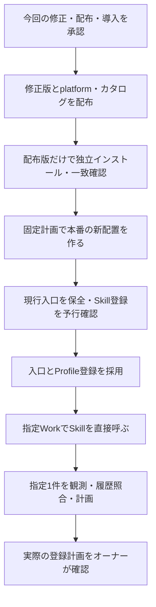

# 実施記録：固定配布・本番採用完了、計画作成は読取エラーで未完了

オーナーのLGTMにより、修正版のmain統合・非公開配布、固定計画による本番導入、3入口更新、Profile Skill登録、指定1件の取得・計画までの検証が承認されました。[親PR #54](https://github.com/flair-agency/live-agency/pull/54)と[Skill PR #4](https://github.com/flair-agency/live-agency-creator-profile-record/pull/4)はmainへ統合済みです。

| 対象 | 実際の結果 |
| --- | --- |
| Runtime | `2.0.0-m3.0`、[run 34487935233](https://github.com/flair-agency/live-agency-provider-runtime/actions/runs/34487935233)成功、main `1f45ae5936980013097202bd570378a8ed5fa747` |
| Lark Base Provider | `1.4.0-m3.0`、[run 34488080826](https://github.com/flair-agency/live-agency-provider-lark-base/actions/runs/34488080826)成功、main `5e66a82ffa8d722248ac7141a56417dad1a6e109` |
| Profile Skill | `2.0.0-m3.1`、[run 34491014611](https://github.com/flair-agency/live-agency-creator-profile-record/actions/runs/34491014611)成功、main `8468b5df83c87e38ae5823b64409f42f4713d86f` |
| TikTok platform | `0.1.0-m3.0`、[run 34491162433](https://github.com/flair-agency/live-agency/actions/runs/34491162433)成功、main `6b45205b8b0c431306369be71d687e19ce9ab85e` |
| カタログ | [catalog-v0.1.0-m3.0](https://github.com/flair-agency/live-agency/releases/tag/catalog-v0.1.0-m3.0)を版付きリリースとして保存・再取得照合 |
| registry独立検証 | 私有 `profile-m3-registry-proof-20260910-2/report.json` は `passed` |
| 本番導入・登録・入口 | 同じ私有stageの `installation.receipt.json` は `installed`、`skill-registration.receipt.json` は `applied`、`host-files.receipt.json` は `adopted` |

カタログの再取得SHA-256は `3f6f48e8e43c66df97733c2296fe4ea44b80f2d5b08e62601fdb423df81f6f48`。APIの `immutable` は `false` のため、技術的な変更不能性は主張しません。

現在の本番は `operations / production / tiktok`、generation `c302bd63a9d0af7c6eb6463d36045c1ce50003e000f4d4a2ffe2a2c7c9c4e4c8` です。上記固定版を新配置へ導入し、Profile Skillを別登録しました。Runtimeは環境確認・能力解決を担当し、業務Skillを起動しません。主体・保存先・読取設定を保持し、書込設定は別参照として採用しました。storageは未選択、更新は手動です。

指定Work「C|OPS|エージェンシー運営」で、登録Skillの発見と直接起動、版・世代・計画SHAの一致を確認しました。最初の対象読取は失敗しましたが、同じ設定の直接読取は1,374件で成功し、その後のSkill対象準備も指定1件で成功しました。プロフィール1件・投稿8件を正規化しましたが、画像ファイルは取得できていません。コンテキストメニューの操作で保存メニュー／ローカルファイルを得られず、取得不可の根本原因は未確定です。

Skillの計画作成は再び PROFILE_DATASTORE_READ_FAILED で停止しました。最後の限定履歴診断は4.869秒で read-fields の失敗を返し、履歴読取完了・登録計画SHA・追加予定件数は未確認です。計画関数は対象者を再確認してから履歴を読むため、詳細を捨てた元のCLIエラーだけで履歴処理への到達を断定しません。ネイティブAPIの失敗原因も未特定です。Workの追加診断はクレジット不足のエラーで終了しました。見積もりを超過し、再試行は停止しています。

本番導入成功と業務受入を分け、Issue #32はBlockedとして記録します。業務書込み・画像アップロードは0件。M3受入は未完了で、次回は既存の失敗記録と、Skillが失っているProvider段階の情報を起点に原因を絞り、同じ試験を繰り返さないことを再開条件とします。実登録は具体的な計画・hash・件数への承認後です。

直近の復旧先はRuntime `2.0.0-m2.1`／Lark `1.4.0-m2.1`／platform `0.1.0-m1.0`／catalog `0.1.0-m2.1`。今回のhost receiptの変更前3コピー・modeを戻し、新規Profile登録はregistration receiptで復旧します。前回のLark m2.0用コピーは流用しません。旧配置・設定・証跡を保持し、入口復旧を外部データの取消しと扱いません。

AIポリシーレビューでは、下段にリンクした文書知識・言語・開発方針とPrivate Source Integration Guideを根拠に、実receiptの状態・世代、現在／履歴／復旧先、配布とWork受入の区別を照合しました。旧提案を履歴として区別し、[移行状況](../migration/status.md)と現行状態を一致させました。文書差分と変更した相対リンクを確認し、この文書更新では保存済みの実施証跡だけを参照しました。Workの完走や原因特定は主張していません。残る作業は読取失敗原因の特定、画像取得と計画作成の実確認です。診断記録は本番の私有stage内 evidence/ に保存し、業務データはこの文書へ転載しません。

# 承認時レビュー（履歴）

以下はLGTMで採用された提案時点の記録です。未配布・未導入・将来実施という記述は当時の状態であり、現在の結果は上段を参照してください。

# Profileを本番のWorkで試せる状態にする

今回の判断対象は、配布時に見つかった依存の修正と、具体化した本番導入です。導入後はChatGPT Work Localの「C|OPS|エージェンシー運営」でProfile Skillを直接呼び、指定済みの `._.nanika7` 1件を取得・計画まで試せる状態を確認します。

# 配布で確認したこと

RuntimeとLarkの固定版は非公開配布と再インストール検査が成功し、候補アーカイブとの一致も確認できました。

| 配布物 | 版・状態 | 証跡 |
| --- | --- | --- |
| Runtime | `2.0.0-m3.0` 配布済み | [成功run](https://github.com/flair-agency/live-agency-provider-runtime/actions/runs/34487935233)、main `1f45ae5936980013097202bd570378a8ed5fa747` |
| Lark Base Provider | `1.4.0-m3.0` 配布済み | [成功run](https://github.com/flair-agency/live-agency-provider-lark-base/actions/runs/34488080826)、main `5e66a82ffa8d722248ac7141a56417dad1a6e109` |
| Profile Skill | `.0` 配布済み・事後検査失敗、`2.0.0-m3.1` が修正候補 | [失敗run](https://github.com/flair-agency/live-agency-creator-profile-record/actions/runs/34488190609)、修正commit `eee6755f9f8e57196c146361bd4000d99f92d676` |
| TikTok platform / カタログ | ともに `0.1.0-m3.0` 未配布 | Profileの選択版を `.1` へ変更 |

Profile `.0` の配布先メタデータでは、Runtimeのpeer依存は残る一方、任意扱いの指定が欠落していました。そのため単体インストールがRuntimeも取得しようとし、配布ワークフローの認証では `read_package` 403となりました。実アーカイブの破損ではありません。新たな読取権限の追加でこの自動依存を認めるのではなく、`.1` でpeer宣言を除き、Runtimeは採用済みの環境が供給する構成を維持します。

業務コード・Skill手順は変更していません。修正アーカイブを単体で実インストールし、Runtime・具体Providerが追加されず、全exportをimportできることを確認済みです。配布の前後双方に同じ検査を追加しました。公開内容と差分検査も成功しています。検証レポートは `/private/tmp/profile-m3-standalone-fix-20260910/report.json`、SHA-256 `e893e0d764d255de0ab82d0535ba117898dcd4e9df2a1ef939b847f0ec837a4e` です。修正版そのもののregistry検証は配布後に行います。

# 本番で採用する範囲

- 環境は既存の `operations / production / tiktok`。既存の利用者・認証参照・テナント・Base・プロフィール保存先・読取権限を維持します。
- Runtime `.m3.0`、Lark `1.4.0-m3.0`、Profile `2.0.0-m3.1`、platform / catalog `0.1.0-m3.0` を固定版から新規配置します。既存配置へ上書きしません。
- 読取設定を変更せず、書込用に `records:batch-create`（履歴追加）、`media:upload`（画像送信）、`attachments:append`（既存履歴の不足画像追加）を選択します。これは後続の承認済み業務計画を扱う設定です。設定採用だけでデータを登録するわけではありません。
- 既存の起動入口・RuntimeホストSkill・運用ガイドの3ファイルを更新し、`live-agency-creator-profile-record` を新規登録します。Runtimeが業務Skillを起動する構造にはしません。
- 指定Workで起動・版・環境を確認し、`._.nanika7` の対象準備・プロフィール観測・既存履歴の限定読取・登録計画まで検証します。実際の登録は、その計画・ハッシュ・件数への承認後です。スケジュールは変更しません。

具体的な保存先と変更前後のハッシュは、端末内の私的な `deployment-plans/profile-2.0.0-m3.1/deployment-review.json` に保存済みです。

| 固定対象 | 値 |
| --- | --- |
| インストール計画SHA-256 | `87947d3bcb527518c0b8a13bdaea341f2e425256277912d4a61ea484d5ab814f` |
| 書込設定案SHA-256 | `631733badd0066c1c5486237560714e8043470e63189f042eabee69c316da40c` |
| 変更しない読取設定SHA-256 | `b16d7a4f395cfa34f71304c5f6ff9a703c8db626168c2a1950b3e42a4d8129be` |
| 新配置 | `~/.local/share/live-agency/production/installations/runtime-2.0.0-m3.0-profile-2.0.0-m3.1` |
| 新Skill登録先 | `~/.agents/skills/live-agency-creator-profile-record`（確認時は未登録） |
| 復旧先 | 現行のRuntime / Lark `.m2.1` 構成と3入口。新規Skill登録はreceiptで取り消す |

本番の新しいgenerationは、承認された固定計画のインストール結果から取得します。現在のgenerationを流用したり、未実行の値を生成したりしません。登録直前にも対象が未登録であることを確認します。

# 完了条件・限界・復旧

完了条件は、指定Workが登録したProfile Skillと固定環境を認識し、指定1件の対象準備と計画へ進めることです。ローカルの起動成功だけを本番受入にしません。データ取得が認証・権限・画面操作で止まる場合は、その段階と実際の結果を報告し、受入完了としません。

配布後は各アーカイブのintegrityと固定版を照合します。現在のM2.1入口・mode・ハッシュは検査済みで、切替直前にも一致確認して保存します。復旧はこの時点の3入口と新規Skill登録だけを戻します。前回のM2.0への復旧記録は流用せず、旧配置と設定を保持します。コードの復旧で外部データの変更が取り消されるわけではありません。

既存のwriterには全件事前確認が残り、実際の書込所要時間・画像を含む業務成功は未検証です。今回の計画までの試用と、その後の実書込受入を分けて結果を記録します。

# AI事前レビューと残る判断

[文書・Skill知識方針](../governance/document-knowledge-policy.md)、[言語方針](../governance/document-language-policy.md)、[開発方針](../governance/development-policy.md)、[Private Source Integration Guide](../governance/private-source-integration-guide.md)に基づき、実差分と私的な設定案・入口案を確認しました。修正は依存メタデータと配布検査に限定し、業務判断を変更していません。Providerの既存契約で主体・保存先・操作の整合をオフライン確認しましたが、APIへの権限・接続確認とは扱っていません。入口案の旧候補番号・設定参照を訂正し、図と実施順、証拠・未検証・復旧を照合しました。

オーナーに確認するのは、修正版のソース採用・非公開配布、上記固定計画による本番導入・3入口更新・Skill登録、指定1件の取得と計画までの検証です。前回の配布承認は `.0` までで本番導入を含まなかったため、変更された版と具体化した本番操作をここでまとめて提示しています。
