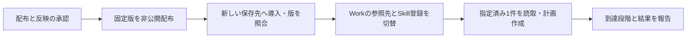

# 書き込み診断改善の配布・本番反映レビュー

本書は日本語のレビュー案です。3件の実装修正は承認されmainへ統合済みです。今回は、その修正を含む固定版の配布と、本番Workへの反映・読取検証をまとめて判断します。

元の書き込み失敗の原因は未確定です。今回の修正は、失敗した認証チェックと元の書き込み・後続の読み取りの診断を失わずに返すためのものです。接続障害そのものの解消を意味しません。

# 更新対象

| 対象 | 現在の本番 | 更新候補 |
| --- | --- | --- |
| Runtime | `2.0.0-m3.0` | 同じ版を使用 |
| Transport | `1.1.2` | `1.1.3` |
| Lark Base Provider | `1.4.0-m3.2` | `1.4.0-m3.3` |
| Profile Skill | `2.0.0-m3.2` | `2.0.0-m3.3` |
| TikTok platform | `0.1.0-m3.1` | `0.1.0-m3.2` |
| カタログ | `0.1.0-m3.2` | `0.1.0-m3.3` |
| Lark CLI / TikTok Web Provider | `1.0.93` / `1.1.0` | 同じ版を使用 |

Providerは新しいTransportを厳密な版で参照します。Platformは利用可能なProfile Skillの版だけを進め、取得Providerとその依存は維持します。保存済みの `operations / production / tiktok`、認証主体、保存先、列定義の設定、許可操作、更新方針は維持します。

採用済みソース: [Transport #7](https://github.com/flair-agency/live-agency-lark-transport/pull/7)、[Provider #16](https://github.com/flair-agency/live-agency-provider-lark-base/pull/16)、[Profile #8](https://github.com/flair-agency/live-agency-creator-profile-record/pull/8)。今回のコード差分は固定版・参照先と選択用メタデータです。

# 実行する範囲

1. 配布準備PRの対象コミットをmainへ統合し、既存のGitHub ActionsでTransport、Provider、Profile、Platformを順に非公開配布します。Transportは既存の通常タグ、他3件は`next`です。カタログは`catalog-v0.1.0-m3.3`の変更しないリリース添付として配布します。
2. 配布版・アーカイブのintegrity・非公開設定を照合した後、新しいinstallationへ導入します。既存の本番installationは保持します。
3. 固定CLIの公式初期化手順で必要な実行ファイルを準備し、版とチェックサムを確認します。全依存のライフサイクルスクリプトを一括有効にはしません。
4. 導入済みRuntimeで実際のgenerationを取得します。準備した3つのホストファイルとProfile Skill登録を切り替え、変更前後のハッシュと復旧receiptを残します。
5. 本番はChatGPT Work Local「C|OPS|エージェンシー運営」です。指定済みの失敗対象1件について、実際のWork経路で保存先の読取を確認し、有効な入力がある場合に新しい計画を作成します。古いgenerationの承認receiptを書き換えたり、元の登録を再送したりしません。新規登録・画像添付はこの実行範囲に含めません。

# 準備・確認結果

- 対象4パッケージの実アーカイブを作成し、版・integrity・収録内容を確認しました。Provider lockのTransport integrityは実アーカイブから取得しています。
- 実アーカイブのTransport・Providerの診断処理・Skillを接続した合成確認1件は成功しました。認証状態の`verified:false`、元の書き込み失敗、読み取り失敗、ログ保存失敗を区別したまま保持し、書き込みの再送をしないことを確認しました。
- この確認は既存開発依存と中立Runtimeの代役を使っています。正式installation、Providerの書込executor全経路、サービス接続、Work受入の証明ではありません。
- インストール済みRuntimeが生成した計画のハッシュは `0397a9b8a5561718158c089675a15392571d4d828d83647f1cafd64e40da471f` です。保存先設定2件のハッシュが現行と一致し、必要な3機能を選択できることを確認しました。
- 既存ソース検証はTransport30件、Provider14件、Profile/Journal10件が成功しています。今回は変更していないコードの同じテストを繰り返していません。
- パッケージ版一覧のAPIは`read:packages`不足で403でした。候補版の未使用は未確認です。配布時に既存版との衝突と配布物を検証し、不一致なら切替前に停止します。

# 復旧と残る検証

即時の復旧先は現在のauthentication diagnostics installationです。generationは `87fe6e04dcc34b37259d53ac699eccb858193c3ba469570c9dbbf6a209b4f515`。以前のread-recovery版まで戻す計画ではありません。

Skill登録の復旧receiptと3つのホストファイルの保存済みコピーを使います。変更後に別の更新があった場合は上書きせず照合します。新旧installationと診断証跡は残します。ローカル構成の復旧は外部データの取り消しではありません。

[Issue #61](https://github.com/flair-agency/live-agency/issues/61)は実際の検証まで継続します。読取が成功しても元の失敗原因や業務完了を断定しません。再度失敗した場合は今回追加した段階情報を保存して原因を絞ります。

# 証跡と判断範囲

このCodexタスクのowner専用記録は `tmp/profile-development-repro-20260911/write-diagnostic-release/` です。`deployment-review.json`、`plan.json`、`composition-result.json`、`archives/`、`host-before-*`、`host-proposed-*`を参照できます。実際のアカウント・保存先識別子・認証情報はGitHub文書へ転記しません。適用時はこの記録を運用側の `profile-write-diagnostics-20260911` として保持します。

今回の判断対象は、この固定版一式の配布・新しいinstallationへの導入・ホスト切替・指定済み1件の読取と有効入力からの計画作成です。実データ登録は実際の新しい計画を確認して扱います。これは既に承認された実装修正の再承認依頼ではありません。
