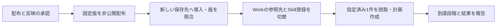

# 書き込み診断改善の配布・本番反映レビュー

本書はオーナーのLGTMで採用された日本語レビュー履歴です。正本は[英文採用文書](../development/profile-write-diagnostic-adoption.md)です。以下の準備・検証結果は承認時点の記録として保持します。承認は配布・本番反映・Work検証の完了を意味しません。3件の実装修正は承認されmainへ統合済みです。今回の採用対象は、その修正を含む固定版の配布と、本番Workへの反映・読取検証です。

元の書き込み失敗の原因は未確定です。今回の修正は、失敗した認証チェックと元の書き込み・後続の読み取りの診断を失わずに返すためのものです。接続障害そのものの解消を意味しません。

# 更新対象

| 対象 | 現在の本番 | 更新候補 |
| --- | --- | --- |
| Runtime | `2.0.0-m3.0` | 同じ版を使用 |
| Transport | `1.1.2` | `1.1.3` |
| Lark Base Provider | `1.4.0-m3.2` | `1.4.0-m3.3` |
| Profile Skill | `2.0.0-m3.2` | `2.0.0-m3.3` |
| TikTok platform | `0.1.0-m3.1` | `0.1.0-m3.2` |
| カタログ | `0.1.0-m3.2` | `0.1.0-m3.3` |
| Lark CLI / TikTok Web Provider | `1.0.93` / `1.1.0` | 同じ版を使用 |

Providerは新しいTransportを厳密な版で参照します。Platformは利用可能なProfile Skillの版だけを進め、取得Providerとその依存は維持します。保存済みの `operations / production / tiktok`、認証主体、保存先、列定義の設定、許可操作、更新方針は維持します。

採用済みソース: [Transport #7](https://github.com/flair-agency/live-agency-lark-transport/pull/7)、[Provider #16](https://github.com/flair-agency/live-agency-provider-lark-base/pull/16)、[Profile #8](https://github.com/flair-agency/live-agency-creator-profile-record/pull/8)。配布準備PRの差分は固定版・参照先と選択用メタデータ、およびレビュー文書です。

# 実行する範囲

1. 配布準備PRの対象コミットをmainへ統合し、既存のGitHub ActionsでTransport、Provider、Profile、Platformを順に非公開配布します。Transportは既存の通常タグ、他3件は`next`です。カタログは`catalog-v0.1.0-m3.3`の変更しないリリース添付として配布します。
2. 配布版・アーカイブのintegrity・非公開設定を照合した後、新しいinstallationへ導入します。既存の本番installationは保持します。
3. 固定CLIの公式初期化手順で必要な実行ファイルを準備し、版とチェックサムを確認します。全依存のライフサイクルスクリプトを一括有効にはしません。
4. 導入済みRuntimeで実際のgenerationを取得します。準備した3つのホストファイルとProfile Skill登録を切り替え、変更前後のハッシュと復旧receiptを残します。
5. 本番はChatGPT Work Local「C|OPS|エージェンシー運営」です。指定済みの失敗対象1件について、実際のWork経路で保存先の読取を確認し、有効な入力がある場合に新しい計画を作成します。古いgenerationの承認receiptを書き換えたり、元の登録を再送したりしません。新規登録・画像添付はこの実行範囲に含めません。

# 準備・確認結果

- 対象4パッケージの実アーカイブを作成し、版・integrity・収録内容を確認しました。Provider lockのTransport integrityは実アーカイブから取得しています。
- 実アーカイブのTransport・Providerの診断処理・Skillを接続した合成確認1件は成功しました。認証状態の`verified:false`、元の書き込み失敗、読み取り失敗、ログ保存失敗を区別したまま保持し、この合成確認で書き込みの呼び出しが1回であることを確認しました。
- この確認は既存開発依存と中立Runtimeの代役を使っています。正式installation、Providerの書込executor全経路、サービス接続、Work受入の証明ではありません。
- インストール済みRuntimeが生成した計画のハッシュは `0397a9b8a5561718158c089675a15392571d4d828d83647f1cafd64e40da471f` です。保存先設定2件のハッシュが現行と一致し、必要な3機能を選択できることを確認しました。
- 既存ソース検証はTransport30件、Provider14件、Profile/Journal10件が成功しています。今回は変更していないコードの同じテストを繰り返していません。
- パッケージ版一覧のAPIは`read:packages`不足で403でした。候補版の未使用は未確認です。配布時に既存版との衝突と配布物を検証し、不一致なら切替前に停止します。

# 復旧と残る検証

即時の復旧先は現在のauthentication diagnostics installationです。generationは `87fe6e04dcc34b37259d53ac699eccb858193c3ba469570c9dbbf6a209b4f515`。以前のread-recovery版まで戻す計画ではありません。

承認後の切替時に新しく生成するSkill登録の復旧receiptと、3つのホストファイルの保存済みコピーを使います。新しいreceiptは未生成です。保存した `previous/skill-registration.receipt.json` は現行構成の採用証跡であり、今回の切替を戻すためには使いません。その旧receiptで復旧すると、さらに前のread-recovery版へ戻ってしまうためです。変更後に別の更新があった場合は上書きせず照合します。新旧installationと診断証跡は残します。ローカル構成の復旧は外部データの取り消しではありません。

[Issue #61](https://github.com/flair-agency/live-agency/issues/61)は実際の検証まで継続します。読取が成功しても元の失敗原因や業務完了を断定しません。再度失敗した場合は今回追加した段階情報を保存して原因を絞ります。

# 証跡と判断範囲

2026-09-11 19:22 JST、承認前の証跡を次の永続保存先へコピーして照合しました。リポジトリーや一時作業ディレクトリを削除しても、この保存先から取得できます。

- 保存先: `/Users/naokikimura/.local/share/live-agency/deployment-plans/profile-write-diagnostics-20260911`
- 保存・取得ユーザー: このMacの `naokikimura`（UID `501`）。全ディレクトリ `0700`、全ファイル `0600` を実測しました。
- 取得手順: 上記ユーザーでFinderの「移動」→「フォルダへ移動」に保存先を入力し、`README.md`、`record.json`、`deployment-review.json` の順に確認します。索引は次のSHA-256と照合し、使用するファイルも索引のハッシュと照合します。
- `record.json` SHA-256: `126e1d15f22320d7d82838a5d4a05a58c031ed357efe00edb65771c33e184461`

索引には70ファイルを収録し、全ハッシュを照合しました。計画・選択設定・カタログ・対象ソースのコミット・配布アーカイブとintegrity・変更前後のホストファイル・検証結果を含みます。元の32ファイルと元索引は `original-preparation/` に同一内容で保持し、現行構成の導入・切替・Skill登録・CLI初期化receiptの4件は `previous/` に原本と一致するコピーを保存しました。

現在使用する `selection.json` と `deployment-review.json` の証跡参照はこの永続保存先へ変更しました。registry設定も既存の環境変数プレースホルダーだけを保存しています。固定Runtimeで移設後の選択設定から計画を再計算し、元の計画と全内容・計画ハッシュが一致しました。現行ホストファイル3件・Skill参照先・環境ハッシュも再照合済みです。

別担当者への引継ぎはownerが許可した非公開経路で記録一式を渡し、同じ索引ハッシュを照合します。他ユーザーへのアクセス許可、別端末へのバックアップ、他担当者による取得実演は実施していません。同一Mac内の永続保存であり、端末喪失への備えまで完了したという意味ではありません。実際のアカウント・保存先識別子・認証情報はGitHub文書へ転記しません。元の準備スクリプトと合成確認は履歴資料として保持しており、別環境でそのまま再実行する配備ツールではありません。

# AI方針レビュー結果

実施日: 2026-09-11。Codexが配布準備差分と根拠資料を確認しました。適用方針は [文書・Skill知識方針](../governance/document-knowledge-policy.md#ai-review-before-requesting-owner-approval)、[開発方針](../governance/development-policy.md)、[言語方針](../governance/document-language-policy.md)、全文確認済みの [Private Source Integration Guide](../governance/private-source-integration-guide.md) です。

| 確認した点 | 実際の確認・訂正 |
| --- | --- |
| 変更と責務の境界 | 採用済み実装と配布候補を照合し、固定依存とアーカイブ内容を確認。Skillへの具象依存追加や業務規則・認証・再送規則の変更はありません。 |
| 判断状態と根拠 | 実装採用済み、配布・本番切替はpending、合成確認とWork検証は別であることを確認。元の失敗原因は未確定のままです。 |
| 人による理解と復旧 | 図と5段階の手順、失敗時の停止点、即時復旧先を照合。旧Skill登録receiptと切替時に生成する新receiptの用途を明記しました。 |
| 証跡・参照・言語 | PRから取得できない作業用保存先への依存を訂正し、承認前にowner専用領域へ保存・全ハッシュ照合。参照先、日本語pendingレビュー、実データをGitHubへ持ち込まない境界を確認しました。 |
| レビュー記録 | ローカルにしかなかったセルフレビューの具体的な結果と限界を本書へ追加。永続記録の `self-review-ja.md` と `custody-verification.json` でも確認できます。 |

残る検証は、配布時の版衝突・配布物確認、正式installation、実際のWork経路、元の書き込み失敗の原因です。このセルフレビューは独立したPRレビュー、人による引継ぎ実演、配布・本番操作の承認、業務完了の証明を代替しません。

今回の判断対象は、この固定版一式の配布・新しいinstallationへの導入・ホスト切替・指定済み1件の読取と有効入力からの計画作成です。実データ登録は実際の新しい計画を確認して扱います。これは既に承認された実装修正の再承認依頼ではありません。
