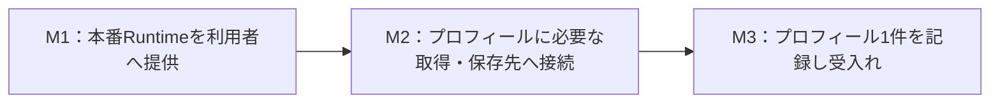

# Runtime本番化と最初の1スキルの提供計画

ユーザーが指定した目的は、本番環境でRuntimeを先に使えるようにし、その上でまず1スキルを動かすことである。M1＝Runtime、M2＝Provider、M3＝Skillを、それぞれ利用者に提供する区切りとして扱う。全Provider・全Skillの移行完了を本番提供の前提にしない。

2026-09-10、オーナーが本計画を承認し、90分を上限として実行するよう指示した。[英語の採用文書](../migration/runtime-first-delivery.md)を参照。この記録は日本語の承認履歴である。以下の提案時記述は履歴として残し、初回30分案は今回の90分上限に置き換える。過去の開発検証を本番受入れに読み替えず、業務仕様を追加・変更しない。

## 実行開始 — 2026-09-10 02:31:53 JST

上限時刻は04:01:53 JST。主分類D、副分類F/G。対象はRuntimeの配布済み入口と本番ホスト接続、親の配布記録。既存Skill/Providerの業務契約は不変。本番配置は `/Users/naokikimura/.local/share/live-agency/production/`、接続用の新規ホスト登録は `/Users/naokikimura/.agents/skills/live-agency-runtime/` を使用し、既存の旧Skillリンクと無効設定は保存する。本番操作はローカルパッケージ導入・入口登録に限定し、サービスへの読書きや定期実行は含めない。並列エージェントなし。

配布前セルフレビュー：既存ローダーを再利用し、Runtime起動時に無関係な月次処理を読み込む依存を除いた。実際の起動テストでSkill本文、Provider指示とAPIの読み込みを確認し、ソースリンク付きlockを拒否することを確認した。共通起動分岐と必須caller inventoryも通過。最初の合成Providerにpeer宣言が不足していたテスト不備は修正し、該当2件だけ再実行して通過した。出力には任意設定値を展開せず、業務完了をfalseと明記する。本番への変更は固定版1.3.0の私有配布と新規独立配置、Codex接続手順であり、既存の本番データや稼働登録の上書きは行わない。復旧は今回追加した入口の登録解除で、旧状態を残す。現時点で実サービス動作と新しいタスクでの自動選択は未確認。

# 最初の1スキルと現在の不足

この節以降の不足・提案は計画時点の記録。最新のM1結果は次の実行結果を参照する。

## M1実行結果 — 2026-09-10

- Runtime `1.3.0`、所有者コミット `052a2a4c4bee06709fdfafb18cc24e334d7fab10` を私有公開。[公開・独立導入検証](https://github.com/flair-agency/live-agency-provider-runtime/actions/runs/34384698367)が成功。
- 本番導入先は `/Users/naokikimura/.local/share/live-agency/production/installations/runtime-1.3.0`。独立したlockで128依存を導入し、公開integrityと導入物が一致。配置内のsymlink 3件はすべて配置内を指し、開発ソースへのリンクは0件。
- 登録した `/Users/naokikimura/.agents/skills/live-agency-runtime/SKILL.md` をこのCodexタスクで読み、記載の入口を `/private/tmp` から実行した。`ready` / `production`、プロフィールSkillの本文、TikTok Webの指示、Lark Base APIのexportを取得。実サービス操作0、業務検証falseを明示している。
- 利用者向け手順と戻し方は本番配置の `OPERATOR.md`、版・hash・登録前状態は `installations/runtime-1.3.0/release.json` に保存。旧Skillリンクと無効設定は不変。新しいタスクでの自動選択と利用者による受入れは未確認。
- 必要な入口検証2件を追加。根拠のある重複を今回の確認範囲で特定できず、既存テスト削除は0件。変更のないローダーの拒否条件は複製せず、月次検証は共有入口の変更確認に限定した。失敗修正後は関連箇所と必要な公開ゲートだけを再検証した。
- 接続用Skillの標準形式validatorはPyYAML未導入で利用できず、依存を追加せずにfrontmatterと実呼出しを確認した。本番証跡の保存1回はsandboxの書込み範囲外で失敗し、同じ保存を承認済み範囲の権限で実施した。いずれも本番Runtimeの起動障害ではない。

自己評価：M1の「本番Runtimeを呼び、指定した固定版の資源を読み込む」は実機確認により達成。確信度は高い。新規タスクの自動発見と人の受入れまで完了したとは評価しない。M2/M3の実サービス接続・プロフィール登録は未実施。初回配布で未公開依存を拾った手戻りは改善点であり、配布ゲートで検出しソースを保持して範囲を修正した。

最初はAの**プロフィール同期**を提案する。[#4](https://github.com/flair-agency/live-agency/issues/4)のソース取得、[#30](https://github.com/flair-agency/live-agency/issues/30)の必要なLark能力、[#13](https://github.com/flair-agency/live-agency/issues/13)の開発環境での履歴・画像記録が受入済みである。[受入記録](profile-m3-readiness-ja.md)を再利用し、招待ステータスの残課題はこの経路の前提にしない。

Runtimeには[固定版のProvider読み込み](../../runtime/src/provider-resolution.mjs)と[Skill導入手順](../../runtime/README.md)がある。しかし[現在の起動入口](../../runtime/bin/live-agency.mjs)にはプロフィールの実行経路がなく、[選択済み設定を認証付きクライアントにつなぐ入口](../../runtime/docs/configuration.md)も不足している。月次CLIの開発環境限定条件を外すだけでは、この不足は解消しない。

開発で受入済みのソースと公開パッケージにも差がある。[配布準備記録](v2-release-readiness-ja.md)を基に、プロフィールで必要な版と依存だけを確定する。過去に検証した版を現在の公開版と断定しない。

# 提供する順序と完了条件

| 段階 | 実施する最小作業 | 利用者に渡す成果・完了条件 |
| --- | --- | --- |
| M1：Runtime | 既存の固定版ローダー・導入処理を使い、本番用の明示設定を読み込む入口を整える。必要な配布物を固定して導入し、Codexから呼ぶ経路を接続する。 | 開発checkoutを参照せず、通常の利用入口からRuntimeを起動し、選択した環境・版・Provider・Skillと必要な手順を確認できる。実際の呼出し方と戻し方を渡す。ここで先行提供し、M2/M3の完了を待たない。 |
| M2：必要なProvider | 同じ本番Runtimeから、TikTok Webの既存取得手順とLark Baseの選択済みAPI経路を接続する。指定1アカウントと記録先を読み取る。 | 利用者が取得結果と記録先を照合できる。既存の内部ブラウザー操作知識を使い、ブラウザーの新しい自動実行基盤は作らない。 |
| M3：プロフィール1件 | 既存Skillの計画・登録・再読取処理に、Runtimeが解決したクライアントを渡す。変更計画を提示し、承認された1件を記録する。 | 通常の利用入口から取得→計画→承認→記録→再読取が完了する。同じ観測の再計画で重複追加がなく、画像がある場合は既存契約の画像検証も通る。利用者が手順を辿って結果を判断できる。 |

M1の起動確認だけを「1スキルが動いた」とは報告しない。最初の1スキルの完了はM3の実行結果で判断する。

変更の中心はRuntimeの入口・接続と配布設定。公開Skillの業務判断、私有Providerのサービス知識、Runtimeの構成責任を維持する。既存の公開exportを再利用し、汎用的な環境管理機能、全MCP、招待の追加修正、B〜Dの移行、移行後対応のLark経路不具合、AIレビュー基盤は今回の完了条件に含めない。ただし、選択したプロフィール経路が実際に不具合で動かない場合は、その具体的な障害として報告する。

# 本番への適用と復旧

実装開始時に既存設定から、本番導入先、Codexの呼出し先、Larkの利用者・App・Base・対象フィールド、取得対象を一度確認する。既に明示された選択は再質問しない。今回確認した資料だけでは本番導入先と今回の実行対象を確定できていないため、曖昧な項目だけを具体的に提示する。開発Appや利用可能なログイン状態を本番の選択として流用しない。

本番切替前に、配布する版、変更する登録・設定、実行範囲、保存した変更前の状態と復旧手順をレビュー可能にする。既存の承認範囲で進め、追加判断が必要な差分だけを確認する。実データの登録は、その時点で作成した既存契約の計画・件数への承認で実行する。

起動・接続に失敗した場合は保存した登録と設定へ戻す。旧環境自体が正常だったとは仮定しない。登録結果が不明な場合は再読取で状態を確定し、盲目的に再送しない。パッケージや設定を戻すことは、登録済み業務データの取消しを意味しない。

# テストとクレジット消費の削減

「テストを増やさない」ではなく、**不要なテストを削除し、必要な検証に絞る**。変更する所有者のテストについて、同じ振る舞いの重複、内部実装の書き写し、採用されていない仕様だけを根拠とするものは削除・統合する。残る仕様上の検証先を確認してから削除し、件数を減らすために業務仕様や誤更新防止の保証を落とさない。

今回、月次CLI・固定版ローダー・版表示の3テストファイルを読んだ範囲では、直ちに削除してよい重複は確認できなかった。テスト削除・実行はまだ行っていない。全テストの棚卸しを新しい前提作業にはしない。

- 固定版ローダーの拒否条件は既存の所有者テストに集約し、プロフィール接続側で同じ組合せを複製しない。
- 変更のない月次処理や他Skillのテストを、作業の各段階で繰り返さない。共有の起動分岐を変えた場合は、その分岐への影響を確認する。
- 今回追加する入口は、配布物から選択した版と宛先につながること、誤った宛先への更新を止めることを確認する。これを既存のプロフィール業務検証と本番1件の再読取につなげる。
- 必須CIは実施する。依存や共有契約を変えた場合は、その影響に必要な検証を行う。通過後は新しい変更・失敗・未解決の懸念がなければ繰り返さない。

次の実装はM1だけに着手する。最初の作業枠は**30分を上限とする提案**で、入口の接続と配布候補を進める。これは完了見積もりではなく、根拠のない長時間継続を避ける予算区切りである。終了時に動く成果、残る本番導入差分、実測に基づく次の所要時間を提示し、未達の場合は原因と追加範囲を示す。現時点では本番設定と最終配布物の実測がないため、完了時刻やドル額を確約しない。

# Projectへの反映案

| 対象 | 整理内容 |
| --- | --- |
| M1 | 本番Runtimeの先行提供を独立した1件で追跡する。着手時だけIn Progressにし、呼出し可能になった時点で利用者に渡す。 |
| [#31](https://github.com/flair-agency/live-agency/issues/31) | プロフィール分の配布を先行する。招待分の完了をプロフィールの公開条件にしない。 |
| [#32](https://github.com/flair-agency/live-agency/issues/32) | プロフィール分から切替・受入れする。既存Issue内で両Skillの進捗を分け、片方の完了で全体をDoneにしない。 |
| [#39](https://github.com/flair-agency/live-agency/issues/39) | プロフィールの利用・判断・復旧手順と利用者確認をM3に含める。招待分の文書完成はプロフィール提供の待ち条件にしない。 |

この記録時点では、GitHub Projectの項目・依存関係はまだ変更していない。

# 変更・セルフレビュー記録

今回の主分類G：計画整理。実行する作業は今後のD（経路移行）・F（本番適用）で別途具体化する。今回変更するのは親リポジトリーの計画と現在の優先順位の記録だけ。実装、パッケージ版、本番登録・データは変更しない。取消しはこの文書差分のrevertで可能。

[文書・知識方針](../governance/document-knowledge-policy.md)、[言語方針](../governance/document-language-policy.md)、[開発方針](../governance/development-policy.md)と照合した。ユーザーの目的と具体案、開発受入れと本番結果、Provider/Skill/Runtimeの責任を分離し、段階提供と図・表の一致、既存証跡へのリンク、復旧範囲を確認した。ローカルリンク9件に欠落なし、差分の空白検査も成功。M1を全移行の完了待ちにする依存を計画から除き、「テストを増やさない」という説明を削除・統合と必要な検証の選別へ訂正した。具体案はpendingであり、AIのセルフレビューをユーザーの受入れや実運用の成功とは扱わない。

配布前検証の是正：公開ワークフロー34384363541は、独立インストール時に未公開の招待履歴adapter exportが存在しないため停止した。Runtime 1.3.0のfiles/exportをM1と既存月次経路に限定し、checkpoint/historyの開発ソースはGitに保持して今回の配布から除外する。これらは今回の本番入口の依存ではない。未公開Larkを追加公開して待ち条件を増やさない。
