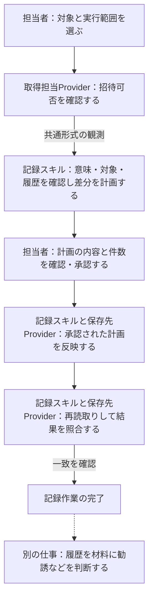
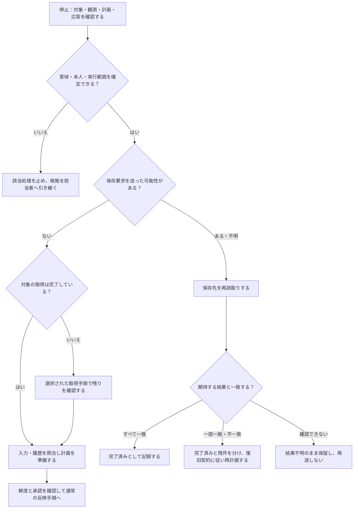

# スキル文書の共通基準と招待可否記録の改善案

# 位置付けと今回の範囲

これは[既存の知識方針](../governance/document-knowledge-policy.md)を具体化する日本語レビュー案である。別の方針や業務契約を設けない。承認後、採用した内容を既存の英語方針と対象パッケージへ反映する。

[Issue #37](https://github.com/flair-agency/live-agency/issues/37)について、所有者は「今は共通基準とAに必要な文書、A後に履歴重複整理、その後は各スキルの移行時に改善」の順序での着手を選択した。全スキルの文書改善をA移行の前提にしない。以下の具体的な文章は未承認である。

変更区分はG（文書保守）。既存の業務規則、公開Skillと非公開Providerの境界、実行権限を維持する。最初の成果物は共通基準、2件の棚卸し、招待可否記録の業務説明案と受入れ方法。今回は実装、公開、配布、データ更新を行わない。復旧は文書変更の差戻しで足りる。並列エージェントは使用しない。

# 共通基準の具体化案

SKILL.mdは、選択と実行の入口として、目的、責務の境界、必須の入出力、主要な作業順序、重要な停止条件、必要時に読む資料へのリンクを示す。業務の背景、判断根拠、詳細な手順、例、引き継ぎは、分量と用途に応じて補助文書に置く。READMEの新設や固定のファイル数を必須にしない。

パッケージを初めて読む適格な担当者が、入口から次の問いに到達できることを最低限とする。

| 問い | 必要な説明 |
| --- | --- |
| 何を担うか | 誰のどの業務成果を代替するか、対象外の仕事は何か |
| なぜ存在するか | 業務上の必要性と、採用した規則の理由。未確認の経緯は創作しない |
| どこに位置するか | 前工程、入力、出力、後工程、隣接するスキルやProviderとの役割分担 |
| どう進めるか | 順序、判断材料、正常終了の証拠、例外と停止条件 |
| 人がどう引き継ぐか | 必要な権限と道具、完了済み・未処理・不明の見分け方、再開方法、代替不能な依存先 |

一つの規則の正本は一か所に置き、他の文書からは要約とリンクで参照する。リンクには読む目的を示す。実行時に必要な補助資料は配布物に含め、リポジトリーや過去の会話だけに依存させない。非公開手順は公開パッケージに複製せず、選択されたProviderと運用構成から権限のある人が取得できるようにする。公開資料だけで認証サービスを操作できるとは主張しない。

工程の順序、役割の境界、判断による分岐は、読み手が辿れる図で示す。図は説明する規則の近くに置き、詳細条件は本文・表を参照する。単純な情報まで一律に図にせず、図だけで承認条件や例外を省略しない。本案ではGitHubで閲覧できるMermaidを用いる。

自動検査はリンク、配布資源、実装との整合性を確認する。人の理解可能性は別途、適格な担当者による説明と架空例の机上演習で確認する。既存の自動テスト合格や所有者が従来から手作業できることを、その代わりにしない。

# 初回の文書棚卸し（2026-09-09時点）

確認基点：親ブランチ codex/human-readable-skill-knowledge、開始時コミット098b183。両パイロットのブランチは codex/migration-checkpoint-20260909。今回は子リポジトリーを変更していない。

| 対象 | 現在の資料と強み | 不足・次の対応 |
| --- | --- | --- |
| 招待可否記録 | [SKILL.md](../../skills/live-agency-creator-invitation-eligibility-record/SKILL.md)に意味の区別、履歴比較、承認、読戻し、旧経路の制約。[入力仕様](../../skills/live-agency-creator-invitation-eligibility-record/references/normalized-observation-schema.md)に新旧契約と不明結果の扱い。[設定](../../skills/live-agency-creator-invitation-eligibility-record/references/lark-config.md)にフィールドID。READMEは技術的入口 | 業務背景と前後工程が点在し、新規担当者向けの順序と停止時の引継ぎが不足。SKILL.mdから業務・引継ぎ用の補助資料へ誘導する案。新旧経路の実行説明は既存の正本を参照し、重複転記しない |
| 履歴重複整理 | [SKILL.md](../../skills/live-agency-creator-invitation-eligibility-history-deduplicate/SKILL.md)に隣接重複の規則と保存・削除・復元の権限。[archive-workflow](../../skills/live-agency-creator-invitation-eligibility-history-deduplicate/references/archive-workflow.md)に具体的コマンド。READMEは技術的入口 | なぜ状態遷移を残し重複だけ整理するか、人が保存・削除・復元途中を引き継ぐ順序の説明をA後に補う。削除・復元の動作は今回変更しない |

記録スキルのpackage.jsonはreferencesを配布対象に含める。新しい補助資料をそこへ置けば対象となるが、実際のアーカイブへの収録とリンクは反映時に検査する。この棚卸しだけで配布検査完了とはしない。

非公開側の既存入口は、[BackStageの取得手順](../../providers/backstage/knowledge/invitation-eligibility-surface.md)、[共通制約](../../providers/backstage/knowledge/common-policy.md)、[Larkのアクセス方針](../../providers/lark-base/knowledge/access-policy.md)、[履歴読取り](../../providers/lark-base/knowledge/selected-history-reader.md)、[履歴書込み](../../providers/lark-base/knowledge/selected-history-writer.md)。これらへの相対リンクは私有の開発構成での所在を示す。インストール後の権限ある担当者が、選択中の構成から同じ手順を取得できるかは未検証であり、引継ぎ試験で確認する。

# 招待可否記録の業務説明案

## 責務と業務上の理由

この仕事は、クリエイターを招待できるかという観測結果を、後から確認できる履歴として残す。エージェンシーが誰を勧誘したいかという判断や、実際に招待を送る仕事は別である。招待可能という観測は、招待するべきという推薦や送信許可を意味しない。

可否は観測した時点の情報なので、確認時刻と対象者を結び付ける必要がある。毎回同じ内容を新しい行にすると変化を追いにくくなるため、比較対象の内容が同一なら最新の行の確認時刻だけを延ばし、変わった場合は新しい行を追加する。過去の行を書き換えて現在の状態に見せない。比較する項目と競合条件の正本はSKILL.mdのRefresh semanticsである。

## 前後の仕事との関係

図は役割と情報の受渡しを示す。招待の送信は、この記録作業には含まれない。

これは正常時の概略である。確認段階で止まる条件と、保存結果が不明な場合の対応は以下に示す。

このスキルは認証画面の操作を取得担当Providerに任せ、共通形式の観測を受け取る。保存先との通信は選択された保存先Providerが担う。履歴の重複整理は別の保守作業であり、通常の記録更新に混ぜない。

## 担当者が辿る作業の流れ

1. 対象アカウント、取得元、保存先、実行者、許可された操作を確認する。利用できる認証情報があるだけでは実行先を選択したことにならない。
2. 選択された取得手順で対象を確認する。対象ごとの結果と観測時刻を保存し、未取得の対象や意味が分からない表示を正常結果へ置き換えない。
3. 入力仕様に従い対象の過不足・重複と結果の意味を確認する。保存済み履歴が同じ意味の招待可否であることも確かめる。新旧経路を都合よく切り替えて検査を回避しない。
4. 選択された実行経路で読取りと差分計画を作る。作成、時刻更新、画像追加、登録済み、競合、古い観測の件数を計画のハッシュとともに確認する。
5. 既存契約に従って、承認された計画だけを反映する。取得結果への確認と保存先への更新承認は区別する。
6. 保存先を再読取りし、期待した結果が存在することを確認する。要求を送信したことだけでは完了としない。残作業と不明な結果を引継ぎ記録に残す。

## 停止時の人による引継ぎ

最初に、処理がどこまで進んだかを証拠から確認する。「結果不明」を「未処理」とみなして再送しない。

具体的な証拠と行動は次の表で確認する。

| 状態 | 担当者が確認する証拠 | 次の行動 |
| --- | --- | --- |
| 取得前・取得未完了 | 対象一覧、取得済みの対象、観測時刻 | 選択された非公開取得手順で残りを確認する。対象や鮮度が変われば計画を作り直す |
| 取得済み・保存前 | 観測、入力検査、計画と承認の有無 | 意味や対象を照合して計画を準備する。画面の読取り確認だけで保存しない |
| 保存完了を確認済み | 保存先を読戻した結果と期待値の一致 | 完了済みとして区別し、同じ更新を盲目的に再送しない |
| 保存要求後・結果不明 | 元の計画、承認、応答、保存先の現状 | まず読戻して照合する。残りだけ実行できるかは当該経路の復旧契約に従う |
| 表示や保存先の意味が不明 | 未対応表示、フィールド、選択された仕様版 | 該当変換・更新を止め、Providerまたは契約の担当者へ根拠とともに引き継ぐ |

人による代替にも、取得サービスと保存先へのアクセス、対象を特定できる設定、正しい履歴比較が必要である。AIが停止してもサービスと選択済みの道具が使える場合は、非公開手順を参照して取得し、文書化された計画・承認・読戻しの経路を担当者が操作する。保存先のGUIで直接編集する別経路が現在承認・検証済みであるとは主張しない。既存の実行経路も使用不能なら、その代替手順を確認するまで保存を止める。サービス自体の停止や権限欠如をこの文書で解消できるわけではない。

## 架空例による確認

以下は意味を説明する机上例であり、実データでも実行承認でもない。値はすべて架空で、保存先が同じ意味の選択肢を持つことを前提とする。

- synthetic_alpha：直近と同じsynthetic_eligibleで、本人ID・表示名・画像も同一なら、既存行の確認時刻だけを更新する計画になる。
- synthetic_beta：synthetic_eligibleからsynthetic_ineligibleへ変化すれば、新しい行を追加し過去の行を残す。
- synthetic_gamma：画面に既知の「見つかりません」が表示された場合は、そのステータスを正常な観測として記録する。通信失敗・結果欠落・未知の表記と混同しない。汎用契約の取得不能not_foundとは区別する。
- 保存要求の応答が途切れた場合：再送する前に保存先を読む。一致を確認できたものと、不一致または未確認のものを区別する。

# 受入れ方法と未完了事項

適格な担当者に入口と架空例を渡し、招待可能と勧誘判断の違い、同一内容と変化の扱い、不明結果の扱いを説明してもらう。そのうえで、取得側と保存側の非公開手順をどこから開くか、途中停止からどの証拠で再開するかを机上で辿ってもらう。実更新は不要。回答、使用資料の版、迷った箇所、代替経路の未整備箇所を既存の受入れ記録に残す。

所有者による9件の画面結果確認は、読取りの正確性の証拠である。この新しい文書による引継ぎ能力の検証ではない。地域表示と画面の「見つかりません」の誤変換はProvider 4d72c97までで修正済み。一方、招待種別の保存先、複数バッチの実登録・再開接続は未完了であり、文書承認を実装完了としない。

| 次の作業 | 人の担当 | 期限 | 要約 | 完了条件 | 参照 |
| --- | --- | --- | --- | --- | --- |
| 共通基準と記録スキルの説明レビュー | 所有者 | TBD | 本案の内容を確認 | 修正点または採用範囲が明確 | Issue #37 |
| Aに必要な文書の反映・検査 | TBD | TBD | 採用内容を英語方針と記録スキルへ反映 | リンク・配布・契約整合を確認、作業ブランチを同期 | 本案 |
| 記録スキルの引継ぎ確認 | TBD | TBD | 文書から架空例と復旧経路を辿る | 実施結果と残る不足を受入れ記録に保存 | A受入れ |
| A後の重複整理パイロット | TBD | TBD | 整理・保存・削除・復元の業務文脈を補う | 同じ基準で説明と引継ぎを確認 | Issue #37 |
| 他スキルの段階改善 | TBD | TBD | 各移行時に確認、残件を後続Issue化 | 未確認・不足・確認済みを区別した棚卸し | Issue #37 |

# A文書の引継ぎ確認準備 — 2026-09-09（到達検証は当時の版）

Issue #39の準備として、現在の入口と配布経路を実際に確認した。ここで示す机上演習は未実施であり、所有者による9件の招待可否の目視照合とは別である。公開Skillの本文や業務規則はまだ変更していない。

## 配布された知識への到達

招待Skillの `scripts/resolve_invitation_source.mjs` を、BackStage 5890962の未公開archiveを含む隔離した構成で呼び出した。取得入口、共通制約、ソース目録、招待可否と招待進捗の境界が返り、知識版2026-09-09.2を確認した。プロフィールの `scripts/resolve_profile_source.mjs` も既存ソースを参照する隔離構成で呼び出し、知識版2026-08-31.7の取得手順が返った。両方とも無人実行指定では停止した。依存の新規インストールや認証サービス操作は不要だった。

この検証は、招待ではアーカイブ内資源の到達、プロフィールでは既存ソースの到達を示す。正式公開版の新規インストールや、人が説明を理解して実行できたことまでは示さない。保存先Larkの資料は別のProviderにあり、取得元resolverの出力だけで全工程を読めるわけではない。私有の構成側から、選択した保存先の[アクセス方針](../../providers/lark-base/knowledge/access-policy.md)、[履歴読取り](../../providers/lark-base/knowledge/selected-history-reader.md)、[履歴書込み](../../providers/lark-base/knowledge/selected-history-writer.md)へ案内する必要がある。公開Skillに私有手順を転記しない。

## プロフィールのA関連差分

[プロフィールSkill入口](../../skills/live-agency-creator-profile-record/SKILL.md)は対象、正規化入力、照合、承認、画像、読戻しの規則を既に持つ。#13の受入れ済み動作を再試験する必要はない。

| 観点 | 現在の説明 | 文書として補う内容 |
| --- | --- | --- |
| 目的と理由 | 観測履歴を追記し、未取得値をゼロなどで補完しない | 時点付き履歴を残す目的と、その後の評価・集計との境界を短い業務説明へまとめる |
| 作業順序 | 各節に取得・計画・反映・検証を記載 | 全工程の図と、承認前/送信前/送信後の停止点を対応させる |
| 引継ぎ | 不確実な書込みを再送せず再読取りする規則あり | 担当交代時に見る計画、送信記録、読戻し結果と、残件の見分け方を一続きの例で示す |
| 私有知識 | インストール済みProviderの方針を参照 | 選択した構成から保存先資料へ辿る案内を私有側へ置く |

## 人による机上演習の提示案

架空データだけを使い、書込みは行わない。実施者と実施日時はTBD。AIは次の期待結果を準備したが、人の理解を合格と判定していない。

| 例 | 担当者が説明すること | 根拠・期待結果 |
| --- | --- | --- |
| 招待可否：前回と同じ観測、確認時刻だけ新しい | 履歴を増やすか、時刻を更新するか。どの計画を承認するか | 既存の比較規則を辿り、同じ内容なら時刻更新として計画する。取得結果の確認だけでは更新を承認したことにならない |
| 招待可否：3件中1件に既知の「見つかりません」を表示 | 検索結果と取得失敗を区別できるか | 3件とも観測として計画する。表示結果を勝手に取得不能へ変換しない。宛先の正確な選択肢とその他の検査は必要 |
| 招待可否：3件中1件を通信失敗で取得できない | 未取得を何と記録するか | 既知の表示ステータスを捏造せず、取得を完了できるか確認する。未完了の全体計画を勝手に縮めて登録しない |
| プロフィール：フォロワー数が未取得、名前は観測済み | 未取得値を0にしてよいか、どの観測を保存するか | 観測値だけを使い、未取得は空欄。少なくとも一つの値が観測済みなら計画対象になり得る。他の整合性検査も必要 |
| 書込み送信後に応答がなく、担当者が交代 | 完了・未処理・不明をどう区別し、何から再開するか | 計画・送信記録・読戻しを確認し、同じ要求を無条件に再送しない。残件は再計画と必要な承認に分ける |

合格材料は、実施者が入口から根拠を見つけ、判断と停止条件を自分の言葉で説明できた記録とする。説明できなかった点は文書の修正対象として残す。外部の書込み権限や本番切替をこの演習で付与しない。

AI方針レビューでは、知識方針の目的・引継ぎ・私有境界、言語方針、実際のSkill入口とresolver実装を照合した。アーカイブ確認と既存ソース確認を区別し、実施していない人の演習を完了扱いにしていない。これはセルフレビューであり、独立したレビューゲートではない。

# 現在のレビュー対象 — 2026-09-10

#39は資料修正・検証中。以下と本文の訂正を今回のレビュー対象とし、過去の配布到達確認を現行版の確認と読み替えない。英語Skillへの採用・配布確認、人による机上演習は未完了。

## 招待可否：判断根拠と処理単位

私有Providerの[ステータス知識](../../providers/backstage/knowledge/invitation-status-semantics.md)を読む。7つの親ステータスは取得元の表示、子ステータスは追加情報による内部細分化。A〜Eは人間の推測であり、自動的に割り当てない。一般／プレミアムは別の観測だが、別項目への情報保持は現行移行の未完了事項である。

[処理単位の仕様](../architecture/execution-batches.md)では、取得上限30件・保存の送信単位100件・再開のチェックポイントを分離する。総件数101件以上の拒否は解消すべき能力差であり、業務規則ではない。現在のRuntime基礎executorは未接続なので、担当者に「自動で続きから実行できる」と案内しない。

| 観測・処理の状態 | 現在、人が取る行動 |
| --- | --- |
| 既知の否定的な表示結果 | 表示どおりの観測として照合・計画する |
| 通信失敗・対象欠落・未知表示 | 取得の未完了として原因と残件を確認する |
| 101件以上の保存効果 | 現在の選択writerの制限を報告する。勝手に計画を削減したり別経路で実行しない。複数バッチ接続の完了を待つ |
| 送信後に結果不明 | 計画と送信証跡を保ち、保存先の内容・画像を読戻す。未確認のまま再送しない |

## プロフィール：目的と流れ

観測時点のプロフィールを履歴として残し、後の変化の確認や別工程の評価に使う。評価そのものやLIVE履歴の取得はこの作業に含めない。未取得のフォロワー数を0にするなどの補完は行わない。

~~~mermaid
flowchart TD
  A[対象・取得元・保存先を確認] --> B[Provider手順でプロフィールを観測]
  B --> C{少なくとも一つ値を取得できた?}
  C -->|いいえ| D[取得状況を記録し保存を捏造しない]
  C -->|はい| E[対象と観測値の整合・既存履歴を確認]
  E --> F[追加・画像補完・登録済みを計画]
  F --> G[承認済みの効果を実行]
  G --> H[履歴と画像を再読取り]
  H -->|一致| I[完了と記録]
  H -->|不明・不一致| J[再送せず残件を確認]
~~~

[Skill入口](../../skills/live-agency-creator-profile-record/SKILL.md)から入力・計画手順を辿り、[取得側の知識](../../providers/tiktok-web/knowledge/public-profile-surface.md)で観測方法を確認する。保存には[プロフィール用writer](../../providers/lark-base/knowledge/selected-profile-writer.md)を使う。これは権限のある担当者向けの私有構成内の所在案内であり、公開Skillへこれらの手順を転記しない。

架空例: synthetic_deltaは名前を取得できたがフォロワー数は未取得。名前を観測値として計画し、人数は空欄。送信後に応答が切れた場合、元計画と履歴・画像の読戻しを照合し、登録済みと画像のみ未完了を区別する。単に同じ要求をもう一度送らない。#13の技術受入は維持し、本演習では実登録しない。

## 順番に行うレビュー

1. 招待の目的、同一内容と変化、既知表示と取得失敗の区別を文書として確認する。
2. 招待の正常完了・未取得・送信結果不明を架空例で辿る。未実装の自動再開を実施できたと記録しない。
3. プロフィールの目的・欠落値・履歴と画像の引継ぎを同様に確認する。

文章の承認、演習の実施結果、実装の受入は別々に記録する。今回の資料を所有者が読んだだけで演習合格とはしない。

AI自己レビュー: 現行Providerの4d72c97、処理単位仕様、Runtime dede2d2の未接続状態、両Skill入口に照合。既知の「見つかりません」を取得失敗にする旧例と、地域表示の未修正表記を訂正。図は現行処理と人の判断を説明し、未実装の自動再開を描いていない。ローカルリンクを検査。現行版の新規配布検証、人の演習、公開Skillへの採用は未実施。
