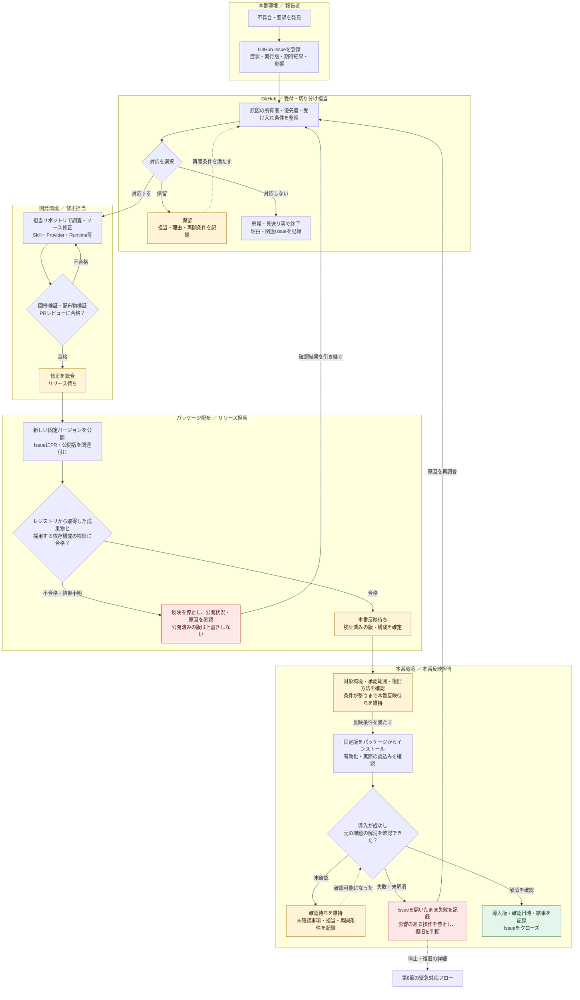
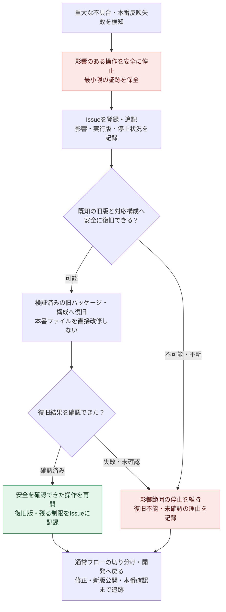

# GitHub Issuesを起点にしたSkill保守運用案

- 状態: 2026-09-08にオーナーがLGTMで承認。本文は承認時点のレビュー履歴であり、正本ではない。
- 作成日: 2026-09-08
- 対象: 本番で利用するパッケージ版Skillの不具合・要望と、その修正に関係するProvider・Runtime・共通ライブラリ。
- 正本: [Issue-based Skill maintenance policy](../governance/skill-maintenance-policy.md)。以後の運用規則は英語正本を参照する。
- 追加決定: Organization共通の保守ProjectをPublicにする指示を採用。経緯と実設定の状態は末尾の追記を参照する。

以下の提案表現・未承認時の記録はレビュー履歴として保持する。承認後の作業記録は末尾に記載し、共通受付・担当者・GitHub設定の導入完了とは区別する。

## 1. 評価と基本方針

この案を推奨する。本番のインストール済みファイルを修正すると、公開したパッケージと実行内容が一致しなくなり、再インストールで修正が消える。GitHub Issuesを入口にすると、課題からソース変更、リリース、本番での解消確認までを追跡できる。

### 通常の保守フロー

枠は作業の担当・場所を表す。GitHub Issueを全工程の追跡元にして、PR・公開版・本番確認結果を関連付ける。実線は処理の順序、点線は保留からの再開や緊急対応への接続を表す。

「修正統合」「公開」「本番で解消確認」は別の節目とし、解消によるクローズは最後の節目で行う。要件変更・コード修正が不要と判明した場合も、担当所有者の手順で対応し、本番確認の記録を残す。公開や導入の失敗・結果不明は現状を確認してから次の操作を選び、無条件に再実行しない。

本番ではパッケージに含まれるSkillの指示・スクリプト・参照資料を直接改修しない。開発チェックアウトへのリンクへの差し替えも行わない。環境固有の設定変更は必要に応じて別途扱い、ソースの恒久修正を代替しない。

これは[配布方針](../architecture/distribution.md)と[開発方針](../governance/development-policy.md)を補う課題管理の提案であり、既存の責任分担、外部操作の権限、移行ゲートを変更しない。

## 2. Issueを置く場所と責任

基本は、その変更を所有するリポジトリにIssueを置く。利用者に最初から原因特定を求めず、Skill利用時に発見した課題は該当Skillのリポジトリで受け付ける。

| 切り分け結果 | 修正の所有者 |
| --- | --- |
| 業務判断、共通入力の検証、差分・承認・照合の手順 | 該当Skill |
| サービス固有の取得・更新、画面・出力形式の変化 | 該当Provider |
| パッケージ構成、依存解決、インストール・起動 | Runtime |
| 共通APIや契約の変更 | 該当する共通ライブラリ・contracts |
| 複数所有者にまたがる要件・運用方針 | 親プロジェクトで調整し、必要な実装Issueを各所有者に関連付ける |

原因が別の所有者にあった場合は担当先で修正し、元のIssueから追跡できるようにする。単一所有者の小さな修正を、調査・実装・検証ごとのIssueに機械的に分割しない。重複報告は既存Issueに集約する。

受付・切り分け担当が優先度と次の担当者を決め、修正担当がPRと検証結果を記録し、本番反映担当が導入結果を記録する。同一人物が兼ねてもよいが、各段階の完了条件は分ける。

リポジトリ不明・複数Skill共通の報告用には、親プロジェクトのPrivate GitHubリポジトリを共通受付にする案を推奨する。実際の受付URL、Issuesの有効化、可視性、投稿権限は導入時に確認する。本草案では設定済みとは扱わない。

## 3. 報告に必要な情報

最初の報告に完全な再現調査を要求しない。判明している項目を記録し、不明項目は不明のまま切り分け担当に渡す。要望には再現エラーの代わりに、実現したい業務と受け入れ条件を書く。

| 項目 | 内容 |
| --- | --- |
| 種別・概要 | 不具合／要望、短いタイトル |
| 影響 | 使えない操作、回避方法、業務期限、外部データへの影響の有無・不明 |
| 発生条件 | 発生日時とタイムゾーン、操作手順、頻度、直近の変更 |
| 実行版 | 実際に読み込まれたSkillのパッケージ名・バージョン、Runtimeの版、関係するProviderの版。可能なら構成・lockの識別子 |
| 期待と実際 | 期待する結果、観測結果、機密情報を除いたエラー要旨 |
| 再現材料 | 架空データによる最小例、または別管理の制限付き証跡を識別する安全な参照 |
| 完了条件 | 修正後に、どの操作で何を確認できれば解消とするか |

本番ファイルが既に手修正されていたり、版と実行内容の一致が確認できなかったりする場合は、その事実を記録する。パッケージ版番号だけで再現性があるとは判断しない。

実データ、認証情報、セッション情報、実画面のスクリーンショット、生ログは、PrivateリポジトリであってもIssue・コメント・添付・PRへ持ち込まない。必要な証跡はアクセス制限付きの別保管先に保持する。Issue側の参照にも署名付きURLや実対象の識別子を含めない。認証サービス固有の仕様はProviderの非公開境界で扱い、公開SkillのIssueには正規化した再現例を用いる。[Private Source Integration Guide](../governance/private-source-integration-guide.md)を情報取扱いの根拠とする。

## 4. 進行状態と完了条件

初期運用ではIssue本文のチェックリストと関連PR・リリースへのリンクで十分とし、独自の自動化やGitHub Projectsの導入は必須にしない。`bug`／`enhancement`などの種別と優先度も、必要な最小限にする。

| 状態 | この状態とする条件 |
| --- | --- |
| 受付・切り分け中 | 判明している情報でIssueを登録し、影響・担当所有者・優先度を確認している |
| 対応中 | 対応範囲と受け入れ条件を決め、開発環境で調査・修正・検証を進めている |
| リリース待ち | 必要な回帰・契約確認とPRレビューを経て修正を統合し、対象パッケージ版と公開対象が確定した |
| 本番反映待ち | 新版を公開し、レジストリから取得した成果物と採用する依存構成の検証が完了した |
| 本番確認中 | 選択した環境に導入・有効化し、実際に新しい版が読み込まれたことを確認した |
| 完了 | 元の受け入れ条件を本番で確認し、導入版・確認日時・結果をIssueに記録した |

推奨は、本番起点のIssueを本番確認まで開いたままにすること。修正の統合やパッケージの公開だけで、本番で解消したとは扱わない。反映を延期する場合は担当者と理由・再開条件を記録する。重複・見送り・再現不能で終了する場合は、解消完了と区別して理由を残す。

GitHubには、既定ブランチへのPR統合でIssueを自動クローズするキーワードがある。そのため本番確認まで追跡するIssueには、PR本文やコミットメッセージで`Fixes`／`Closes`などを使わず、通常のIssue URL参照で関連を残す。実装用Issueを別に設けた場合、その完了と本番報告Issueの完了は区別する。[GitHub公式: PRとIssueの関連付け](https://docs.github.com/en/issues/tracking-your-work-with-issues/using-issues/linking-a-pull-request-to-an-issue)

## 5. 開発・リリース・本番反映

1. 開発担当はIssueから対象と受け入れ条件を選び、既存の開発方針に沿って変更カードを記録する。Issueが存在するだけで、その要望の採用や実行が決定したとはみなさない。
2. 実行版・構成を手掛かりに再現し、原因を所有するソースを修正する。不具合には原因に対応する回帰検証を、要件追加には受け入れ条件を確認する検証を行う。必要な範囲で契約・呼出し元への影響を確認する。
3. PRにIssue、変更理由、検証、互換性、既知の制約を記録する。公開するアーカイブ内の指示・参照資源・依存関係と、そのアーカイブからのインストールも検証する。ソース上のテスト成功だけで配布の成功としない。
4. 既存の配布契約に従い、新しい一意なバージョンを公開する。公開済みの版は上書きしない。Issueに修正PR／ソースcommit、パッケージ名・版、リリース証跡を関連付ける。
5. 本番へ採用するRuntime・Skill・Provider・共通依存の組合せを固定して検証する。Skillだけの変更で済むか、ProviderやRuntimeの新版が必要かを依存関係から判断する。`latest`の追従を本番反映手順にしない。
6. 本番反映担当は対象環境、導入する版・構成、反映時の停止範囲、検証方法、復旧可能な旧構成を明示する。パッケージ公開と本番反映は別の操作として、既存の承認範囲と実行選択を適用する。既に有効な同一範囲の承認は重複して求めない。
7. インストール後は有効化と実際の読込みを確認し、元の課題に対応する最小限の確認を行う。外部データを更新する確認は、その操作の権限・dry run・readback条件に従う。確認できなければ「本番確認中」または保留を維持する。

導入するパッケージの構成を戻すことと、外部データを復元することは異なる。前者の復旧が成功しても、既に発生した誤更新が解消したとは扱わない。

[Runtimeの配備設計](../../runtime/docs/deployment.md)には未実装のCLI案も含まれるため、この草案を実装済みの更新・ロールバックコマンドの案内にしない。実行時には[現行状態](../migration/status.md)と所有者の実装・設定手順を確認する。

## 6. 緊急時と運用導入

### 緊急対応フロー

課題の初回発見時にも、本番反映後の失敗時にも適用する。以下は本番反映担当の流れで、停止・復旧操作には既存の実行選択と権限を適用する。封じ込めと恒久修正は同じIssueで追跡し、運用を復旧できても課題が残る間は解消完了にしない。

外部データの誤更新や書込み結果不明がある場合は、パッケージの復旧とは別にreadbackと必要なデータ復旧を扱う。旧版への切替だけでデータまで復元したとは扱わない。

重大障害時は、安全な停止や、互換性・利用可能性を確認できた既知の版への復旧を先行できるようにする。受付手続が封じ込めを遅らせないよう、最小限の記録から始めてIssueを追記する。書込み結果が不明な操作は無条件に再実行しない。

緊急修正も開発ソースで作り、検証した新バージョンをパッケージとして導入する。本番への直接パッチを例外手順にしない。旧版が安全に利用できなければ影響範囲を停止し、必要なデータ復旧は独立した条件で実施する。

最初の導入範囲は、受付先の確認、不具合／要望テンプレート、担当者と優先度の決め方、上記の完了条件に絞る。期限が迫る業務停止・誤更新の疑いを先に切り分け、影響が限定された不具合や改善要望は計画的に扱う。固定SLAはこの草案では設けない。

Issue Formsによる入力欄の定型化も可能だが、運用が固まるまではMarkdownテンプレートで開始できる。[GitHub公式: Issueテンプレート](https://docs.github.com/en/communities/using-templates-to-encourage-useful-issues-and-pull-requests/about-issue-and-pull-request-templates)

実際のIssue投稿、公開、インストール、自動更新は本検討では実行しない。特に自動報告を追加する場合は、投稿先・送信可能な情報・投稿の実行条件を別途決める。

## 7. 採用に向けた判断事項

推奨案は「担当リポジトリで受付、共通受付はPrivateの親リポジトリ」「本番確認で完了」「緊急時もパッケージ経由」「小さなテンプレートから開始」の4点。

採用時には共通受付の実URLと可視性、受付・本番反映の担当者を確定する。その後、英語正本と既存の開発方針からの参照、所有者ごとのIssueテンプレートを整備する。全SkillへのIssue投稿手順の埋め込みや、専用のIssue管理Skillの新設は初期導入の前提にしない。

## 8. この文書化作業の記録

変更カード:

- 主分類: G（文書化）。運用変更の提案を記述し、採用・実行は行わない。
- 触れる境界: 親リポジトリのレビュー文書と案内。Skill・Provider・Runtimeの契約・実装は変更しない。
- 維持条件: 本番と開発の分離、パッケージ配布、所有者ごとの修正、明示的な実行選択、非公開情報の分離。
- 今回の成果物と完了条件: オーナーが方針を評価できる日本語草案と、内容・参照先の確認記録。
- 次のゲート: 推奨方針の採否と、導入先・担当者の具体化。承認前に英語正本へ昇格しない。
- 検証・復旧: 文書差分とリンクを確認する。製品コード・外部サービスの変更はなく、今回の文書差分の取り消しで復旧できる。
- 並列作業: なし。モデル設定変更・workerの起動は行っていない。

作業開始時の親リポジトリは`git status --short`に出力がなく、既存差分はなかった。変更所有者は親リポジトリのみ。成果物は本草案とREADMEの草案リンクで、未コミット・未ステージの差分として保持した。

検証結果: 両ファイルの差分をレビューし、相対リンク21件の存在と行末空白なしを確認した。`git diff --check`は成功。GitHubのIssue関連付け・テンプレートの仕様は上記の公式文書で確認した。製品コード・API・配布資源の変更や移動はなく、製品テストや本番動作確認は実行していない。GitHubの受付設定・投稿権限も未検証である。

今回の日本語レビュー草案の作成は完了。次は方針のレビューと共通受付・担当者の具体化であり、正式採用・外部設定・本番反映は未実施。取り消す場合は今回追加した草案とREADMEの案内だけを対象とする。

### 運用フロー図の追記（2026-09-08）

オーナーの図示指示に対応するG分類の追記。通常の保守を担当・環境別に示す図と、緊急停止・旧版復旧・恒久修正への戻りを示す図を本草案に追加する。完了条件は、本文の状態・権限・復旧条件との一致と図の接続確認。正式採用・外部操作の範囲は増やさない。

開始時は前段のREADME変更と未追跡の本草案が存在し、いずれも未ステージだった。READMEはそのまま保持し、本草案のみ追記する。直前の草案は無視対象の`tmp/skill-maintenance-diagrams/before.md`に保持し、今回の追記だけを戻せるようにする。並列作業はない。

図示は完了。通常フロー20ノード・24接続・5担当枠、緊急フロー9ノード・10接続について、ノード参照の解決、開始点からの到達性、担当枠の閉じを機械確認した。本文との整合性と今回の差分をレビューし、本草案の相対リンク6件、行末空白なし、`git diff --check`の成功を確認した。Mermaidの描画ツールはローカル依存にないため、レンダラーによる構文・表示検証は未実施。製品テスト・外部操作は行っていない。次の判断事項は前段の方針レビューから変わらない。

### 承認内容の正本化（2026-09-08）

オーナーのLGTMを受け、G分類の文書正本化を選択。変更所有者は親リポジトリで、対象は英語の保守方針、本レビュー履歴、README、開発方針からの参照。承認済みの意味・責任・完了条件と2つの図の分岐を保持する。完了条件は英語正本と参照の整備、翻訳・図の接続・リンク・差分の確認。並列作業はない。

開始時の既存差分は未ステージのREADMEと未追跡の本レビュー文書。既存作業を引き継ぎ、indexや子リポジトリを変更しない。今回は方針の採用であり、実際の投稿・公開・インストールやGitHub設定変更の実行選択を含まない。次の具体化対象は共通受付URL・可視性・投稿権限、担当者、所有者ごとのテンプレート。

正本化は完了。承認済みの本文・通常／緊急フローを英語正本に反映し、READMEと開発方針から参照した。本書は正本にリンクするレビュー履歴に変更した。4文書の相対リンク36件と行末空白なし、`git diff --check`の成功を確認。2つの図は表示文言を除く構造を日本語版と比較し、ノードID・担当枠・分岐・接続方向・スタイルが一致した。翻訳内容と対象差分もレビューした。レンダラーによる表示検証と製品テストは実行していない。

変更は親リポジトリの未コミット・未ステージ差分として保持し、外部設定・本番環境は変更していない。文書上の採用は完了したが、共通受付と担当者の確定・テンプレート導入は残る。復旧が必要な場合は今回の英語正本追加・参照・承認表示の差分を対象とし、前段の承認済み日本語内容や無関係な変更は保持する。

### 公開Projectの採用（2026-09-08）

オーナーがProjectの可視性と非公開Issueの見え方を確認したうえで「Project自体は公開にしたい」と指定した。先に提案したPrivateのProjectは採用せず、Organization共通の保守ProjectをPublicとする。基本構成は会話で提案した1つのProject、進捗別ボード・優先度順の一覧、ステータス・優先度・担当・リポジトリとする。工数・スプリント・複雑な自動化は初期条件にしない。

Projectの公開はIssueやリポジトリの公開範囲を変えない。非公開Issueの内容は権限のない閲覧者には表示されず、項目の存在は隠し項目として見える場合がある。Projectの説明・README・Draftや独自欄には公開可能な情報だけを書く。公開概要が必要な場合は公開用に整えた別項目を用意できるが、全件の概要複製・自動投稿は選択していない。

G分類の正本文書への反映とGitHub設定準備。変更所有者は親リポジトリ、対象は英語正本と本レビュー追記、無視対象の設定案。既存のREADME・開発方針・外貨売上受付記録の差分とindexは保持する。通常・緊急フローの完了条件と本番での直接改修禁止は維持し、並列作業は行わない。完了条件は承認済み公開方針と情報境界の反映、設定案・確認結果の記録。

GitHubの既存Projectを`gh project list --owner flair-agency --format json --limit 100`で確認したが、認証に`read:project`がないというエラーで取得できなかった。ネットワーク制限の自動承認拒否ではなく、GitHub認証スコープの不足である。Projectは未作成・未変更で、既存Projectの有無も未確認。作成・編集には`project`スコープが必要であり、認証情報自体の変更は行っていない。

公開用タイトル案は`LIVE Agency Maintenance`。公開用説明・README・初期項目案を`tmp/skill-maintenance-project/`に準備する。認証が整った後に既存Projectを照合し、該当Projectの有無と内容を確認してから設定する。準備済みの外貨売上Issue2件の投稿は引き続き別の未実行操作である。

文書反映と公開用設定案・READMEの準備は完了。変更内容をレビューし、両文書の相対リンク、行末空白なし、設定JSONの`PUBLIC`指定と公開用READMEの内容、`git diff --check`の成功を確認した。通常・緊急フロー図は変更していない。製品テストや外部変更は行わず、差分は未ステージで保持した。次はGitHub CLIのProject権限を整えた後の既存Project照合・設定。今回の文書追記と準備ファイルを取り消しても外部側の復旧操作は不要。

### 公開Projectの設定実行（2026-09-08）

オーナーから権限付与完了を受領。F分類・副分類Gとして、`flair-agency`所有の公開保守Project `LIVE Agency Maintenance`の作成・説明・進捗／優先度・ビュー設定と再読確認を選択する。対象はこのProjectだけで、Issue投稿・リポジトリ可視性変更・会計操作は含まない。既存Project一覧は0件で、既存の公開内容や共同編集への影響はない。公開用説明は直前に準備した文面を使い、実データ・非公開報告の転記はしない。

完了条件は対象ID・URL・Public設定・説明・6段階の進捗・優先度・担当／リポジトリ欄・進捗別ボードと優先度順一覧の再読確認。通常／緊急フローの完了条件を維持し、PR統合で完了扱いにする自動化は設定しない。操作は直列で、結果不明時は同名Projectを新規作成せず再照合する。復旧には今回作成するProjectのIDと設定を使い、必要時に対象だけを非公開化またはクローズする。既存の文書差分・index・子リポジトリは保持する。

設定完了: [LIVE Agency Maintenance](https://github.com/orgs/flair-agency/projects/2)をPublicで作成した。Project番号は2、IDは`PVT_kwDODXPhx84Bix7J`。進捗は承認済みの6段階、Priorityは`P0 - Urgent`／`P1 - High`／`P2 - Normal`／`P3 - Low`。[Status board](https://github.com/orgs/flair-agency/projects/2/views/2)はStatusで列分けして優先度昇順、[Priority-ordered table](https://github.com/orgs/flair-agency/projects/2/views/3)は優先度昇順。両ビューにTitle・Status・Priority・Assignees・Repositoryを表示する。

新規Projectに既定で付いた6件の自動化（項目追加・クローズ、PR関連付け・統合、自動Issueクローズ、自動sub-issue追加）を記録してから削除し、早期完了や未選択項目追加を防いだ。必要な2ビューの作成後、未使用の既定View 1だけを削除した。別Projectの変更はない。

作業中、「環境整理・本番保守 司令塔｜live-agency」からユーザー指示として、作成済みの[ギフトSkill Issue #1](https://github.com/flair-agency/live-agency-gift-history-merge/issues/1)の関連付けが引き継がれた。既存Issueを読み、Project項目が0件で重複がないことを確認して追加。`Intake / triage`・`P2 - Normal`とし、未着手の保留理由・再開条件は既存Issue本文に残した。IssueはOPEN、個人担当未割当、本文は変更前と完全一致する。非公開リポジトリのIssueであり、公開Draft・説明への転記はない。この関連付けは外貨売上2件の投稿やギフト実装・リリースを選択しない。

GraphQLによる独立した再読で、Public設定・タイトル・公開説明／README一致、Statusの6選択肢、Priorityの4選択肢、両ビューの列・レイアウト・優先度昇順・Status列分け、自動化0件、Project項目1件とその状態・Issue本文不変を確認した。APIの作成応答だけを完了証拠にはしていない。設定要求・初期状態・再読・検証receiptは無視対象の`tmp/skill-maintenance-project/`に保持する。

GitHub上の設定と再読検証は完了。画面描画・未認証閲覧者の非公開項目表示は個別に試験していない。製品テスト・会計操作・ソース修正・パッケージ公開・本番展開は行っていない。親の文書にはProject URLと完了記録を追記し、既存差分・index・子リポジトリを保持する。残るのは受付担当・テンプレート等の具体化と、投稿未実施の外貨売上Issue2件である。

今回変更した3文書の相対リンク27件、行末空白なし、`git diff --check`の成功を確認し、対象差分をレビューした。ギフトIssueの関連付け・状態設定・再読結果は引き継ぎ元タスクへ報告済み。

### 外貨売上2件のDraft受付（2026-09-08）

その後のオーナー指示により、外貨売上の2件を公開ProjectのDraftとして登録した。親リポジトリへのIssue投稿という旧案は置き換え、該当リポジトリができた後に既存DraftをIssue化する。両件は未着手・暫定通常優先度・個人担当未割当で、本文に変換条件を明記した。Projectは既存ギフトIssue 1件と新規Draft 2件の計3項目。独立再読で本文・状態・重複なし・既存項目不変を確認した。具体的なIDと検証結果は[外貨売上受付記録](foreign-revenue-maintenance-intake-ja.md)に保持する。
