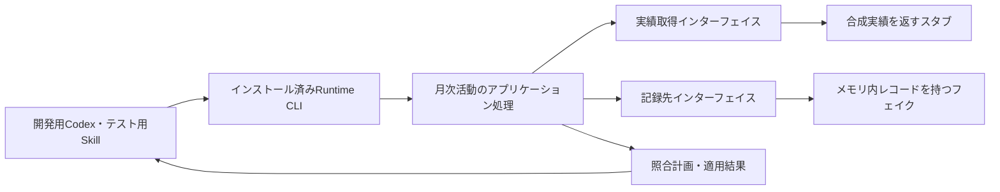
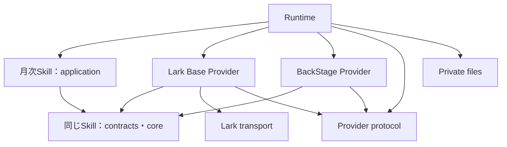
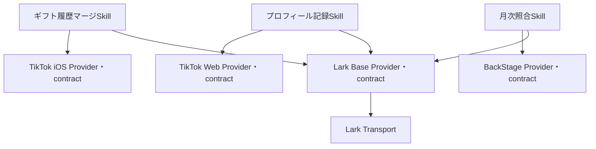

# M1：開発基盤の具体設計案

状態：承認済み（LGTM）。着手前の処置は承認どおり完了し、親`2170115`と30個の子repoの固定版から別ディレクトリーで再現確認済み。本書の命名・公開入口・具体的インターフェイスを採用してM1を実装中。全体の順序・方針は[採用済み計画](../migration/v2-plan.md)に従う。

## 1. M1で通す経路

**インストール済みのテスト用SkillからRuntime CLIを呼び、テスト用Providerで月次実績の取得・照合・結果返却を行う。** 実Lark・BackStageの操作は先行M2で行う。MCPはこの経路には追加しない。CLIでCodexとの要求・結果の受渡しが成立しない具体的理由が出た場合だけ、最小限のMCPアダプターを検討する。

最初の入力は架空の1か月・2アカウント。片方に更新差分、もう片方に差分なしを用意する。dry-runで期待する計画を返し、次にフェイク内だけで承認済み変更の適用とreadbackを確認する。テストコードがドライバー、Provider側がスタブ／フェイクになる。

## 2. パッケージ構成・命名の提案

契約の所有・依存方向は承認済みの11節で改訂。以下の当初案より11節を優先する。

以下は既存コードを責務別に組み直す対応表。実装言語は既存のJavaScript ESMを継続し、型システムや契約プログラミングの新規導入を前提にしない。

| 現在の所有元 | 正式npm名・配置案 | 公開入口・責務 | 変更理由 |
| --- | --- | --- | --- |
| `source-provider-api`の汎用接続定義 | `@flair-agency/provider-protocol`、`packages/provider-protocol/` | `.`：Provider descriptor、能力IDと対応版、実行方式、汎用要求・結果の形式と検証 | consumerとProviderの双方が共有する接続規約。業務validator、ファイル読取、動的importを含めない |
| 同パッケージのdiscovery・module/resource解決 | `@flair-agency/live-agency-runtime`、`runtime/` | Runtime内部の選択・ロード処理。公開APIを増やす必要がある利用者がいなければ内部実装にする | 構成所有者であるRuntimeに実装を置き、契約から実装への依存をなくす |
| 同パッケージの月次実績などの業務validator | 各Skillのnpmパッケージ | `./contracts`：サービス中立な入出力と必要操作、`./core`：純粋な業務判断 | 利用側がインターフェイスを所有する。業務ごとの定義を巨大な共通パッケージへ集約しない |
| `private-runtime-files` | `@flair-agency/private-files`、`packages/private-files/` | `.`：明示パスの制限付き読取・書込、サイズ制限、原子的置換等 | Runtime専用ではなく、複数の利用側が使うprivateファイルI/O。業務・profile選択は持たない |
| `lark-core` | `@flair-agency/lark-transport`、`packages/lark-transport/` | `./selection`、`./api`、`./cli`：選択済み主体による通信と共通の失敗処理 | Base・Chatの共通実装。Baseのテーブル意味や業務計画を含めない |
| `cli-utils` | `@flair-agency/cli-utils`、現配置維持 | 現行`./is-main` | 今回は再移動しない。無関係な便利関数の集積先にしない |
| `row-archive` | `@flair-agency/row-archive`、現配置維持 | `.`：履歴アーカイブの形式・codec・receipt照合 | 実ストレージ操作、削除判断、復元実行は含めない。今回は不要な改名を加えない |
| `creator-activity-sync` | `@flair-agency/creator-monthly-activity-reconcile`、`skills/live-agency-creator-monthly-activity-reconcile/` | `./contracts`、`./core`、`./application`、`./SKILL.md`と参照資源 | 月次の既存記録の照合、更新計画、結果確認。具体的なProviderをimportしない |
| Lark Base旧client | `@flair-agency/lark-base-provider`、`providers/lark-base/` | `./creator-monthly-activity`等の採用能力、descriptor・知識資源 | 旧scopeとclient呼称を整え、取得・更新・サービス固有変換の所有者を明確にする |
| 他6 Provider | 現行`@flair-agency/*-provider`を維持 | 各descriptor・能力実装・資源 | 配布名の役割は明瞭。実装していない能力を追加宣言しない |
| Runtime | `@flair-agency/live-agency-runtime`、`runtime/` | `live-agency` CLI、必要な構成API | 実装選択・結線・インストール済み資源解決・実行。Skill業務判断を持たない |
| `mcp/operations` | 必須配布対象外 | 保存と必要な処理の選択的移管 | 全ツール移行・配備をM1の依存にしない |

他のSkillの名前・責務の具体化は[採用計画の候補表](../migration/v2-plan.md#skill-naming-and-foreign-revenue-migration)に対応させる。M1の対象全体から黙って除外しない。招待資格の意味、履歴の識別・保持、backupの対応範囲、maintenanceの責務分解、外貨売上の1／2 Skill分割は対象ごとの仕様確認が残る。本書だけでその判断まで完了したとは扱わない。

## 3. 当初のコード依存とリリース単位（11節で改訂）

矢印はコード・パッケージ依存。Runtimeが具体的実装を注入する。SkillパッケージはRuntimeや具体的Providerをnpm依存に持たない。Skillの指示からCLIを利用する場合、CLIは配備構成が用意する実行手段として明示し、SkillコードからRuntimeをimportして循環を作らない。

ProviderはSkillの`./contracts`だけをimportする。contractsからapplication・CLI・I/Oを読み込まない。npm上は同じSkillパッケージを取得するため、指示資源等も導入されることと、ProviderからSkillの互換版を指定する必要があることはトレードオフとなる。初期は公開入口による分離を採用し、契約の独立した利用者・リリース周期が生じた場合だけ別パッケージへ抽出する。

プロトコルの共通形式と業務の入出力を区別する。前者は「どの能力を、どの実行方式・版で呼べるか」、後者は「月次実績として何が正しいか」を表す。

## 4. 月次活動のインターフェイス案

現在の注入経路は保全済みだが、`listFields/searchRecords/batchUpdate`やBase/table/field IDsが利用側へ露出している。次の業務操作へ置き換え、サービス固有の変換をProviderへ寄せる。

| インターフェイス | 入力 | 結果と意味 |
| --- | --- | --- |
| 実績取得 `readActivity` | 対象月、対象アカウント範囲 | 正規化済み実績、または操作指示の受渡し要求 |
| 既存記録取得 `readRecords` | 対象月、対象アカウント範囲 | 不透明な記録ID、対象アカウント、月次値、選択の証跡 |
| 変更適用 `applyChanges` | 記録IDに結びつく承認済み変更、実行許可・選択の証跡 | 適用結果、競合・拒否・結果不明。対象外作成や暗黙の再送を行わない |

Skillが月とアカウントの照合、差分・更新計画、業務上の更新条件、適用結果とreadbackの照合を所有する。ProviderがLarkのfield ID解決、API変換、許可対象への制限、送信結果の正規化を所有する。Runtimeがread/write主体・設定・実装を選ぶ。承認情報の形式は既存の許可条件を保持して定義し、操作を呼べることを実行許可と同一視しない。

現行runnerの選択欠如拒否、対象bindingの一致、read/write分離、readback、不確定writeの再送禁止は保持する。既存と新しい実装へ同じ合成入力を与え、計画・更新対象・結果・停止理由の差を確認する。

## 5. 非同期・指示型経路

CLIの結果は完了・操作待ち・失敗を区別する。操作待ちには要求ID、選択した能力と版、対象月・範囲、必要な操作指示を含める。Codex側が結果を渡す際は同じ要求との対応を検証する。照合できない結果・別月・別対象を受け入れない。

M1の指示型Providerは合成結果を返すものに限定する。既存のinstruction fixtureを再利用し、実ブラウザー操作を始めない。メッセージキューや汎用永続ワークフローは作らず、必要な要求状態は明示した開発用出力先へ保持する。機密値を標準出力へ含めない。

## 6. 発行・導入・更新

1. 採用した子repoの版と親参照を使い、実際のGitHub配布元・権限・package関連付けを確認する。現時点のProvider/MCP取得元はローカルbundleなので、そのままGitHub CIで取得できるとは扱わない。
2. 所有repoのActionsから合成テストと配布内容検査を経て、固定版をGitHub Packagesへ発行する。共通ライブラリー → Provider（能力contractを含む） → Skill → Runtime／配備構成の依存順に扱う。変更のないパッケージの版は増やさない。
3. npmの`private: true`は発行禁止なので、発行対象manifestでは見直す。これはGitHub Packages側のPrivate公開範囲とは別。親の開発用workspaceは`private: true`を維持する。
4. 独立した配備manifest/lockfileに固定版を記録し、ソースを参照しない開発用導入先へ取得する。
5. 開発Codexから代表操作を実行し、更新した版へ切替後、前の検証済み版へ戻せることを確認する。本番の登録・設定・稼働版を変更しない。

今回完了した別ディレクトリーでの確認は、ローカルGit取得元の明示上書きとoffline npm ciによる**ソース採用版の再現確認**。GitHub Packagesの発行・取得や、配布物だけでの起動はまだ検証していない。

## 7. レビュー対象と次の実装

今回のレビュー対象は、**2節の正式名・責務、3節の依存と契約の配布方法、4〜5節の代表インターフェイスと受渡し**。合意したM1/M2/M3の順序や、先行M2後の並行化は再選択しない。

レビュー後は、この設計の共通部分と月次の代表経路を一つの基盤作業として実装する。構成が固定した後、Runtime接続とCI準備を競合しない範囲で分担できる。代表操作の成功だけでM1完了にはせず、対象パッケージ全体の導入・資源解決と、計画の五条件まで揃える。

## 8. GitHub配布元の対応案

ローカル実装・配布物だけの動作検証まで完了。全体689テスト、30アーカイブの導入と更新・復帰を確認した。実GitHub Packagesへの発行は未実施で、M1完了ではない。旧互換入口と他SkillのM2/M3は残る。

GitHubの組織リポジトリ一覧を読み取り確認した結果、RuntimeとProvider7件の既存private repoはある。一方、親・共通5・分割後Skill16の独立repoは見つからない。[対応情報](../../tools/m1-source-repositories.json)は取得先の検討用で、発行許可や呼出し一覧ではない。

Skill用repoは、**リポジトリ名＝Skill識別子（`SKILL.md`の`name`）＝ディレクトリ名**とする。`live-agency-`を含む識別子をそのまま使い、npm名や旧Skill名から別の名前を作らない。例えば月次活動は、`flair-agency/live-agency-creator-monthly-activity-reconcile`となる。

以下のSkill名は[移行計画の候補表](../migration/v2-plan.md#skill-naming-and-foreign-revenue-migration)に揃えた。月次活動は採用済み。他は業務責務・識別子が確定するまでrepo名も候補であり、旧名に接頭辞を付けたrepoを先に作成しない。凍結Skillは引き続き凍結として扱う。

親は`flair-agency/live-agency`、共通ライブラリーは下表の案を維持する。既存Runtime・Provider repoは再利用する案。

| 現在の配置 | repo名（`flair-agency/`配下）＝移行先Skill識別子 | 状態 |
| --- | --- | --- |
| `skills/coin-expense-reconcile` | `live-agency-coin-purchase-expense-reconcile` | 候補 |
| `skills/coin-expense-weekly-application` | `live-agency-weekly-coin-expense-claim-submit` | 候補・凍結 |
| `skills/live-agency-creator-monthly-activity-reconcile` | `live-agency-creator-monthly-activity-reconcile` | 採用済み |
| `skills/creator-insight-sync` | `live-agency-creator-assessment-update` | 候補 |
| `skills/creator-invitation-status-compaction` | `live-agency-creator-invitation-eligibility-history-deduplicate` | 候補 |
| `skills/creator-invitation-status-sync` | `live-agency-creator-invitation-eligibility-record` | 候補 |
| `skills/creator-live-history-compaction` | `live-agency-creator-live-session-history-prune` | 候補 |
| `skills/creator-live-history-sync` | `live-agency-creator-live-observation-record` | 候補 |
| `skills/creator-live-metrics-compaction` | `live-agency-creator-live-metric-history-prune` | 候補 |
| `skills/creator-profile-compaction` | `live-agency-creator-profile-history-prune` | 候補 |
| `skills/creator-profile-sync` | `live-agency-creator-profile-record` | 候補 |
| `skills/gift-history-sync` | `live-agency-gift-history-merge` | 候補 |
| `skills/lark-base-backup` | `live-agency-data-backup-create` | 候補 |
| `skills/lark-base-backup-retention` | `live-agency-data-backup-prune` | 候補 |
| `skills/lark-base-disaster-recovery-drill` | `live-agency-data-recovery-test` | 候補 |
| `skills/lark-base-maintenance` | `live-agency-datastore-maintain` | 候補 |

| 共通ライブラリーの配置 | repo名の案（`flair-agency/`配下） |
| --- | --- |
| `packages/cli-utils` | `live-agency-cli-utils` |
| `packages/lark-transport` | `live-agency-lark-transport` |
| `packages/private-files` | `live-agency-private-files` |
| `packages/row-archive` | `live-agency-row-archive` |
| `packages/provider-protocol` | `live-agency-provider-protocol` |

親1＋共通5＋現在のSkill16で数えると22repoに相当するが、これは一括新設する確定数ではない。Skillの分割・統合・凍結の扱いと識別子の確定に合わせて作成対象を決める。この名前の統一は、GitHub作成・push・発行の実施を意味しない。発行準備とM1の残条件は[現在の状況](../migration/status.md)に従う。

## 9. TikTok Providerの依存先2件：正式名の確定案

状態：承認済み。2026年9月7日、所有者が「提案の2名を正式採用する」と回答。実コードを確認すると、iOS Providerはギフト入力のvalidator、Web Providerはプロフィール観測のvalidatorを各Skillの`./contracts`から参照している。この所有関係を維持し、2件とも既存Skillを1対1で引き継ぐ。

| 現行Skill | 正式Skill名＝ディレクトリー名＝GitHub repo名（案） | npm名（案）、初回版 | 維持する責務 |
| --- | --- | --- | --- |
| gift-history-sync | live-agency-gift-history-merge | @flair-agency/gift-history-merge、1.0.0 | 事務所負担ギフトの部分観測を既存マスターへ統合。入力にない記録の削除は含まない |
| creator-profile-sync | live-agency-creator-profile-record | @flair-agency/creator-profile-record、1.0.0 | プロフィール観測と証拠を履歴へ記録。履歴の汎用編集・削除は含まない |

推奨：この2名を正式採用する。GitHubは`flair-agency`配下に各Private repoを作り、SkillsとProvider側の参照を対応するnpm名へ揃える。既存の`./contracts`公開入口を維持し、独立インストールと合成テストを通してから発行する。接続方式や責務の追加、既存Skillの分割は行わない。残る旧実装経路と実サービスでの動作は、引き続きM2/M3の未完了範囲として記録する。名前の変更を実運用移行の完了とは扱わない。

正式名を採用し、2件のPrivate repo作成と改名を実施。発行は固定lockとActionsの権限・テストを確認して行う。Runtimeの明示的な導入先と固定版パッケージを使うインストール処理、単体テストの独立化は並行して準備できる。

## 10. Actions読み取り設定（依存修正に伴い旧一覧を撤回）

以前の一覧には、TikTokからSkillを経由してLark・月次照合へ到達する不要な依存が含まれていた。旧一覧に沿った追加作業は不要。既存権限の削除はこの作業では行わない。

Actionsで追加が必要と確認できたのは次の5件。TikTokの2件には後続Runtime用Readもまとめて追加する。

| Package settings | Readを追加するリポジトリー |
| --- | --- |
| [tiktok-ios-provider](https://github.com/orgs/flair-agency/packages/npm/tiktok-ios-provider/settings) | `live-agency-gift-history-merge`、`live-agency-provider-runtime` |
| [tiktok-web-provider](https://github.com/orgs/flair-agency/packages/npm/tiktok-web-provider/settings) | `live-agency-creator-profile-record`、`live-agency-provider-runtime` |
| [backstage-provider](https://github.com/orgs/flair-agency/packages/npm/backstage-provider/settings) | `live-agency-creator-monthly-activity-reconcile` |
| [lark-base-provider](https://github.com/orgs/flair-agency/packages/npm/lark-base-provider/settings) | `live-agency-creator-monthly-activity-reconcile` |
| [lark-transport](https://github.com/orgs/flair-agency/packages/npm/lark-transport/settings) | `live-agency-creator-monthly-activity-reconcile` |

以下は修正後の必要関係。既に付与されている項目は再追加不要。公開レジストリーの外部依存を除き、実際の固定依存の推移閉包から確認する。すべて`flair-agency`配下。

| 利用するActionsリポジトリー | 読める必要があるPrivateパッケージ |
| --- | --- |
| `live-agency-provider-tiktok-ios` | `private-files`, `provider-protocol` |
| `live-agency-provider-tiktok-web` | `private-files`, `provider-protocol` |
| `live-agency-provider-backstage` | `provider-protocol` |
| `live-agency-provider-lark-base` | `lark-transport` |
| `live-agency-gift-history-merge` | `tiktok-ios-provider`, `lark-base-provider`, `lark-transport`, `cli-utils`, `private-files`, `provider-protocol` |
| `live-agency-creator-profile-record` | `tiktok-web-provider`, `lark-base-provider`, `lark-transport`, `cli-utils`, `private-files`, `provider-protocol` |
| `live-agency-creator-monthly-activity-reconcile` | `backstage-provider`, `lark-base-provider`, `lark-transport`, `cli-utils`, `private-files`, `provider-protocol` |
| `live-agency-provider-runtime` | Runtime manifestが採用するProvider・Skillと、それらの推移的依存 |

TikTokからLark、月次照合、gift/profile SkillへのReadは不要。Provider発行後に必要なSkill側のReadを確定し、Actionsで実際に取得できたものと未確認のものを区別する。

## 11. Provider所有contractへの修正（承認済み）

当初の「利用側がインターフェイスを所有する」を、ProviderがSkillパッケージを取得する設計として実装した。その結果、契約のimportだけでもSkillの全依存が導入される構成になった。公開入口の分離では配布単位の依存は解消されないため、この判断を改める。

| 所有者 | 公開contract | Skillに残す条件 |
| --- | --- | --- |
| TikTok iOS | `./contracts/gift-history`：観測履歴の形式・一貫性 | マスターとの照合、マージ、記録計画 |
| TikTok Web | `./contracts/profile-observation`：観測値・状態・証拠の形式 | 記録先IDの必須性・一意性、対象照合、履歴記録 |
| BackStage | `./contracts/activity`：月次観測値の形式 | 要求月・対象アカウントとの一致、月の日数などの業務条件 |
| Lark Base | `./contracts/creator-activity`：記録の取得・変更要求と選択binding | 差分計画、承認済み計画との一致、readbackによる業務結果確認 |

矢印はパッケージ依存。共通ライブラリーへの依存は省略。Runtimeによる実装選択・注入は維持する。ProviderはSkillへ依存せず、contract専用パッケージは新設しない。Skill側の既存`./contracts`入口は互換用に残すが、Providerからは参照しない。

TikTok Webは記録先のない観測入力を受け付ける。既存の`creatorRecordId`は互換のため任意の不透明な相関値として受け渡すだけとし、Lark固有のID書式を要求しない。記録処理を実行するSkillでは必須・一意性を引き続き検証する。

修正完了条件は、合成入力で既存の業務結果・拒否条件を保つこと、全ProviderからSkillへの依存がないこと、TikTok単体の配布物とlockfileにLark・Skillが含まれないこと。共通ライブラリー→Provider→Skill→Runtimeの順に新しい固定版を検証・発行する。既存の公開済み版は上書きせず、本番登録・実サービス操作は行わない。
