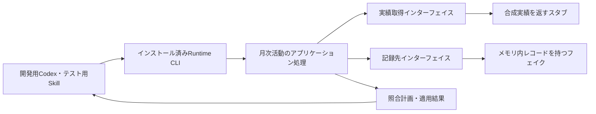
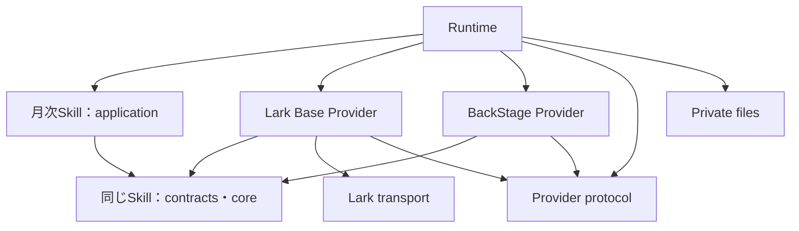

# M1：開発基盤の具体設計案

状態：承認済み（LGTM）。着手前の処置は承認どおり完了し、親`2170115`と30個の子repoの固定版から別ディレクトリーで再現確認済み。本書の命名・公開入口・具体的インターフェイスを採用してM1を実装中。全体の順序・方針は[採用済み計画](../migration/v2-plan.md)に従う。

## 1. M1で通す経路

**インストール済みのテスト用SkillからRuntime CLIを呼び、テスト用Providerで月次実績の取得・照合・結果返却を行う。** 実Lark・BackStageの操作は先行M2で行う。MCPはこの経路には追加しない。CLIでCodexとの要求・結果の受渡しが成立しない具体的理由が出た場合だけ、最小限のMCPアダプターを検討する。

最初の入力は架空の1か月・2アカウント。片方に更新差分、もう片方に差分なしを用意する。dry-runで期待する計画を返し、次にフェイク内だけで承認済み変更の適用とreadbackを確認する。テストコードがドライバー、Provider側がスタブ／フェイクになる。

## 2. パッケージ構成・命名の提案

以下は既存コードを責務別に組み直す対応表。実装言語は既存のJavaScript ESMを継続し、型システムや契約プログラミングの新規導入を前提にしない。

| 現在の所有元 | 正式npm名・配置案 | 公開入口・責務 | 変更理由 |
| --- | --- | --- | --- |
| `source-provider-api`の汎用接続定義 | `@flair-agency/provider-protocol`、`packages/provider-protocol/` | `.`：Provider descriptor、能力IDと対応版、実行方式、汎用要求・結果の形式と検証 | consumerとProviderの双方が共有する接続規約。業務validator、ファイル読取、動的importを含めない |
| 同パッケージのdiscovery・module/resource解決 | `@flair-agency/live-agency-runtime`、`runtime/` | Runtime内部の選択・ロード処理。公開APIを増やす必要がある利用者がいなければ内部実装にする | 構成所有者であるRuntimeに実装を置き、契約から実装への依存をなくす |
| 同パッケージの月次実績などの業務validator | 各Skillのnpmパッケージ | `./contracts`：サービス中立な入出力と必要操作、`./core`：純粋な業務判断 | 利用側がインターフェイスを所有する。業務ごとの定義を巨大な共通パッケージへ集約しない |
| `private-runtime-files` | `@flair-agency/private-files`、`packages/private-files/` | `.`：明示パスの制限付き読取・書込、サイズ制限、原子的置換等 | Runtime専用ではなく、複数の利用側が使うprivateファイルI/O。業務・profile選択は持たない |
| `lark-core` | `@flair-agency/lark-transport`、`packages/lark-transport/` | `./selection`、`./api`、`./cli`：選択済み主体による通信と共通の失敗処理 | Base・Chatの共通実装。Baseのテーブル意味や業務計画を含めない |
| `cli-utils` | `@flair-agency/cli-utils`、現配置維持 | 現行`./is-main` | 今回は再移動しない。無関係な便利関数の集積先にしない |
| `row-archive` | `@flair-agency/row-archive`、現配置維持 | `.`：履歴アーカイブの形式・codec・receipt照合 | 実ストレージ操作、削除判断、復元実行は含めない。今回は不要な改名を加えない |
| `creator-activity-sync` | `@flair-agency/creator-monthly-activity-reconcile`、`skills/live-agency-creator-monthly-activity-reconcile/` | `./contracts`、`./core`、`./application`、`./SKILL.md`と参照資源 | 月次の既存記録の照合、更新計画、結果確認。具体的なProviderをimportしない |
| Lark Base旧client | `@flair-agency/lark-base-provider`、`providers/lark-base/` | `./creator-monthly-activity`等の採用能力、descriptor・知識資源 | 旧scopeとclient呼称を整え、取得・更新・サービス固有変換の所有者を明確にする |
| 他6 Provider | 現行`@flair-agency/*-provider`を維持 | 各descriptor・能力実装・資源 | 配布名の役割は明瞭。実装していない能力を追加宣言しない |
| Runtime | `@flair-agency/live-agency-runtime`、`runtime/` | `live-agency` CLI、必要な構成API | 実装選択・結線・インストール済み資源解決・実行。Skill業務判断を持たない |
| `mcp/operations` | 必須配布対象外 | 保存と必要な処理の選択的移管 | 全ツール移行・配備をM1の依存にしない |

他のSkillの名前・責務の具体化は[採用計画の候補表](../migration/v2-plan.md#skill-naming-and-foreign-revenue-migration)に対応させる。M1の対象全体から黙って除外しない。招待資格の意味、履歴の識別・保持、backupの対応範囲、maintenanceの責務分解、外貨売上の1／2 Skill分割は対象ごとの仕様確認が残る。本書だけでその判断まで完了したとは扱わない。

## 3. コード依存とリリース単位

矢印はコード・パッケージ依存。Runtimeが具体的実装を注入する。SkillパッケージはRuntimeや具体的Providerをnpm依存に持たない。Skillの指示からCLIを利用する場合、CLIは配備構成が用意する実行手段として明示し、SkillコードからRuntimeをimportして循環を作らない。

ProviderはSkillの`./contracts`だけをimportする。contractsからapplication・CLI・I/Oを読み込まない。npm上は同じSkillパッケージを取得するため、指示資源等も導入されることと、ProviderからSkillの互換版を指定する必要があることはトレードオフとなる。初期は公開入口による分離を採用し、契約の独立した利用者・リリース周期が生じた場合だけ別パッケージへ抽出する。

プロトコルの共通形式と業務の入出力を区別する。前者は「どの能力を、どの実行方式・版で呼べるか」、後者は「月次実績として何が正しいか」を表す。

## 4. 月次活動のインターフェイス案

現在の注入経路は保全済みだが、`listFields/searchRecords/batchUpdate`やBase/table/field IDsが利用側へ露出している。次の業務操作へ置き換え、サービス固有の変換をProviderへ寄せる。

| インターフェイス | 入力 | 結果と意味 |
| --- | --- | --- |
| 実績取得 `readActivity` | 対象月、対象アカウント範囲 | 正規化済み実績、または操作指示の受渡し要求 |
| 既存記録取得 `readRecords` | 対象月、対象アカウント範囲 | 不透明な記録ID、対象アカウント、月次値、選択の証跡 |
| 変更適用 `applyChanges` | 記録IDに結びつく承認済み変更、実行許可・選択の証跡 | 適用結果、競合・拒否・結果不明。対象外作成や暗黙の再送を行わない |

Skillが月とアカウントの照合、差分・更新計画、業務上の更新条件、適用結果とreadbackの照合を所有する。ProviderがLarkのfield ID解決、API変換、許可対象への制限、送信結果の正規化を所有する。Runtimeがread/write主体・設定・実装を選ぶ。承認情報の形式は既存の許可条件を保持して定義し、操作を呼べることを実行許可と同一視しない。

現行runnerの選択欠如拒否、対象bindingの一致、read/write分離、readback、不確定writeの再送禁止は保持する。既存と新しい実装へ同じ合成入力を与え、計画・更新対象・結果・停止理由の差を確認する。

## 5. 非同期・指示型経路

CLIの結果は完了・操作待ち・失敗を区別する。操作待ちには要求ID、選択した能力と版、対象月・範囲、必要な操作指示を含める。Codex側が結果を渡す際は同じ要求との対応を検証する。照合できない結果・別月・別対象を受け入れない。

M1の指示型Providerは合成結果を返すものに限定する。既存のinstruction fixtureを再利用し、実ブラウザー操作を始めない。メッセージキューや汎用永続ワークフローは作らず、必要な要求状態は明示した開発用出力先へ保持する。機密値を標準出力へ含めない。

## 6. 発行・導入・更新

1. 採用した子repoの版と親参照を使い、実際のGitHub配布元・権限・package関連付けを確認する。現時点のProvider/MCP取得元はローカルbundleなので、そのままGitHub CIで取得できるとは扱わない。
2. 所有repoのActionsから合成テストと配布内容検査を経て、固定版をGitHub Packagesへ発行する。共通インターフェイス → 利用側の契約公開パッケージ → Provider → Runtime／配備構成の依存順に扱う。変更のないパッケージの版は増やさない。
3. npmの`private: true`は発行禁止なので、発行対象manifestでは見直す。これはGitHub Packages側のPrivate公開範囲とは別。親の開発用workspaceは`private: true`を維持する。
4. 独立した配備manifest/lockfileに固定版を記録し、ソースを参照しない開発用導入先へ取得する。
5. 開発Codexから代表操作を実行し、更新した版へ切替後、前の検証済み版へ戻せることを確認する。本番の登録・設定・稼働版を変更しない。

今回完了した別ディレクトリーでの確認は、ローカルGit取得元の明示上書きとoffline npm ciによる**ソース採用版の再現確認**。GitHub Packagesの発行・取得や、配布物だけでの起動はまだ検証していない。

## 7. レビュー対象と次の実装

今回のレビュー対象は、**2節の正式名・責務、3節の依存と契約の配布方法、4〜5節の代表インターフェイスと受渡し**。合意したM1/M2/M3の順序や、先行M2後の並行化は再選択しない。

レビュー後は、この設計の共通部分と月次の代表経路を一つの基盤作業として実装する。構成が固定した後、Runtime接続とCI準備を競合しない範囲で分担できる。代表操作の成功だけでM1完了にはせず、対象パッケージ全体の導入・資源解決と、計画の五条件まで揃える。

## 8. GitHub配布元の対応案

ローカル実装・配布物だけの動作検証まで完了。全体689テスト、30アーカイブの導入と更新・復帰を確認した。実GitHub Packagesへの発行は未実施で、M1完了ではない。旧互換入口と他SkillのM2/M3は残る。

GitHubの組織リポジトリ一覧を読み取り確認した結果、RuntimeとProvider7件の既存private repoはある。一方、親・共通5・分割後Skill16の独立repoは見つからない。[対応情報](../../tools/m1-source-repositories.json)は取得先の検討用で、発行許可や呼出し一覧ではない。

推奨は、承認済みの独立したソース管理構成をGitHubにも反映すること。これはGitHub Packages自体の要件ではない。具体的には、親を`flair-agency/live-agency`、共通と各Skillを次表のprivate repoとして作成する。既存Runtime・Provider repoはそのまま使い、既存public Skillモノレポへ戻さない。凍結Skillはソース保全対象のみで、npm発行対象にはしない。

| 対象 | 新設するprivate repo名（`flair-agency/`配下） |
| --- | --- |
| `packages/cli-utils` | `live-agency-cli-utils` |
| `packages/lark-transport` | `live-agency-lark-transport` |
| `packages/private-files` | `live-agency-private-files` |
| `packages/row-archive` | `live-agency-row-archive` |
| `packages/provider-protocol` | `live-agency-provider-protocol` |
| `skills/coin-expense-reconcile` | `live-agency-coin-expense-reconcile` |
| `skills/coin-expense-weekly-application` | `live-agency-coin-expense-weekly-application` |
| `skills/live-agency-creator-monthly-activity-reconcile` | `live-agency-creator-monthly-activity-reconcile` |
| `skills/creator-insight-sync` | `live-agency-creator-insight-sync` |
| `skills/creator-invitation-status-compaction` | `live-agency-creator-invitation-status-compaction` |
| `skills/creator-invitation-status-sync` | `live-agency-creator-invitation-status-sync` |
| `skills/creator-live-history-compaction` | `live-agency-creator-live-history-compaction` |
| `skills/creator-live-history-sync` | `live-agency-creator-live-history-sync` |
| `skills/creator-live-metrics-compaction` | `live-agency-creator-live-metrics-compaction` |
| `skills/creator-profile-compaction` | `live-agency-creator-profile-compaction` |
| `skills/creator-profile-sync` | `live-agency-creator-profile-sync` |
| `skills/gift-history-sync` | `live-agency-gift-history-sync` |
| `skills/lark-base-backup` | `live-agency-lark-base-backup` |
| `skills/lark-base-backup-retention` | `live-agency-lark-base-backup-retention` |
| `skills/lark-base-disaster-recovery-drill` | `live-agency-lark-base-disaster-recovery-drill` |
| `skills/lark-base-maintenance` | `live-agency-lark-base-maintenance` |

新設は親1＋共通5＋Skill16の計22repo。実際の初回pushは、各repoの採用履歴・公開範囲・取得先を確認した具体的な変更として扱う。既存public MCPへの変更・本番設定変更はこの案に含めない。発行前にはnpmの発行禁止フラグ、CIでの依存取得・テスト実行、Actionsからのpackageアクセス権も整える。
