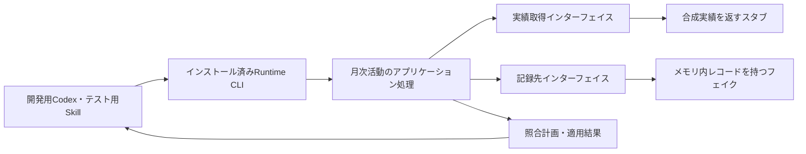
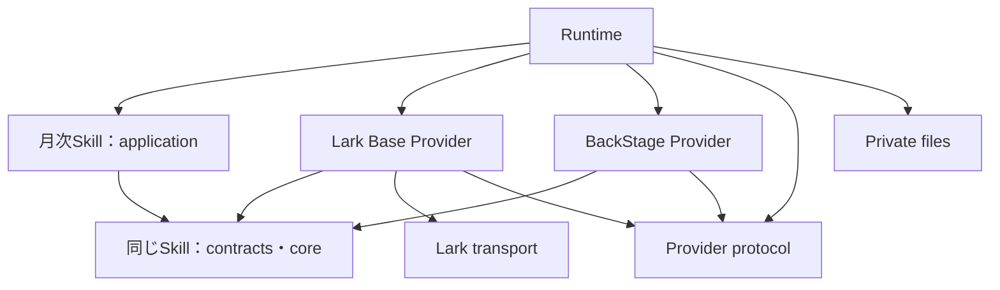
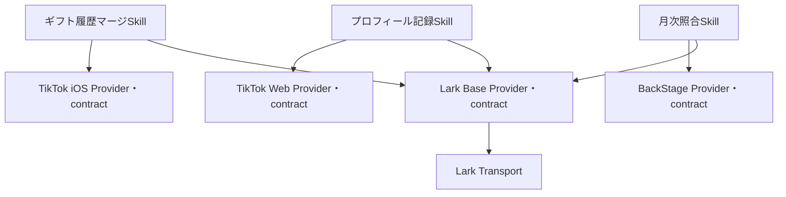
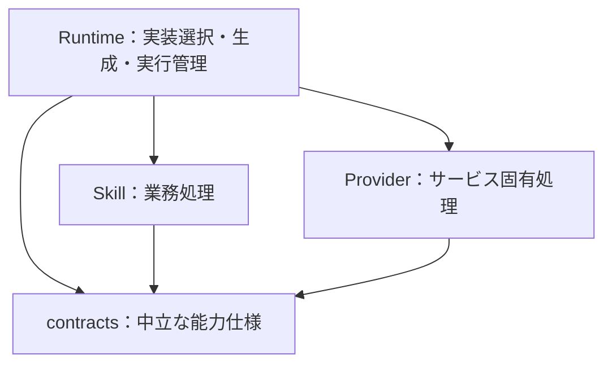
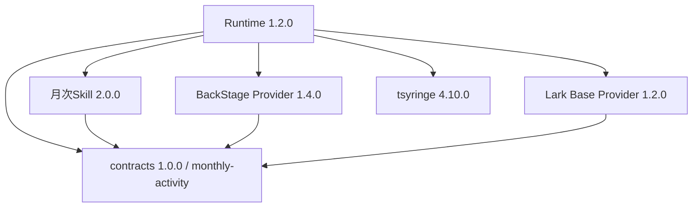

# M1：開発基盤の具体設計案

状態：承認済み（LGTM）。着手前の処置は承認どおり完了し、親`2170115`と30個の子repoの固定版から別ディレクトリーで再現確認済み。本書の命名・公開入口・具体的インターフェイスを採用し、12節の範囲変更の承認によりM1完了。先行M2へ進む。全体の順序・方針は[採用済み計画](../migration/v2-plan.md)に従う。

## 1. M1で通す経路

**インストール済みのテスト用SkillからRuntime CLIを呼び、テスト用Providerで月次実績の取得・照合・結果返却を行う。** 実Lark・BackStageの操作は先行M2で行う。MCPはこの経路には追加しない。CLIでCodexとの要求・結果の受渡しが成立しない具体的理由が出た場合だけ、最小限のMCPアダプターを検討する。

最初の入力は架空の1か月・2アカウント。片方に更新差分、もう片方に差分なしを用意する。dry-runで期待する計画を返し、次にフェイク内だけで承認済み変更の適用とreadbackを確認する。テストコードがドライバー、Provider側がスタブ／フェイクになる。

## 2. パッケージ構成・命名の提案

契約の所有・依存方向は承認済みの11節で改訂。以下の当初案より11節を優先する。

以下は既存コードを責務別に組み直す対応表。実装言語は既存のJavaScript ESMを継続し、型システムや契約プログラミングの新規導入を前提にしない。

| 現在の所有元 | 正式npm名・配置案 | 公開入口・責務 | 変更理由 |
| --- | --- | --- | --- |
| `source-provider-api`の汎用接続定義 | `@flair-agency/provider-protocol`、`packages/provider-protocol/` | `.`：Provider descriptor、能力IDと対応版、実行方式、汎用要求・結果の形式と検証 | consumerとProviderの双方が共有する接続規約。業務validator、ファイル読取、動的importを含めない |
| 同パッケージのdiscovery・module/resource解決 | `@flair-agency/live-agency-runtime`、`runtime/` | Runtime内部の選択・ロード処理。公開APIを増やす必要がある利用者がいなければ内部実装にする | 構成所有者であるRuntimeに実装を置き、契約から実装への依存をなくす |
| 同パッケージの月次実績などの業務validator | 各Skillのnpmパッケージ | `./contracts`：サービス中立な入出力と必要操作、`./core`：純粋な業務判断 | 利用側がインターフェイスを所有する。業務ごとの定義を巨大な共通パッケージへ集約しない |
| `private-runtime-files` | `@flair-agency/private-files`、`packages/private-files/` | `.`：明示パスの制限付き読取・書込、サイズ制限、原子的置換等 | Runtime専用ではなく、複数の利用側が使うprivateファイルI/O。業務・profile選択は持たない |
| `lark-core` | `@flair-agency/lark-transport`、`packages/lark-transport/` | `./selection`、`./api`、`./cli`：選択済み主体による通信と共通の失敗処理 | Base・Chatの共通実装。Baseのテーブル意味や業務計画を含めない |
| `cli-utils` | `@flair-agency/cli-utils`、現配置維持 | 現行`./is-main` | 今回は再移動しない。無関係な便利関数の集積先にしない |
| `row-archive` | `@flair-agency/row-archive`、現配置維持 | `.`：履歴アーカイブの形式・codec・receipt照合 | 実ストレージ操作、削除判断、復元実行は含めない。今回は不要な改名を加えない |
| `creator-activity-sync` | `@flair-agency/creator-monthly-activity-reconcile`、`skills/live-agency-creator-monthly-activity-reconcile/` | `./contracts`、`./core`、`./application`、`./SKILL.md`と参照資源 | 月次の既存記録の照合、更新計画、結果確認。具体的なProviderをimportしない |
| Lark Base旧client | `@flair-agency/lark-base-provider`、`providers/lark-base/` | `./creator-monthly-activity`等の採用能力、descriptor・知識資源 | 旧scopeとclient呼称を整え、取得・更新・サービス固有変換の所有者を明確にする |
| 他6 Provider | 現行`@flair-agency/*-provider`を維持 | 各descriptor・能力実装・資源 | 配布名の役割は明瞭。実装していない能力を追加宣言しない |
| Runtime | `@flair-agency/live-agency-runtime`、`runtime/` | `live-agency` CLI、必要な構成API | 実装選択・結線・インストール済み資源解決・実行。Skill業務判断を持たない |
| `mcp/operations` | 必須配布対象外 | 保存と必要な処理の選択的移管 | 全ツール移行・配備をM1の依存にしない |

他のSkillの名前・責務の具体化は[採用計画の候補表](../migration/v2-plan.md#skill-naming-and-foreign-revenue-migration)に対応させる。12節の承認に基づき、先行3 Skill以外の正式名・業務仕様・個別配布は各SkillのM3準備で確定する。移行対象からは除外しない。招待資格の意味、履歴の識別・保持、backupの対応範囲、maintenanceの責務分解、外貨売上の1／2 Skill分割は対象ごとの仕様確認が残る。本書だけでその判断まで完了したとは扱わない。

## 3. 当初のコード依存とリリース単位（11節で改訂）

矢印はコード・パッケージ依存。Runtimeが具体的実装を注入する。SkillパッケージはRuntimeや具体的Providerをnpm依存に持たない。Skillの指示からCLIを利用する場合、CLIは配備構成が用意する実行手段として明示し、SkillコードからRuntimeをimportして循環を作らない。

ProviderはSkillの`./contracts`だけをimportする。contractsからapplication・CLI・I/Oを読み込まない。npm上は同じSkillパッケージを取得するため、指示資源等も導入されることと、ProviderからSkillの互換版を指定する必要があることはトレードオフとなる。初期は公開入口による分離を採用し、契約の独立した利用者・リリース周期が生じた場合だけ別パッケージへ抽出する。

プロトコルの共通形式と業務の入出力を区別する。前者は「どの能力を、どの実行方式・版で呼べるか」、後者は「月次実績として何が正しいか」を表す。

## 4. 月次活動のインターフェイス案

現在の注入経路は保全済みだが、`listFields/searchRecords/batchUpdate`やBase/table/field IDsが利用側へ露出している。次の業務操作へ置き換え、サービス固有の変換をProviderへ寄せる。

| インターフェイス | 入力 | 結果と意味 |
| --- | --- | --- |
| 実績取得 `readActivity` | 対象月、対象アカウント範囲 | 正規化済み実績、または操作指示の受渡し要求 |
| 既存記録取得 `readRecords` | 対象月、対象アカウント範囲 | 不透明な記録ID、対象アカウント、月次値、選択の証跡 |
| 変更適用 `applyChanges` | 記録IDに結びつく承認済み変更、実行許可・選択の証跡 | 適用結果、競合・拒否・結果不明。対象外作成や暗黙の再送を行わない |

Skillが月とアカウントの照合、差分・更新計画、業務上の更新条件、適用結果とreadbackの照合を所有する。ProviderがLarkのfield ID解決、API変換、許可対象への制限、送信結果の正規化を所有する。Runtimeがread/write主体・設定・実装を選ぶ。承認情報の形式は既存の許可条件を保持して定義し、操作を呼べることを実行許可と同一視しない。

現行runnerの選択欠如拒否、対象bindingの一致、read/write分離、readback、不確定writeの再送禁止は保持する。既存と新しい実装へ同じ合成入力を与え、計画・更新対象・結果・停止理由の差を確認する。

## 5. 非同期・指示型経路

CLIの結果は完了・操作待ち・失敗を区別する。操作待ちには要求ID、選択した能力と版、対象月・範囲、必要な操作指示を含める。Codex側が結果を渡す際は同じ要求との対応を検証する。照合できない結果・別月・別対象を受け入れない。

M1の指示型Providerは合成結果を返すものに限定する。既存のinstruction fixtureを再利用し、実ブラウザー操作を始めない。メッセージキューや汎用永続ワークフローは作らず、必要な要求状態は明示した開発用出力先へ保持する。機密値を標準出力へ含めない。

## 6. 発行・導入・更新

1. 採用した子repoの版と親参照を使い、実際のGitHub配布元・権限・package関連付けを確認する。現時点のProvider/MCP取得元はローカルbundleなので、そのままGitHub CIで取得できるとは扱わない。
2. 所有repoのActionsから合成テストと配布内容検査を経て、固定版をGitHub Packagesへ発行する。共通ライブラリー → Provider（能力contractを含む） → Skill → Runtime／配備構成の依存順に扱う。変更のないパッケージの版は増やさない。
3. npmの`private: true`は発行禁止なので、発行対象manifestでは見直す。これはGitHub Packages側のPrivate公開範囲とは別。親の開発用workspaceは`private: true`を維持する。
4. 独立した配備manifest/lockfileに固定版を記録し、ソースを参照しない開発用導入先へ取得する。
5. 開発Codexから代表操作を実行し、更新した版へ切替後、前の検証済み版へ戻せることを確認する。本番の登録・設定・稼働版を変更しない。

今回完了した別ディレクトリーでの確認は、ローカルGit取得元の明示上書きとoffline npm ciによる**ソース採用版の再現確認**。GitHub Packagesの発行・取得や、配布物だけでの起動はまだ検証していない。

## 7. レビュー対象と次の実装

今回のレビュー対象は、**2節の正式名・責務、3節の依存と契約の配布方法、4〜5節の代表インターフェイスと受渡し**。合意したM1/M2/M3の順序や、先行M2後の並行化は再選択しない。

レビュー後は、この設計の共通部分と月次の代表経路を一つの基盤作業として実装する。構成が固定した後、Runtime接続とCI準備を競合しない範囲で分担できる。代表操作の成功だけでM1完了にはせず、対象パッケージ全体の導入・資源解決と、計画の五条件まで揃える。

## 8. GitHub配布元の対応案

ローカル実装・配布物だけの動作検証まで完了。全体689テスト、30アーカイブの導入と更新・復帰を確認した。実GitHub Packagesへの発行は未実施で、M1完了ではない。旧互換入口と他SkillのM2/M3は残る。

GitHubの組織リポジトリ一覧を読み取り確認した結果、RuntimeとProvider7件の既存private repoはある。一方、親・共通5・分割後Skill16の独立repoは見つからない。[対応情報](../../tools/m1-source-repositories.json)は取得先の検討用で、発行許可や呼出し一覧ではない。

Skill用repoは、**リポジトリ名＝Skill識別子（`SKILL.md`の`name`）＝ディレクトリ名**とする。`live-agency-`を含む識別子をそのまま使い、npm名や旧Skill名から別の名前を作らない。例えば月次活動は、`flair-agency/live-agency-creator-monthly-activity-reconcile`となる。

以下のSkill名は[移行計画の候補表](../migration/v2-plan.md#skill-naming-and-foreign-revenue-migration)に揃えた。月次活動は採用済み。他は業務責務・識別子が確定するまでrepo名も候補であり、旧名に接頭辞を付けたrepoを先に作成しない。凍結Skillは引き続き凍結として扱う。

親は`flair-agency/live-agency`、共通ライブラリーは下表の案を維持する。既存Runtime・Provider repoは再利用する案。

| 現在の配置 | repo名（`flair-agency/`配下）＝移行先Skill識別子 | 状態 |
| --- | --- | --- |
| `skills/coin-expense-reconcile` | `live-agency-coin-purchase-expense-reconcile` | 候補 |
| `skills/coin-expense-weekly-application` | `live-agency-weekly-coin-expense-claim-submit` | 候補・凍結 |
| `skills/live-agency-creator-monthly-activity-reconcile` | `live-agency-creator-monthly-activity-reconcile` | 採用済み |
| `skills/creator-insight-sync` | `live-agency-creator-assessment-update` | 候補 |
| `skills/creator-invitation-status-compaction` | `live-agency-creator-invitation-eligibility-history-deduplicate` | 候補 |
| `skills/creator-invitation-status-sync` | `live-agency-creator-invitation-eligibility-record` | 候補 |
| `skills/creator-live-history-compaction` | `live-agency-creator-live-session-history-prune` | 候補 |
| `skills/creator-live-history-sync` | `live-agency-creator-live-observation-record` | 候補 |
| `skills/creator-live-metrics-compaction` | `live-agency-creator-live-metric-history-prune` | 候補 |
| `skills/creator-profile-compaction` | `live-agency-creator-profile-history-prune` | 候補 |
| `skills/creator-profile-sync` | `live-agency-creator-profile-record` | 候補 |
| `skills/gift-history-sync` | `live-agency-gift-history-merge` | 候補 |
| `skills/lark-base-backup` | `live-agency-data-backup-create` | 候補 |
| `skills/lark-base-backup-retention` | `live-agency-data-backup-prune` | 候補 |
| `skills/lark-base-disaster-recovery-drill` | `live-agency-data-recovery-test` | 候補 |
| `skills/lark-base-maintenance` | `live-agency-datastore-maintain` | 候補 |

| 共通ライブラリーの配置 | repo名の案（`flair-agency/`配下） |
| --- | --- |
| `packages/cli-utils` | `live-agency-cli-utils` |
| `packages/lark-transport` | `live-agency-lark-transport` |
| `packages/private-files` | `live-agency-private-files` |
| `packages/row-archive` | `live-agency-row-archive` |
| `packages/provider-protocol` | `live-agency-provider-protocol` |

親1＋共通5＋現在のSkill16で数えると22repoに相当するが、これは一括新設する確定数ではない。Skillの分割・統合・凍結の扱いと識別子の確定に合わせて作成対象を決める。この名前の統一は、GitHub作成・push・発行の実施を意味しない。発行準備とM1の残条件は[現在の状況](../migration/status.md)に従う。

## 9. TikTok Providerの依存先2件：正式名の確定案

状態：承認済み。2026年9月7日、所有者が「提案の2名を正式採用する」と回答。実コードを確認すると、iOS Providerはギフト入力のvalidator、Web Providerはプロフィール観測のvalidatorを各Skillの`./contracts`から参照している。この所有関係を維持し、2件とも既存Skillを1対1で引き継ぐ。

| 現行Skill | 正式Skill名＝ディレクトリー名＝GitHub repo名（案） | npm名（案）、初回版 | 維持する責務 |
| --- | --- | --- | --- |
| gift-history-sync | live-agency-gift-history-merge | @flair-agency/gift-history-merge、1.0.0 | 事務所負担ギフトの部分観測を既存マスターへ統合。入力にない記録の削除は含まない |
| creator-profile-sync | live-agency-creator-profile-record | @flair-agency/creator-profile-record、1.0.0 | プロフィール観測と証拠を履歴へ記録。履歴の汎用編集・削除は含まない |

推奨：この2名を正式採用する。GitHubは`flair-agency`配下に各Private repoを作り、SkillsとProvider側の参照を対応するnpm名へ揃える。既存の`./contracts`公開入口を維持し、独立インストールと合成テストを通してから発行する。接続方式や責務の追加、既存Skillの分割は行わない。残る旧実装経路と実サービスでの動作は、引き続きM2/M3の未完了範囲として記録する。名前の変更を実運用移行の完了とは扱わない。

正式名を採用し、2件のPrivate repo作成と改名を実施。発行は固定lockとActionsの権限・テストを確認して行う。Runtimeの明示的な導入先と固定版パッケージを使うインストール処理、単体テストの独立化は並行して準備できる。

## 10. Actions読み取り設定（依存修正に伴い旧一覧を撤回）

以前の一覧には、TikTokからSkillを経由してLark・月次照合へ到達する不要な依存が含まれていた。旧一覧に沿った追加作業は不要。オーナーは余剰Readの整理を含め設定し直したと報告済み。下記は削除対象の記録であり、GitHubの全設定行をこちらで再取得したという意味ではない。

設定変更の連絡後、以下のRead不足はすべて解消。3 SkillとRuntimeのActionsで依存取得・発行・独立インストールが成功した。以下は設定した関係の記録であり、追加作業の依頼ではない。

| Package settings | Readを追加するリポジトリー |
| --- | --- |
| [tiktok-ios-provider](https://github.com/orgs/flair-agency/packages/npm/tiktok-ios-provider/settings) | `live-agency-gift-history-merge`、`live-agency-provider-runtime` |
| [tiktok-web-provider](https://github.com/orgs/flair-agency/packages/npm/tiktok-web-provider/settings) | `live-agency-creator-profile-record`、`live-agency-provider-runtime` |
| [backstage-provider](https://github.com/orgs/flair-agency/packages/npm/backstage-provider/settings) | `live-agency-creator-monthly-activity-reconcile` |
| [lark-base-provider](https://github.com/orgs/flair-agency/packages/npm/lark-base-provider/settings) | `live-agency-creator-monthly-activity-reconcile` |
| [lark-transport](https://github.com/orgs/flair-agency/packages/npm/lark-transport/settings) | `live-agency-creator-monthly-activity-reconcile` |

以下は修正後の必要関係。既に付与されている項目は再追加不要。公開レジストリーの外部依存を除き、実際の固定依存の推移閉包から確認する。すべて`flair-agency`配下。

| 利用するActionsリポジトリー | 読める必要があるPrivateパッケージ |
| --- | --- |
| `live-agency-provider-tiktok-ios` | `private-files`, `provider-protocol` |
| `live-agency-provider-tiktok-web` | `private-files`, `provider-protocol` |
| `live-agency-provider-backstage` | `provider-protocol` |
| `live-agency-provider-lark-base` | `lark-transport` |
| `live-agency-gift-history-merge` | `tiktok-ios-provider`, `lark-base-provider`, `lark-transport`, `cli-utils`, `private-files`, `provider-protocol` |
| `live-agency-creator-profile-record` | `tiktok-web-provider`, `lark-base-provider`, `lark-transport`, `cli-utils`, `private-files`, `provider-protocol` |
| `live-agency-creator-monthly-activity-reconcile` | `backstage-provider`, `lark-base-provider`, `lark-transport`, `cli-utils`, `private-files`, `provider-protocol` |
| `live-agency-provider-runtime` | Runtime manifestが採用するProvider・Skillと、それらの推移的依存 |

TikTokからLark、月次照合、gift/profile SkillへのReadは不要。修正後の3 SkillとRuntimeは、上記の必要依存をActionsで実際に取得できることまで確認済み。

### 削除対象のRead（追加指示に基づく整理）

修正後の各リポジトリーのmanifestと推移的依存を照合済み。以前に追加を依頼した権限のうち、次の8パッケージ・最大16件が不要になった。GitHub設定の現在の登録一覧は取得できていないため、実際に登録されている行だけを削除する。こちらで設定削除を実行したという記録ではない。

| Package settings | Manage Actions accessから削除するリポジトリー |
| --- | --- |
| [cli-utils](https://github.com/orgs/flair-agency/packages/npm/cli-utils/settings) | `live-agency-provider-lark-base` `live-agency-provider-tiktok-ios` `live-agency-provider-tiktok-web` |
| [private-files](https://github.com/orgs/flair-agency/packages/npm/private-files/settings) | `live-agency-provider-lark-base` |
| [provider-protocol](https://github.com/orgs/flair-agency/packages/npm/provider-protocol/settings) | `live-agency-provider-lark-base` |
| [creator-monthly-activity-reconcile](https://github.com/orgs/flair-agency/packages/npm/creator-monthly-activity-reconcile/settings) | `live-agency-provider-lark-base` `live-agency-gift-history-merge` `live-agency-creator-profile-record` `live-agency-provider-tiktok-ios` `live-agency-provider-tiktok-web` |
| [lark-transport](https://github.com/orgs/flair-agency/packages/npm/lark-transport/settings) | `live-agency-provider-tiktok-ios` `live-agency-provider-tiktok-web` |
| [lark-base-provider](https://github.com/orgs/flair-agency/packages/npm/lark-base-provider/settings) | `live-agency-provider-tiktok-ios` `live-agency-provider-tiktok-web` |
| [gift-history-merge](https://github.com/orgs/flair-agency/packages/npm/gift-history-merge/settings) | `live-agency-provider-tiktok-ios` |
| [creator-profile-record](https://github.com/orgs/flair-agency/packages/npm/creator-profile-record/settings) | `live-agency-provider-tiktok-web` |

この一覧は修正後のmainと採用する新版を基準とする。削除後に旧版のActionsを再実行する場合は、旧依存のため再付与が必要になることがある。Runtimeや未移行Skillなど、表にない利用元のReadは削除対象に含めない。

## 11. Provider所有contractへの修正（承認済み）

当初の「利用側がインターフェイスを所有する」を、ProviderがSkillパッケージを取得する設計として実装した。その結果、契約のimportだけでもSkillの全依存が導入される構成になった。公開入口の分離では配布単位の依存は解消されないため、この判断を改める。

| 所有者 | 公開contract | Skillに残す条件 |
| --- | --- | --- |
| TikTok iOS | `./contracts/gift-history`：観測履歴の形式・一貫性 | マスターとの照合、マージ、記録計画 |
| TikTok Web | `./contracts/profile-observation`：観測値・状態・証拠の形式 | 記録先IDの必須性・一意性、対象照合、履歴記録 |
| BackStage | `./contracts/activity`：月次観測値の形式 | 要求月・対象アカウントとの一致、月の日数などの業務条件 |
| Lark Base | `./contracts/creator-activity`：記録の取得・変更要求と選択binding | 差分計画、承認済み計画との一致、readbackによる業務結果確認 |

矢印はパッケージ依存。共通ライブラリーへの依存は省略。Runtimeによる実装選択・注入は維持する。ProviderはSkillへ依存せず、contract専用パッケージは新設しない。Skill側の既存`./contracts`入口は互換用に残すが、Providerからは参照しない。

TikTok Webは記録先のない観測入力を受け付ける。既存の`creatorRecordId`は互換のため任意の不透明な相関値として受け渡すだけとし、Lark固有のID書式を要求しない。記録処理を実行するSkillでは必須・一意性を引き続き検証する。

修正完了条件は、合成入力で既存の業務結果・拒否条件を保つこと、全ProviderからSkillへの依存がないこと、TikTok単体の配布物とlockfileにLark・Skillが含まれないこと。共通ライブラリー→Provider→Skill→Runtimeの順に新しい固定版を検証・発行する。既存の公開済み版は上書きせず、本番登録・実サービス操作は行わない。

## 12. M1完了範囲の確認（今回のレビュー対象）

共通5ライブラリー・7 Provider・Runtime・先行3 Skillの計16パッケージは、実GitHub Packagesで発行・導入できた。合成Providerを使った現在のCodexからのCLI呼出し、照合・適用・readback・中断再開も通った。さらに同じ開発用導入先でRuntime `1.0.0 → 1.0.1 → 1.0.0`を切り替え、各段階の起動・同じ業務結果・配布資源を確認し、元のlockfileと全パッケージ版の一致まで確認した。

残りは基盤の技術検証ではなく、未確定Skillの正式名・責務と配布対象の確定である。従来の正本は全対象Skillの配布確認をM1条件としていたが、今回の承認により、下記の残作業を各SkillのM3準備へ移す。完了・対象外扱いにはしない。

| 区分 | 現状 |
| --- | --- |
| 先行3 Skill | 月次照合・ギフト履歴マージ・プロフィール記録。正式名採用済み、配布検証済み |
| 未確定11 Skill | コイン購入照合、インサイト、招待状態記録・重複除去、LIVE履歴記録・間引き、LIVE指標間引き、プロフィール履歴間引き、バックアップ作成・保持・復旧検証。正式名や責務の確定、個別repo/パッケージの発行が残る |
| 週次コイン申請 | 凍結済み。今回の作業では再開しない |
| 保守統括 | 一対一移行を保留。責務分解が必要 |
| 外貨売上 | 現在の16 Skill repoの外。1／2 Skill分割と移行対象の確定が残る |

**承認済み判断：M1は今回検証した16パッケージで基盤の成立を判定し、未確定Skillの正式名・業務仕様・配布は各SkillのM3準備へ配置する。** これにより、最初に基盤を作り、その後Provider、最後にSkillを検証する順序を維持できる。残るSkillを廃止・完了扱いにはせず、各M3の完了条件として追跡する。

オーナーの「推奨案でM1を完了し、先行M2へ進む」を受け、正本へ反映しM1完了を記録した。月次照合で使うLark Base、続いてBackStageの先行M2へ進む。実サービスの対象・主体・許可は各検証で明示する。

## 13. 先行M2完了レビュー

状態：技術検証完了、次段階へ進む準備のレビュー。

| 対象 | 検証済みの版・範囲 |
| --- | --- |
| Runtime | `1.1.0`。配布済みCLIから両Providerを明示的に選択・接続 |
| BackStage | `1.3.1`。指定された2026年6月Excelの全5件を読み込み、元セル値と独立照合 |
| Lark Base | `1.1.1`。選択したユーザーで一時Baseの読み取り・更新・読戻し |
| 認証・通信 | `lark-transport@1.0.0`、CLI `1.0.93`。App・ユーザー・法人・操作範囲の明示と照合 |

GitHub Packagesから新しい導入先へインストールしたRuntimeで、変更4件・変更不要1件の計画を作り、その計画を適用した。読戻し成功後の再照合は全5件が差分0件となり、古い承認済み計画の再適用は拒否された。検証用Baseは削除し、同じAPI経路の削除済み応答も確認した。関連16テストとActionsの配布物検証も成功している。

実装の選択と認証の結線だけをRuntimeへ追加した。Larkのセル形式修正はLark Provider、BackStageの列順対応はBackStage Provider、照合・承認・結果判定はSkillが引き続き担当する。

今回の完了範囲は「既に取得した月次Excelを渡す経路」と「選択したユーザーによるLark Baseの月次操作」。実ブラウザーからの取得、指示型の実観測、iPhone、他の認証主体・操作は各M2で検証する。本番への切替とSkillの業務受け入れはM3に残る。

**推奨：先行M2のこの範囲を完了として、月次照合のM3準備と、独立した他ProviderのM2を並行して進める。** 共通部分の変更は統合担当が直列に取り込む。これは採用済み計画の先行M2完了レビューポイントであり、新しいアーキテクチャ判断は追加していない。

## 14. 中立contractへの設計変更レビュー

状態：LGTMにより本節の具体案を採用。DIはtsyringeを今回導入する。月次1経路の実装・配布検証を進め、本番切替は別途扱う。

### 目標と現状の差

目標は、Skillのリポジトリーと配布物が具体的Providerを知らず、SkillとProviderをcontractに対して独立開発・検証できること。現在の手動DIは実装の受渡しを実現したが、パッケージの独立までは実現していない。11節のProvider所有contract方針はこの目標に対して改訂する。13節の実接続結果は有効な既存版の証跡であり、設計要件を満たした証拠とは扱わない。

矢印はコード・パッケージ依存。SkillからProvider、ProviderからSkillへの依存を持たせない。実行時にはRuntimeがcontractに適合する実装をSkillへ渡す。Providerの差替えはRuntimeの構成に収める。

### 所有範囲の案

| 所有者 | 保持・移管するもの |
| --- | --- |
| 中立contracts | 能力インターフェイス、入力・結果の型／検証、欠損・失敗・副作用・互換性の仕様、共有トークン、合成データによる適合テスト |
| Skill | 対象月・対象者の業務判断、照合・計画・承認・結果判定。具体的ProviderやDIコンテナーへの依存を持たない |
| Provider | 外部スキーマ、セル・ファイル解析、サービス操作、認証・対象選択の検証。中立contractを実装する |
| Runtime内部のcomposition | インストール済み版・能力・権限の選択と検証、Provider生成、必要ならDI登録。Skill業務処理を持たない |
| Runtime内部のrunner | 入力、中断・再開、Skill起動、結果の受渡し。Provider選択・生成はcompositionへ委譲する |
| 既存共通ライブラリー | `provider-protocol`の汎用要求／応答・記述子、`private-files`のI/Oなど。中立contractへの移管と無関係な再編は行わない |

採用した配置・名称は `packages/contracts/`、repo `live-agency-contracts`、npm `@flair-agency/contracts`。まず公開入口 `./monthly-activity` で始める。正式名として確定。適合テストは同repoに置き、必要なテスト用入口を実行用APIから分離する。新たなRunner repo/packageは設けず、Runtime内のモジュール分離とする案。

月次の中立contractは `readActivity`、`readRecords`、`applyChanges` を起点とし、要求月・対象者、観測日時、単位、欠損、対象の曖昧性、競合、書込み結果不明、readbackの意味を規定する。レコード識別子や選択・承認の対応値は不透明値として扱い、LarkのID形式・Base/フィールド構造・BackStage列名・認証情報を持ち込まない。適合テストを通ったことは外部サービスへの実行許可を意味しない。

### 月次1経路で変更する具体的範囲

| 現行箇所 | 必要な変更 |
| --- | --- |
| 月次Skill `package.json`、`src/contracts.js` | Lark／BackStage packageへの依存と再exportを中立contract依存に置換。業務の月・暦・対象範囲の判定はSkillに残す |
| 月次Skill `scripts/lark_activity_sync.mjs` | 残っている `field_id`／`field_name`／`record_id` の解釈と具体的選択Providerへの呼出しを整理。Provider処理を公開Skillへ残したまま完了にしない |
| 月次Skill `scripts/resolve_activity_source.mjs` | `provider-protocol/legacy`経由の探索・実装選択をRuntimeへ移管。旧CLIの入力・出力・呼出し元の移行も含める |
| Lark／BackStage Provider | 中立contractを参照し、既存の解析・操作実装を適合させる。現行contractファイルを丸ごと移すのではなく、サービス固有部分を除いて定義する |
| Runtime | 具体的APIの結線とrunnerを内部で分離。Skill／Providerにコンテナー操作を持ち込まない |
| Skillのinstructions・tests・配布入口 | `src/`だけでなく配布物全体で具体的Provider参照を確認。旧入口を残す場合はその所有先と廃止条件を示す |
| ギフト／プロフィールほか | 同様のProvider-owned contract依存を後続対象として追跡。月次と同時に一括変更しない |

依存宣言だけを削除して上位 `node_modules` に依存させることや、Skill内にサービス名付きの互換shimを残すことは受入条件を満たさない。

### 互換性と管理の推奨案

- 当面は1つのnpmパッケージ版で管理する。破壊的変更は影響する能力を明示してmajor更新し、旧版を残す。実行構成ごとに互換なcontract版とProvider版を固定し、互換性未確認の版を自動混在させない。
- 能力別の入口は維持するが、パッケージmajor更新の影響は他の能力の利用者にも及ぶ。この負担が実測で大きくなった場合にのみ分割を検討する。
- contractの変更には利用するSkillと実装するProvider双方のレビューを必要とする。仕様・validator・適合テスト・互換性の説明を一緒に変更する。
- 共通トークンを採る場合は能力と互換majorを識別できる値にする。重複インストールしたmoduleのオブジェクト同一性に依存せず、Runtimeで同じ実行に参加するcontractの互換性を検査する。
- 既存の発行版は変更せず、新版へ移行する。互換入口を残すなら旧Provider／Runtime側に限定し、期限と対象呼出し元を記録する。旧版への復帰はコードと構成の復帰であり、外部データの復元とは分ける。

### 採用したDI方針

`tsyringe`をRuntime内部に採用する。非同期の選択・検証・生成を終えてから実行単位の子コンテナーへ登録し、Skillに能力の実装を渡す。共有トークンは能力と互換majorを表す文字列とする。探索・認証・承認・中断再開は従来どおりRuntimeとProviderが担当する。

JavaScript ESMのまま明示登録を使う。全面的なTypeScript化、decorator導入、独自DIコンテナーや汎用フレームワークの開発は行わない。

### 受入条件と進め方

1. 月次Skillのコード・manifest・配布物から具体的Lark／BackStage Provider参照を除く。Skill単独のcheckoutと宣言依存だけでテストとpack/installが通る。
2. 同じSkillを変更せず、テスト用Providerと実Providerで実行できる。
3. ProviderはSkill実装をインストールせず、中立contractの適合テストを実行できる。
4. Providerの差替えがRuntime構成に収まり、互換性のないcontract／実装・未選択の権限は実行前に拒否される。
5. 既存M2と同じ入力で計画・結果を比較し、必要な実結合・配布物検証を完了する。既存証跡を新契約の成功として流用しない。

本節の正式repo/package名、能力分割と所有範囲、互換性・レビュー運用、tsyringe導入は採用済み。まず月次の変更を実装・統合・検証し、その結果をレビューする。

## 15. 中立contracts・月次1経路の実装検証結果

14節の採用案を、月次の1経路で実装・配布・実接続検証しました。

| 所有者 | 発行版 | 変更・確認結果 |
| --- | --- | --- |
| contracts | 1.0.0 | 中立な月次インターフェイス、検証関数、互換major付き共有トークン、独立した適合テスト入口 |
| 月次Skill | 2.0.0 | 依存はcontractsのみ。業務の照合・計画・承認・readback判定を保持。旧CLI入口の削除をmajor変更として配布 |
| Lark Base Provider | 1.2.0 | 中立contractsへ依存。単独インストールで101テスト成功 |
| BackStage Provider | 1.4.0 | 中立contractsへ依存。単独インストールで22テスト成功 |
| Runtime | 1.2.0 | tsyringe 4.10.0をcomposition内に限定。非同期生成後に実行単位で登録。互換性不一致・実装不足を拒否 |

矢印はコード・パッケージ依存です。月次Skillの配布物から、具体的Provider・DI・サービスのフィールド構造への参照を除去しました。Skillは独立インストールで9テスト成功し、ProviderはSkillをインストールせずに適合テストを実行できます。

6月の同じ実ファイルと保存済み初期値を使った比較で、旧Runtime 1.1.0と新版のdry-run出力全体が一致しました。GitHub Packagesから新規インストールしたRuntimeでも、一時Baseの5件を照合して4件を更新し、readbackで一致を確認しました。再照合は差分0件、古い計画の再使用は拒否されています。作成した一時Baseは削除しました。

初回の実接続テストでは、私が月セルを既存検証と異なるYYYY-MM表記で作り、対象0件で停止しました。既存Providerが扱うYYYY/MM/DD表記に揃えて成功しています。製品コードを検証に合わせて変更したものではありません。失敗時も更新は実行されず、その一時Baseも削除済みです。

旧サービスCLIと探索CLIはRuntimeの互換領域へ移管し、既存runnerと比較テストの呼出し先を更新しました。新規利用を増やさず、月次M3で旧呼出しがないことを確認後、Runtimeのmajor更新で削除します。旧発行版はコード・構成のロールバック先として保持します。

今回の完了範囲は月次1経路です。ギフト・プロフィールなどの中立contracts化、本番切替、スキルとしてのM3受け入れは含みません。次は本結果を確認後、承認済みの順序に沿って先行月次M3と、準備が整った他ProviderのM2へ進みます。

## 16. 月次SkillのM3受け入れ検証結果

15節のLGTM後、配布済み月次Skill 2.0.0とRuntime 1.2.0を、独立した開発用ディレクトリーへ導入しました。実行担当はSkillとその入力仕様だけを読み、実装や期待値を見ずに利用者の依頼を実行しています。司令塔が返却された計画・承認・結果を別途照合しました。

| 利用者シナリオ | 結果 |
| --- | --- |
| まず照合だけを依頼 | 5件を照合、変更案4件・変更なし1件。更新せず計画を提示 |
| 宛先に重複がある | 1アカウントに2件一致して停止。残りの部分的な変更候補も適用せず |
| 提示された計画を承認して更新 | 適用1回。5件のレコードIDと3指標をreadbackで確認し、差分0件 |
| 書込み応答が不明になる | 再送せずreadbackで一致を確認。結果はreconciled-after-uncertain-response |

今回のM3宛先はメモリー内のテスト用Providerです。入力は同じ6月の実ファイルで、実サービスへの接続・更新・古い計画の拒否は、同一の固定パッケージで成功済みの15節の証跡を引き継いでいます。製品パッケージの版や実装は変更していません。適用回数は実行担当の報告、業務値・計画・選択の一致は司令塔による成果物検査を根拠としています。

初回は司令塔が用意した入力JSONの権限が0644だったため、private-filesの0600要件で停止しました。今回のテスト入力だけを0600に直し、内容が変わっていないことをハッシュで確認して再実行しています。

**レビュー対象は、月次Skillが利用者の照合依頼と更新指示を区別し、曖昧な対象を停止し、不明な応答を再送せず検証できたことです。** 受け入れ後の本番切替には、実際の宛先・起動経路・profileと復帰先を具体化します。本番への登録・切替は今回行っていません。

並行して他ProviderのM2準備を確認しました。Lark Chatはその後、指定されたチャットと期間で読み取りを実施しました。結果は17節です。Google Driveはバックアップ保存先、Money Forwardは会社・対象期間、TikTokは対象・端末等の選択が必要です。これらをM2成功扱いにはしていません。

## 17. Lark ChatのM2：ユーザー認証からProvider実行まで完了

指定チャットの**2025年8月20日0時以上・23日0時未満（日本時間）**を、配布済みChat Provider 1.1.0で検証しました。

今回の変更はChat側のBot限定制約を修正し、明示的に選択したユーザーも通すことです。共通transportが持つApp・ユーザー・法人・scopeの照合をそのまま使います。認証方式の自動切替や権限の追加はありません。

| 検証 | 結果 |
| --- | --- |
| profile選択 → API選択 → CLI本人・法人・scope確認 → 選択済みアダプター → Provider | 配布済みパッケージで成功 |
| 実データ取得・ページ送り | 1ページ1件で3ページ取得し、2件・重複0件・次ページなしを確認（終端の空ページを含む） |
| 以前のアダプター単体の結果との比較 | 2件の正規化済みメッセージが完全一致 |
| 監査結果 | 選択したユーザー・routeに一致 |
| 回帰検証 | Provider所有テスト9件、既存Bot・ブラウザー経路等の親テスト18件、private-boundary検査が成功 |

取得できたのはシステム通知1件とカード形式1件です。通常テキスト・添付・スレッドの実サンプルは今回含まれず、添付取得・スレッド展開は対象外です。**今回選択したユーザーによるメッセージ一覧取得のM2は完了**とします。

ユーザー用APIの根拠は、固定CLI 1.0.93の公式実装と実接続結果です。古い公開API文書がBot認証だけを記述している点との違いは、Providerのknowledgeに明記しました。

1.1.0は[GitHub Actions](https://github.com/flair-agency/live-agency-provider-lark-chat/actions/runs/34178101749)から非公開で発行済みです。発行物のハッシュ、独立したnpm ci、ローカル検証環境の導入物の一致を確認しました。開発用submoduleとlockを更新し、以前の1.0.0を復帰先として残しています。製品Runtimeの月次パッケージは今回の変更対象ではありません。

メッセージの書込み、本番設定の変更、運用環境への登録は行っていません。実チャットIDと応答はGit管理外に保管しています。前回2026年の0件は入力訂正前の証跡であり、画面との比較を求めた確認は不要です。

## 18. Google DriveのM2：マイドライブで保存・照合・後片付けを完了

指定に従い、接続済みアカウントのマイドライブに検証専用フォルダーを作成しました。共有ドライブを前提とする既存手順に対する、今回の開発検証だけの明示的な指定変更です。本番の保存方針は変更していません。

Runtime 1.2.0が配布済みGoogle Drive Provider 1.0.0の指示を読み込み、その手順と検証コードを使いました。

| 検証 | 結果 |
| --- | --- |
| テストデータ保存・完全再取得 | 294バイトとSHA-256が一致 |
| Provider生成の検証記録を保存・完全再取得 | 651バイトとファイルハッシュ・記録内部のハッシュが一致 |
| 保存先と保存済み判定 | 指定フォルダーに一致、保存済み判定成功 |
| 本体と記録の対応 | 正常な組合せ1件、不整合・対応先なし0件 |
| 後片付け | 2ファイルを削除、空を確認後フォルダーを削除、再照会で存在しないことを確認 |

**対話操作によるマイドライブへの保存・再取得のM2は完了しました。** 共有ドライブ・無人実行・実Baseのエクスポートや復元の検証は含みません。今回は保管経路の検証用データです。

再取得時、接続ツールのストリーム形式はこの環境でローカルファイルに展開できなかったため、既存の互換形式で小さな検証ファイルだけを完全取得して照合しました。この制約は無人運用の確認時に引き継ぎます。製品コード・配布パッケージの変更はありません。

## 19. ギフト履歴：既存ZIPからマスターへの検証結果

配布済みTikTok iOS Provider 1.2.0とギフトSkill 1.1.0で確認しました。

| 範囲 | 結果 |
| --- | --- |
| 既存ZIPの正規化 | 元52,639行を46,100件に集約し、独立照合で全件一致 |
| ローカル業務検証 | 初回計画、再取込、入力にない履歴の保持、古い計画・同日競合の拒否が成功 |
| 実マスターとの照合 | 今回のZIPは取込済み。46,100件全件一致、既存47,183件を保持 |
| 集計 | 実績485組の金額・初回・最終日時が一致。別途承認済みのゼロ実績2行も保持 |
| 検証用コピーへの書込 | 1件復元と全A:E範囲の復元を実施。全47,183件・集計487行の読み戻し一致 |
| 後片付け | 検証用コピー2件を削除し、Drive APIのNOT_FOUNDで確認 |

全範囲の検証では、期待値との一致を確認したコピー内データをステージングし、意図的な欠落・集計値の破損から復元しました。新規生成した全データのアップロードや新規行増加の検証とは区別します。数式・書式・ピボット表示は代表範囲の一致を確認しています。

**既存ZIPの取り込み、既存マスターとの照合、同じ最終状態への書込・読み戻しは成功です。** 製品コード・版・本番登録は変更していません。日時は既存表現と全件一致しましたが、元データのタイムゾーンの独立証明ではありません。新規行増加、全ピボットの再計算照合、Larkへの派生転記、本番切替は別の残範囲です。ギフトのiPhoneでの取得はヒューマンタスクであり、自動化は移行の残課題・完了条件に含めません。

### ギフトの取得操作はヒューマンタスク（オーナー確認済み）

- 人が担当：TikTokアプリからJSONをリクエスト、準備完了を確認、SMS認証を含むダウンロード。
- Providerが担当：取得済みZIP/JSONと、ユーザーが指定したアカウント・リクエスト日を受け取り、ファイルとの紐付け確認・正規化。
- Skillが担当：正規化結果の検証、マスターとの照合、承認に基づく反映・読み戻し。

ダウンロード時のSMS認証と、iPhoneミラーリングでTikTokからSafariへの遷移が正常に動作しない問題があるため、取得操作の自動化をギフト移行の条件にしません。配布済みSkill 1.1.0／Provider 1.2.0は既にこの分担です。以前の「iPhoneでの取得が残範囲」という記述を訂正しました。独立したLIVE観測の端末操作はこの決定の対象外です。
