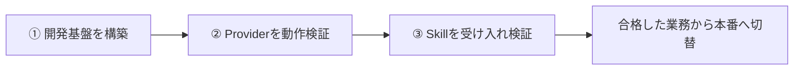
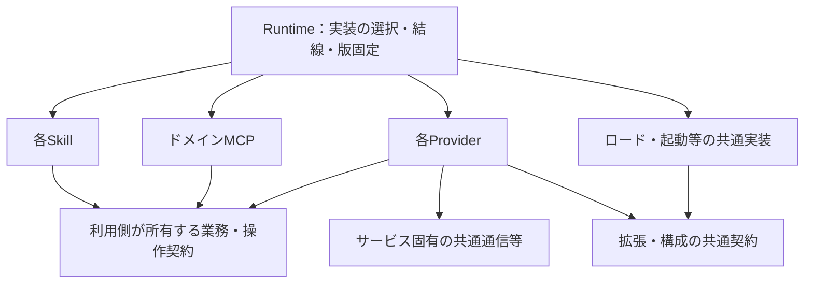

# v2移行計画・改訂レビュー案

> Status: Review proposal; unapproved portions remain unadopted. Relocation does not approve the design. Current work: [migration status](../migration/status.md).

2026年9月7日。**レビュー用。今回は計画文書の作成のみ。実装・環境構築・他タスクへの開始指示は行わない。**

## 1. 目的と順序

v2アーキテクチャを実現し、共通モジュール・各Provider・各Skillをパッケージで管理する。検証した版の組合せを配備し、開発の変更が本番へ直接影響しない状態にする。

本番・開発の分離とパッケージ管理を、v2とは別の計画にしない。進める順序は次のとおり。

一部Skillが既に動作しないという報告を前提にする。無停止移行を維持できているとは扱わない。ただし、個別Skillの修復を先頭へ割り込ませず、まず基盤を完成させる。

## 2. 設計と配布の前提

- 共通モジュール、各Provider、各Skillを責務に沿ってパッケージ化する。MCPとRuntimeもソースツリーから独立して配備できる形にする。
- npm scopeは`@flair-agency`、配布先はGitHub Packages、初期はPrivate、発行はFlair組織のGitHub Actions。既存repositoryを使う。
- 既存v2のScouting・Management等の業務境界とプロセス・権限の分離を維持する。会計・経費をcreator領域へ押し込まない。
- 業務判断はSkill側、サービス固有の取得・更新はProvider側に置く。MCPはドメインの操作を提供し、そのプロトコル処理にLark等の直接操作を混在させない。
- 共通契約とロード・ファイルI/O等の実装を分け、循環依存を解消する。同じ業務判断は必要な範囲で共通化する。
- 実行主体・対象・操作を明示し、開発から本番の認証・設定へ暗黙に接続しない。

### 依存の図

実行時の代表経路は、`Skill → ドメインMCP → Provider → API・ブラウザー・iPhone等`。会計・経費等へ同じMCPを一律に必須とする意味ではない。

次の矢印はコード・パッケージの依存を示す。呼出しの順序と、具体的な実装への依存を区別する。

Providerは利用側の契約を実装する。具体的なProviderの選択はRuntimeが行う。業務からProvider具象へ、契約からロード実装へ逆向きの依存を作らない。共通化した業務実装もこの原則に従う。図の箱一つにつき一つのnpmパッケージを作る必要はない。

## 3. 第一段階：開発基盤

**完了条件：GitHub Packagesに発行した固定版を開発用インストール先へ導入し、ソースツリーを参照せずv2を起動できる。開発クライアントから接続し、テスト用Providerとの操作往復、版の更新・差し戻しを確認できる。**

| 作るもの | 作業内容 | 確認すること |
| --- | --- | --- |
| 共通モジュールと配布構成 | 共通契約・ロード・I/Oの責務を整理。必要な呼出し側も修正し、共通・Provider・Skill・MCP・Runtimeの配布一覧と依存を確定 | 循環・具象への逆依存がなく、配布対象が欠落していない |
| パッケージのビルド | 各配布物のmanifest・公開入口・資源・依存を整備。既存のpack・導入検証を再利用 | 開発用パスやworkspaceリンクなしで導入・ロード・資源参照が成立 |
| 開発用Runtimeと起動 | 開発設定、Provider選択、MCP起動、Skill資源の参照を接続。版と状態を確認できるようにする | 本番の設定や認証がなくても起動し、選択漏れを拒否。テスト用Providerで実際のクライアントから往復できる |
| CIとパッケージ発行 | 既存repositoryのActionsから検証した配布物を発行。固定版のインストール用manifest/lockfileを生成 | 発行先とPrivate設定を確認し、GitHub Packagesから固定版を取得できる |
| 開発環境への配備 | 新規導入→起動→更新→差し戻しを同じ仕組みで実行 | ソースがなくても動き、失敗時に稼働版を壊さない。開発操作が本番の版・登録を変更しない |

作業の依存は、**配布構成の確定 → ビルド → 起動とCIの整備 → 開発配備の通し確認**。表の行ごとに別タスクを作らず、関連する実装・接続・テストをまとめて完了させる。

この段階では各Provider・Skillの配布境界を整えるが、実サービスの操作や全業務機能の完成を要求しない。テスト用Providerの成功は実Providerの検証には数えない。以前の2ライブラリーとcoin Skillだけの配布成功を、基盤全体の完成にはしない。

ローカルtarballによる検証は途中成果として使う。GitHub Packages経由の配備と開発クライアント接続が未完了なら、基盤全体も未完了とする。

開発用の設定・状態・実行手段を本番と分離する。ディレクトリ分離やSkill一覧の表示だけでは実行権限の分離を証明しない。既存の分離成果を引き継ぎ、実際の起動先と設定・認証の解決先を確認する。実行先の変更が必要なら、具体的な不足と変更案を提示する。

## 4. 第二段階：Providerの実動作

第一段階で配備したパッケージとRuntimeを使い、各Providerの必要な能力を確認する。既存のAPI・ブラウザー・iPhoneの方式を再利用する。

| 検証環境 | 対象 | 主な確認 |
| --- | --- | --- |
| Lark API/CLI、必要なブラウザー | Lark Base・Chat | 主体・対象の選択、読取・更新・添付等の必要操作、正規化・エラー |
| Webブラウザー | BackStage・TikTok Web・Lark | 対象画面の操作、取得・正規化、結果の受渡し |
| iPhone | TikTok iOS | 実機とアカウントの選択、必要操作、結果の受渡し |
| 各採用経路 | Google Drive・Money Forward等 | 対象Skillが要求する保存・取得・登録等 |

必要な設定・検証対象・利用権限を具体化し、許可された開発対象で試験する。Lark Baseを共通依存の多い先行候補とし、独立したProviderは環境・担当が揃えば並行できる。

合格はProviderの版・能力・操作・経路・検証範囲で記録する。読取成功を更新成功とみなさず、未完了の能力だけを識別する。ブラウザーや実機の準備待ちを理由に、独立したProviderまで止めない。

## 5. 第三段階：Skillの受け入れと本番移行

必要なProvider能力が合格したSkillから、配備済みの構成で業務を確認する。全Providerの完了待ちは作らない。第一段階の完了後は、Skillの実装・ローカル検証をProvider検証と並行できる。

1. Skillの実装・指示・資源参照を整え、業務ロジックを検証する。
2. 検証用の対象で、入力取得から計画、必要な承認、実行、結果照合まで確認する。
3. 曖昧な対象、古い入力、部分成功、結果不明など、その業務で必要な失敗時の動作も確認する。
4. 合格した版の組合せを固定し、業務単位で本番へ切り替えて稼働を確認する。

停止報告があるSkillも受け入れ対象に含める。正常に動く旧経路があれば同じ入力で比較する。旧経路が動かない場合は、業務契約と期待結果を基準にする。

正常性未確認の旧版を復旧先とみなさない。本番切替では実際に戻せる配布物・設定と、操作に必要なデータ保護を確認する。パッケージの差し戻しでサービス上のデータまで戻るとは扱わない。

## 6. 進め方と今回追加しないもの

既存のソース分離、契約、Provider実装、業務ロジック、パッケージ試験を再利用する。変更した部分と接続先を検証し、無関係な合格済み試験を繰り返さない。

実装開始時に担当と採用ソースを一度照合し、Codex Worktreeで変更を隔離する。関連実装・直接テスト・結果報告は同じ作業に含める。共通契約とlockfileの統合担当を固定し、形式的なレビュー専用タスクや再承認の往復を作らない。

新規repository・履歴移行・monorepo化、8業務パッケージへの再分割、汎用キューや永続ワークフローの先行構築は追加しない。非同期の要求・結果受渡しは既存方式を基本とし、永続継続は必要な業務で判断する。現時点で必須spikeを裏付ける技術的不確実性は特定できていない。

本番のLark Baseを保護し、外部操作は対象・主体・操作を明示した権限で行う。これを独立したローカル開発まで止める理由にはしない。第一段階のデプロイ先は開発環境であり、本番切替は第三段階で扱う。

## 7. レビュー事項と開始時の確認

**今回レビューしてほしいのは、この三段階の作業範囲と完了条件である。** 配布先やscopeなど、既に決まった方針を再び選び直す必要はない。

実装に入る前に具体化する点は次の三つに絞る。

| 項目 | 提示するもの | 判断の扱い |
| --- | --- | --- |
| パッケージ構成と名前 | 各パッケージの責務・公開入口・依存・旧名との対応一覧 | 旧2ライブラリーの名前と分割を既定にせず、レビューできる具体案を作る |
| 開発の起動・配備先 | 現在の開発環境で実現する配置と起動方法、追加変更が必要ならその理由 | 既存環境を利用する。別ホスト等を当然の前提にしない |
| CI発行と取得の接続 | 既存repository、発行権限、開発環境の取得権限 | 基本方針の再決定ではなく、実際に使う設定の特定。不足があればその箇所だけ示す |

これらの具体化も開始指示後の基盤作業に含める。レビューの合意と作業開始を区別し、今回の依頼では計画文書のみを作成する。

進捗は文書数やテスト件数ではなく、基盤の完了条件、利用可能なProvider能力、受け入れ済みSkillで報告する。見積りは採用ソースと差分を確認した時点で提示し、根拠のない完了日時を置かない。

## 8. 既存計画の扱い

採用後、既存計画とhandoffの現在の作業順序を一本化する。SEP-1の完了成果を引き継ぎ、SEP-2とnpm配布を第一段階、Provider実動作を第二段階、Skillの未完了機能と本番移行を第三段階へ整理する。直前に私が出した個別修復優先の指示は採用しない。

根拠は[既存v2計画](../archive/v2-migration-plan.md)、[現在の引継ぎ](../archive/v2-task-handoff.md)、[配布方針](../architecture/distribution.md)、[npm配布設計](../../provider-runtime/docs/deployment.md)、[環境分離の既存計画](../archive/environment-separation-and-production-stability-plan.md)、[設計ギャップ](npm-package-architecture-revision.md)。過去の実装・試験記録は保持し、今回再試験したとは扱わない。

今回の変更は本ファイルのみ。コード、設定、依存、Git index、既存計画・handoff、外部サービス、他タスクの作業指示は変更しない。
