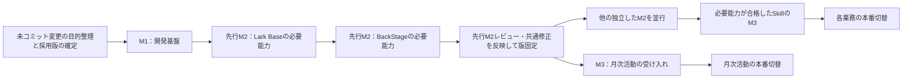
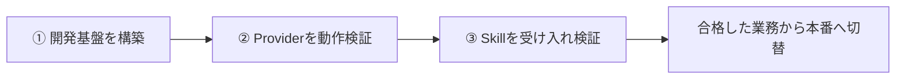
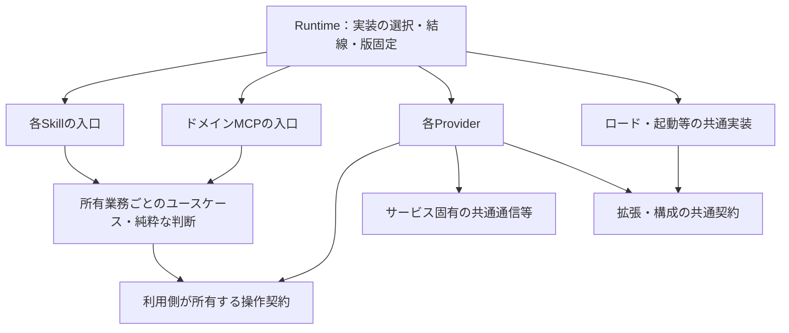
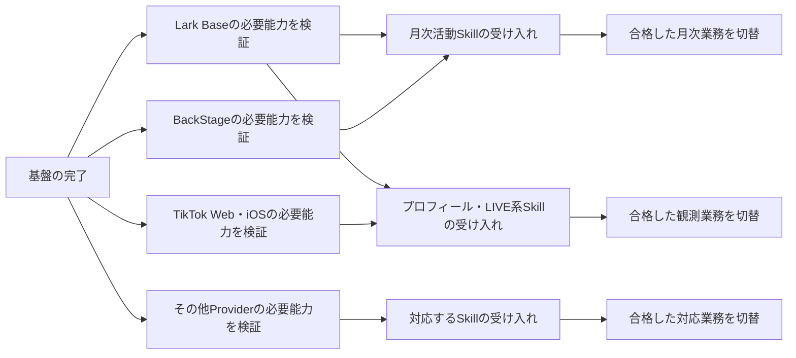

# v2移行計画・改訂レビュー案

> 状態：2026年9月7日、再計画とD1・D2・D3の推奨案を承認済み。日本語のレビュー履歴。採用内容の正本は[英語のv2移行計画](../migration/v2-plan.md)、現在の進捗は[移行状況](../migration/status.md)。具体的な命名対応表等は承認された進め方に沿って作成する。実装開始の指示は別。

2026年9月7日改訂。文書整理の親コミット`6e9b1d9`と、その後に承認されたリポジトリ再編を反映。**今回の成果物は改訂計画。実装・環境構築・発行・本番切替の開始は含まない。**

## 承認後の追記：`mcp/operations`の扱い

全体の完成・配備をM1の必須条件から外す案を承認済み。[英語正本](../migration/v2-plan.md#adopted-treatment-of-operations-mcp)へ反映した。以降のレビュー履歴にある「ドメインMCPの配備・接続が必須」という記述は、この決定で置き換える。

- **位置付け**：MCPは、アプリケーションの機能をCodex等へ公開するプロトコルアダプター。ツール登録、要求・結果・エラーの変換を担い、業務処理は利用側のインターフェイスへ委譲する。
- **必要な処理の所有先**：業務判断と純粋なインターフェイスは利用側、Lark固有の読取・更新はProvider、Provider選択・構成解決はRuntimeまたは該当する共通実装へ移す。未コミット変更の目的別整理で、必要なコードと呼出し元を対応付ける。
- **M1の対象**：既存CLI／runnerで開発Codexとの要求・結果の往復が成立すればそれを利用する。MCPが必要なら代表操作と必要な移行経路を扱う最小限のアダプターを含める。旧ツール一式・全ドメインMCPの完成を要求しない。
- **M1の確認**：配布済みの入口から実行でき、延期した`mcp/operations`への隠れた依存がないことを確認する。月次活動runnerがあることだけでは、取得から更新までの全経路が成立したとは扱わない。
- **移行後**：ドメインMCPの拡充は、対話から呼びたい操作が具体化した時点で扱う。Scouting／Managementの業務・実行権限・認証の分離は維持し、会計をcreator領域に入れない。
- **保全とリスク**：repoは保全する。必要処理の欠落・隠れた依存をリスク表へ追加し、所有先のテストと独立導入で確認する。この判断だけで既存プロセスの停止やソース削除は行わない。

M1の発行・導入・接続・更新・差し戻しという完了条件と、先行M2合格後の並行化は維持する。

## 承認後のフィードバック：実行順序・レビュー・リスク

以下は承認後の会話で合意し、[英語正本](../migration/v2-plan.md)へ反映した追記。本書のそれ以降は元のレビュー履歴であり、並行化・着手順序についてはこの追記と正本を優先する。



- **未コミット変更**：目的、対象repo・ファイル、採用根拠、依存、戻す影響、保全先、推奨処置を整理してレビューする。未採用の変更は基本ロールバック。承認済み再編に必要な変更は採用してコミットし、子の版と親の参照を揃える。目的不明の変更を推測で破棄せず、一括resetで再編まで戻さない。処置後は別の作業場所で採用状態を確認する。
- **M1**：テスト用コンシューマーがドライバー、テスト用Providerがスタブ／フェイク。既存fixtureを再利用し、配布・導入・接続・要求と結果の受渡しを検証する。「契約」は利用側が定義するインターフェイスと振る舞いの仕様を指し、契約プログラミングの導入ではない。
- **先行M2**：月次活動に必要なLark Base、BackStageを順に検証する。それが合格するまで他のM2実行を並行化しない。共通の修正と検証手順を確定した後、後続M2と月次活動M3を並行する。最初の本番移行完了までは待たない。
- **不具合の扱い**：インターフェイスが確立した後、実装の不適合は該当コンシューマー／Providerで対処する。インターフェイス自体の不足やRuntimeの問題だけを共通課題として、影響確認・修正・必要な再検証を行う。合格済み能力は変更・不足がなければ再利用する。
- **作業体制**：このタスクが司令塔を担い、作業タスクに成果・所有repo・採用版・完了条件を渡す。実装と直接テストは同じ作業に含め、統合は順に行う。共有ファイルやブラウザー・実機・アカウントが競合する作業は並行しない。

| レビュー時点 | 確認するもの |
| --- | --- |
| M1着手前 | 未コミット変更の目的別処置と採用版 |
| M1設計時 | 責務・正式名・インターフェイス・依存図・変更箇所・代表操作。採用済み原則は再審議しない |
| M1完了時 | 独立導入、クライアントとの往復、更新・差し戻しと残る共通リスク |
| 先行M2完了時 | 実接続の証拠、共通修正、固定版、後続を並行化できる状態 |
| 各M3 | 事前に合わせた業務期待結果と受け入れ結果 |
| 各本番切替前 | 対象・影響・復旧手順・残るリスク。有効な既存権限は再利用する |

リスクは共通基盤と個別コンポーネントに分ける。以下は初期の定性的評価であり、対策を実施・検証済みとは扱わない。

| リスク | 初期の可能性／影響 | 対策と評価時点 |
| --- | --- | --- |
| 変更の取りこぼし・誤採用 | 高／高 | 目的別処置、原本保全、コミットと親参照、採用状態の再現。M1着手前 |
| workspaceでのみ動く配布物 | 高／高 | ソースなし・registry経由の導入と起動。M1完了時 |
| テスト用Providerと実接続の差 | 中／高 | 先行M2で共通経路を検証・修正してから並行化。異なる媒体固有の問題は個別に評価 |
| インターフェイス・Runtime・版の不整合 | 中／高 | 互換性と版固定、共通修正の統合、影響する試験。M1・先行M2・共通変更時 |
| コンシューマー／Providerの実装不具合 | 中／中 | 所有コンポーネントで修正し、依存する業務だけを止める。各M2・M3 |
| 並行作業や実行環境の競合 | 中／高 | 先行M2合格、所有Worktree・統合担当・共有資源の利用調整。並行作業の割当時 |
| 開発から本番への誤接続 | 中／高 | 実際の認証・設定・対象の解決先を確認し、選択漏れを拒否。実操作前 |
| 改名・切替による参照切れや二重実行 | 中／高 | 旧新対応、導入・呼出し・監視の照合、更新と復旧確認。M3・切替前 |
| CI権限・ブラウザー・実機の準備待ち | 中／中 | 必要条件を早期確認し、外部待ちと実装時間を区別。先行M2の順序を守って非依存作業を進める |
| 設計見直しの拡大 | 高／高 | M1完了条件に必要な変更へ絞る。設計レビュー・追加変更時 |

各対策の担当、状態、証拠、残るリスクは既存の作業記録で追う。確認結果が揃えば発生可能性を再評価するが、外部操作等の影響度まで自動的に下げない。テスト件数ではなく、そのリスクに直接対応する証拠で判断する。今回の更新ではソースのロールバックや作業タスクの開始は行っていない。

## 1. 目的と順序

v2アーキテクチャを実現し、共通モジュール・各Provider・各Skillをパッケージで管理する。検証した版の組合せを配備し、開発の変更が本番へ直接影響しない状態にする。

本番・開発の分離とパッケージ管理を、v2とは別の計画にしない。進める順序は次のとおり。



一部Skillが既に動作しないという報告を前提にする。無停止移行を維持できているとは扱わない。ただし、個別Skillの修復を先頭へ割り込ませず、まず基盤を完成させる。

### 引き継ぐ成果と現在の不足

以下は整理後の[現在状況](../migration/status.md)と[文書整理結果](documentation-audit-ja.md)に記録された事実であり、今回実サービスへ接続して再検証した結果ではない。

| 項目 | 引き継ぐもの | 今後完成させるもの |
| --- | --- | --- |
| 文書・ソース管理 | 親Gitと再編済みの30個のコンポーネントrepo、所有別の正本、整理後の参照検証 | 開発着手時に採用するソース差分とコミットを確定。既存の未コミット実装を消さず、採用版へ取り込む |
| 本番・開発の分離 | 独立した開発ソース、既存の設定選択・ホスト経路の検証記録 | 開発起動先と設定・認証の解決先を実際の採用経路で確認。旧カタログ試験だけで現在の隔離を保証しない |
| npm配布 | 指示資源解決、代表的なcoinパッケージの独立導入、lockfile・改変検知の既存検証 | 共通・全対象Provider・全対象Skill・MCP・Runtimeの配布境界、Actions発行、registry取得、実クライアント接続 |
| Provider・業務コード | Lark共通処理、選択された呼出し経路、バックアップ・観測・履歴整理等のローカル実装と検証 | 実Providerの能力単位の検証、未完了の添付・更新・保守連携、Skill受け入れ |
| 運用 | 一部Skillの不動作報告 | 対象と影響は受け入れ対象一覧へ。旧版が正常という前提を置かない |

`caller-inventory`の固定JSON9件、ソースハッシュ・移行状態の完全一致テスト、専用生成処理は廃止済み。必要時の呼出し元調査と独立した検証は維持する。今後の進捗管理や合格条件に、固定スナップショットの更新を復活させない。

親`live-agency/`の`package.json`が`private: true`の開発用npm workspaceを管理する。`runtime/`はその一つの独立コンポーネントであり、他のソースrepoを内包しない。現在のRuntimeの起動コマンドには兄弟ディレクトリーのソース参照が残るため、配布用Runtimeの完成とは扱わない。上表のローカル検証の成功だけでは、第一段階はまだ完了していない。

### 再編後の配置と計画の出発点

以下は承認済みで、ローカルへの反映を完了した配置。再編を今後の工程として繰り返さない。

```text
live-agency/                       親Git：全体仕様・方針・コンポーネントの組合せ
├── runtime/                      Runtimeの独立Gitリポジトリ
├── skills/<Skill名>/             Skillごとの独立Gitリポジトリ（16個）
├── providers/<Provider名>/       Providerごとの独立Gitリポジトリ（7個）
├── mcp/operations/               既存MCPの独立Gitリポジトリ（1個）
├── packages/<ライブラリー名>/    共通ライブラリーの独立Gitリポジトリ（5個）
├── docs/                         全体の業務モデル・設計・方針・移行計画
├── tools/                        共通の開発・配布・検証ツール
├── test/                         コンポーネント間のテスト・合成fixture
├── package.json                  ローカル開発用workspace
├── package-lock.json             開発用依存の固定
└── tmp/                          Git管理外の作業出力・旧構成の保全コピー
```

親は30個のコンポーネントをsubmoduleで管理する。`skills/`自体はモノレポではなく、各SkillがGit履歴・manifest・版・配布の単位になる。親のnpm workspaceは複数repoをローカル開発で接続する仕組みであり、一括リリースを要求しない。配備する版の組合せは、第一段階で別途整えるインストール用manifest/lockfileで固定する。

現存する共通ライブラリーは`source-provider-api`、`private-runtime-files`、`lark-core`、`cli-utils`、`row-archive`。旧Skillsの`_shared`にあった汎用処理は所有ライブラリーへ、Lark Baseクライアントは`providers/lark-base/`へ移した。この5分割と現在の名前は現状の記述であり、v2の正式な契約・依存・命名の承認ではない。残る具象依存や循環の解消は第一段階の作業とする。

16個のSkillには凍結中の`coin-expense-weekly-application`を含む。ソース保全のためのrepo分割と、v2で配布・受け入れする対象は区別し、凍結解除を暗黙に含めない。

| ローカル再編で確認済み | 基盤構築へ引き継ぐ残作業 |
| --- | --- |
| ソース配置・履歴抽出・共有処理とテストの所有先変更 | 採用差分を所有repoでコミットし、親のsubmodule参照をその版へ更新する |
| 親からの依存導入と一括テスト1,743件成功、公開内容チェック成功 | 残る補助コマンドの旧パス参照も整理し、独立した配布物で起動・接続を検証する |
| 16 Skillと5共通ライブラリーの配布内容を`npm pack --dry-run`で確認、文書の相対リンク642件を確認 | 全対象Provider・MCP・Runtimeも含むregistry発行・取得・配備を完成させる |
| 元の履歴・未コミット変更を保全。新規分割repoはローカルに存在 | 新規repoのGitHub配布元を設定し、親から再帰取得できる状態にする。既存Provider・MCP・Runtimeの配布元は継続利用する |

これらは再編時のローカル検証記録であり、実サービス検証やSkill受け入れの合格ではない。親のsubmodule参照には子repoの未コミット変更は含まれず、現時点のローカル構成をそのまま再現可能な配布済み版とは扱わない。配置方針と開発手順の詳細は[README](../../README.md)を参照する。

## 2. 設計と配布の前提

- 共通モジュール、各Provider、各Skillを責務に沿ってパッケージ化する。MCPとRuntimeもソースツリーから独立して配備できる形にする。
- npm scopeは`@flair-agency`、配布先はGitHub Packages、初期はPrivate、発行はFlair組織のGitHub Actions。再編後の所有repoを配布元にする。既存のGitHub repositoryは継続利用し、新規分割repoには対応するGitHub配布元を整える。
- 既存v2のScouting・Management等の業務境界とプロセス・権限の分離を維持する。会計・経費をcreator領域へ押し込まない。
- 業務判断はSkill側、サービス固有の取得・更新はProvider側に置く。MCPはドメインの操作を提供し、そのプロトコル処理にLark等の直接操作を混在させない。
- 共通契約とロード・ファイルI/O等の実装を分け、循環依存を解消する。同じ業務判断は必要な範囲で共通化する。
- 実行主体・対象・操作を明示し、開発から本番の認証・設定へ暗黙に接続しない。

### 配布対象と責務

| 配布単位 | 責務と境界 | 第一段階で整える範囲 |
| --- | --- | --- |
| 共通モジュール | 利用側の契約・純粋な共通処理と、通信・ロード・I/O等の実装を区分する | 循環の解消、公開入口、依存。現存する5ライブラリーをそのまま正式構成としない |
| 各Provider | Lark Base、Lark Chat、BackStage、TikTok Web、TikTok iOS、Google Drive、Money Forwardのサービス実装と資源 | 7つの既存Providerを配布対象に含め、宣言・ロード・必要資源を導入先から解決する。実動作合格は第二段階 |
| 各Skill | 業務手順、必要な実行コード・参照資源、入出力・受け入れ条件 | 対象Skillごとに独立した配布物を成立させる。凍結中の試作は対象外と明記し、業務完了と混同しない |
| MCP | 既存のドメイン操作契約と入口。Scouting・Managementのプロセス分離を維持 | 導入済みパッケージから起動し、Provider注入を接続。Lark直接操作はProvider側へ移す |
| Runtime | 具体的な実装の選択・結線・起動と、配備する版の組合せ | ソースを参照しない起動・開発登録・更新・差し戻し |

これは再編済みrepoを前提とする責務と配布対象の区分であり、追加のrepo再編や8つの業務パッケージへの分割を要求しない。正式パッケージ名・exports・旧名からの対応は、契約の所有と同時に確定する。現存する`source-provider-api`・`private-runtime-files`等の名前と分割は、D1で正式な責務・依存とともに見直す。

### 依存の図

実行時の代表経路は、`Skill → ドメインMCP → Provider → API・ブラウザー・iPhone等`。会計・経費等へ同じMCPを一律に必須とする意味ではない。

次の矢印はコード・パッケージの依存を示す。呼出しの順序と、具体的な実装への依存を区別する。



Providerは利用側の契約を実装する。具体的なProviderの選択はRuntimeが行う。業務からProvider具象へ、契約からロード実装へ逆向きの依存を作らない。共通化した業務実装もこの原則に従う。図の箱一つにつき一つのnpmパッケージを作る必要はない。UとCは所有業務ごとに存在し、全業務をまとめた汎用パッケージを意味しない。SkillとMCPが同じ判断を実行する場合は同じ業務実装を利用し、Skillの指示文から全コードを機械的に分離する作業にはしない。契約の物理的な配布方法は7節のD1でレビューする。

### Skill命名と外貨売上の移行を含める

[Skill命名・移行案](v2-skill-naming-and-migration-plan.md)を、この三段階に組み込む。対象は再編済み16 Skill（凍結試作を含む）と、別途管理されている`foreign-revenue-accounting`の計17移行元。候補名と責務の論点は同文書に集約し、ここでは作業順序と完了条件を管理する。

第一段階ではD1の対応表に、Skill識別子・npm名・所有repo・公開入口・旧名・凍結等の状態を含め、採用対象の改名・責務分離を配布と導入の実装へまとめる。Skill名の`live-agency`とnpm scopeの`@flair-agency`を区別する。初期Privateの方針は共通であり、サービス中立なSkillも自動的にPublicにはしない。

外貨売上の移行先は`skills/<確定名>/`の独立repoとし、収益認識と債権消込を一つにするか二つにするかをD1で決める。サービス固有処理は対応Provider、組織固有の構成・監視はRuntimeへ置く。第二段階で必要なProvider能力を検証し、第三段階で業務受け入れと導入・呼出し元・入金監視の切替を行う。監視の二重作成や仕訳の重複実行を防ぐ。外貨売上の実環境待ちで無関係な業務を止めない。

旧SN・FR・M4・M5・M7の独立工程は復活させず、必要な導入・互換性・結果照合は該当段階に引き継ぐ。凍結解除や候補名の採用は、文書への組込みだけでは承認されたと扱わない。

## 3. 第一段階：開発基盤

**完了条件：GitHub Packagesに発行した固定版を開発用インストール先へ導入し、ソースツリーを参照せずv2を起動できる。開発クライアントから接続し、テスト用Providerとの操作往復、版の更新・差し戻しを確認できる。**

| 作るもの | 作業内容 | 確認すること |
| --- | --- | --- |
| 採用ソースとGit配布元 | 再編済みrepoの採用差分をコミットし、親の参照を更新。新規分割repoのGitHub配布元とsubmodule URLを設定 | 親から必要な版を取得でき、未コミット変更やローカル専用URLに依存しない |
| 共通モジュールと配布構成 | 共通契約・ロード・I/Oの責務を整理。必要な呼出し側も修正し、共通・Provider・Skill・MCP・Runtimeの配布一覧と依存を確定 | 循環・具象への逆依存がなく、配布対象が欠落していない |
| パッケージのビルド | 各配布物のmanifest・公開入口・資源・依存を整備。既存のpack・導入検証を再利用。命名対応表に沿って識別子・出所・版の解決、同名衝突、既存導入からの更新も確認 | 開発用パスやworkspaceリンクなしで導入・ロード・資源参照が成立 |
| 開発用Runtimeと起動 | 開発設定、Provider選択、MCP起動、Skill資源の参照を接続。版と状態を確認できるようにする | 本番の設定や認証がなくても起動し、選択漏れを拒否。テスト用Providerで実際のクライアントから往復できる |
| CIとパッケージ発行 | 所有repoごとのActionsから検証した配布物を発行。親に追加済みのソース検証CIを再利用し、各repoの発行workflowを整備。固定版のインストール用manifest/lockfileを生成 | 発行先とPrivate設定を確認し、GitHub Packagesから固定版を取得できる |
| 開発環境への配備 | 新規導入→起動→更新→差し戻しを同じ仕組みで実行 | ソースがなくても動き、失敗時に稼働版を壊さない。開発操作が本番の版・登録を変更しない |

再編済みのソースを採用したうえで、作業の依存は**配布構成の確定 → ビルド → 起動とCIの整備 → 開発配備の通し確認**。Git配布元の設定は発行までに整え、設定待ちでもローカルの実装・ビルドは進める。表の行ごとに別タスクを作らず、関連する実装・接続・テストをまとめて完了させる。

構成・契約を決めた後は、Runtimeの起動とCI発行の準備を独立して進められる。共通契約・manifest・lockfileを複数担当が同時に変更しない。CI権限の不足は発行・取得だけの待ち条件とし、ローカルの実装と導入確認を進める。

基盤の判定は次の五点をすべて満たすこととする。

1. 対象パッケージの依存方向・公開入口が定まり、循環と業務からのサービス具象依存を解消している。
2. 必要なコード・指示・資源を含む配布物を、開発ソースへのリンクなしで導入・解決できる。
3. Actionsで発行した固定版をGitHub Packagesから取得し、独立したインストール用manifest/lockfileで構成を再現できる。
4. 採用した開発クライアントから、インストール済みSkill資源とドメインMCPを利用し、テスト用Providerで要求・結果を往復できる。必要な指示型経路も要求と結果を受け渡せる。
5. 開発環境で初回起動・更新・以前の検証済み版への差し戻しを行い、本番の登録・設定・稼働版を変更していない。

最初の通し確認は一つの代表操作から行う。第一段階の完了までに対象パッケージ全体の導入・資源解決を揃えるが、全Skillの業務シナリオは第三段階で判定する。

この段階では各Provider・Skillの配布境界を整えるが、実サービスの操作や全業務機能の完成を要求しない。テスト用Providerの成功は実Providerの検証には数えない。以前の2ライブラリーとcoin Skillだけの配布成功を、基盤全体の完成にはしない。

ローカルtarballによる検証は途中成果として使う。GitHub Packages経由の配備と開発クライアント接続が未完了なら、基盤全体も未完了とする。

既存の[配備設計](../../runtime/docs/deployment.md)にあるCLI全コマンド、全Skillの実動作、複数ホスト対応、完全なアンインストール・世代削除の管理機能を、第一段階の必須成果へ一括で追加しない。初回は上記の導入・起動・更新・差し戻しを既存手段で再現可能にする。最終運用に必要な管理機能は、対象を決めて本番切替前に扱う。CLIの名称だけを実装済み機能として扱わない。

開発用の設定・状態・実行手段を本番と分離する。ディレクトリ分離やSkill一覧の表示だけでは実行権限の分離を証明しない。既存の分離成果を引き継ぎ、実際の起動先と設定・認証の解決先を確認する。実行先の変更が必要なら、具体的な不足と変更案を提示する。

## 4. 第二段階：Providerの実動作

第一段階で配備したパッケージとRuntimeを使い、各Providerの必要な能力を確認する。既存のAPI・ブラウザー・iPhoneの方式を再利用する。

| 検証環境 | 対象 | 主な確認 |
| --- | --- | --- |
| Lark API/CLI、必要なブラウザー | Lark Base・Chat | 主体・対象の選択、読取・更新・添付等の必要操作、正規化・エラー |
| Webブラウザー | BackStage・TikTok Web・Lark | 対象画面の操作、取得・正規化、結果の受渡し |
| iPhone | TikTok iOS | 実機とアカウントの選択、必要操作、結果の受渡し |
| 各採用経路 | Google Drive・Money Forward等 | 対象Skillが要求する保存・取得・登録等 |

必要な設定・検証対象・利用権限を具体化し、許可された開発対象で試験する。Lark Baseを共通依存の多い先行候補とし、独立したProviderは環境・担当が揃えば並行できる。

Providerの合格条件は、対象の実行環境で必要操作が成功し、戻り値の正規化・対象選択・認証切れ・必要な失敗時処理が契約どおりであること。変更操作は許可された検証先で結果を読み戻す。ブラウザー／iPhoneの手動操作が契約上必要なら、その手順と結果受渡しを含めて確認し、自動化を追加の必須条件にしない。

添付追加や既存ブラウザー／iPhone操作は新たなspikeにしない。既存実装・結果を確認し、未完了の実装や不足する実動作証拠を、その能力の作業として埋める。技術的に不確実な問題が具体的に出た場合だけ、問い・最小の実験・終了条件を提示する。

合格はProviderの版・能力・操作・経路・検証範囲で記録する。読取成功を更新成功とみなさず、未完了の能力だけを識別する。ブラウザーや実機の準備待ちを理由に、独立したProviderまで止めない。

## 5. 第三段階：Skillの受け入れと本番移行

必要なProvider能力が合格したSkillから、配備済みの構成で業務を確認する。全Providerの完了待ちは作らない。第一段階の完了後は、Skillの実装・ローカル検証をProvider検証と並行できる。

1. Skillの実装・指示・資源参照を整え、業務ロジックを検証する。
2. 検証用の対象で、入力取得から計画、必要な承認、実行、結果照合まで確認する。
3. 曖昧な対象、古い入力、部分成功、結果不明など、その業務で必要な失敗時の動作も確認する。
4. 合格した版の組合せを固定し、対象業務・設定・戻し先を具体化した本番切替を実施する。既存の有効な操作権限を利用し、範囲が変わる判断だけを求める。

停止報告があるSkillも受け入れ対象に含める。正常に動く旧経路があれば同じ入力で比較する。旧経路が動かない場合は、業務契約と期待結果を基準にする。

正常性未確認の旧版を復旧先とみなさない。本番切替では実際に戻せる配布物・設定と、操作に必要なデータ保護を確認する。パッケージの差し戻しでサービス上のデータまで戻るとは扱わない。

### 段階間の依存



図は代表的な依存であり、必要能力の全件表ではない。各Skillの具体的な操作とProvider経路を既存の[能力一覧](../architecture/capabilities.md)で照合する。例えばバックアップはLark Baseと保存先Providerの両方を必要とする。能力不足はそのSkillの受け入れだけを止める。

## 6. 進め方と今回追加しないもの

既存のソース分離、契約、Provider実装、業務ロジック、パッケージ試験を再利用する。変更した部分と接続先を検証し、無関係な合格済み試験を繰り返さない。

実装開始時に担当と採用ソースを一度照合し、Codex Worktreeで変更を隔離する。関連実装・直接テスト・結果報告は同じ作業に含める。共通契約とlockfileの統合担当を固定し、形式的なレビュー専用タスクや再承認の往復を作らない。

承認済みのSkill個別repo化を超える追加のrepo再編、8業務パッケージへの再分割、汎用キューや永続ワークフローの先行構築は追加しない。非同期の要求・結果受渡しは既存方式を基本とし、永続継続は必要な業務で判断する。現時点で必須spikeを裏付ける技術的不確実性は特定できていない。

本番のLark Baseを保護し、外部操作は対象・主体・操作を明示した権限で行う。これを独立したローカル開発まで止める理由にはしない。第一段階のデプロイ先は開発環境であり、本番切替は第三段階で扱う。

## 7. 承認された判断（推奨案を採用）

三段階の順序、承認済みの独立repo構成、`@flair-agency`・GitHub Packages・Private・Actions発行は既に示された方針であり、再選択を求めない。今回の提案は、上記の完了条件と次の実装・進行上の選択である。

| 判断 | 推奨案 | 代替案とトレードオフ | いつ必要か |
| --- | --- | --- | --- |
| D1 契約と業務コードの配布粒度 | 利用側が契約を所有し、純粋な入口を公開する。同じ変更理由・リリース単位のコードは同じパッケージ内で分け、独立した利用者・互換性管理が必要な契約だけ別パッケージへ抽出する | 契約をすべて独立配布すると依存は小さくなるが、版数・発行順・互換性管理が増える。一括の巨大共通パッケージは責務と変更影響を広げる | 基盤の実装前。正式名・exports・旧名対応を一つの具体表で確定し、現在の5ライブラリーや8業務分割を最終形の既定にしない |
| D2 最初に検証する開発クライアント | 現在のローカルCodexを一つ目の対象とし、明示的な開発の起動・設定・登録先を使う | 最初から複数ホストを対象にすると接続・配備の検証が増える。同一ホストで必要な分離を実現できないと判明した場合に限り、別の実行環境を選ぶ | 基盤着手時。既存の分離成果と具体的な不足を確認する |
| D3 最初のSkill受け入れ対象 | `creator-activity-sync`を先行候補とする。月次の入力・更新結果が明確で、既存のrunnerとローカル検証を利用できる | 停止中のSkillを先行すれば復旧価値は高いが、停止範囲の確認と媒体・実機等の依存が増える場合がある。ユーザーの業務上の緊急度が高ければそちらを優先する | 第二段階の優先順を確定する時。基盤の構築を止めない |

D1には[Skill命名案の候補と責務判断](v2-skill-naming-and-migration-plan.md)を含める。招待資格・セッション識別・履歴保持・保守の責務整合と、外貨売上の1 Skill／2 Skillの判断を、対象の配布構成と同時に扱う。

D1の推奨はパッケージ名を先送りし続ける意味ではない。基盤の最初の成果として、責務・正式名・公開入口・依存・配置・旧名対応を同時にレビュー可能にし、その判断が済めば関連する呼出し側まで一括で実装する。命名変更だけのタスクを作らない。

各所有repoのCI発行権限・package関連付け・開発側の取得権限は、設計の選択肢ではなく設定の確認項目である。先に候補設定とworkflowを具体化し、不足する権限・接続だけを明示する。個別化したSkill等のGitHub配布元の設定は具体的な未完了事項として示し、既存履歴の一括公開へ広げない。

## 8. 着手単位と進捗の扱い

実装開始が指示された後、最初の作業は**「v2開発基盤を構築し、registry経由で配備・起動する」**とする。構成・契約の確定、必要なリファクタリング、配布、Runtime接続、直接テストをこの成果へまとめる。途中でパッケージ名・責務をレビューした場合も、同じ基盤作業の継続として扱う。

作業開始時に既存タスクと変更所有を一度照合し、採用ソースを確定してCodex Worktreeへ引き継ぐ。各Skill・Provider・MCP・共通ライブラリー・Runtimeは1節の配置で独立Gitリポジトリとして再編済み。親repoと子repoは別々のGit履歴なので、親Worktreeの作成だけで子の未コミット変更まで隔離・継承できたとは扱わない。変更する所有repoの作業場所と採用版を明示し、共通契約・配布構成の統合担当を一つにする。

現時点では採用差分と実機・CIの利用条件が未確定なので、完了時間の数値は置かない。着手時に実装時間と外部環境の待ち時間を区別して見積もる。進捗は「基盤の五条件」「利用可能になったProvider能力」「受け入れ済みSkill」で報告し、文書数・テスト数・固定JSONの一致数を進捗率にしない。

この改訂と推奨判断は承認され、内容を[英語の移行計画](../migration/v2-plan.md)へ反映済み。現在状況は[status](../migration/status.md)だけで管理する。CP・M・SEP・RLS等の旧番号は過去証拠の参照に残すが、それぞれを独立した再開始待ちの工程には戻さない。既存の契約に必要な保護・結果確認は、そのProvider能力・Skill操作へ対応付ける。

今回参照したのは、[責務の正本](../architecture/overview.md)、[能力一覧](../architecture/capabilities.md)、[配布方針](../architecture/distribution.md)、[現在状況](../migration/status.md)、[Runtime配備設計](../../runtime/docs/deployment.md)、[設計ギャップのレビュー案](npm-package-architecture-revision.md)と親・Runtimeの現行manifest、および再編の検証記録。過去の試験記録は継承しており、今回新たな動作保証を付与していない。
