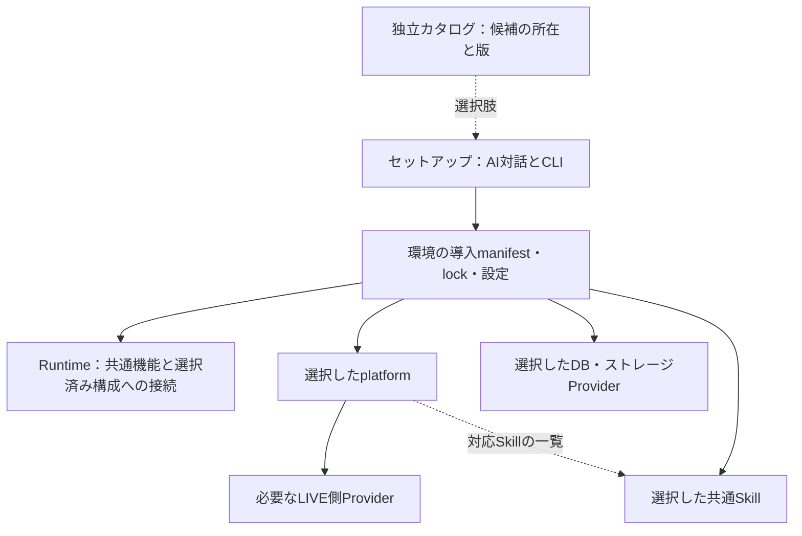
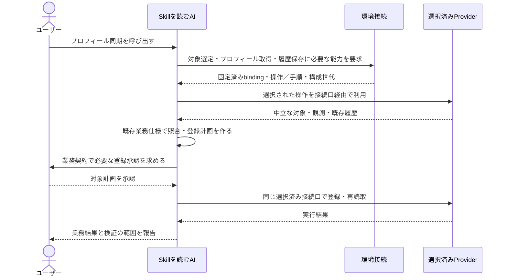
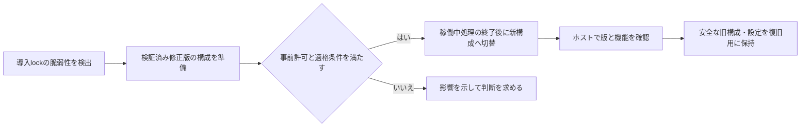
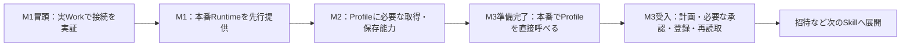

# v2再設計：platformと環境セットアップ

# 結論と採用範囲

コンセプトはオーナー承認済み。承認済みの責務は英語の
[アーキテクチャ](../architecture/overview.md)と
[配布方針](../architecture/distribution.md)へ反映した。
本書の接続と先行Profileの移行順も、2026-09-10にオーナーがLGTMし実装を指示した。
論理メッセージは実装済みAPI名そのものではない。実装・実証の範囲は末尾の記録で区別する。
旧[基盤設計](v2-foundation-design-ja.md)の承認・検証記録は保存する。

変更の中心は、既存の業務を環境に組み立てる部分である。ただし、Profile Skillの直接依存と
Lark固有設定が現行ソースに残っており、「Skillはほぼ無修正」とは確定できない。
既存Providerの操作・知識とSkillの業務計算は流用候補とし、全移行や全テストのやり直しを前提にしない。

| 区分 | 内容 |
| --- | --- |
| 承認済み | 小さいRuntime、独立カタログ、選択したplatform・Skill・保存先の導入 |
| 承認済み | AI対話を入口にし、導入・検証・保存は人も使えるCLIが担当 |
| 承認済み | ユーザーは業務Skillを呼び、Skillが選択済みProviderの能力・手順を使う |
| 承認済み | 複数platform構成、デフォルト、呼び出し時の指定、設定変更の区別 |
| 承認済み | 本番Work Localと開発Codexの分離。アプリのプロジェクトは任意の関連付け |
| 承認済み | 初回に更新方針を選ぶ。事前許可の範囲内で検証済みセキュリティ修正版を自動適用可能にする |
| 承認済み | 環境選択から能力解決までの接続、カタログ形式の境界、段階的な実装・受入 |
| 設計準備時の作業 | 設計書のみ。続く実装の変更範囲・証拠は末尾の記録で区別する |

# 責務と依存関係

Environment以下の実線は配布依存、点線は情報の参照。SetupからEnvironmentへの線は構成作成。
Runtime自身がすべてのplatformに依存する構成は採らない。
platformは実行順を決める業務エンジンではなく、能力・Providerの組み合わせと互換性を宣言する。
対応Skillは選択肢として列挙し、全件を強制的なnpm依存にしない。
一つのSkillをplatformごとにコピーせず、共通の業務契約を使う。

DB・ストレージはLIVE側と独立して選ぶ。選択Skillが要求しない機能はセットアップで必須にしない。
TikTok内でもWeb・BackStage・iOSのすべてが常に必須とは限らない。
17LIVEは拡張例であり、対応実装が存在するという主張ではない。

# セットアップの具体的な流れ

1. 検証済みのRuntime固定版を取得する。Node/npm、配布先の取得権限、ホスト登録の前提を確認する。
   初期の取得方法とホスト登録手順は配備機能の実装対象。業務認証をnpmのインストールフックで行わない。
2. Runtimeが同梱するセットアップの案内をAIが使用する。人が同じ操作をCLIから進める手順も提供する。
3. 独立カタログから対応platformを提示する。取得だけでは各platformをインストールしない。
4. 選択platformの宣言から利用可能なSkillを提示し、必要な取得・保存能力に合うProviderを選ぶ。
5. Providerが持つ設定定義を使って必要事項を質問する。認証値はサービスの認証フローや秘密管理へ渡し、
   通常のAI回答・設定ファイル・カタログに保存しない。環境には認証参照を保存する。
6. 対象環境と導入構成を表示し、そのセットアップ操作として選択された範囲を導入・検証・保存する。
   パッケージが配置できた状態と、認証・ホスト権限を含めて利用準備ができた状態を区別する。
7. 選択Skillをホストが認識する場所へ登録する。再起動が必要ならその事実を返す。
   実際のWork LocalでSkillを呼べることを確認してセットアップ受入とする。

AI対話・CLI・将来のGUIは同じ設定検証・導入処理を利用する。
質問文や設定項目をセットアップ側へサービスごとに複製しない。
保存した構成を人が表示・変更・再作成できることを、人による引き継ぎの入口とする。

# Skillと選択済み環境の接続案

Skillは「能力と中立な業務入力」を渡し、Runtimeは「今回使う固定済み構成」を返す。
公開SkillにはサービスURL、Providerパッケージ名、画面手順、具体的な認証やテーブル設定を置かない。
ここで示すメッセージ名は論理名であり、CLI名・関数シグネチャの確定や実装を意味しない。

| やり取り | 入力 | 結果・責務 |
| --- | --- | --- |
| 環境を選ぶ | 明示された環境参照、任意のplatform指定 | 環境・platform・構成世代を確定する。不足時はセットアップへ案内する |
| 能力を要求する | 環境の選択、能力ID・互換版、処理範囲 | 選択済みbindingを解決する。未知の候補を推測して選ばない |
| moduleを利用する | bindingに対応する中立な要求 | Providerの公開操作を呼び、正規化結果を返す |
| instructionsを利用する | 同じ選択と要求の対応情報 | 宣言された私有手順をAIへ渡す。結果を同じ要求・契約に対応付けて検証する |

ホスト連携部分が環境参照と汎用接続口を提供する。固定のユーザーディレクトリーや本番の絶対パスを
公開Skillへ埋め込まない。具体的な接続方式は、既存CLI／公開exportを再利用して最小実装で実証する。
Skillごとのtargets／plan／applyをRuntimeの新しいサブコマンドとして増やす方式を一般形にしない。

図のSkill→Providerは論理的な利用であり、具体的なProviderのnpm importを意味しない。
instructionsの場合は、AIがホストのブラウザー等を使って私有手順を実行する。
実行の途中で導入版を切り替えず、入力・計画・結果を同じ構成へ対応付ける。
業務上の同一性、対象件数、停止条件、招待ステータスの解釈、承認範囲は既存の採用仕様を維持する。
新しい構成管理を理由に、正常な他レコードまで止める条件を追加しない。

# 環境とホスト

環境IDはアプリのプロジェクトIDと独立させる。プロジェクトは環境の選択を補助する関連付けにできる。
明示された環境、保存された関連付けの順に扱い、どちらもなければ利用する環境を選ぶ。
本番を暗黙の代替にしない。同じ環境内ではplatformの明示指定、保存されたデフォルトの順とする。
platform指定だけでデフォルトを書き換えない。

| 対象 | 本番 | 開発 |
| --- | --- | --- |
| ホスト | 指定済みChatGPT Work Local | Codexの開発作業 |
| コード | 公開済みの固定版を独立導入 | ソース・開発依存 |
| 設定・認証・実データ | 本番用の参照と保存先 | 開発用の参照と保存先 |
| Skill登録 | 配布物の固定版を参照 | 本番の登録先を上書きしない |

同名Skillの探索順に依存した分離は採らず、実ホストで読み込み範囲を確認する。
プロジェクトを分けてもブラウザーのログインや秘密管理まで隔離されるとは限らない。
強い隔離が必要な場合の別OSユーザー／別ホストは、既存配備設計の選択肢として残す。
Cloud Work、CLI、IDEをローカルWorkの検証結果だけで対応済みとしない。
ブラウザーのオリジン、アップロード等の機能、CLI/APIネットワークの権限は別々に確認する。

# カタログと更新

カタログは既存の非公開GitHubリポジトリー内の小さいJSONから始める。
形式版と内容版を区別し、公開した内容版は書き換えず、新版を追加する。
所在・推奨版を提示する情報と、実際に選択した版を固定する環境lockを分離する。
カタログを取得できなくても、完成済み環境の通常業務は保存された構成で継続できる。

環境の更新方針は初回セットアップで選び、後から変更可能にする。
機能更新は明示操作。セキュリティ更新は、事前許可の範囲に加え、実際の構成で検証された修正版、
業務互換性、権限変更なし、設定移行なし等の適格条件を確認してから自動切替できる設計とする。
SemVerのpatch表示、カタログ更新、修正PRの作成だけを自動適用の根拠にしない。

間接依存も実環境lockで照合する。依存情報の監視・修正PR作成と本番切替は別段階。
重大な脆弱性は優先して扱うが、この設計承認だけで既存本番を停止・更新しない。
既知の脆弱版を通常の復旧先から外す。コードの復旧で外部の業務データ変更は取り消せない。
具体的なチェック頻度・通知方法は、実装時に選択可能な設定として詰める。

# 現行ソースとの差分と再利用

2026-09-10の静的確認。Runtime `aeeaaf7`、Profile Skill `0a9b50e`を確認した。
これは親の子参照の採用でも、実ホストでの今回の動作検証でもない。

| 判定 | 対象と根拠 | 再設計で必要なこと |
| --- | --- | --- |
| 変更 | Runtimeの[package.json](https://github.com/flair-agency/live-agency-provider-runtime/blob/aeeaaf7c3e667944c6501f65f05ddd6ae1fa53ad/package.json)は個別Skill・Providerを直接依存に持つ | 選択依存を環境側へ移す |
| 変更 | [Provider探索](https://github.com/flair-agency/live-agency-provider-runtime/blob/aeeaaf7c3e667944c6501f65f05ddd6ae1fa53ad/src/provider-resolution.mjs)・[検査](https://github.com/flair-agency/live-agency-provider-runtime/blob/aeeaaf7c3e667944c6501f65f05ddd6ae1fa53ad/src/inspect-cli.mjs)は直接依存と直下配置を前提にする | 宣言元の所有パッケージに対する解決・間接依存の固定版検査 |
| 流用候補 | 同じProvider解決コードの固定package／binding／version照合と私有資源の境界確認 | 新しい環境選択へ接続して検証する |
| 変更 | [Profile CLI](https://github.com/flair-agency/live-agency-provider-runtime/blob/aeeaaf7c3e667944c6501f65f05ddd6ae1fa53ad/src/profile-cli.mjs)がProfile・Lark・対象／計画操作を組み立てる | 汎用環境接続とSkillの業務フロー、Provider固有結線へ責務を整理する |
| 変更 | Profileの[package.json](https://github.com/flair-agency/live-agency-creator-profile-record/blob/0a9b50e3aaf170ce0db714a54382a160246ecbe6/package.json)はLark・TikTok Providerに直接依存。[接続コード](https://github.com/flair-agency/live-agency-creator-profile-record/blob/0a9b50e3aaf170ce0db714a54382a160246ecbe6/scripts/profile_lark_runtime.mjs)はLarkの設定・field型等を扱う | 中立な業務入力・操作と、具体的なサービス変換の境界を移す。修正量は未確定 |
| 流用候補 | [Skill登録コード](https://github.com/flair-agency/live-agency-provider-runtime/blob/aeeaaf7c3e667944c6501f65f05ddd6ae1fa53ad/scripts/install-codex-skills.mjs)の固定版・来歴・置換の確認 | 間接依存とホストごとの配備に対応する。対話やパッケージ導入は別途必要 |
| 追加 | カタログ、platform宣言、複数platformの保存・選択、更新方針 | 小さいデータ契約とセットアップ機能を用意する |
| 設計流用 | [既存配備設計](../../runtime/docs/deployment.md)の環境分離・導入世代・復旧 | 設計済みと実装済みを区別して採用する |

Provider全体や全Skillのコード監査は今回行っていない。共通ライブラリー抽出は、最初の接続で
実際に複数の利用者が必要とする部分に限定して判断する。新しい汎用workflow engineは導入しない。

# 品質評価と最小の実証

| 観点 | 設計評価 | 確認する証拠 |
| --- | --- | --- |
| 実行可能性 | npm、既存解決処理、module／instructionsを使うため実現見込みあり。業務接続は未実証 | 本番Work LocalでSkillを直接呼び、固定構成から能力を利用できる |
| Skillの中立性 | 責務分離で成立する見込み。現行Profileに具体依存が残る | Profileの依存・指示・接続から具象を分離し、同じ業務判断を保つ |
| 拡張性 | catalogとplatformをRuntime本体から独立更新できる | 初号後に合成の第二platformを構成データだけで選べることを確認する。実17LIVE対応とは扱わない |
| 保守性 | 所有者と版を分離し、二重に知識を持たせない | 1件の設定・能力変更で修正すべき所有者が特定できる |
| 環境分離 | 固定版・設定・認証を分離する方針は妥当。ホスト探索は要確認 | 開発変更後もWorkが本番の版を読み、同名Skillを誤選択しない |
| 信頼性・復旧 | 構成世代を実行単位で固定し、既存業務の再開・重複防止を維持する | 途中の版切替を避け、失敗後の状態と復旧先を説明できる |
| セキュリティ | 設定と権限を分離し、事前許可の範囲内だけ自動更新する | 初号で秘密・権限と配備復旧を確認する。自動更新の提供前に修正版候補・権限変更・脆弱な復旧先を区別できることを確認する |
| コスト・人の代替 | 初回に構成を決め、通常業務ではカタログ検索や再セットアップを繰り返さない | 人がCLIと記録から構成・不足事項・次の操作を確認できる |

既存テストは新案への適合の証拠として自動転用しない。業務期待値・既存仕様に対応するものを残し、
旧依存配置や新規に加えた停止条件だけを固定化するテストは、変更箇所を確認して修正・削除する。
広い繰り返し試験や独立したテスト計画作成を、最初のSkill利用の前提にしない。

# 移行計画の見直し案

2026-09-10の追加依頼に基づき、その後オーナーがLGTMした計画。目的は、先行する一つのSkillを本番へ提供し、
オーナー自身が受け入れ検証できる状態を早く作ること。初号は従来の指定どおり
`live-agency-creator-profile-record`（プロフィール同期）とする。
本番はChatGPT Work Localの **C|OPS|エージェンシー運営**。Codexの開発環境と区別する。
今回新しい本番先を選ぶという意味ではなく、将来の環境管理ではプロジェクトを必須にしない。

## PoCの判断

**別建てのPoCは作らず、M1の最初に小さな接続実証を組み込む案を推奨する。**
既存ローダー・Provider・Skillの業務処理があり、全面的な試作品を作ると二重実装になる。
一方、Work上でSkillを直接呼び、開発の登録と混同せず、選択済み能力を使う経路は未実証である。
ここを最初に確かめる。本番機能として残す最小実装を作り、成立しない場合は接続方式を修正する。

実証は、本番ホストでの技術的な呼出し確認として、登録する候補・設定参照・戻し方を事前に
具体化する。合成入力で中立な能力の要求と結果の対応を確認し、module操作とinstructionsの
引き渡しを実ホストのSkill利用から確認する。公開SkillへのProvider名・本番パスの埋め込みで
成立させない。単なる`ready`表示やファイルを読めたという結果では通過にしない。
検証用の合成データ・Bindingは本番の業務設定や業務データへ混ぜない。

この実証でプロフィールの取得・登録全体まで完成させる必要はない。共通接続はM1に残し、
最小の利用例は開発用の契約検証として残す。検証用登録は終了時に取り除くか明示的に識別する。
無理な接続、ホスト制約、具象の漏れが見つかったら、その点を解決するまで依存先の実装を広げない。

## 段階と利用者が試せる成果

| 段階 | 実装・確認の範囲 | オーナーが試せること／完了の判断 |
| --- | --- | --- |
| M1：Runtime | 接続実証を通し、小さいカタログ、TikTokの宣言、必要なProvider設定を使う最小セットアップ、環境保存、固定版解決、Skill登録を接続する。設定表示・修正・再利用と最小の配備復旧を含む | 実Workでセットアップを呼び、選択構成を保存・再利用できる。開発ソースを変えても本番の登録・版は変わらない。中立なSkill呼出しから共通接続が使えることを確認し、Runtimeとして独立受入・配布する |
| M2：必要なProvider | TikTok Webによるプロフィール取得とLark Baseによる対象／履歴読取・画像／履歴保存のうち、選択Skillが使う能力を接続する。現行の業務判断は維持し、Lark固有のfield変換・認証設定をProvider側へ移す | 同じ本番環境から指定対象の観測と保存先の読取結果を照合できる。必要な保存能力は同じ候補版の既存証拠と変更部分の開発用検証で確認する。本番の書込み権限を読取結果から推定しない |
| M3準備完了：Profile | 公開Skillから具体Provider依存を外し、上記能力を使う既存の計画・承認・登録・再読取を接続する。配布物に操作手順・結果判断・人による引継ぎを含め、本番へ登録する | オーナーがWorkでプロフィールSkillを直接呼び、指定済み1件の登録計画まで進められる。この時点で「受入検証を開始できる」と報告する |
| M3受入：Profile | 実際の計画に対する既存契約上の承認を得て登録・再読取を行う。画像がある場合も契約の検証を維持し、同じ観測の再計画で重複追加しないことを確認する | オーナーが期待した結果、保存先、件数、画像、既存データ保持を確認し、手順から判断・引継ぎができる。ここで初号Skillの本番業務受入とする |

M1/M2/M3は従来どおり責務別のマイルストーンであり、実証用のM0は増やさない。
M1の完了はM2/M3を待たず、M2は全Providerを待たず、ProfileのM3は招待Skillを待たない。
必要な宣言や呼出し部分をM1で先に触ることは、Provider・Skill全体の受入をM1の条件にすることではない。
M3準備完了と実行成功・オーナー受入は別々に記録する。

既に指定されたアカウント・本番主体・保存先は実行時の私有選択記録から引き継ぐ。
未解決・変更箇所だけを確認し、新しい対象を推測したり選び直させたりしない。
本計画の採用は既存の使い切った書込み承認を復活させず、定期実行も追加しない。

## 最初の経路の所有者と依存

| 作業 | 所有者 | 次に渡すもの |
| --- | --- | --- |
| 中立な接続と必要なデータ契約 | `runtime/`、必要な差分だけ`packages/contracts/` | Skillが具体Providerを指定せず使える入出力、固定環境の対応情報 |
| カタログ・platform宣言・セットアップ | Runtimeのセットアップ機能と選択構成の配布物 | 最小TikTok構成、選択Providerの設定定義、固定した導入manifest／lock。新しいデータの配置・公開先は実装時に具体化する |
| 取得・保存能力と具象の移動 | `providers/tiktok-web/`、`providers/lark-base/`、共通経路に変更が必要な場合のみ`packages/lark-transport/` | 中立な観測・履歴・保存操作と、Providerが所有する私有知識・設定 |
| Profileの業務接続と手順 | `skills/live-agency-creator-profile-record/` | 既存の業務期待値を保ったSkill、計画と結果の説明・引継ぎ手順 |
| リリース・本番適用・受入記録 | 各配布所有者と`live-agency`の調整記録 | 固定版、変更するホスト登録・設定、試し方、実際の結果と復旧先 |

最初に手を付けるのはM1の接続実証一単位。呼出し方式と実ホストの成立を確認してから、
その入出力へ必要なProvider・Profileをつなぐ。契約が決まる前に各層の実装を別々に先走らせない。
旧実装から業務規則を移す際は採用済みの根拠と同じ入力の期待結果を照合し、
新しい停止条件や招待ステータス解釈の追加を今回の構成変更へ混ぜない。

## 初号の前提にしないもの

招待の残件、第二LIVEプラットフォーム、他Skill、全MCP、全カタログ整備、GUI、
全面的な自動更新、Larkの共通フェールオーバー改善全体は後続とする。
複数platformを識別できる設定構造は維持するが、実17LIVE対応や二つ目の本番構成を先行条件にしない。
自動更新未実装の初期版は、固定版・明示更新として限界を示す。利用できない自動更新を選択肢に出さない。
選択した経路を現実に止める不具合があれば、その経路に必要な最小修正として扱う。

**初回配備の復旧はM1に含める。** 切替前の固定版、登録、設定参照を保持し、候補の導入が
不完全なら現在の環境を壊さず中止できるようにする。以前のSkillが正常に動くとは仮定しない。
初回登録で戻す既存登録がない場合は、追加した登録・設定参照だけを取り除ける手順を用意する。
外部書込みの結果が不明なら再読取で確定し、版の復旧を理由に書込みを無条件に再送しない。

## 既存Issueと受入証拠の扱い

2026-09-10に既存Issueを読取り確認した。次の表は計画採用時の整理案であり、
この文書編集ではIssue・Projectの状態を変更していない。

| 対象 | 扱い |
| --- | --- |
| [#42：本番Runtime](https://github.com/flair-agency/live-agency/issues/42) | Closedを維持。Runtime 1.3.0のWork起動・選択資源読込という受入証拠を保存する。新設計のSkill起点接続まで確認済みとはしない |
| 新規M1差分1件 | 計画採用時に、選択環境・セットアップ・Skill起点接続の追加分を一つのIssueで管理する。PoCを別Issue・別マイルストーンに増やさない |
| [#13：Profile開発受入](https://github.com/flair-agency/live-agency/issues/13) | Closedを維持。既存業務・画像・再読取の証拠を再利用し、変更した接続・配布・本番ホストだけ再検証する |
| [#31：A配布準備](https://github.com/flair-agency/live-agency/issues/31) | Profileと招待の完了を別々に記録する。Profileを先に配布し、招待の未完了をProfileのブロック理由にしない |
| [#32：A本番受入](https://github.com/flair-agency/live-agency/issues/32) | Profileを先に「受入検証可能」へ進める。M3の登録・再読取とオーナー受入が終わるまで、その経路の本番完了とはしない |
| [#39：文書・人の引継ぎ](https://github.com/flair-agency/live-agency/issues/39) | Profileに必要な文書受入を同じM3へ含める。全Skillの文書完成は前提にしない |

新設計への適合を、過去の成功件数の合計で証明しない。既存の業務期待値と適用できる検証を
再利用し、変更した契約・配布接続・ホスト・正常系と関連例外に絞って確認する。
不要な重複や旧実装だけを固定化するテストは変更範囲で修正・削除し、全体棚卸しを別の前提作業にしない。
必須CIは実施し、通過済み検証は新しい変更・失敗がある場合にだけ再実行する。

M1冒頭の実証後に、成立した接続、残る差分、実測作業時間と待ち時間を分けて報告する。
次の作業単位をその差分から見積もり、全移行の総時間・費用を根拠なく確約しない。
実証を通せない間、他Skillの移行や全般的なテスト追加へ作業を拡散しない。

# AIポリシーレビューと作業記録

根拠はオーナーの2026-09-10の連続したLGTM、[開発方針](../governance/development-policy.md)、
[知識方針](../governance/document-knowledge-policy.md)、
[言語方針](../governance/document-language-policy.md)、全文を確認した
[Private Source Integration Guide](../governance/private-source-integration-guide.md)。
実装・配布済みという事実から新しい設計の正しさを推定しない。

静的レビューで、概念承認と未実装の接続案を区別し、配布依存図と業務実行図を分けた。
Profileの具体依存が残るため「ほぼ無修正」という見込みは確定事項から外した。
秘密値・実アカウント・実テーブル識別子は本書に含めない。CLIによる人の代替を明記した。
現行ソースの照合は動作テスト・独立した人の受入ではない。

初版の検証結果：変更する5文書の相対リンク90件（うち子repoの固定参照先8件）と見出し参照を確認し、
欠落はなかった。独立したAIの文書レビューでも、承認済みの責務との重大な矛盾や実装済みとの
誤認を招く主張は見つからなかった。図は手順との静的照合のみで、描画検証は未実施。
文書変更のためRuntimeの動作テストは実行していない。

作業分類はE（アーキテクチャ・共有基盤）／G（文書）。今回の完了条件は、承認済み方針の記録、
接続と差分のレビュー案、リンク・図と手順の整合確認、文書のみの作業ブランチ同期。
既存作業場所の未採用Runtime参照は保持し、本書のコミットへ含めない。
復旧は文書差分の取り消しで足り、稼働コード・設定の復旧操作は発生しない。

計画見直しのAIレビューでは、別建てPoCによる二重実装、M1にM3完了を要求する依存、
最小の配備復旧まで後続へ送る危険を確認した。旧計画の現行形の図・全パッケージ条件を
履歴として明示し、本番Runtime、Provider接続、受入検証可能、業務受入の各結果を分けた。
旧証拠はIssue本文と照合し、新設計の成功へ読み替えていない。今回も実装・実ホスト検証は行っていない。
改訂後は相対リンク91件（子repoの固定参照先8件を含む）と見出し参照、差分の空白検査に成功した。
既存図と改訂後の段階表を静的に照合し、第二構成と自動更新の実証が初号の前提に見える表記も修正した。

接続案とM1に接続実証を含める先行Profileの移行順は、その後オーナーが採用した。ホストの同名Skill分離、Profileの具象分離、
自動更新の実行は、確認済みとは扱わない。具体的な実装API・配備パスを想像で既存機能として案内しない。

| 次の作業 | 人の担当 | 期限 | 概要 | 完了条件 | 参照 |
| --- | --- | --- | --- | --- | --- |
| M1の実装と技術実証 | Naoki Kimura（受入） | TBD | 採用された接続と最小セットアップを段階的に実装する | 実Workで選択・保存・利用・復旧を確認し、M1を独立受入できる | [#45](https://github.com/flair-agency/live-agency/issues/45)、以下の記録 |

# M1接続実装の記録

実装開始の変更カード：主分類E、副分類D/F。Runtimeの配布依存・中立な能力接続と、
実Workでの合成Skill登録が対象。最初の作業単位は、Skill起点のmodule実行・instructions引渡しの実証。
業務仕様・実サービス・本番の業務設定・スケジュールは変更しない。
既存の承認を使い、合成候補と固有名の登録だけを作成する。復旧対象もその登録だけとする。
workerは方針どおりgpt-6-astra / low。親がRuntimeを実装し、独立workerが合成fixtureと必要な境界テストを担当した。

Runtime候補`2.0.0-m1.0`を独立ブランチで実装。配布依存は18件から共通protocol1件へ変更し、
既存の具象依存は旧ソース検証用のdevDependenciesへ移した。127依存の版・取得元・integrityは不変。
v1の業務別入口は既存インストールに残し、新しい配布物は環境接続の6ファイルに限定した。
親の既存Runtime参照の差分は保持し、新候補のpin・公開・常用環境への切替は行っていない。

独立候補でmoduleの合計9とinstructionsによる合計9、依存・版・相関・構成の境界を検証した。
レビューでplatform間の結果混同を検出し、generationにplatformを含める修正を行った。
修正後の必要な4テストが成功。親の独立caller検査2件も成功したが、未採用の子pinの統合検証とは扱わない。
配布archiveと初回候補の6ファイルが一致。合成lockはコピー内容のdigestであり、registry導入の証拠ではない。
修正版archiveも実Workで使用した固定候補の6ファイルと一致した。
公式Skill validatorはPyYAML不足で実行できず、frontmatter・参照・手順を直接確認した。検証のための依存追加は行っていない。

本番の指定Workタスクでは、`live-agency-connection-proof`をSkill一覧から名前解決できた。
初回候補でmodule／instructionsが各9を返し、結果相関検証も成功した。
これは実ホストの技術実証であり、プロフィールの本番業務成功、常用の開発本番隔離、M1全体の完了ではない。
platform識別修正を含む固定候補でも同じ経路が成功した（Workタスクの完了turn
`01a08a08-9999-7601-a38f-19513778acf2`、2026-09-10 15:38 JST）。
environmentIdは`synthetic-connection-proof`、platformは`first`、generationは
`432ea9696b9f252242f10ed4ff97e1e42ef3e1556b5efadd1c046ac7aedc1ed1`。
moduleの計算結果と、AIがinstructionsを読み実行した計算結果はともに9で、相関検証も成功。
修正版の固定候補・入力・手順結果はローカル証拠`/private/tmp/live-agency-m1-host-proof-r2-20260910/`に保持する。
これは一時保管であり、手順・合成入力の再現元はRuntimeソースのfixtureとする。
修正版archiveのSHA-512は
`2deZooS6xD5f6okiWKCWro8u58DbKaSKz8cLQ6Syli2c12I7fcFJpwMhSyLe4GEKNigjFuM6Jei+XBliwxJRTA==`。

方針セルフレビュー：公開用の中立な確認Skillへ具象名・環境絶対パスを入れず、選択入力で渡した。
Providerのサービス知識や既存業務規則の変更なし。追加した固有名Skillの参照先が検証用候補と一致することを確認し、
その一時登録だけを解除済み。既存のSkill登録・本番設定・データ・スケジュールは変更していない。
M1の次の作業は、既に成立した接続に小さいカタログと設定保存・Skill登録・復旧を接続すること。
変更3文書の独立AI方針レビューと追加の相対リンク・見出し参照確認でも、重大な不整合や欠落はなかった。

実装はRuntimeのコミット`e9d82be`、
[Runtime PR #3](https://github.com/flair-agency/live-agency-provider-runtime/pull/3)へ同期済み。
親の文書チェックポイントは実装を参照するだけで、未リリース候補の採用pinには更新しない。
[#45](https://github.com/flair-agency/live-agency/issues/45)は最初の接続実証2項目を完了とし、
M1のセットアップ・継続利用・常用配備を残してIn Progressを維持する。

# 製品仕様の参照

- [OpenAI：Projects and chats](https://learn.chatgpt.com/docs/projects)：プロジェクトなしの開始と、プロジェクトの文脈・探索範囲。
- [OpenAI：Build skills](https://learn.chatgpt.com/docs/build-skills)：Skill形式とローカル探索・配布方式。
- [OpenAI：Browser](https://learn.chatgpt.com/docs/browser)：Work／Codexとブラウザー・権限の区別。
- [OpenAI：Work Cloud](https://learn.chatgpt.com/docs/enterprise/chatgpt-work-cloud-security)：ローカル配備やブラウザー状態をクラウドへ自動継承しない。
- [GitHub：Dependabot security updates](https://docs.github.com/en/code-security/concepts/supply-chain-security/dependabot-security-updates)：脆弱性修正PRと本番切替の区別。
