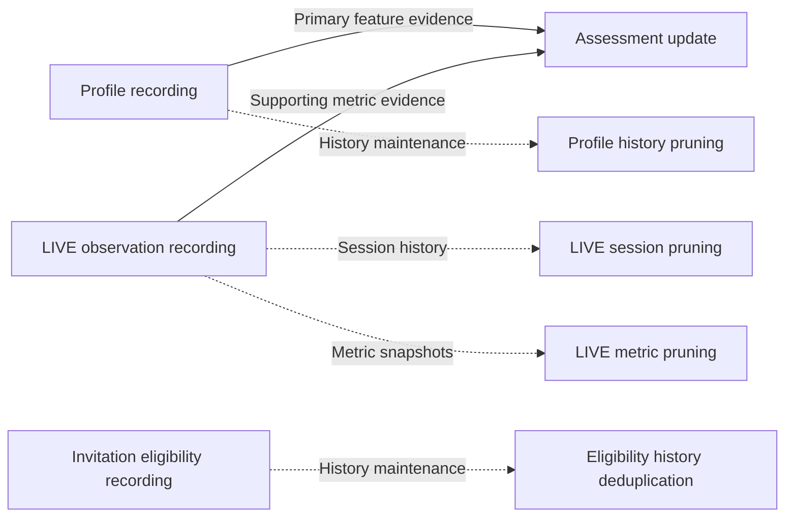
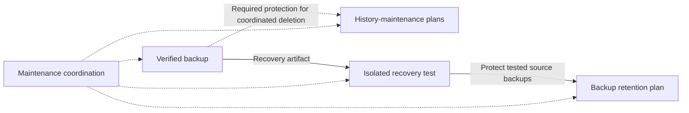

# Skill catalog

Browse the 18 Skills by business purpose and the information they share. Each linked public repository owns its `SKILL.md`, detailed inputs, approval rules and acceptance criteria. All identifiers below have the prefix `live-agency-`.

This is a navigation catalog, not a deployment inventory. Source availability does not establish that a Skill is installed or accepted for production. See [current migration status](../docs/migration/status.md) for readiness and [source associations](../tools/m1-source-repositories.json) for pinned source versions. Provider-specific acquisition belongs to Providers; Runtime selects and composes the required capabilities.

## How the workflows relate

Arrows show business information flow or maintenance relationships, not automatic execution, mandatory package dependencies or execution permission.

Revenue recognition establishes the receivable that a later settlement reconciles. The two planning Skills require separate inputs and decisions; neither planning CLI posts journals. Coin-purchase expense reconciliation is separate from creator revenue and gift-event history. Weekly expense claims remain a frozen prototype.

## Creator workflows

| Skill (without the shared prefix) | Overview | Relationship / boundary |
| --- | --- | --- |
| [creator-invitation-eligibility-record](https://github.com/flair-agency/live-agency-creator-invitation-eligibility-record) | Record whether a creator can be invited, maintaining transition history. Does not send invitations or track sent-invitation progress. | Eligibility history deduplication maintains this history. |
| [creator-profile-record](https://github.com/flair-agency/live-agency-creator-profile-record) | Append profile observations, including followers, posts, nickname, avatar and features. | Supplies evidence for assessment; profile pruning maintains the history. |
| [creator-live-observation-record](https://github.com/flair-agency/live-agency-creator-live-observation-record) | Append LIVE sessions and point-in-time fan-club metric observations. | Supplies supporting assessment evidence; session and metric histories have separate pruning Skills. |
| [creator-assessment-update](https://github.com/flair-agency/live-agency-creator-assessment-update) | Update a reviewed creator assessment and approved characteristic tags from stored evidence. | Uses profile features as primary evidence, with complete LIVE metrics as support. |
| [creator-monthly-activity-reconcile](https://github.com/flair-agency/live-agency-creator-monthly-activity-reconcile) | Compare normalized monthly activity with existing records and apply approved metric updates. | Monthly reconciliation is distinct from recording individual LIVE observations. |
| [gift-history-merge](https://github.com/flair-agency/live-agency-gift-history-merge) | Merge an already downloaded gift-event snapshot into an append-preserving master, with reviewed identity evidence. | A separate history workflow; it neither acquires exports nor calculates coin-purchase expenses. |

## Accounting workflows

| Skill (without the shared prefix) | Overview | Relationship / boundary |
| --- | --- | --- |
| [coin-purchase-expense-reconcile](https://github.com/flair-agency/live-agency-coin-purchase-expense-reconcile) | Match normalized coin-purchase receipts to existing expense candidates and verify approved registrations. | Receipt-to-expense reconciliation precedes any separate expense claim. |
| [foreign-currency-revenue-recognize](https://github.com/flair-agency/live-agency-foreign-currency-revenue-recognize) | Prepare a reviewed revenue and receivable recognition plan from normalized final-invoice evidence. | Planning candidate; shares neutral calculations with settlement. It does not acquire invoices or write journals. |
| [foreign-currency-receivable-settle](https://github.com/flair-agency/live-agency-foreign-currency-receivable-settle) | Prepare settlement of one open receivable against one JPY bank receipt, including FX gain or loss. | Planning candidate; consumes an existing receivable. It does not collect bank data or write journals. |
| [weekly-coin-expense-claim-submit](https://github.com/flair-agency/live-agency-weekly-coin-expense-claim-submit) | Frozen prototype for grouping coin expenses into Monday-to-Sunday claims. | Not available for active drafts, submission or automation; reopening requires an owner decision. |

## History maintenance

| Skill (without the shared prefix) | Overview | Relationship / boundary |
| --- | --- | --- |
| [creator-profile-history-prune](https://github.com/flair-agency/live-agency-creator-profile-history-prune) | Retain representative profile observations and propose removal of unneeded history. | Maintains profile-record output; preserves retention and field-completeness rules. |
| [creator-live-session-history-prune](https://github.com/flair-agency/live-agency-creator-live-session-history-prune) | Prune LIVE-session history while preserving its recent window and oldest/latest records. | Maintains LIVE observation sessions; uses verified archives and separate restore authority. |
| [creator-live-metric-history-prune](https://github.com/flair-agency/live-agency-creator-live-metric-history-prune) | Retain representative LIVE-metric snapshots across time periods and incomplete metrics. | Maintains LIVE observation snapshots, not individual sessions. |
| [creator-invitation-eligibility-history-deduplicate](https://github.com/flair-agency/live-agency-creator-invitation-eligibility-history-deduplicate) | Remove adjacent equivalent invitation-history rows through reviewed archives and deletion plans. | Maintains eligibility history; preserves transitions such as A → B → A. |

## Backup and maintenance coordination

| Skill (without the shared prefix) | Overview | Relationship / boundary |
| --- | --- | --- |
| [data-backup-create](https://github.com/flair-agency/live-agency-data-backup-create) | Create or reuse a content-verified Base backup through selected Providers and shared storage. | Protects maintenance operations and supplies recovery-test artifacts; row archives are not full Base backups. |
| [data-backup-retention-plan](https://github.com/flair-agency/live-agency-data-backup-retention-plan) | Identify backups to retain and deletion candidates, with protection reasons. | Planning only: does not delete storage. Successful recovery evidence protects source backups. |
| [data-recovery-test](https://github.com/flair-agency/live-agency-data-recovery-test) | Prepare and verify restoration into an isolated destination, recording restoration and cleanup separately. | Uses a verified backup; supplies recovery evidence for retention. Does not restore over production. |
| [datastore-maintain](https://github.com/flair-agency/live-agency-datastore-maintain) | Coordinate backup coverage, capacity checks, history-maintenance plans, retention and recovery-test status. | Coordinates the Skills above; a schedule never substitutes for deletion or restore approval. |

## Where to go next

- Open a linked repository and read its `SKILL.md` before using it.
- Use the [capability inventory](../docs/architecture/capabilities.md) for the Skill/Provider/Runtime responsibility boundary.
- Use the [identity map](../tools/skill-source-identities.json) to translate former Skill names.
- Follow the [maintenance policy](../docs/governance/skill-maintenance-policy.md) when reporting or fixing a Skill issue.

Keep this catalog aligned with additions, removals and identity changes. Summarize the owning contract here; keep detailed procedures and changing deployment status in their respective owners.
